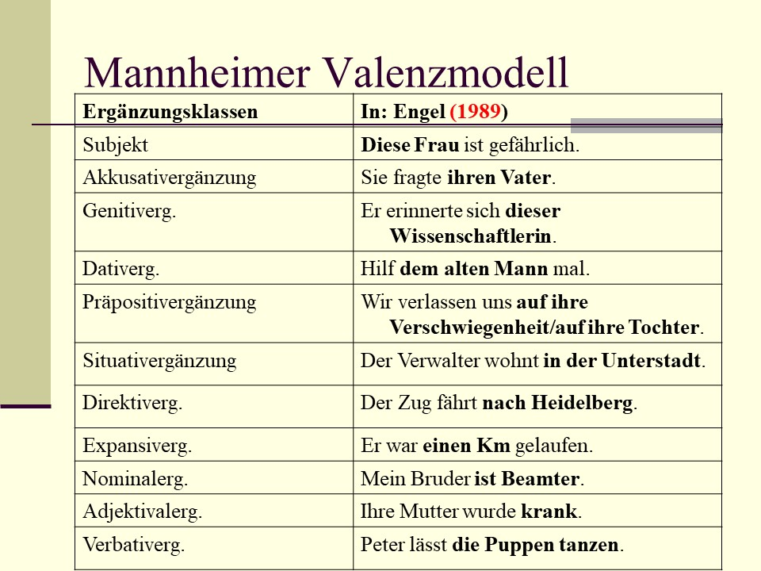
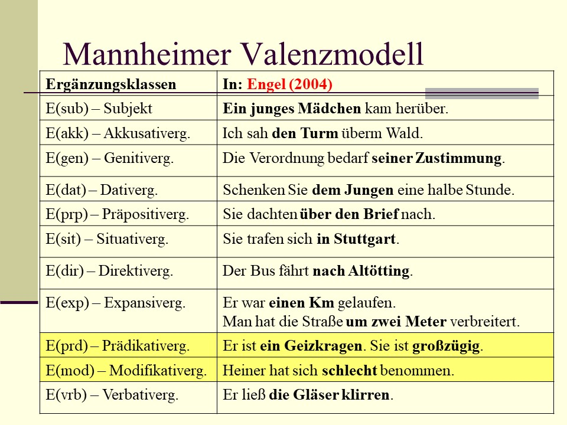
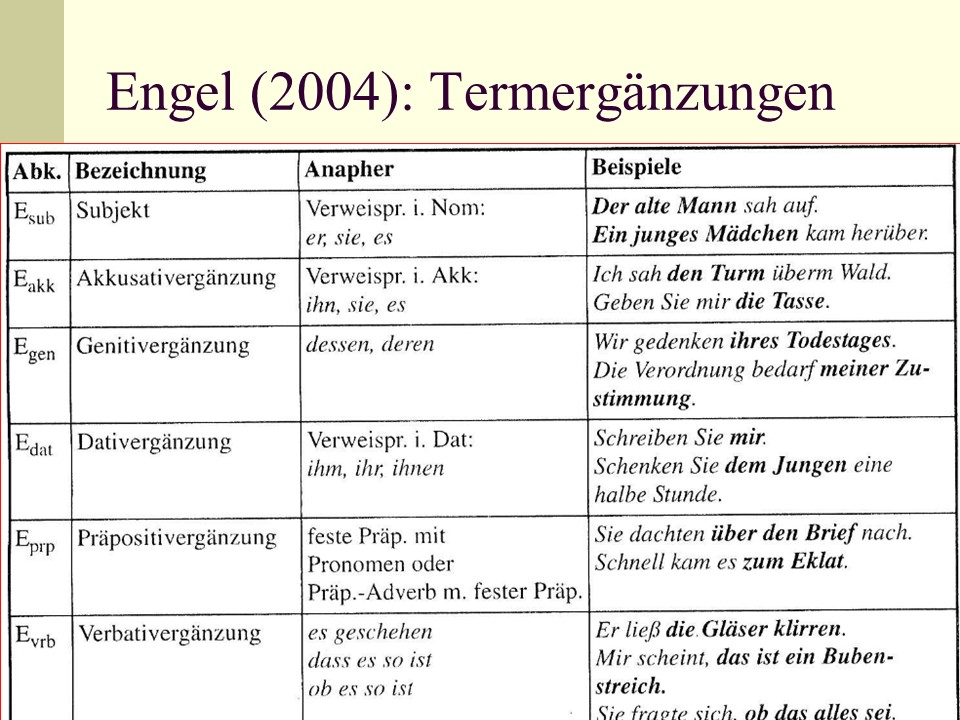
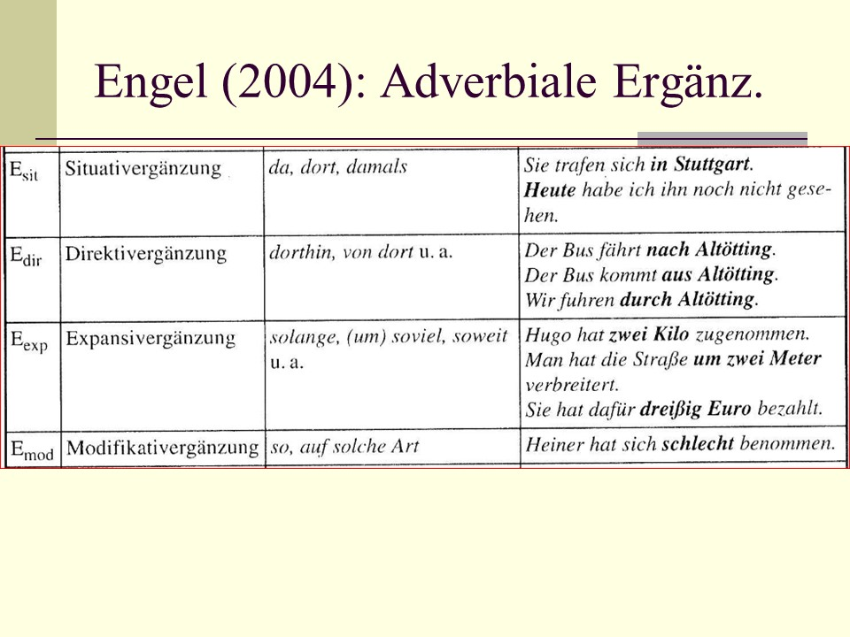
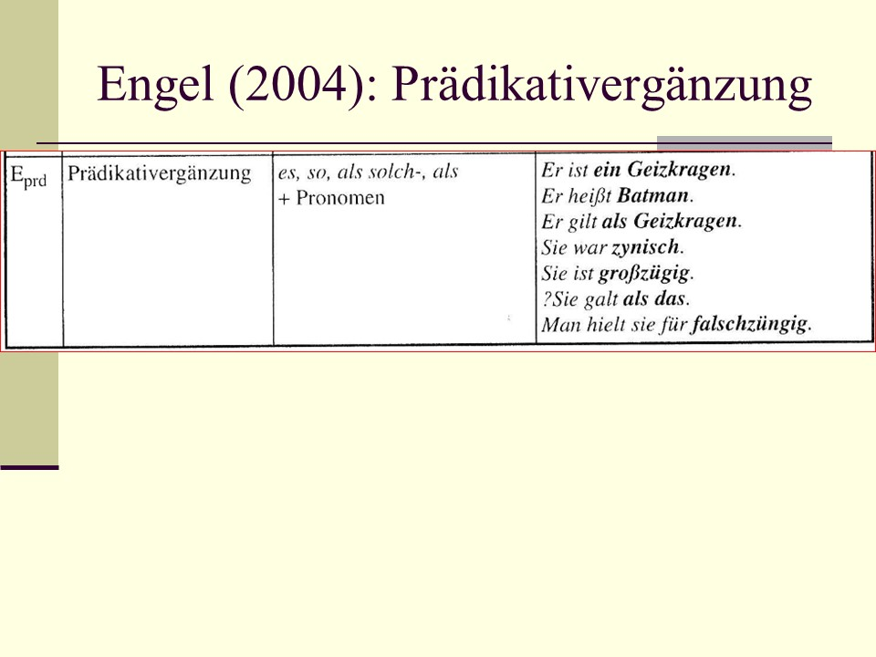
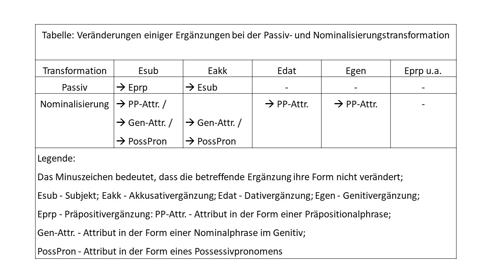

# Dependenz

Als Grundbeziehung zwischen (linear auftretenden) sprachlichen Elementen gilt auch das Prinzip der **Dependenz**, d.h.
der Abhängigkeit eines Elementes von einem anderen.
Sprachliche Elemente stehen somit wie andere Erscheinungen in unserer Welt in Hierarchiebeziehungen zueinander.
Das abhängige Element wird Dependens genannt, das nicht-abhängige dagegen Regens (vgl. syntagmatische Beziehung Rektion).
Die Dependenz ist eine syntaktische Grundbeziehung, bei der ein Element (das Dependens) nicht ohne ein anderes (das Regens) auskommen kann: z.B.
in der Phrase *ziemlich wichtige Persönlichkeiten* kann die Partikel *ziemlich* nicht ohne das Adjektiv *wichtig* auftreten, da die Phrase \* *ziemlich Persönlichkeiten* keine wohlgeformte Phrase der deutschen Sprache wäre (also ungrammatisch).
Das Dependenzprinzip steht in den sogenannten Valenzgrammatiken bzw.
*Valenzmodellen* im Mittelpunkt.
Die Satzstruktur wird hierarchisch gegliedert, mit dem Verb (Verbalkomplex, Prädikat) an der Spitze.
Derartige Valenzmodelle werden übrigens als *Valenzverbgrammatiken* bezeichnet.

## Valenz

**Valenz** (auch: **Wertigkeit**) ist die Fähigkeit eines Satzelementes, andere Elemente im Satz zu ermöglichen, zu fordern oder auszuschließen.
Das **Regens** ist dasjenige Satzelement, das andere Elemente im Satz ermöglicht, fordert oder ausschließt.
Ein **Dependens** ist ein Satzelement, das von einem Regens ermöglicht, verlangt oder ausgeschlossen wird.

(1) [ ~NP~ Kanadier] -- [ ~VP~ lachen / weinen / schlafen ...]\
(2) Kanadier lachen / weinen / \*schlafen darüber\
(3) [ ~NP~ Kanadier] -- [ ~VP~ können darüber *lachen*].

lachen~2~ [Subjekt, Präpositivergänzung]: Wer lacht?
Worüber lacht x ?

## Ergänzung \<==\> Angabe

Ergänzungen sind spezifisch für bestimmte Klassen von Verben, Angaben sind hingegen mit beliebigen Verbklassen verknüpfbar.

**Subklassenspezifisch \<==\> nicht-subklassenspezifisch**

(4) Diese Frau ist gefährlich.

(5) Diese Frau ist \* den Mann gefährlich.
    (Existenz)

(6) Diese Frau fragt den Mann.
    (Sagen, Meinen)

(7) Diese Frau fährt nach Maribor.
    (Ziel)

(8) Diese Frau fragt den Mann \* nach Maribor.
    (Ziel)

(9) Heute fährt diese Frau nach Maribor (Angabe)

(10) Heute fragt diese Frau den Mann.
     (Angabe)

(11) Heute ist diese Frau gefährlich.
     (Angabe

(12) Sie fragt den Mann.
     (Austauschprobe)

(13) Sie fragt ihn.
     (Austauschprobe, Ersatzprobe: dieselbe Funktion ?)

(14) Den Mann fragte sie.
     (Verschiebeprobe: Satzglied oder kein Satzglied ?)

(15) Diese Frau sagt, dass sie morgen nach Maribor fährt.
     (dass = kein Satzglied)

(16) Diese Frau sagt, sie morgen \* dass nach Maribor fährt.

## Ergänzungsklassen

In den folgenden Tabellen sind die Ergänzungsklassen zu sehen, die im Rahmen der Mannheimer Valenzgrammatik unterschieden werden (Engel 1989 und 2004).

```{r echo=FALSE, message=FALSE, warning=FALSE, out.height="100%", out.width="100%"}

```

```{r echo=FALSE, message=FALSE, warning=FALSE, out.height="100%", out.width="100%"}

```

```{r echo=FALSE, message=FALSE, warning=FALSE, out.height="100%", out.width="100%"}

```

```{r echo=FALSE, message=FALSE, warning=FALSE, out.height="100%", out.width="100%"}

```

```{r echo=FALSE, message=FALSE, warning=FALSE, out.height="100%", out.width="100%"}

```

```{r echo=FALSE, message=FALSE, warning=FALSE, out.height="100%", out.width="100%"}

```

## Verben: semantische Oberklassen

**Verben mit ähnlicher Bedeutung haben eine ähnliche syntaktische Valenz.**

**Dynamische Verben**

-   **Handlungsverben**:\
    Essen, trinken, schreiben, verfassen, treffen, kraulen, bringen, abholen, graben, heben, ...

-   **Vorgangsverben**:\
    treiben, wehen, triefen, schneien, schnarchen (?) ...

**Statische Verben** - **Zustandsverben**: sein, sitzen, stehen, schlafen (?), ...

Die semantischen Oberklassen zerfallen in eine Reihe von semantischen **Unterklassen**: z.B.
bei den *Handlungsverben* kann man beispielsweise unterscheiden:\
- *Verben des Sagens und Meinens* (Verba dicendi),\
- *Fortbewegungsverben*,\
- ...

Bei den *Zustandsverben* sind unterscheidbar:\
- Existenzverben,\
- Emotionsverben,\
- ...

## Präpositivergänzung

(in anderen grammatischen Werken in der Regel deckungsgleich mit den Kategorien *Präpositionalergänzung (E~4~; E~prp~; pS), Präpositionalobjekt*)

Die E~prp~ ist eine relativ neue "Entdeckung" im Bereich der deutschen Grammatik.
In nicht wenigen Grammatiken, auch in einigen neueren, wird sie nicht als selbständig Ergänzungskategorie aufgeführt.
Woran das liegen mag, lässt sich anhand von Beispielen wie den folgenden erkennen.^1^

z.B.
(1) Sie denkt an ihren Freundin der Armee.\
(2) denken [an]{.underline}, fragen [nach]{.underline}, sie freuen [auf]{.underline}/[über]{.underline}, rechnen [mit]{.underline}, ...

Präpositivergänzungen E~prp~ ähneln den Situativergänzungen E~sit~ und Direktivergänzungen E~dir~.

Aber welcher grundlegende syntaktische Unterschied besteht zwischen E~prp~ - E~sit~, E~dir~ ?^2^

z.B.
(3) Er fährt [nach]{.underline} Bamberg /[ans]{.underline} Meer/ [ins]{.underline} Gebirge.\
(4) Wir denken [an]{.underline} den Urlaub/[an]{.underline} ihn/ dar[an]{.underline}.\
(5) Er fährt ([dorth)in]{.underline}.

**Unterschied zwischen Eprp und Esub, Eakk, Edat, Egen:**\
^**1**^Die E~prp~ hat im Gegensatz zu Subjekt, Akkusativ-, Dativ- und Genitivergänzung keine bestimmten [Kasussendungen]{.underline} zur Identifizierung.\
Die E~prp~ haben viele [verschiedene]{.underline} Präpositionen (2), die verschiedene Kasus regieren (können).

**Unterschiede zwischen Eprp und Edir / Esit:**\
^**2**^ (a) Ein **Austausch der Präpositionen** in eine E~prp~ ist grundsätzlich **nicht** möglich und führt gewöhnlich zu ungrammatischen Sätzen (zu Sonderfällen wie *protestieren für/gegen* siehe unten).\
(b) In einer E~prp~ ist die **Präposition immer enthalten** (außer wenn sie als satzförmige Ergänzung (SE) auftritt), also auch in Anaphern (z. B. [*an*]{.underline} *ihn denken, dar[an]{.underline} denken*)\
(c) Die **Präp**.
einer E~prp~ sind **ohne Eigenbedeutung**, worin sich zeigt, dass die Präposition in ihrer Funktion mit einer Kasusendung vergleichbar ist.

Aber wie soll man die folgenden Fälle beurteilen?

z.B.
(6) Die Ärzte [halten]{.underline} den Mann [für tot]{.underline}.\
(7) Meine Freundin [hält]{.underline} nichts [davon]{.underline}, [kurze Röcke zu tragen]{.underline}.\
(8) Er besteht [auf sein Recht]{.underline}.\
(9) Das Haus [besteht aus Steinen]{.underline}.\
(10) Die Prüfung [besteht in einer schriftlichen Arbeit]{.underline}.
(11) Er kann [vor den Augen seiner Familie]{.underline} bestehen.

Beim Austausch der Präp.
ändert sich [die Bedeutung]{.underline} des Verbs.
Im Grunde kann man in solchen Fällen sogar behaupten, dass es sich um verschiedene (**homophone** oder gleichlautende) **Verben** handelt, die sich darin unterscheiden, dass in den von ihnen verlangten Ergänzungen nicht die gleichen Präpositionen auftreten.

Vgl.
(12) Er wohnt *am Stadtrand / in Belgien / neben dem Supermarkt*.

Warum würden Sie (bei Berücksichtigung der oben angeführten Kriterien zur Unterscheidung zwischen Eprp und Edir / Esit) folgende Präpositionalphrasen als E~prp~ einordnen bzw.
warum als E~sit~/ E~dir~?

z.B.
(13) Der Opa [erzählt]{.underline} (seinen Enkeln) [über sein Leben]{.underline}.\
(14) Der Chef [erzählt]{.underline} (uns) [von]{.underline} seinen Plänen.\
(15) Die Tante [erzählt]{.underline} (ihrem Neffen) [aus]{.underline} ihrem Leben.\
(16) Günther [freut sich am Glück anderer]{.underline}.\
(17) Die Kinder [freuen sich auf]{.underline} die Ferien.\
(18) Carola [freut sich über]{.underline} ihren Erfolg.

Die **Präp. wirken bedeutungsdifferenzierend**, obwohl die Unterschiede schwer fassbar sein können.
In (13) und (14) sind wahlweise verschiedene Präp.
**ohne** Bedeutungsunterschiede zugelassen.
Die Präposition *aus* in der Eprp in (15) legt eine **partitive Interpretation** nahe ("ein *Ausschnitt* aus ihrem Leben").
In (17-18) wird die jeweilige Sonderbedeutung aus der [Verbindung]{.underline} zwischen dem Verb *sich freuen* und einer der beiden Präp.
hergeleitet (**Bezug auf Gegenwärtiges/Zukünftiges** (17) bzw.
Bezug auf **Vergangenes** (18)).

Wie kann man problematische Fälle wie in (19-20) beurteilen?

z.B.
(19) Er [schreibt für]{.underline} die Abschaffung des Paragraphen 218.
(20) Er [schreibt gegen]{.underline} die Abschaffung des Paragraphen 218.

Bei *schreiben* (= schriftlich Partei ergreifen) haben die Präp.
eigene scharf unterschiedene Bedeutungen.

Aber das **Paradigma** ist **auf** zwei **Antonyme beschränkt**, es fehlt die relativ freie Austauschbarkeit der Präp.
wie sie für die E~sit~, E~dir~, typisch ist.
Ähnliche Fälle: *sein, stimmen, eintreten, sich entscheiden + für / gegen* (paraphrasierbar durch *zugunsten von* + D bzw. *zuungunsten von* + D).

Welchen **Status** hat die **Präposition**?\
(a) Sollte man die Präposition einer E~prp~ **zum Verb** rechnen **oder**\
(b) sollte man sie zusammen **mit** der **NP** bzw.
P~rn~P **als E~prp~** aufführen?

**Drei Gründe gegen die Lösung (a),** d.h.
dagegen, dem regierenden Verb die Präp.
der E~prp~ zuzurechnen (obwohl die Präp. der E~prp~ fest mit dem Verb verbunden ist, was sich beispielsweise in der Eigenschaft der Präposition zeigt, wie ein Kasusmorphem zu fungieren):

**1.** die Präposition bildet mit den von ihr abhängigen Elementen **eine Präpositionalphrase**, die durch Lösung (a) auseinander gerissen würde.\
**2.** **Viele E~prp~** sind **fakultativ**.
Das macht eine Integration der Präp.
in das regierende Verb unzweckmäßig.
Bei jedem Verb mit fakultativer E~prp~ müsste man (statt einer gleich) zwei Wörterbucheinheiten ansetzen (z.B. *sich erinnern* und *sich  erinnern an* ).
Dies würde zu einer gewaltigen Aufblähung des Lexikons führen.
[Anmerkung: Für Erst- und Zweitsprachenlerner schwerer zu erlernen.]\
**3.** Es gibt **Verben, die zwei E~prp~ mit verschiedenen Präp. regieren**, deren NPs in unterschiedlichen Kasus auftreten können (z. B. *sprechen mit* + D *über* + A).
Mindestens eine E~prp~ muss aktualisiert sein, aber es können auch beide gemeinsam auftreten.
Der Einbau der Präpositionen in die VP wäre daher auch aus diesem Grunde schwierig.

z.B.
(22) Er meldet sich [in der Zentrale]{.underline} [beim Operateur]{.underline}.\
(23) Ich mache das [mit dem Hammer]{.underline}.
(instrumental)\
(24) Inge geht [mit ihrem Freund]{.underline} ins Kino.
(komitativ)\
(25) Walter geht [mit dem Schirm]{.underline} in die Stadt.
(komitativ)

Engel & Schumacher (1978: 65) setzen in (22) neben der Lokalangabe (*in der Zentrale*) noch eine E~prp~ (*beim Operateur*) an.
Die *bei*-Phrase wird als E~prp~ gewertet, da die Präposition nicht kommutiert (d. h. nicht austauschbar ist, ohne die Funktion der Phrase im Satz zu verändern).
Sonst sind ***bei*****-Phrasen** **meist als E~sit~** zu werten.
In (23-24) scheint es Latour (1985: 65) im Gegensatz zu Engel & Schumacher (1978: 65), dass die **Komitativbestimmungen** dennoch nur bei bestimmten Verben vorkommen (also subklassenspezifisch sind).
Dies soll laut Latour auch bei den **Instrumentalbestimmungen** der Fall sein.

**Kommutation**:\
(23) mittels, mit Hilfe (von), unter Verwendung (von), ...\
(24) in Begleitung (von), in Gesellschaft (von), unter Mitnahme (von), nicht ohne.

**Anaphern**:\
a) [Präposition + Pronomen]{.underline} (besonders bei Menschen, teilweise bei Tieren)\
b) [da(r)- + Präposition]{.underline} "Pronominaladverb" bei Sachen, teilweise auch bei Tieren)

Die Grenze zwischen a) und b) ist fließend, insbesondere bei Tieren, aber auch bei Institutionen (die Organisationseinheiten von Personengruppen darstellen) ist die Zuordnung nicht immer eindeutig.

**Ausdrucksformen.**\
Charakteristisch für die E~prp~ (in Engel & Schumacher: E~4~) ist ihre morphosyntaktische Vielfältigkeit: - Präp.
+ NP\
- Präp + P~rn~P\
- Pronominaladverb (Präpositionaladverb)\
- Nebensatz ± Korrelat\
- Infinitivsatz ± Korrelat

z.B.
(25) Der Text handelt [von Umweltproblemen]{.underline}.\
(26) niemand denkt [an ihn]{.underline}.\
(27) Ich habe nichts [damit]{.underline} zu tun.\
(28) Ich warte [darauf, dass du kommst]{.underline}.\
Er denkt [darüber]{.underline} nach, [ob er kommen soll]{.underline}.
Wir erkundigen uns, [wann die Vorstellung beginnt]{.underline}.\
(29) Er besteht [darauf, die Wahrheit zu erfahren]{.underline}.\
selten : Präp.
+ Adj (Engel & Schumacher 1978), (Latour 1985:61)

z.B.
(30) Alle halten ihn [für genial]{.underline}.
(Helbig & Buscha 1987: Prädikativ)

Das **Korrelat** ist **oft fakultativ**, **manchmal jedoch obligatorisch**.
Wenn ein Verb mehrere Präpositionen regiert, die bedeutungsdifferenzierend wirken, dann ist das Korrelat obligatorisch.

Die E~prp~ kommt bei ziemlich **vielen Verben** vor, nur fakultativ und nicht selten doppelt (Latour 1985: 62, 66)

**Transformationen**: (Helbig & Buscha 1987: 547)

z.B.
(31) Man wartete [auf die ausländische Gäste]{.underline}.
Auf die ausländischen Gäste]{.underline} wurde gewartet.
Es wurde [auf die ausländische Gäste]{.underline} gewartet.\
(32) Die Regierung hofft [auf bessere Beziehung]{.underline}.
Die Hoffnung der Regierung auf die bessere Beziehung.\
(33) Er schreibt [an seinen Vater]{.underline} einen Brief.
Er schreibt [seinem Vater]{.underline} einen Brief.\
(34) Sie erinnert sich [an ihre Kindheit]{.underline}.
Sie erinnert sich [ihrer Kindheit]{.underline}.

Bei der Passiv- oder Nominalisierungstransformation bleibt die Präpositivergänzung gewöhnlich unverändert.

```{r echo=FALSE, message=FALSE, warning=FALSE, out.height="100%", out.width="100%"}

```

## Situativergänzung

E5 , Esit ; pS/Adv , pSA

Lokale wie temporale Esit benennen die Situation, in die ein Sachverhalt eingebettet ist.
Deshalb wird diese Art von Ergänzung im Mannheimer Valenzmodell auch ***Situativergänzung*** genannt (sie entspricht der Ergänzungsklasse E5 in Engel & Schumacher 1978: 68 ff).
Der Terminus "adverbiale Umstandsbestimmung des Ortes (bzw. der Zeit) in der deutschen Schulgrammatik verwischt (nach Latour 1985: 65) den **Unterschied**

a)  **zwischen verbspezifischen und nichtverbspezifischen** Satzgliedern und

b)  **zwischen Esit und Edir**, die u.a.
    durch spezifische Anaphern unterscheidbar sind.

Welche **Klassen von Verben** verlangen eine Esit ?

z.B.

(1) *sein, sich befinden, liegen, stehen, sitzen, wohnen, hängen, kleben, stecken*, ...

(2) *beginnen, anfangen, stattfinden, passieren; beißen*, ...

Die Esit kommt vor allem bei den Verben des räumlichen Sich - Befindens vor, seltener bei anderen Verben, bei denen das Geschehen zeitlich näher bestimmt wird.
[Engel 1988: 194 ff].
In der Grammatik von Engel werden auch einige wenige Verben zu dieser Klasse gezählt, die eine kausale Situativergänzung erfordern (z. B. *beißen*).

**Anapher**:

a)  lokal   ([da, dort)]{.underline}  ([da(r) + Prät)]{.underline}

b)  temporal  [(dann)]{.underline}

c)  kausal [(deshalb)]{.underline}

Innerhalb einer Ergänzungskategorie liegen somit [drei]{.underline} (zumindest) unterschiedliche [*Anaphorisierungsmöglichkeiten*]{.underline} vor.
Warum haben die beiden Vertreter des Mannheimer Valenzmodells (Engel und Schumacher) trotzdem nur eine Ergänzungsklasse und nicht zumindest zwei verschiedene (lokale + temporale) Ergänzungsklassen gebildet ?
Laut Latour (1985: 66) taten sie dies eher aus praktischen Gründen, denn Verben mit einer [temporalen]{.underline} Esit sind nicht besonders häufig.
Daher hat man beide in einer E - Kategorie zusammengefasst.
Noch seltener sind Verben mit einer kausalen Situativergänzung.
Die meisten Kausalbestimmungen haben nämlich Angabestatus, d.h.
sie sind nicht spezifisch für bestimmte Verbklassen.

Wodurch unterscheidet sich die Situativergänzung Esit von der Präpositivergänzung Eprp?

z.B.
(3) Dort In ihr befand sich ein brauner Briefumschlag.
Auf ihr Unter ihr

(4) [Auf sie]{.underline} / [auf dein Entgegenkommen]{.underline} wartet er schon die ganze Zeit.

In (3) erscheinen Situativergänzungen, in (4) eine Präpositivergänzung.

Wesentliche **Kennzeichen der Esit** sind

a)  dass die Esit *ohne* Präposition vorkommen kann,\
b)  dass die Präposition *prinzipiell austauschbar* ist,\
c)  dass die Präposition in Esit eine *eigene* *Bedeutung* hat und\
d)  dass die Esit als Kategorie eine eigene Bedeutung hat; (bei der Eprp als Kategorie ist eine solche spezifische Eigenbedeutung nicht zu erkennen, was sie mit den restlichen Objekten, der Akkusativ-, Dativ- und Genitivergänzung, vergleichbar macht), d.h. die Esit ist nicht nur syntaktisch, sondern auch semantisch als *Kategorie* (bzw. als zwei oder drei Kategorien sogar) bestimmbar.

Welche **Ausdrucksformen** hat die Esit ?

z.B.
(5) [In der Kiste]{.underline} lag ein brauner Briefumschlag.\
(6) [In ihr]{.underline} lag ein brauner Briefumschlag.\
(7) [Darin]{.underline} lag ein brauner Briefumschlag.\
(8) [Dort]{.underline} lag ein brauner Briefumschlag.\
(9) Diese Leute wohnen, [wo der Weg zum Wald abbiegt.]{.underline}\
[Engel 1988: 195]

Die Esit erscheint in (5) und (6) als Präpositionalphrase (d. h. als Präposition + NP (5) bzw.
als Präp.
+ PrnP (6)),  als Präpositionaladverb (7),  Adverb (8) und wie die meisten anderen Ergänzungsklassen auch als generalisierende Nebensätze (9) oder indefinite Nebenätze.

Nach Engel (1988: 195) ist die Esit immer *obligatorisch.* Fakultative Situativbestimmungen (10) betrachtet er als [Angaben]{.underline} (mit jeder Art von Verb verbindbar).\
(10)     Das Mädchen las [in ihrem Zimmer]{.underline} einen spannenden Arztroman und vergaß, zu ihrer Verabredung mit dem tollsten Junge in der Klasse zu gehen.

**Transformationen**:

z.B.
(11) Familie Meier wohnt [in einem Hochhaus.]{.underline}\
==\> Das Wohnen der Familie Meier [in einem Hochhaus.]{.underline}\
(12) Man stand [dort]{.underline} nur herum.\
==\> [Dort]{.underline} wurde nur herumgestanden.\
(Passiv mit intransitiven Verben seltener)

In den Beispielen (11) und (12) ist zu sehen, daß die Situativergänzung bei einer Nominalisierungs- oder bei einer Passivtransformationen unverändert bleibt.

Tabelle 1: Unterschiede zwischen Präpositiv- und Situativergänzung:

+------+-----------------------------------------------------+------+-------------+------+------------+------+
|      |                                                     |      |      Eprp   |      |       Esit |      |
+------+-----------------------------------------------------+------+-------------+------+------------+------+
|      |                                                     |      |             |      |            |      |
+------+-----------------------------------------------------+------+-------------+------+------------+------+
|      |  kann [ohne]{.underline} Präposition vorkommen      |      |         -   |      |         +  |      |
+------+-----------------------------------------------------+------+-------------+------+------------+------+
|      |                                                     |      |             |      |            |      |
+------+-----------------------------------------------------+------+-------------+------+------------+------+
|      |  die Präposition ist [austauschbar]{.underline}     |      |         -   |      |         +  |      |
+------+-----------------------------------------------------+------+-------------+------+------------+------+
|      |                                                     |      |             |      |            |      |
+------+-----------------------------------------------------+------+-------------+------+------------+------+
|      |  die Präposition hat [eigene Bedeutung]{.underline} |      |         -\* |      |         +  |      |
+------+-----------------------------------------------------+------+-------------+------+------------+------+
|      |                                                     |      |             |      |            |      |
+------+-----------------------------------------------------+------+-------------+------+------------+------+

\*bei wenigen Verben haben die Präpositionen eine Eigenbedeutung (*mit, gegen*, u.a.); Sonderfälle siehe Präpositivergänzung

Tabelle 2: Ausdrucksformen der Situativergänzung:

+--------+----------------------+--------+-----------------------------------+--------+
|        | **Ausdrucksformen**  |        | **Beispiele**                     |        |
+--------+----------------------+--------+-----------------------------------+--------+
|        |                      |        |                                   |        |
+--------+----------------------+--------+-----------------------------------+--------+
|        | PP (Präp. + NP)      |        | in der Kiste; unter dem Tisch     |        |
+--------+----------------------+--------+-----------------------------------+--------+
|        |                      |        |                                   |        |
+--------+----------------------+--------+-----------------------------------+--------+
|        | PP (Präp. + PrnP)    |        | in ihr; unter ihm                 |        |
+--------+----------------------+--------+-----------------------------------+--------+
|        |                      |        |                                   |        |
+--------+----------------------+--------+-----------------------------------+--------+
|        | Präpositionaladverb  |        | darin  ; darunter                 |        |
+--------+----------------------+--------+-----------------------------------+--------+
|        |                      |        |                                   |        |
+--------+----------------------+--------+-----------------------------------+--------+
|        | Adverb               |        | dort                              |        |
+--------+----------------------+--------+-----------------------------------+--------+
|        |                      |        |                                   |        |
+--------+----------------------+--------+-----------------------------------+--------+
|        | gener. und indef. NS |        | ..., wo der Weg zum Wald abbiegt. |        |
+--------+----------------------+--------+-----------------------------------+--------+
|        |                      |        |                                   |        |
+--------+----------------------+--------+-----------------------------------+--------+

Tabelle 3: Transformationen :

+--------+------------------------------------------------------+--------+---------------------------+--------+
|        |                                                      |        |        E sit              |        |
+--------+------------------------------------------------------+--------+---------------------------+--------+
|        |                                                      |        |                           |        |
+--------+------------------------------------------------------+--------+---------------------------+--------+
|        | Veränderungen bei der Nominalisierungstransformation |        |                           |        |
|        |                                                      |        |                           |        |
|        |                                                      |        |           /               |        |
+--------+------------------------------------------------------+--------+---------------------------+--------+
|        |                                                      |        |                           |        |
+--------+------------------------------------------------------+--------+---------------------------+--------+
|        | Veränderungen bei der Passivtransformation           |        |           /               |        |
+--------+------------------------------------------------------+--------+---------------------------+--------+
|        |                                                      |        |                           |        |
+--------+------------------------------------------------------+--------+---------------------------+--------+

Weitere Beispiele und Erläuterungen zur Situativergänzung aus Latour (1985)

[Verben mit der Situativergänzung]{.underline}

Zur Valenz einer Reihe von Verben gehört eine Situativergänzung, die in meisten Fällen auch obligatorisch ist.

Beispiel: München liegt [*an der Isar*]{.underline}***.***

\*München liegt.

Die gleiche morphosyntaktische Struktur wie die Esit haben die situative Angaben.

Beispiel Er hat mir die Geschichte [*an der Isar*]{.underline} erzählt.

Eine temporale Esit erscheint selten, bei Verben wie *stattfinden, passieren , beginnen*.

Beispiel: Die Diskussion begann [*am frühen Abend*]{.underline}.

Es gibt einige Präpositionen mit lokaler Bedeutung, die sich nicht nur mit Hilfe von Adverbien anaphorisieren lassen, sondern auch durch die Anapher [da(r)- + Präposition]{.underline} (die ja gerade für die Präpositivergänzung Eprp charakteristisch ist).
Solche Präpositionen sind:

             hinter                  [(dahinter)]{.underline}

             neben                  [(daneben)]{.underline}

             unter                   [(darunter)]{.underline}

             zwischen             [(dazwischen)]{.underline}

             in                        [(darin)]{.underline}

             über                    [(darüber)]{.underline}

             vor                      [(davor)]{.underline}

Bei den Präpositionen [an]{.underline}  und [auf]{.underline} ist diese Art der Anaphorisierung nur beschränkt möglich.

Beispiele: Eine Kugel hängt [am Tannenbaum]{.underline}.\
Eine Kugel hängt [daran]{.underline}.

Monika steht [an der Haltestelle]{.underline}.\
Monika steht [\*daran]{.underline}.

Das Buch liegt [auf dem Tisch]{.underline}.\
Das Buch liegt [darauf]{.underline}.

Fritz steht [auf dem Bahnsteig]{.underline}.\
Fritz steht [\*darauf]{.underline}.

Bei anderen lokalen Präpositionen wie [außerhalb]{.underline}, [bei]{.underline}, [diesseits]{.underline}, [gegenüber]{.underline}, [innerhalb]{.underline}, [inmitten]{.underline}, [oberhalb]{.underline} u.a.
ist nur die Anaphorisierung mit *da* und *dort* möglich.
Die Ausdrucksform der Esit ist dann eine adverbiale Partikel oder eine Präpositionalphrase, wobei die Präposition austauschbar ist.

Beispiele: Das Schloss befindet sich [dort]{.underline}.\
Das Schloss befindet sich [da oben]{.underline}.

Das Restaurant liegt [hinter dem Berg]{.underline}.\
Das Restaurant liegt [im Wald.]{.underline}\
(Latour 1985: 66, 67 ff)

## Direktivergänzung

E6, Edir; pS/Adv (pSA); Richtungsergänzung, Adverbialbestimmung

Diese Ergänzungsklasse lässt sich (gemäß Engel 1988: 195) mit sehr vielen Verben verbinden.
Eine wichtige Teilmenge der "Direktivverben" sind in (1) zu sehen.
Welche ?

z.B.
(1) *gehen, fahren, fliegen, kommen, ziehen, drehen*, ...

Es sind die Verben der *Fortbewegung*.

**Ausdruckformen**: [Engel 1988: 195]

z.B.
(2) Er stürzte sich [auf das Tier]{.underline}.\
(3) Er stürzte sich [auf den mit der Brille]{.underline}.\
(4) Er stürzte sich [darauf]{.underline}.\
(5) Er stürzte sich [hinein]{.underline}.\
(6) Er ging, [wohin der Wind ihn trieb.]{.underline}

Die Direktivergänzung erscheint in (2) und (3) als Präpositionalphrase (als Präp.+NP (2), als Präp.+PrnP (3)), als Präpositional-/Pronominaladverb (4), als Adverb (5) sowie als generalisierender / indefiniter Nebensatz (6).

**Unterscheidung zwischen Edir und Eprp**?
Siehe auch Esit!

Wesentliche **Kennzeichen der Edir** sind\
a) dass die Edir *ohne* Präposition vorkommen kann,\
b) dass die Präposition *prinzipiell austauschbar* ist,\
c) dass die Präposition in Edir eine *eigene* *Bedeutung* hat und\
d) dass die Edir als Kategorie eine eigene Bedeutung hat; (bei der Eprp als Kategorie ist eine solche spezifische Eigenbedeutung nicht zu erkennen, was sie mit den restlichen Objekten, der Akkusativ-, Dativ- und Genitivergänzung, vergleichbar macht), d.h.
die Edir ist somit nicht nur syntaktisch, sondern auch semantisch als *Kategorie* (bzw. als mehrere Kategorien sogar) bestimmbar.

**Anaphern**:\
Die Edir unterscheidet sich von den übrigen bisher behandelten Ergänzungsklassen (Subjekt, Akkusativ-, Dativ- und Genitivergänzung; im geringeren Maße jedoch von der zuvor behandelten Situativergänzung) durch die *Uneinheitlichkeit und Unübersichtlichkeit ihrer Anaphorisierungsverhältnisse.* Stellen Sie in den folgenden Beispielen jeweils eine geeignete Anapher für die folgenden Edir fest!

z.B.
(7) Klaus fährt [nach Osnabrück]{.underline}.\
(8) Der Zug kommt [aus Braunschweig]{.underline}.\
(9) Wir kommen diesmal nicht [über Göttingen.]{.underline}\
(10) Der Wagen drehte sich [um seine Achse]{.underline}.

Je nach Bedeutung sind folgende Anaphern geeignet und damit **Subklassen** von Direktivergänzungen unterscheidbar:

**Subergänzungsklassen**

(7) *Ziel der Bewegung* - [dahin, dorthin, hin]{.underline}\
(8) *Ausgangspunkt der Bewegung* - [von dort, von dorther, von daher]{.underline}\
(9) *passierter Bereich* - [darüber]{.underline}\
(10) *umgangener Bereich* - [darum, herum]{.underline}

Die Anaphorisierungsverhältnisse bei der Edir sind aber noch komplizierter:

Stellen Sie in den folgenden Sätzen die geeigneten Anaphern für Edir fest !

z.B.
(11) Er platzt [in die Gesellschaft]{.underline} hinein.\
(12) Peter wandert [in die USA]{.underline} aus.\
(13) Der junge Vögel fällt [aus dem Nest]{.underline}.\
(14) Der erschossene Gangster fiel [aus dem Wagen]{.underline}.\
(15) Wir kommen nicht [über Österreich]{.underline}.\
(16) Fritz steigt [über den Zaun]{.underline}.

(11,12) - *Ziel* -\
(11) [hinein, darein, herein, \*dahin, \*dorthin]{.underline}\
(12) [\*hinein, \*darein, \*herein, dahin, dorthin]{.underline}

(13,14) - *Ausgangspunkt*\
(13) [daraus, her-/hinaus, her-/hinunter, \*daher, \*dorther]{.underline}\
(14) [daraus, hin-/heraus, \*hin-/herunter, \*daher, \*dorther]{.underline}

(15,16) - *passierter Bereich*\
(15) [darüber, \*hin-/herüber,\*dahin, \*daher]{.underline}\
(16) [darüber, hin-/herüber, \*dahin, \*daher]{.underline}

Die **Anaphorisierungsprobe**, die sich bei der Bestimmung des Subjekts, der Akkusativ-, Dativ-, Genitiv- und Situativergänzung als taugliches Testverfahren zur Identifikation und Abgrenzung verschiedener Ergänzungsklassen bewährt hat, liefert nun sogar für Beispielsätze **innerhalb einer Subergänzung unterschiedliche Ergebnisse**.
Die Beispiele haben gezeigt, daß offenbar mit zwei verschiedenen Typen von Anaphern innerhalb einer Edir gearbeitet werden muss:

a)  *Partikelanaphorisierung* (Anaphorpart)

(da- / dort-) [hin / her]{.underline}

b)  *Pronominaladverbiale Anaphorisierung* (Anaphpronadv)

[da(r) + Präp,]{.underline}  [hin + Präp.]{.underline},  [her + Präp]{.underline}

Die Subergänzungen *passierter Bereich* und *umgangener Bereich* sind nur durch b) Anaphpronadv anaphorisierbar.

[Latour 1985: 71; 68 - 83 weitere Beispiele und Hinweise]

Es gibt eine kleine Gruppe von Verben (Latour 1985: 68 ff), bei denen eine Zuordnung zur Edir nicht eindeutig ist.
Vergleichen Sie die folgenden Beispielsätze !

z.B.
(17) Er verschwand [in ein]{.underline} / [in einem Nebenzimmer]{.underline}.\
(18) Er schreibt [auf ein]{.underline} / [auf einem Blatt Papier]{.underline}.\
(19) Er versuchte [in die]{.underline} / [in der Sparkasse]{.underline} einzubrechen.\
(20) Er trug das Bündel, [in eine]{.underline} / [in einer Zeitung]{.underline} *eingewickelt*, zum Bahnhof.\
Aber: (21) Er *wickelte* das Bündel [in eine Zeitung]{.underline}.

Diese Verben (hier nicht vollständig aufgezählt) markieren einen **Überschneidungsbereich zwischen Esit und Edir**.
Aber sonst sind Esit und Edir relativ klar abgrenzbar.
[weitere Hinweise: Latour 1985: 68]

Bei den Subergänzungen "***passierter***" bzw.
"***umgangener Bereich***" ist nur Anaphpronadv möglich (Latour 1985: 82).
Aber welche Ergänzung wird ebenfalls durch Anaphpronadv identifiziert?
Wie kann man die Edir und die *andere* Ergänzungsklasse dennoch voneinander abgrenzen?

z.B.
(22) Der Zug fährt [durch den Tunnel]{.underline}.\
(23) Der Weg fährt [um den See]{.underline}.\
(24) Ich sehe ein Problem [in dieser Sache]{.underline}.\
(25) Wir wählen Paul [in den Betriebsrat]{.underline}.

Neben bereits oben genannten **Unterschieden zwischen Edir und Eprp** können noch zwei **weitere** hinzugefügt werden.

1.  Eine [Edir]{.underline} kann man durch die folgenden Formen anaphorisieren:

```{=html}
<!-- -->
```
a)  "da(r) + Präp."\
b)  "hin- / her- + Präp."

Die Eprp kann hingegen durch die folgenden Formen anaphorisiert werden:

a)  "da(r) + Präp."\
b)  "Präp. + Pron."

2\.
Die Anaphern zu [Edir]{.underline} in (25) offenbaren noch einen weiteren (leicht übersehbaren) Unterschied:

Die Präposition [*in*]{.underline} einer Edir wird bei Anaphpronadv zu [*- ein*]{.underline}, bei Eprp bleibt sie [*- in*]{.underline}.

Edir sind **teilweise obligatorisch, teils fakultativ**.
Von fakultativen Edir sprechen Engel & Schumacher (1978: 71), wenn dem betreffenden Element ein besonders hoher Erwartungsgrad und damit eine *spezifische Relation zum Verb* zugeschrieben wird.
Im anderem Falle, wenn diese Bedingung nicht erfüllt wird, liegt eine [*Direktivangabe*]{.underline} vor.

Vergleichen Sie !

z.B.
(26) Der Vogel fliegt ([nach Süden]{.underline}).\
(27) Er keuchte ([den Gang entlang]{.underline}).\
(28) Er lächelte ([hinüber]{.underline}).\
[Engel & Schumacher 1978: 71]

In (27) und (28) liegen gemäß Engel & Schumacher Angaben vor; die Verben dort kommen nur unter besonderen Kontextbedingungen mit Direktivangabe vor.

Es ist gelegentlich kritisiert worden, daß die Edir und die Esit "semantisch definiert" seien, während beispielsweise die Esub und die Eprp morphologisch definiert sind, d.h.
dass die Kriterien für die Klassifikation der E disparat seien.
Dazu Engel & Schumacher (1978: 71 ff):

1.  Die E beruhen auf Kommutationsreihen, die bereits [erhebliche semantische Voraussetzungen]{.underline} machen (die Elemente, die einander entsprechen - miteinander kommutieren, können semantisch ja nicht beliebig sein, wenn man [sinnvolle Sätze]{.underline} bilden will).
    - Hierin liegt also kein Unterschied zwischen Edir und Esit einerseits und Esub und Eprp andererseits.

2.  Die *Doppelnatur des sprachlichen Zeichen* (Inhalts- und Ausdrucksseite): Man kann zwar keine grundsätzliche 1 : 1 Entsprechung zwischen Inhalts- und Ausdrucksseite feststellen, was aber nicht unbedingt bedeutet, daß sich zu oberflächensyntaktisch ermittelten Kategorien stellenweise keine semantische Entsprechungen ergeben können; stellenweise fehlen solche semantischen Entsprechungen allerdings (nämlich bei Esub, Eakk, Edat, Egen, Eprp).

Anmerkung: Das Subjekt transitiver Verben ist recht häufig **Agens** (d.h. Verursacher einer Handlung), die Akkusativergänzung recht häufig **Patiens** (d.h. betroffener oder erzeugter Gegenstand einer Handlung oder - seltener - Person einer Handlung), die Dativergänzung dagegen des öfteren **Adressat** (d. h. meist eine Person, an die die Handlung gerichtet ist).
Zu charakteristischen semantischen Interpretationen letzterer Ergänzungsklassen siehe auch Helbig & Buscha 1987 (unter den semantischen Satzmodellen).

**Transformationen** :

z.B.
(29) Die Vögel ziehen [in den Süden]{.underline}.\
==\> Der Zug der Vögel [in den Süden]{.underline}.\
(30) Man treibt die Stiere [durch die Straßen Pamplonas]{.underline}.
==\> Die Stiere werden [durch die Straßen Pamplonas]{.underline} getrieben.

Bei Passiv- oder Nominalisierungstransformationen bleibt die Edir unverändert.

Im Duden (1973: 488 ff) setzt man statt Esit und Edir (E6, E7 in Engel & Schumacher 1978) folgende Ergänzungsklassen an: Raumergänzung, Zeitergänzung, Begründungsergänzung.

Tabelle 1 Edir - Ausdrucksformen

+--------+----------------------------------+--------+---------------------------------+--------+
|        | **Ausdrucksformen**              |        | **Beispiele**                   |        |
+--------+----------------------------------+--------+---------------------------------+--------+
|        |                                  |        |                                 |        |
+--------+----------------------------------+--------+---------------------------------+--------+
|        | PP (Präp. + NP)                  |        | auf das Tier                    |        |
+--------+----------------------------------+--------+---------------------------------+--------+
|        |                                  |        |                                 |        |
+--------+----------------------------------+--------+---------------------------------+--------+
|        | PP (Präp. + PrnP)                |        | auf den mit der Brille          |        |
+--------+----------------------------------+--------+---------------------------------+--------+
|        |                                  |        |                                 |        |
+--------+----------------------------------+--------+---------------------------------+--------+
|        | Präpositional-/ Pronominaladverb |        | darauf                          |        |
+--------+----------------------------------+--------+---------------------------------+--------+
|        |                                  |        |                                 |        |
+--------+----------------------------------+--------+---------------------------------+--------+
|        | Adverb                           |        | hinein                          |        |
+--------+----------------------------------+--------+---------------------------------+--------+
|        |                                  |        |                                 |        |
+--------+----------------------------------+--------+---------------------------------+--------+
|        | general. / indefiniter NS        |        | ...., wohin der Wind ihn trieb. |        |
+--------+----------------------------------+--------+---------------------------------+--------+
|        |                                  |        |                                 |        |
+--------+----------------------------------+--------+---------------------------------+--------+

Tabelle 2 Transformationen

+------+------------------------------------------------------+------+------+------+
|      |                                                      |      | Edir |      |
+------+------------------------------------------------------+------+------+------+
|      |                                                      |      |      |      |
+------+------------------------------------------------------+------+------+------+
|      | Veränderungen bei der Nominalisierungstransformation |      | \-   |      |
+------+------------------------------------------------------+------+------+------+
|      |                                                      |      |      |      |
+------+------------------------------------------------------+------+------+------+
|      | Veränderungen bei der Passivtransformation           |      | \-   |      |
+------+------------------------------------------------------+------+------+------+
|      |                                                      |      |      |      |
+------+------------------------------------------------------+------+------+------+

Weitere Beispiele und Erläuterungen zur Direktivergänzung

Nach Latour (1985: 69 ff) gibt es noch einige Verben, bei denen eine Zuordnung sowohl zu Edir als auch zu Esit möglich ist.
Diese Verben haben alle den trennbaren Verbzusatz [ein-]{.underline}.
Die Präposition ist in den meisten Fällen *in* und ist nicht kommutierbar (d. h. sie kann nicht gegen eine andere Präposition ausgetauscht werden), was bei den Esit und den Edir sonst nicht vorkommt.

Beispiele: einbrechen in  [der / die]{.underline}  Sparkasse\
sich einpendeln auf  [ein / einem]{.underline} bestimmtes (-en) Niveau\
sich einreihen in  [der / die]{.underline}  Schlange der Wartenden\
etwas einzeichnen in [der / der]{.underline} Karte\
jemanden einsperren in\
sich einbürgern in\
sich eingewöhnen in

Bei Verben wie [einbetten, einklammern, einstufen, eintätowieren, einwachsen, einweben]{.underline} und anderen, die sonst mit der Direktivergänzung  vorkommen, ist in Konstruktionen mit Partizip II alternativ auch eine Situativergänzung möglich.

Beispiel: Er wickelte das Bündel *in eine Zeitung* ein.
(Edir)\
Er trug das Bündel, *in eine / einer Zeitung* eingewickelt, zum Bahnhof.
( Edir / Esit)

Diese Verben kennzeichnen einen **Überschneidungsbereich** zwischen den beiden Ergänzungen, aber trotzdem handelt sich um Kategorien, die ansonsten klar voneinander abgegrenzt werden können.

Anmerkung: Auch im Slowenischen gibt es entsprechende Überschneidungen zwischen Direktiv- und Situativergänzungen.

Tabelle 3: Die Subergänzungen der Direktivergänzung

+-------+--------------------------------+-------+----------------------------------------------------------------------------+-------+
|       | **Subergänzung**               |       | **Anapher**                                                                |       |
+-------+--------------------------------+-------+----------------------------------------------------------------------------+-------+
|       |                                |       |                                                                            |       |
+-------+--------------------------------+-------+----------------------------------------------------------------------------+-------+
|       | 1\. Ziel der Bewegung          |       | [dahin]{.underline} ,  [dorthin]{.underline},  [hin]{.underline}           |       |
+-------+--------------------------------+-------+----------------------------------------------------------------------------+-------+
|       |                                |       |                                                                            |       |
+-------+--------------------------------+-------+----------------------------------------------------------------------------+-------+
|       | 2\. Ausgangspunkt der Bewegung |       | [von dort]{.underline}, [von dorther]{.underline}, [von daher]{.underline} |       |
+-------+--------------------------------+-------+----------------------------------------------------------------------------+-------+
|       |                                |       |                                                                            |       |
+-------+--------------------------------+-------+----------------------------------------------------------------------------+-------+
|       | 3\. passierter Bereich         |       | [darüber]{.underline}                                                      |       |
+-------+--------------------------------+-------+----------------------------------------------------------------------------+-------+
|       |                                |       |                                                                            |       |
+-------+--------------------------------+-------+----------------------------------------------------------------------------+-------+
|       | 4\. umgangener Bereich         |       | [darum]{.underline},  [herum]{.underline}                                  |       |
+-------+--------------------------------+-------+----------------------------------------------------------------------------+-------+
|       |                                |       |                                                                            |       |
+-------+--------------------------------+-------+----------------------------------------------------------------------------+-------+

Tabelle 4: Anaphorisierungsmöglichkeiten mit Pronominaladverbien für jede Präposition

<table>
<thead>
<tr class="header">
<th><p></p></th>
<th><p></p></th>
<th><p></p></th>
<th><p></p></th>
<th><p></p></th>
<th><p></p></th>
<th><p></p></th>
<th><p></p></th>
<th><p></p></th>
<th><p></p></th>
<th><p></p></th>
</tr>
</thead>
<tbody>
<tr class="odd">
<td></td>
<td><p><strong>Präposition</strong></p></td>
<td></td>
<td><p><strong>Subergänzung</strong></p></td>
<td></td>
<td><p><strong>dar-</strong></p></td>
<td></td>
<td><p><strong>hin -</strong></p></td>
<td></td>
<td><p><strong>her -</strong></p></td>
<td></td>
</tr>
<tr class="even">
<td></td>
<td></td>
<td></td>
<td></td>
<td></td>
<td></td>
<td></td>
<td></td>
<td></td>
<td></td>
<td></td>
</tr>
<tr class="odd">
<td></td>
<td><p>an</p></td>
<td></td>
<td><p>1</p></td>
<td></td>
<td><p>daran</p></td>
<td></td>
<td><p>-</p></td>
<td></td>
<td><p>-</p></td>
<td></td>
</tr>
<tr class="even">
<td></td>
<td></td>
<td></td>
<td></td>
<td></td>
<td></td>
<td></td>
<td></td>
<td></td>
<td></td>
<td></td>
</tr>
<tr class="odd">
<td></td>
<td><p>auf</p></td>
<td></td>
<td><p>1</p></td>
<td></td>
<td><p>darauf</p></td>
<td></td>
<td><p>hinauf</p></td>
<td></td>
<td><p>herauf</p></td>
<td></td>
</tr>
<tr class="even">
<td></td>
<td></td>
<td></td>
<td></td>
<td></td>
<td></td>
<td></td>
<td></td>
<td></td>
<td></td>
<td></td>
</tr>
<tr class="odd">
<td></td>
<td><p>aus</p></td>
<td></td>
<td><p>2</p></td>
<td></td>
<td><p>daraus</p></td>
<td></td>
<td><p>hinaus</p></td>
<td></td>
<td><p>heraus</p></td>
<td></td>
</tr>
<tr class="even">
<td></td>
<td></td>
<td></td>
<td></td>
<td></td>
<td></td>
<td></td>
<td></td>
<td></td>
<td></td>
<td></td>
</tr>
<tr class="odd">
<td></td>
<td><p>durch</p></td>
<td></td>
<td><p>3</p></td>
<td></td>
<td><p>dadurch</p></td>
<td></td>
<td><p>hindurch</p></td>
<td></td>
<td><p>-</p></td>
<td></td>
</tr>
<tr class="even">
<td></td>
<td></td>
<td></td>
<td></td>
<td></td>
<td></td>
<td></td>
<td></td>
<td></td>
<td></td>
<td></td>
</tr>
<tr class="odd">
<td></td>
<td><p>gegen</p></td>
<td></td>
<td><p>1</p></td>
<td></td>
<td><p>dagegen</p></td>
<td></td>
<td><p>-</p></td>
<td></td>
<td><p>-</p></td>
<td></td>
</tr>
<tr class="even">
<td></td>
<td></td>
<td></td>
<td></td>
<td></td>
<td></td>
<td></td>
<td></td>
<td></td>
<td></td>
<td></td>
</tr>
<tr class="odd">
<td></td>
<td><p>hinter</p></td>
<td></td>
<td><p>1</p></td>
<td></td>
<td><p>dahinter</p></td>
<td></td>
<td><p>-</p></td>
<td></td>
<td><p>-</p></td>
<td></td>
</tr>
<tr class="even">
<td></td>
<td></td>
<td></td>
<td></td>
<td></td>
<td></td>
<td></td>
<td></td>
<td></td>
<td></td>
<td></td>
</tr>
<tr class="odd">
<td></td>
<td><p>in</p></td>
<td></td>
<td><p>1</p></td>
<td></td>
<td><p>darein</p></td>
<td></td>
<td><p>hinein</p></td>
<td></td>
<td><p>herein</p></td>
<td></td>
</tr>
<tr class="even">
<td></td>
<td></td>
<td></td>
<td></td>
<td></td>
<td></td>
<td></td>
<td></td>
<td></td>
<td></td>
<td></td>
</tr>
<tr class="odd">
<td></td>
<td><p>nach</p></td>
<td></td>
<td><p>1</p></td>
<td></td>
<td><p>-</p></td>
<td></td>
<td><p>-</p></td>
<td></td>
<td><p>-</p></td>
<td></td>
</tr>
<tr class="even">
<td></td>
<td></td>
<td></td>
<td></td>
<td></td>
<td></td>
<td></td>
<td></td>
<td></td>
<td></td>
<td></td>
</tr>
<tr class="odd">
<td></td>
<td><p>neben</p></td>
<td></td>
<td><p>1</p></td>
<td></td>
<td><p>daneben</p></td>
<td></td>
<td><p>-</p></td>
<td></td>
<td><p>-</p></td>
<td></td>
</tr>
<tr class="even">
<td></td>
<td></td>
<td></td>
<td></td>
<td></td>
<td></td>
<td></td>
<td></td>
<td></td>
<td></td>
<td></td>
</tr>
<tr class="odd">
<td></td>
<td><p>über</p></td>
<td></td>
<td><p>3</p></td>
<td></td>
<td><p>darüber</p></td>
<td></td>
<td><p>hinüber</p></td>
<td></td>
<td><p>herüber</p></td>
<td></td>
</tr>
<tr class="even">
<td></td>
<td></td>
<td></td>
<td></td>
<td></td>
<td></td>
<td></td>
<td></td>
<td></td>
<td></td>
<td></td>
</tr>
<tr class="odd">
<td></td>
<td><p>um</p></td>
<td></td>
<td><p>4</p></td>
<td></td>
<td><p>darum</p></td>
<td></td>
<td><p>-</p></td>
<td></td>
<td><p>-</p></td>
<td></td>
</tr>
<tr class="even">
<td></td>
<td></td>
<td></td>
<td></td>
<td></td>
<td></td>
<td></td>
<td></td>
<td></td>
<td></td>
<td></td>
</tr>
<tr class="odd">
<td></td>
<td><p>unter</p></td>
<td></td>
<td><p>1</p></td>
<td></td>
<td><p>darunter</p></td>
<td></td>
<td><p>-</p></td>
<td></td>
<td><p>-</p></td>
<td></td>
</tr>
<tr class="even">
<td></td>
<td></td>
<td></td>
<td></td>
<td></td>
<td></td>
<td></td>
<td></td>
<td></td>
<td></td>
<td></td>
</tr>
<tr class="odd">
<td></td>
<td><p>von</p></td>
<td></td>
<td><p>2</p></td>
<td></td>
<td><p>-</p></td>
<td></td>
<td><p>-</p></td>
<td></td>
<td><p>-</p></td>
<td></td>
</tr>
<tr class="even">
<td></td>
<td></td>
<td></td>
<td></td>
<td></td>
<td></td>
<td></td>
<td></td>
<td></td>
<td></td>
<td></td>
</tr>
<tr class="odd">
<td></td>
<td><p>vor</p></td>
<td></td>
<td><p>1</p></td>
<td></td>
<td><p>davor</p></td>
<td></td>
<td><p>-</p></td>
<td></td>
<td><p>-</p></td>
<td></td>
</tr>
<tr class="even">
<td></td>
<td></td>
<td></td>
<td></td>
<td></td>
<td></td>
<td></td>
<td></td>
<td></td>
<td></td>
<td></td>
</tr>
<tr class="odd">
<td></td>
<td><p>zu</p></td>
<td></td>
<td><p>1</p></td>
<td></td>
<td><p>-</p></td>
<td></td>
<td><p>-</p></td>
<td></td>
<td><p>-</p></td>
<td></td>
</tr>
<tr class="even">
<td></td>
<td></td>
<td></td>
<td></td>
<td></td>
<td></td>
<td></td>
<td></td>
<td></td>
<td></td>
<td></td>
</tr>
<tr class="odd">
<td></td>
<td><p>zwischen</p></td>
<td></td>
<td><p>1</p></td>
<td></td>
<td><p>dazwischen</p></td>
<td></td>
<td><p>-</p></td>
<td></td>
<td><p>-</p></td>
<td></td>
</tr>
<tr class="even">
<td></td>
<td></td>
<td></td>
<td></td>
<td></td>
<td></td>
<td></td>
<td></td>
<td></td>
<td></td>
<td></td>
</tr>
</tbody>
</table>


Beispiele:

**1. Ziel der Bewegung**

**an**

Uwe geht  { ans Ufer.

                   [dahin, dorthin, \*daran]{.underline}

Er schraubt sein Namenschild   { an die Tür.

                                                   [daran, \*dorthin, \* dahin]{.underline}

Häng bitte das Bild  {  an die Wand.

                                   [daran, dahin, dorthin]{.underline}

  **auf** (weitere Besonderheiten: Latour 1985: 73)

Morgen steigen wir   {  auf den Feldberg.

                                    [darauf, hinauf, \*dahin, \* dorthin]{.underline}

Gisela drückt  {  auf den Knopf.

                          [darauf, \*hinauf, \*herauf, \*dahin, \*dorthin]{.underline}

 

  **gegen**

a)  Der Wind dreht  {  gegen Osten.

                                  [dahin, dorthin, \*dagegen]{.underline}

b)  Fritz fährt den Wagen   {  gegen einen Laternenpfahl.

                                            [dagegen, \*dahin, \*dorthin]{.underline}

 

  **hinter**

 Der Ball fliegt  {  hinter das Tor.

                            [dahinter, dahin, dorthin]{.underline}

 

  **in**

a)  Karin geht  { in die USA.

                         [dahin, dorthin, \*darein, \*hinein, \*herein]{.underline}

    Sonja fährt   { ins Gebirge.

                          [dahin, dorthin, \*darein, \*hinein, \*herein]{.underline}

     ( a- Ländername enthalten; b- großräumigen Bewegungen)

b)  Lisa schlägt einen Nagel  {  in die Wand. 
 

                                                [darein, hinein, \*dahin, \*dorthin]{.underline}

    (kleinräumige Bewegungen)

 

**nach**

a)  Wir fuhren  {  nach Heidelberg / Madagaskar.

                          [dahin, dorthin, \*danach]{.underline}

      (Ortsname, Ländername)

b)  Fritz greift   {  nach dem Wecker.

                            [danach]{.underline}

      (kleinräumige Bewegung !)

 

 

  **neben**

Christian setzt sich  {  neben den Brunnen.

                                  [daneben, dorthin, dahin]{.underline}

  **unter**

Der Ball rollt  {  unter den Schrank.

                         [darunter, dahin, dorthin]{.underline}

 

   **vor**

Anne fährt den Wagen  {  vor die Garage.

                                        [davor, dahin, dorthin]{.underline}

 

  **zu**

Bernd bringt den Koffer  {  zum Bahnhof.

                                          [dahin, dorthin]{.underline}

 

  **zwischen**

Friedrich fährt den Wagen  {  zwischen die beiden Bäume.

                                            [dahin, dorthin, dazwischen]{.underline}

Karl legt ein Lesezeichen   {  zwischen die Seiten.

                                             [dazwischen, \*dahin, \*dorthin]{.underline}

      (Kleinräumigkeit !)

\

**2. Ausgangspunkt der Bewegung**

  **aus**

a)  Der Zug kommt    {  aus Braunschweig / Frankreich.

                                    [daher, dorther, \* daraus, \*heraus]{.underline}

      (Ortsname, Ländername)

b)  Der junge Vogel fällt   {  aus dem Nest.

                                            [daraus, heraus, hinaus, hinunter, herunter, \*daher,]{.underline}

                                           [\*dorther]{.underline}       (vertikale Bewegung)

    Der erschossene Gangster fiel { aus dem Wagen.

                                                    [daraus, hinaus, heraus, \*daher, \*hinunter,\*herunter]{.underline}

                                                    (vertikale und horizontale Bewegung)

c)  Fritz steigt { aus dem Fenster.

                        [daraus, hinaus, heraus, \*daher, \*dorther]{.underline}

 

  **von**

a)  Der Wind weht {  von Norden.

                                [daher, dorther, \*davon]{.underline}    (weiträumige Bewegungen)

b)  Robert fällt  {  von der Leiter.

                           [hinunter, herunter, \*davon, \*daher, \*dorther]{.underline}

c)  Monika nimmt die Decke {  vom Tisch.

                                                [weg   !]{.underline}

                                                [\*davon, \* daher, \*dorther, \*herunter]{.underline}

 

\

**3. Passierter Bereich**

  **durch**

Jürgen fällt {  durch die Glasscheibe.

                      [dadurch, hindurch, \*dahin, \*daher]{.underline}

Wir fuhren  {  durch Italien.

                     [dadurch, hindurch, \*dahin, \*daher]{.underline}

   (direktionale Bewegung)

 

  **über**

a)  Wir kommen nicht {  über Frankfurt / Österreich.

                                      [darüber, \*hinüber, \*herüber, \*dahin, \*daher]{.underline}

b)  Nina steigt {  über den Zaun.

                         [darüber, hinüber, herüber, \*dahin, \*daher]{.underline}

 

**4.  Umgangener Bereich**

  **um**

Der Weg führt  {  um den See.

                           [darum, herum, \*dahin, \*dorthin]{.underline}

 

 


## Andere Erg

