# Nominalphrasen

Die folgenden Abschnitte stellen in wesentlichen Teilen eine Zusammenfassung des Kapitels *Die NOMINALPHRASE (NP)* in [@engel1996deutsche: 603-648] dar.

## Bestandteile der Nominalphrase

Das **Nomen** (auch: *Substantiv*) hat die Aufgabe, eine außersprachliche Größe (konkret oder abstrakt) zu benennen.
Während das isolierte Nomen nur namengebende Funktion hat, verleiht jedes **Determinativ** (z.B. ein Artikel) einer Größe ihren Wirklichkeitsbezug und überführt die **lexikalische Kategorie** (das Nomen) in eine **syntaktische Kategorie** (die Nominalphrase).
Salopp gesprochen sind Determinative ***Phrasenmacher***.

Die Nominalphrase (NP) besteht aus einem **Kopf** (auch: Gliedkern oder Kern) und einem oder mehreren **Attributen** (Begleiter, Gliedteil, Satellit).
[@engel1996deutsche] verwendet die Termini *Kern* und *Satellit*.
Der Kopf einer NP hat zumindest *ein* Determinativ als dessen Begleiter.

In Fällen wie (1) geht [@engel1996deutsche] davon aus, daß ein Nullartikel (also ein phonetisch nicht realisierter Artikel) als Determinativ vorliegt.

(1) Gibt es noch [*0* Rotwein?]{.underline}

Der Kern einer NP ist ebenfalls obligatorisch, kann aber aus kontextuellen Gründen (wegen Bekanntheit aus dem Vortext) **getilgt** sein (2).

(2) A: Willst du den [roten *0*]{.underline} oder den grünen Bleistift?\
    B: Ich nehme den [grünen *0*]{.underline}.

[@engel1996deutsche] befürwortet eine Zweiteilung in **Nominalphrase und Pronominalphrase**.
Der Kern einer NP ist demnach immer ein Nomen (Substantiv), der Kern einer Pronominalphrase (PrnP) hingegen immer ein Pronomen (3).

(3) [Sie beide]{.underline} hatten spontan dasselbe gedacht.

Die Unterscheidung von NP und PrnP findet sich in den meisten anderen grammatischen Werken nicht, sondern man spricht von NP mit nominalem oder pronominalem Kern.

## Anordnung der Attribute

In diesem Kapitel werden die Termini *Attribut, Satellit, Begleiter* gleichbedeutend verwendet.
In manchen grammatischen Werken gehören die Determinative nicht zu den Attributen, da sie keine potentielle Proposition (Satzinhalt, Sachverhalt) darstellen wie etwa Adjektive.

In der Oberflächenstruktur einer NP erscheinen alle Satelliten nach bestimmten Regeln um das Nomen als Kern herum angeordnet.
Einige Attribute stehen vor dem Nomen, andere hinter dem Nomen und gewisse Satelliten können unter bestimmten Umständen sowohl vor als auch hinter dem Kern stehen.
Es gibt sogar einige, die vom Kern getrennt werden können.

[@engel1996deutsche] unterscheidet in terminologischer Anlehnung zur Satztopologie drei Stellungsfelder:

-   **Vorfeld** (links vom Kern) -- auch: pränominale Stellung des Attributs (**pränominale Attribute**) genannt,\
-   **Kern** (in anderen Modellen auch *Kopf* genannt),\
-   **Nachfeld** (rechts vom Kern) -- auch: postnominale Stellung des Attributs (**postnominale Attribute**).

```{r echo=FALSE, message=FALSE, warning=FALSE, out.height="100%", out.width="100%"}
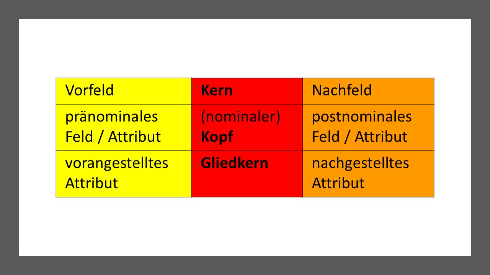
```

Die von [@engel1996deutsche] aus der Satzsyntax auf die Nominalphrase übertragenen Termini *Vorfeld, Mittelfeld* und *Nachfeld* sind **irreführend**, weil sie eine vollkommene Parallele zwischen Satz- und Nominalphrasenstruktur vortäuschen.
Trotz gewisser Parallelen gibt es mehrere Unterschiede, z.B.
die folgenden im Deutschen:

-   Das **Vorfeld** in einem Satz (z.B. *Unser Kind hat dem Weihnachtsmann noch nie einen Brief geschrieben*) wird maximal nur von einer Satzkonstituente besetzt, d.h. meistens nur von einem Satzglied (z.B. *unser Kind*), bei Hervorhebung gelegentlich auch von einer Verbalphrase mitsamt ihren Objekten (z.B. *Dem Weihnachtsmann einen Brief geschrieben - hat unser Kind noch nie*). Vor dem Kern (Kopf) einer Nominalphrase hingegen können durchaus mehrere Attributebenen erscheinen (*Unser kleines von seinen Großeltern total verwöhntes Kind ..., ein kleines mathematisches Genie* ) -- im Vergleich zum Vorfeld eines Satzes also durchaus nicht auf Hervorhebung beschränkt.\
-   Ein **Mittelfeld** wie im Satz gibt es nicht, weil das Nomen nie diskontinuierlich (d.h. zweiteilig an zwei verschiedenen Stellen in der Nominalphrase) vorkommt wie die deutsche Verbalphrase (z.B. *Unser Kind hat dem Weihnachtsmann noch nie einen Brief geschrieben*).\
-   Das **Nachfeld** in einer Nominalphrase ist im Gegensatz zum Nachfeld eines Satzes relativ häufiger besetzt (z.B. *das Haus meiner Eltern, die Behandlung des Patienten, die Fahrt nach Maribor, ...*).

```{r echo=FALSE, message=FALSE, warning=FALSE, out.height="100%", out.width="100%"}
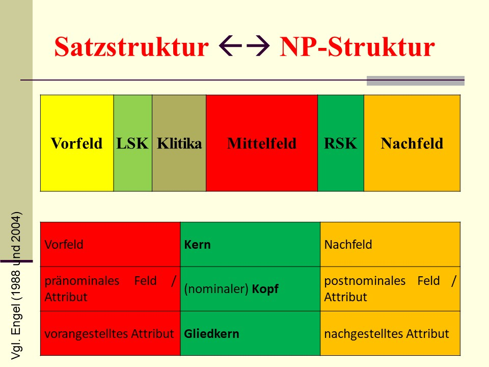
```

Vergleicht man die beiden Feldschemata (Satzfelder vs. Attributfelder), dann bietet sich am ehesten eine **Parallele** zwischen der Struktur von *Nominalphrasen* und *Infinitivsätzen* (inkohärenten Infinitivkonstruktionen) an:   
- dem nominalen Kopf entspricht der Infinitiv in der rechten Satzklammer (RSK),   
- dem nominalen Vorfeld entspricht das Mittelfeld der Infinitivkonstruktion,   
- dem nominalen Nachfeld entspricht das Nachfeld der Infinitivkonstruktion (Unterschiede s.o.),   
- einem Subjunktor, der die linke Satzklammer (LSK) eines Infinitivsätzes besetzen kann, entspricht eine Präposition, die eine Nominalphrase regiert,   
- ein Infinitvsatz hat kein Vorfeld, eine Nominalphrase hat vor dem Engelschen "Vorfeld" keine weitere Strukturstelle.   

Neutraler und daher präferenter sind Ausdrücke wie:\
- \*\*pränominales Feld / Attribut (vorangestelltes Attribut\* und\
- *postnominales Feld / Attribut (nachgestelltes Attribut)*.

[@engel1996deutsche] gibt folgende Übersicht über die unmarkierten und markierten (in speziellen) Positionen der Attribute in einer NP:

```{r echo=FALSE, message=FALSE, warning=FALSE, out.height="100%", out.width="100%"}
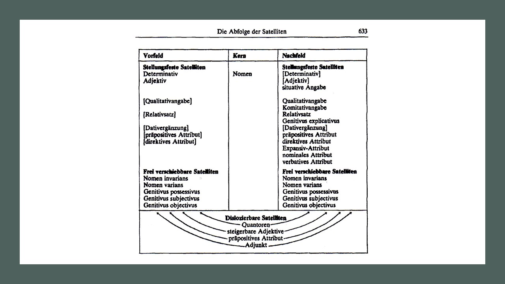
```

```{r echo=FALSE, message=FALSE, warning=FALSE, out.height="100%", out.width="100%"}
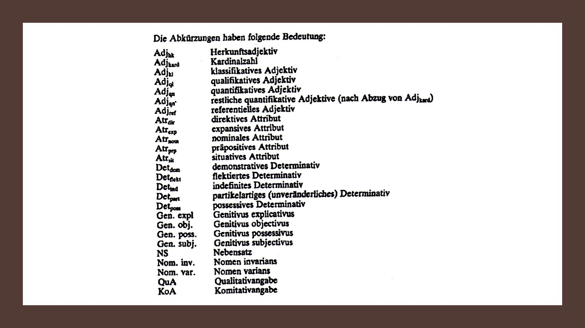
```

Hinsichtlich ihrer Stellungspräferenzen werden drei Attributtypen unterschieden:\
- stellungsfeste Satelliten,\
- frei verschiebbare Satelliten,\
- dislozierbare Satelliten.

*Determinative* und *Adjektive* gehören nach diesem Schema zu den **stellungsfesten Attributen**.
Sie werden gewöhnlich **vorangestellt**, während die Nachstellung markiert ist (d.h. nur in spezifischen Kontexten oder Textsorten üblich).

Eine große und vom Aufbau her diverse Gruppe von Attributen gehört ebenfalls zu den stellungsfesten Attributen, wird aber **nachgestellt**.
Einige davon zwar vor dem Kopf der NP stehen, aber nur unter spezifischen Bedingungen (markiert oder weniger natürlich).
Es handelt sich um formal komplexere Phrasen (Nominal- und Präpositionalphrasen, NP und PP) und satzartige Konstruktionen (Nebensätze, Infinitivkonstruktionen).

**Frei verschiebbare Attribute** sind nicht wirklich frei verschiebbar.
Vielmehr geht es darum, dass bestimmte Attribute, je nach Kombination und Form ihrer Bestandteile voran- oder nachgestellt ewrden.
Zwei Gruppen sind unterscheidbar:\
- Nominalphrasen mit *Possessivpronomen als Kopf* (nach der Terminologie von [@engel1996deutsche] : Pronominalphrasen), die mit einer nachgestellten NP im Genitiv korrespondieren,\
- *Appositionsartige Konstruktionen* wie *Nomen varians* und *Nomen invarians*, die aber in der Grammatik von [@engel1996deutsche] von Appositionen (im Engelschen Sinne) abgegrenzt werden.

**Dislozierbare Attribute** können von ihrem Bezugselement (dem nominalen Kopf) getrennt werden und an einer anderen Stelle im Satz erscheinen.
Diese Eigenschaft zeigen *Quantoren* (Zahlausdrücke), *steigerbare Adjektive*, *präpositive Attribute* und *Adjunkte*.

Das Folgeschema für die deutsche NP in [@engel1996deutsche] zeigt die unmarkierte Abfolge der Attribute, was man als Grundfolge der NP-Attribute bezeichnen könnte.
Die unmarkierte Reihenfolge der Attribute stimmt im Wesentlichen mit dem **Behagelschen Gesetz der wachsenden Glieder** überein: die formale Komplexität der Attribute nimmt nämlich von links (vorangestellte Attribute) nach rechts (nachgestellte NP und PP, dann satzartige Konstruktionen) zu.

```{r echo=FALSE, message=FALSE, warning=FALSE, out.height="100%", out.width="100%"}
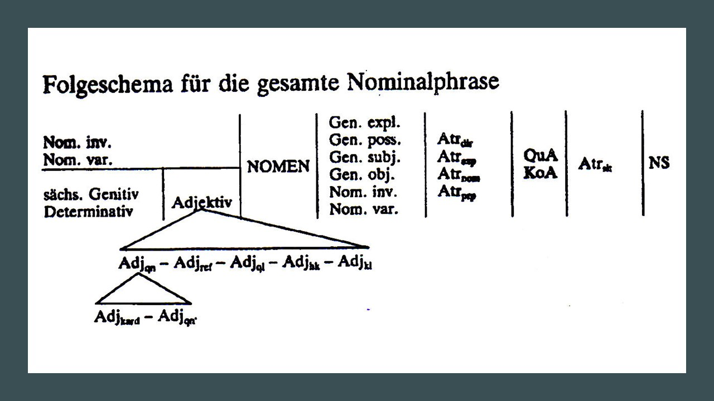
```

Relativ selten werden Determinative in ein- und derselben NP nacheinander aufgestellt.
Das *Folgeschema* zeigt die *unmarkierte Abfolge der Determinative* [@engel1996deutsche].

```{r echo=FALSE, message=FALSE, warning=FALSE, out.height="100%", out.width="100%"}
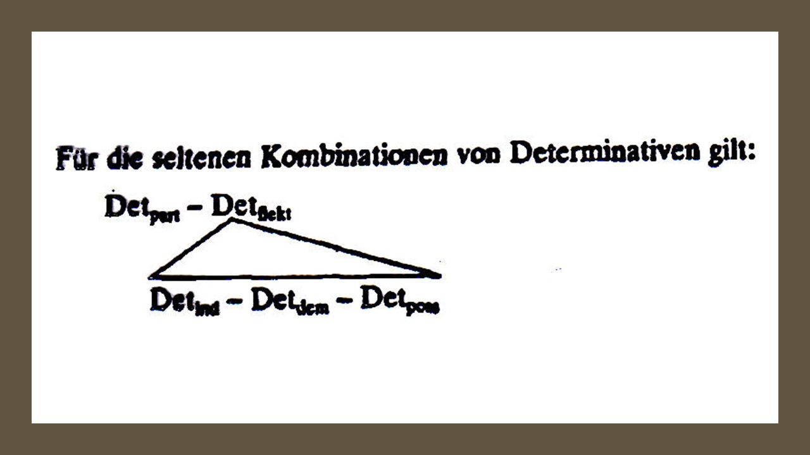
```

## Pränominale Attribute

Im Vorfeld können folgende Attribute stehen (**pränominale Attribute** -- Klammern = markierte Verwendung):

· Determinative

· Adjektive bzw.

Adjektivalphrasen

· Genitivus possessivus (bzw. NP mit N im Genitiv)

· (Situativangaben) ...

· Nomen invarians (in anderen Grammatiken à Apposition)

· Nomen varians (in anderen Grammatiken à Apposition)

· Genitivus subjectivus

· Genitivus objectivus

· Adjunkte mit variabler Position (dislozierbare Satelliten).

(4) A: In [diesem]{.underline} Haus wohnen [meine]{.underline} Eltern.

-   B: In [welchem]{.underline}?

(Determinative)

(5) Die Kinder bekamen [kalte]{.underline} Finger.
    (Adjektiv)

(6) Das war aber mal ein [wirklich *heißer*]{.underline} Sommer.
    (Adjektivalphrase)

(7) [Utes]{.underline} Bluse ist ja wirklich schick.
    (Genitivus possessivus als sächsicher Genitiv)

(8) [Dort]{.underline} der Hund!

(Situativangabe: in Standarsprache selten im Vorfeld, poetisch häufiger)

(9) [Helga]{.underline} Maiers Zeugnis (Nomen invarians: formunveränderliche Ergänzung, keine Anaphorisierung möglich, vor allem Personennamen)

(10) An [Herrn]{.underline} Maier (Nomen varians: formveränderliche Ergänzung zu Familiennamen)

(11) [Frau Müllers]{.underline} Antrag (Genitivus subjectivus: Urheber eines Geschehens oder Ergebnisses)

(12) [Dresdens]{.underline} Zerstörung (Genitivus objectivus: Betroffenes eines Geschehens / Ergebnisses)

## Postnominale Attribute

Im Nachfeld der NP können folgende (**postnominale**) Attribute vorkommen (solche in Klammern stehen nur in markierten Fällen postnominal, z.B. bei Hervorhebung oder nur in bestimmten Textsorten oder Stilregistern):

· (Determinative)

· (Adjektive)

· Genitivus possessivus

· Qualitativangaben

· Situativangaben

· Komitativangaben

· Relativsätze

· Appositionen

· Nomen invarians

· Nomen varians

· Genitivus subjectivus

· Genitivus objectivus

· Genitivus explicativus

· (Dativergänzung)

· präpositive Attribute

· direktive Attribute

· Expansiv-Attribute

· nominale Attribute

· verbative Attribute

· Adjunkte mit variabler Position (dislozierbare Satelliten).

(13) Vater [unser]{.underline} (Determinativ im Nachfeld: Reste in Volksdichtung und Gebetformeln)

(14) Es war ein Abend so [schön]{.underline} wie nie zuvor.
     (Adjektiv)

(15) Der Alte, [gramgebeugt]{.underline}, senkte den Blick.
     (Adjektiv: Hervorhebung in Nachfeldstellung)

(16) Henkell [trocken]{.underline} (Adjektiv: in seltener Nachfeldstellung)

(17) der Garten [meines Vaters]{.underline} (Genitivus possessivus: freie Angabe)

(18) ein Sechstel [der Bevölkerung]{.underline} (G. possessivus mit partitiver Bedeutung: Teil - Ganzes)

(19) eine Frau [mit auffallend großen Augen]{.underline} (Qualitativangabe)

(20) eine Vase [aus Porzellan]{.underline} (Qualitativangabe: Eigenschaft, Beschaffenheit u.a.)

(21) die Bank [da draußen]{.underline} (Situativangabe: Adverbialphrase)

(22) das Kind [im Garten]{.underline} (Situativangabe: Präpositionalphrase)

(23) unser Gespräch [letzen Donnerstag]{.underline} (Situativangabe: akkusativische NP)

(24) ein Wagen [ohne Schaffner]{.underline} (Komitativangabe)

(25) der Schlüssel, [der mir verlorenging]{.underline}, (Relativsatz: Angabe, restriktiv vs. nicht-restriktiv)

(26) Bill Clinton, [mein alter Schulfreund]{.underline}, (Apposition: Angabe, Selbständigkeit, Komma)

(27) im Nachlaß des Professors [Breitenmoser]{.underline} (Nomen invarians)

(28) aus einem Glas [warmer Milch]{.underline} (Nomen varians)

(29) das Verhalten [meines Vaters]{.underline} (Genitivus subjectivus, Subjektgenitiv)

(30) die Publikation [ihrer Monographie]{.underline} (Genitivus objectivus, Objektgenitiv)

(31) die Möglichkeiten [der Entspannung]{.underline} (Genitivus explicativus: Ergänzung, nähere Erklärung)

(32) Kampf [dem Atomtod]{.underline} (Dativergänzung: im Gegenwartsdeutschen sehr selten als Attribut)

(33) Angst [vor dem Krieg]{.underline} (Präpositives Attribut: Ergänzung)

(34) die Auswanderung der Familie [nach Australien]{.underline} (direktives Attribut: Ergänzung)

(35) eine Höhe [von über achtzig Metern]{.underline} (Expansiv-Attribut: Ergänzung)

(36) ihre Tätigkeit [als Referentin]{.underline} (Nominales Attribut: Ergänzung, Kategorisierung)

(37) seine Vermutung, daß sie überhaupt nicht hier war (verbatives Attribut: fakultative Ergänzung zu deverbativen Nomina)

## Attribute mit variabler Position

Unter den Attributen mit variabler Position sind drei Teilmengen zu unterscheiden:

· kaum verschiebbare

· frei verschiebbare

· dislozierbare Elemente.

### Kaum verschiebbare Elemente

Die hier angeführten Elemente sind grundsätzlich an ein Stellungsfeld gebunden.
Verschiebungen sind nur unter besonderen Kontextbedingungen (markierte Option) möglich.
Auf der einen Seite handelt es sich um **Vorfeldelemente** wie die Determinative und Adjektive, auf der anderen Seite um **Nachfeldelemente** wie die Situativangaben, Qualitativangaben, Relativsätze, Dativergänzungen, präpositiven Attribute und die direktiven Attribute, die im markierten Fall auch ins Vorfeld treten können.

#### Verschiebung Vorfeld \>\> Nachfeld

##### Determinative

**Determinative** sind im heutigen Deutschen reine Vorfeldelemente.
In Relikten älteren Sprachgebrauchs und in Gedichten finden sich jedoch auch Determinative in Nachfeldstellung:

(38) Vater [unser]{.underline} (Gebetanfang)

(39) Hänschen [klein]{.underline} ging allein in die weite Welt hinein (Kinderlied)

##### Adjektive

**Adjektive** treten im unmarkierten Fall im Vorfeld einer Nominalphrase auf.
Unter besonderen Kontextbedingungen treten sie auch im Nachfeld auf, und zwar [@engel1996deutsche: 612ff]:

· die **Konstruktion** [*so* + (unflektiertes) Adjektiv + *wie* bzw. *daß-Nebensatz*]{.underline} kann dem Nomen nachgestellt werden (40);

· in der **Apposition**[[1]](#_ftn1) erscheint das Adjektiv (die Adjektivalphrase) unflektiert, durch Kommas vom Kontext abgetrennt, hinter dem Nomen (41);

· in komplexen Typenbezeichnungen (zum Teil aus fremden Sprachen entlehnt) wird das Adjektiv häufig unflektiert dem Nomen nachgestellt; zur Zeit ist dieser Gebrauch zwar noch auf einige wenige Adjektive beschränkt, aber die Anzahl solcher Verwendungen nimmt zu (42);

· im Resten **älteren** Sprachgebrauchs, der sich z.B.
noch in vielen Volksliedern und der volkstümlichen Dichtung des 19.
Jahrhunderts findet, konnte das Adjektiv in unflektierter Form dem regierenden Nomen nachgestellt werden (43).

(40a) Ihre Stimme hatte einen [so schneidend*en* und unerbittlich*en*]{.underline} Klang, [daß es mir den]{.underline} [Atem verschlug]{.underline}.
(unmarkierte Stellung der - flektierten - Adjektive im Vorfeld)

(40b) Ihre Stimme hatte einen Klang [so schneidend und unerbittlich]{.underline}, [daß es mir den Atem]{.underline} [verschlug]{.underline}.
(markierte Stellung der - unflektierten - Adjektive im Nachfeld)

(41a) ein Charakter, [der schwach wie ein Schilfrohr im Wind war]{.underline}, ... (Relativsatz)

(41b) ein Charakter, [schwach wie ein Schilfrohr im Wind]{.underline}, ... (Apposition)

(42a) Campari [bitter]{.underline}, Henkell [trocken]{.underline}, Racke [rauchzart]{.underline}, Aral [Super]{.underline}, Benzin [bleifrei]{.underline}, Kamino [rund]{.underline}, Putenschenkel [bratfertig]{.underline}, Fahrspaß [total]{.underline}, Natur [pur]{.underline}, ... (NF-Adjektiv unflektiert)

(42b) Golf Diesel, Opel Ascona, Mitsubishi Colt (Nomen invarians vergleichbar mit Adj (42a))

(43) ein Mägdelein [fein]{.underline}

#### Verschiebung Nachfeld \>\> Vorfeld

##### Situativangaben

**Situativangaben** ordnen der durch das regierende Nomen benannten Größe ein räumliches oder zeitliches Merkmal zu, lassen sich mit sämtlichen übrigen Attributen kombinieren, solange die Verbindungen überschaubar und die Zuordnungen erkennbar sind (47), und können in der Sprache der Dichtung und gelegentlich in der Alltagssprache auch im Vorfeld einer Nominalphrase auftreten (48).

(44) die Bank [draußen]{.underline}, der Unfall [damals]{.underline} (Adverb),

(45) das Kind [im Garten]{.underline}, Bekanntschaften [aus der Nachkriegszeit]{.underline} (PP)

(46) unser Gespräch [letzten Donnerstag]{.underline}, der Besuch [nächste Woche]{.underline} (tempor. akkusativ. NP)

(47a) *Edgars* *alte* Bank [im Garten]{.underline} (Gen. possessivus + qualif. Adj. + Kern + Situativang.)

(47b) *diese* Kinder [hier]{.underline} (Determinativ + Kern + Situativangabe)

(47c) *Opas* Fehlgriff [damals]{.underline} (Genitivus subjectivus + Kern + Situativangabe)

(47d) (\*)der Preis des Friedens [damals]{.underline} (Bezug unklar: *Preis* oder *Frieden* Bezugselement?)

(47e) (\*)der Unfall *ohne Folgen* [gestern]{.underline} (Kombinationen mit komitativen Angaben begrenzt)

(48) [Dort]{.underline} der Hund hat mich gestern gebissen. (Situativangabe im Vorfeld)

##### Qualitativangaben

**Qualitativangaben** ordnen der durch das regierende Nomen benannten Größe eine Eigenschaft, Beschaffenheit usw.
zu, lassen sich mit sämtlichen übrigen Attributen des Nomen kombinieren (54), stehen gewöhnlich im Nachfeld (49)-(54), können aber in dichterischer oder rhetorisch ausgeschmückter Rede auch vorangestellt werden (55).

(49a) eine Frau [mit auffallend großen Augen]{.underline} (PP am häufigsten)

(49b) eine [auffallend großäugige]{.underline} Frau (qualitative Adjektivalphrase kommutiert mit PP)

(50) eine Vase [aus Porzellan]{.underline}

(51) ein Mädchen [in einem blauen Mantel]{.underline}

(52) ein Kind [von mäßiger Intelligenz]{.underline}

(53a) ein Jüngling [edlen Wuchses]{.underline} (Genitivphrase: Gebrauch meist veraltet oder geschraubt)

(53b) eine Fahrkarte [erster Klasse]{.underline}, Blusen [zweiter Wahl]{.underline}, eine Zeitschrift [neueren Datums]{.underline}, Leute [beliebigen Alters]{.underline} (Genitiv in mehr oder wenigen festen Wendungen)

(54a) *meine blaue* Bluse [zweiter Wahl]{.underline} (poss. Det.+qualif. Adj.+Kern+Qualitativang.)

(54b) *Helgas* Vase [aus Porzellan]{.underline} (Gen. poss.+Kern+Qualitativangabe)

(54c) ein Mann [von mäßiger Intelligenz]{.underline} *aus Sandhofen* (Det.+Kern+Qualitativ.+Direktivattr.)

(55a) ein Kranz [von Apfelblüten]{.underline} (Qualitativangabe nachgestellt)

(55b) [von Apfelblüten]{.underline} ein Kranz (Qualitativangabe vorangestellt)

##### Relativsätze

**Relativsätze** sind nominale Angaben und haben ähnlich den Adjektiven die semantische Funktion, ein Nomen näher zu bestimmen (zu qualifizieren, klassifizieren usw.).
Wie alle Attributsätze haben sie ihre reguläre Stelle hinter dem Nomen.
Voranstellung ist in dichterischer oder rhetorisch ausschmückender Rede, ebenso bei ironischer Verwendung derselben Ausdrucksformen möglich.
Die Voranstellung des Relativsatzes bewirkt die Hervorhebung des Attributsatzes, sind aber in der Standardsprache nicht üblich.

(56a) Den Mann, [der all dies durchgestanden hat]{.underline}, will ich mir zukommen lassen.
(nachgest.)

(56b) [Der all dies durchgestanden hat]{.underline}, den Mann will ich mir kommen lassen.
(vorangestellt)

Relativsätze können restriktiv oder nicht-restriktiv sein.
Von **nicht-restriktiven** Relativsätzen (58) spricht man, wenn lediglich ein Merkmal zum Bezugsnomen hinzugefügt wird.
Wird ein nicht-restriktiver Relativsatz zu einem Nomen hinzugefügt oder weggelassen, verändert sich der Bezug auf die Anzahl der außersprachlichen Objekte nicht.
In nicht-restriktiven Relativsätzen können Abtönungspartikeln (vor allem *ja, doch, eben, halt, eigentlich*), solche Partikeln wie *übrigens*, und Elemente wie *wie du weißt* und *bekanntlich* verwendet werden.
Außerdem können nicht-restriktive Relativsätze durch Pause vom Bezugselement getrennt werden (intonatorisch größere Selbständigkeit).
**Restriktive Relativsätze** sind in der Regel obligatorisch, weil sie für das Verständnis des Satzes notwendig sind.
Mit restriktiven Relativsätzen schränkt man ähnlich wie mit einigen Gradpartikeln (z.B. nur) den Bezug auf eine bestimmte Teilmenge von Objekten ein (57).
Mehr über Relativsätze in [@engel1996deutsche: 292-295].

(57) Ein Junge hatte vier Großväter. Sein Freund wollte wissen, was sie von Beruf waren. Der Junge antwortete:

(57a) Derjenige Großvater, [der Chemiker war]{.underline}, lebte in München.
(r)

(57b) Derjenige Großvater, [der Bäcker war]{.underline}, lebte in Köln.
(r)

(57c) Derjenige Großvater, [der Arzt war]{.underline}, lebte in Hamburg.
(r)

(57d) Derjenige Großvater, [der Politiker war]{.underline}, lebte in Berlin.
(r)

(58) Ein Junge lebte in München.

Dort lebte auch sein Großvater.
Der Freund des Jungen wollte mehr über den Großvater erfahren.
Der Junge erzählte:

Mein Großvater, [der (übrigens) Chemiker war]{.underline}, war ein kluger Mann.
Trotzdem lebte er in ständigen Geldsorgen.
... (n-r)

##### Dativergänzungen

**Dativergänzungen** zum Nomen kommen in der deutschen Standardsprache nur verschwindend selten vor (im Gegensatz zur slowenischen Standardsprache).

In solchen seltenen Fällen treten sie meist im Nachfeld einer isolierten Nominalphrase auf (59b).

(59a) Kampf [*gegen* den Atomtod]{.underline} (PP)

(59b) Kampf [dem Atomtod]{.underline} (Dativergänzung in isoliert auftretender Nominalphrase)

(59c) Sie kämpfen [*gegen* den Atomtod]{.underline}.
(Verb mit Präpositivergänzung, *gegen* als Präp.)

Im Vorfeld einer Nominalphrase häufig bei emotiver Hervorhebung (60) und schlagwortigem Gebrauch (61):

(60) [dem Jubelpaare]{.underline} herzlichen Glückwunsch

(61) [den Ausbeutern]{.underline} keine Stimme

##### Präpositive Attribute

**Präpositive Attribute:**: In dichterisch oder rhetorisch ausschmückender Rede, teilweise auch in der Standardsprache, können präpositive Attribute, die im unmarkiertem Fall dem nominalen Kern nachgestellt werden, auch ins Vorfeld der Nominalphrase treten.

(62a) seine Bitte [um Nachsicht]{.underline}

(62b) [um Nachsicht]{.underline} seine Bitte

(63a) kein Anspruch [auf sofortige Behandlung]{.underline}

(63b) [auf sofortige Behandlung]{.underline} kein Anspruch

##### Direktive Attribute

**Direktive Attribute** stehen gewöhnlich im Nachfeld einer Nominalphrase und können allenfalls in der Alltagssprache, kaum jedoch infolge bewußter rhetorischer Abweichung vorangestellt werden.

(64a) die Straße [nach Maribor]{.underline}

(64b) [nach Maribor]{.underline} die Straße

(65a) der Sonderzug [aus Oberstdorf]{.underline}

(65b) [aus Oberstdorf]{.underline} der Sonderzug

### „Frei" verschiebbare Elemente\*\*

#### Genitivattribute

Die **genitivischen Attribute** (außer dem *Genitivus explicativus*) sowie das **Nomen invarians** können gleicherweise im Vor- wie im Nachfeld auftreten.
Eine Sonderrolle spielt das **Nomen varians**.

**KLASSIFIZIERUNG DER GENITIVATTRIBUTE**

```{r echo=FALSE, message=FALSE, warning=FALSE, out.height="100%", out.width="100%"}
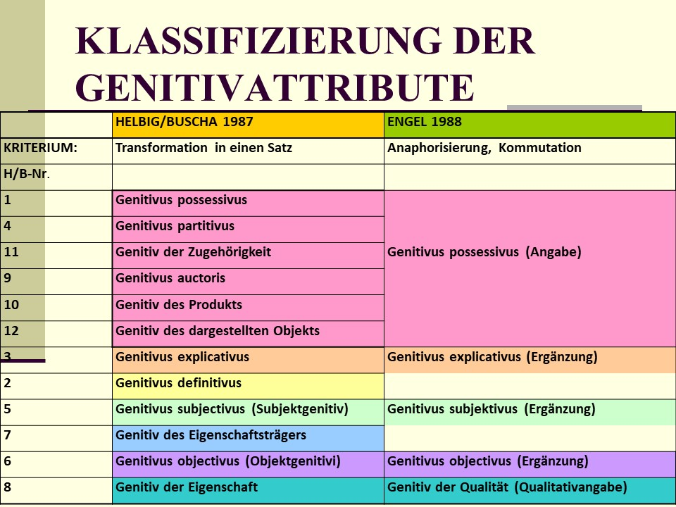
```

Helbig & Buscha (1996): Deutsche Grammatik. S. 591-592

**GENITIVATTRIBUTKLASSEN**

Attribute, die durch ein **Substantiv im Genitiv** repräsentiert werden, müssen auf verschiedene Weise abgeleitet werden, da ihnen verschiedene Arten von Prädikationen zugrunde liegen, denen auch verschiedenartige **inhaltliche Beziehungen** entsprechen (Subjekt, Objekt, Prädikativ und andere).

(1) **Genitivus possessivus** (= Haben-Verhältnis)

das Haus meines Vaters <== mein Vater hat ein Haus

(2) **Genitivus definitivus** (= Sein-Verhältnis)

die Pflicht der Dankbarkeit <== die Dankbarkeit ist eine Pflicht

(3) **Genitivus explicativus** (= Bedeuten-Verhältnis)

der Strahl der Hoffnung <== der Strahl bedeutet Hoffnung

(4) **Genitivus partitivus** (= Teil-von-Verhältnis)

die Hälfte des Buches <== die Hälfte ist Teil von dem Buch

(5) **Genitivus subjectivus** (= Subjekt-Prädikats-Verhältnis)

die Lösung des Schülers <== der Schüler löst (die Aufgabe)

(6) **Genitivus objectivus** (= Objekt-Prädikats-Verhältnis)

die Lösung der Aufgabe <== (der Schüler) löst die Aufgabe

(7) **Genitiv des Eigenschaftsträgers** (= Sein-Verhältnis, aber im Unterschied

zu (2) steht im Prädikativ ein Adjektiv)

die Größe des Zimmers (von 20 m2) <== das Zimmer ist (20 m2) groß

(8) **Genitiv der Eigenschaft** (= Kennzeichnen-Verhältnis)

ein Mann der Vernunft <== Vernunft kennzeichnet den Mann

(9) **Genitivus auctoris** (= Verhältnis des Schaffens)

das Werk des Dichters <== der Dichter hat das Werk geschaffen

(10) **Genitiv des Produkts** (= Verhältnis des Geschaffen-Seins, Umkehrung

von (9); das Produkt steht im Genitiv)

der Dichter des Werkes <== das Werk ist Produkt des Dichters

(11) **Genitiv der Zugehörigkeit** (= Gehören-zu-Verhältnis)

die Schule meines Bruders <== mein Bruder gehört zu der Schule

(12) **Genitiv des dargestellten Objekts** (= Darstellen-Verhältnis)

das Bild Goethes <== das Bild stellt Goethe dar


Nach [@engel1996deutsche] erscheinen die **Genitivattribute** häufiger im Nachfeld einer NP. Als Vorfeldelemente haben sie immer die Form des *sächsichen Genitivs* und erlauben dann kein realisiertes Determinativ. Nachgestellte Genitivattribute verlangen im Vorfeld der NP ein Determinativ und sind im Gegensatz zu den vorangestellten Genitivattributen meist komplexer aufgebaut.

(66a) das Lieblingsgetränk ([von) unserer Oma]{.underline} (Gen. possessivus)

(66b) [Oma*s*]{.underline} Lieblingsgetränk (als sächsicher Genitiv)

(67a) die Zusage [unserer gewissenhaften Oma]{.underline} (Gen. subjectivus)

(67b) [Oma*s*]{.underline} Zusage (als sächsicher Genitiv)

(68a) die Entlassung [der vor wenigen Wochen eingelieferten Oma]{.underline} (Gen. objectivus)

(68b) [Oma*s*]{.underline} Entlassung (als sächsicher Genitiv)


#### Nomen invarians

Das **Nomen invarians** ist ein unveränderliches nominales Attribut zu einem in der Regel flektierten regierenden Nomen. Drückt das Nomen invarians als geographischer, zeitlicher, quantifizierender oder gattungsbezogener Begriff auf, bleibt das Nomen invarians immer im Nachfeld der Nominalphrase (69).

(69) das Dorf [Hambach]{.underline}, der Monat [August]{.underline}, ein Liter [Bier]{.underline}, der Opel [Kadett]{.underline}

**Alternative** Vor- oder Nachfeldstellung des Nomen varians gilt für folgende Verbindungen:

(70) (a) Helga Maier[s]{.underline} : 
(b) d[er]{.underline} Helga Maier (Vorname : Familienname)

(71) (a) Onkel Kurt[s]{.underline} : 
(b) d[es]{.underline} Onkel Kurt (Verwandtschaftsbezeichnung : Name)

(72) (a) Rechtsanwalt Breuer[s]{.underline} : (b) d[es]{.underline} Rechtsanwalt[s]{.underline} Breuer (Titel/Funktion/Beruf : Name)

Für solche Fälle wie in (70)-(72) gilt nach [@engel1996deutsche: 627], daß als regierendes Element jeweils das flektierte Nomen (Flexion in den Beispielen jeweils unterstrichen) anzusehen ist, das invariante Element hingegen als Attribut, d.h. als Nomen invarians. Die Abhängigkeitsverhältnisse liegen also jeweils umgekehrt: in (a) sind *Helga*, *Onkel* und *Rechtsanwalt* Nomen invarians, in (b) hingegen *Maier*, *Kurt* und *Breuer*.

Die **Kombinatorik** des Nomen invarians ist vom regierenden Nomen abhängig.


#### Nomen varians

Das **Nomen varians** findet sich in Nominalphrasen, in denen zwei Nomina parallel flektiert werden. Das Nomen varians kann nicht im eigentlichen Sinne als verschiebbares Element eingeordnet werden, weil für Voran- und Nachstellung jeweils ganz verschiedene Elemente in Frage kommen.

**Voranstellen** kann man nur die Nomina *Genosse, Herr* und *Kollege* (*Genosse Tito, Herr Lehrer*).
Wird ein Artikel hinzugefügt (z.B. *der Genosse Tito*), so wird das das zweite Nomen automatisch zum Nomen invarians (z.B. *d[es]{.underline} Genosse[n]{.underline} Tito*).

(73) Genosse Tito, der Genosse Tito, des Genossen Tito

(74) Herr Lehrer, der Herr Lehrer, des Herrn Lehrer

(75) Abgeordneter Maier, der Abgeordnete Maier, des Abgeordneten Maier

**Nachgestellt** werden Beinamen und Namenszusätze bei Herrschernamen und Materialbezeichnungen bei Maß- und Mengenbezeichnungen, als Nomina mit ganz eigenen Bedeutungen und syntaktischen Eigenschaften.

(76) Heinrich der Achte - Heinrichs [des Achten]{.underline} (Heinrichs VIII.)

(77) aus einer Flasche [purem Apfelwein]{.underline} (Kongruenz beider Nomina)

mit einem Sack [gutem Zement]{.underline}

(78) mit einem Sack [guter Zement]{.underline} (alltagssprachlich: Nominativ als Nullkasus)

(79) eines Sacks [gutem Zement]{.underline} (Dativ statt Genitiv als Kasus obliquus)

Das Nomen varians läßt sich nur **begrenzt erweitern**.
Bei Materialbezeichnungen möglich:

(80) aus einem Glas [warmer Milch]{.underline} *aus dem Allgäu*


### Dislozierbare Elemente

Ein Teil der Determinative und der Adjektive sowie die präpositiven Attribute und Adjunkte als auch die Pertinenzelemente (meist im Dativ) sind relativ frei verschiebbar.
Sie können sogar durch andere Satzbestandteile vom nominalen Kern getrennt werden.


#### Quantoren

Die **Quantoren** (dh die indefiniten Determinative *aller, einiger,* das negative Determinativ *kein* und die Zahladjektive *beide, viel(er), wenig(er)*) bewirken eine quantitative Bestimmung des Nomens. Sie zeigen besondere Stellungseigenschaften.

(81a) [Alle/beide]{.underline} Geschwister waren abgereist.

(81b) *Die* Geschwister waren [alle/beide]{.underline} abgereist.

(81c) [All]{.underline} *die* Geschwister, die sich zu Weihnachten bei ihm versammelt hatten, waren nun ...

(81d) [All]{.underline} *ihre* Geschwister, die sich ... hatten, waren nun abgereist.

(81e) [All]{.underline} *diese* Geschwister waren nun abgereist.

(81f) *Diese* Geschwister waren nun [alle]{.underline} abgereist.

(81g) *Ihre* Geschwister, die sich ... hatten, waren nun [alle]{.underline} abgereist.

Die restlichen oben genannten Quantoren können ebenfalls vom Kern getrennt werden.
Allerdings muß das regierende Nomen im Nominativ, Akkusativ oder Dativ stehen.

(82) Ausländer sind ebenfalls [einige]{.underline} dagewesen.

(83) Freunde hatt er [viele]{.underline}.

(84) Nachbarn traut er heute nur noch [wenigen]{.underline}.

Während im **Deutschen** nur die Abfolge (85a) möglich ist, ist im **Slowenischen auch die umgekehrte Reihenfolge** (85b) realisierbar (Nomen *N*, fintes Verb *Vf*, Quantor *Q*).

(85a) N - Vf - ... - Q Deutsch, Slowenisch

(85b) Q - Vf - ... - N.
Slowenisch


#### Steigerbare Adjektive

**Steigerbare Adjektive** können vom regierenden Nomen getrennt werden.

Das Nomen muß allerdings im Vorfeld eines Aussagesatzes (Konstativsatzes) stehen und als Nominativ oder Akkusativ realisiert sein.
Das dislozierte Adjektiv, meist eine komparativische oder superlativische Form, steht im Mittelfeld des Satzes.
Derartige diskontinierliche NPs sind in der Alltagssprache üblich.

(86a) Ich habe [bessere]{.underline} Bleistifte als du.

(86b) Bleistifte habe ich [bessere]{.underline} als du.


#### Präpositive Attribute

**Präpositive Attribute** können vom regierenden Nomen getrennt werden.

Wie bei den Adjektiven muß das Nomen im Nominativ oder Akkusativ stehen.

Möglich sind Links- und Rechtsverschiebung der NP-Teile mit präpositivem Attribut.

(87a) Er scheint *eine auffallende Vorliebe* [für schnelle Wagen]{.underline} zu haben.

(87b) *Eine auffallende Vorliebe* scheint er [für schnelle Wagen]{.underline} zu haben.

(87c) [Für schnelle Wagen]{.underline} scheint er eine auffallende Vorliebe zu haben.

Die Eliminierungsprobe zeigt, dass die Präpositionalphrase nicht vom Verb *haben* abhängt.
Lässt man nämlich das Substantiv *Vorliebe* (samt pränominalen Attributen) weg, erhält man einen grammatisch nicht wohlgeformten Satz (angezeigt durch das Asterisk \*).
In der folgenden Satzversion wurde der größeren Deutlichkeit wegen auch das Modalitätsverb *lassen* eliminiert.

(87d) \*Er hat ~~eine auffallende Vorliebe~~ für schnelle Wagen.

Das Verb *haben* verbindet sich nicht mit Präpositionalphrasen in Objektfunktion, sondern mit einer Nominalphrase im Akkusativ.

(87e) Er hat schnelle Wagen.

Dass die Präpositionalphrase *für schnelle Wagen* tatsächlich ein Attribut zum Substantiv *Vorliebe* ist und damit trotz selbständiger Verschiebbarkeit und Dislozierbarkeit kein Satzglied, erkennt man mit einer Kommutationsprobe, bei der man das Substantiv *Vorliebe* durch ein anderes austauscht.

(87f) Er hat *einen Chauffeur* [für schnelle Wagen]{.underline}.

Durch den Ersatz des Bezugssubstantivs (*Vorliebe à Chauffeur*) verändert sich die syntaktische Funktion und Bedeutung der Präpositionalphrase *für schnelle Wagen* dahingehend, dass statt eines Objekts (mit der syntaktischen Funktion einer Ergänzung) der Zweck einer Handlung (eine Finalangabe also) angegeben wird.

(87g) Er hat *eine Vorliebe* [für schnelle Wagen]{.underline}.
(= Objekt der Handlung bzw. des Zustands)

(87h) Er hat *einen Chauffeur* [für schnelle Wagen]{.underline}.
(= Zweck der Handlung bzw. des Zustands)

Die Verschiebeprobe ist zwar notwendig, um Satzglieder von Attributen unterscheiden zu können, erweist sich jedoch im Falle der dislozierbaren Attribute als nicht hinreichend.
Die Eliminierungsprobe hat uns gezeigt, dass eine engere Beziehung zwischen dem Substantiv *Vorliebe* und der Präpositionalphrase *für schnelle Wagen* besteht.
Mit Hilfe der Kommunationsprobe ließ sich genauer bestimmten, welcher Art diese Beziehung war (syntaktisch und semantisch).
Um den Unterschied klarer herauszustellen, kann man sich außerdem dazu entschließen, den Satzbau zu vereinfachen (beispielsweise wurde das Modalitätsverb *scheinen* getilgt, da es keinen Einfluss auf die Funktion der Präpostionalphrase hat).
Ist man sich allerdings nicht sicher, sollte man einen Satz so geringfügig verändern wie nur möglich.


#### Adjunkte

Das wichtigste gemeinsame Merkmal der **Adjunkte** ist ihre Dislozierbarkeit vom regierenden Nomen. Aus diesem Grund können sie nicht vorrangig einem bestimmten Stellungsfeld zugeordnet werden.

(88a) *Der Sanitäter* kam [völlig erschöpft]{.underline} aus dem Dorf zurück.

(Adjektiv als Adjunkt)

(88b) [Völlig erschöpft]{.underline} kam *der Sanitäter* aus dem Dorf zurück.

(Adjektiv als Adjunkt)

(88c) *Der [völlig erschöpfte]{.underline} Sanitäter* kam aus dem Dorf zurück.

(Adjektiv im NP-Vorfeld)

Adjunkte (88b) führen ein Merkmal neu ein, ein Attribut im NP-Vorfeld (88c) dieses Merkmal als bekannt, als vorausgesetzt ausweist.
Adjunkte bildet somit in der Regel einen Teil des Rhemas, die entsprechenden flektierten Adjektive im Vorfeld einer NP hingegen einen Teil des Themas.

Die Umformung eines Satzes mit Adjunkt in eine Nominalisierung (d.h. eine Nominalisierungstransformation) zeigt den Bezug auf ein Substantiv deutlicher.

(88d) Er handelte weise. ==> Sein Handeln war weise.

(88e) Er kam erschöpft zurück. ==> \* Sein Zurückkommen war / geschah erschöpft.

Dislozierbare Attribute wie die gerade vorgeführten Adjunkte kann man auch im Slowenischen nachweisen.
Allerdings fällt die Identifizierung dadurch leichter, dass Adjunkte im Gegensatz zu Adverbialbestimmungen mit einem zum Adjunkt stammgleichen Adverb das unveränderlich auftretende Morphem *--o* nicht aufweisen.

(88f) Janez se je vrnil povsem *izčrpan*\_\_ .
(= Adjunkt zum Substantiv *Janez*, seinen Zustand beschreibend)

(88g) Janez je *modr[o]{.underline}* molčal.
(= Adverbialbestimmung zum Verb *molčati*, die Art und Weise der Handlung)

Da Adjunkte bei beliebigen Nomina vorkommen können, sind sie zu den **Angaben des Nomens** zu rechnen.

**Ausdrucksformen**: unflektierte Adjektive (89), als+unflekt.
AP (90), PP (91), als+NP (92)

(89) *Hanna* stürzte [weinend]{.underline} ins Zimmer.

(90) Er war vom Pfarrer [als besonders gutmütig]{.underline} bezeichnet worden.

(91) *Hanna* stürzte [mit lautem Geschrei]{.underline} ins Zimmer.

(92) *Hanna* hatte [als Sekretärin]{.underline} seltsame Beobachtungen gemacht.

(93) Franz folgte ihm [blindlings]{.underline} ins Dunkel.
     (modifikative Angabe zum Verb oder Adjunkt?)

Trotz Angabestatus sind gewisse Ausdrucksformen der Adjunkte auf bestimmte Satzgliedfunktionen des regierenden Nomens beschränkt:

· Adjunkte zur Akkusativergänzung (94)

· Adjunkte zur Dativergänzung (95)

· Adjunkte zur Präpositivergänzung (96)

· Adjunkte zur Situativergänzung (97)

· Adjunkte zur Situativangabe (zum Verb) in (98).

(94a) Wir fanden *ihn* [den Kopf auf den Armen]{.underline} am Schreibtisch.

(94b) Wir fanden *ihn* [schlafend]{.underline} am Schreibtisch.

(94c) [Schlafend]{.underline} fanden wir *ihn* am Schreibtisch.

(94d) Wir haben *sie* [allein]{.underline} am Schreibtisch gefunden.

(94e) Ich hatte *sie* [als beste Programmiererin]{.underline} für diese Stelle vorgeschlagen.

(95a) *Ihr* [als Sekretärin]{.underline} habe ich immer vertraut.

(95b) [Als Sekretärin]{.underline} habe ich *ihr* immer vertraut.

(96a) Wir haben *mit ihnen* [als einem Freund der Familie]{.underline} ohnehin gerechnet.

(96b) *Mit ihnen* haben wir [als einem Freund der Familie]{.underline} ohnehin gerechnet.

(97) Sie hielten sich damals *auf Hvar* [als der sonnenreichsten Adriainsel]{.underline} auf.

(98a) Wir machten *in Jesenice* [als dem ersten Ort nach dem Karawankentunnel]{.underline} Station.

(98b) *In Jesenice* machten wir [als dem ersten Ort nach dem Karawankentunnel]{.underline} Station.

Adjunkte können unabhängig von der Stellung des regierenden Nomens **an beliebigen Stellen** des Satzes stehen.
Es gelten jedoch folgende **Beschränkungen**:

· Stehen Adjunkt und Nomen **gemeinsam** vor oder hinter dem finiten Verb des Aussagesatzes, so **folgt das Adjunkt** dem Bezugsnomen (z.B. (94a)).

· Steht das Bezugsnomen hinter dem finiten Verb des Aussagesatzes und ist es nicht Subjekt, Akkusativ- oder Dativergänzung, so kann das Adjunkt nicht vor dem finiten Verb stehen (99).

· Außerdem bestehen Stellungsrestriktionen für die Adjunkte *allein* und *selbst*, die noch nicht völlig erforscht sind.

(99a) [Als Sekretärin]{.underline}~i~ ist *Ina*~i~ unübertrefflich. (Ina=Subjekt)

(99b) [Als Sekretärin]{.underline}~i~ brauchen wir *Ina*~i~ unbedingt.
(Ina=Akkusativergänzung)

(99c) \*[Als Sekretärin]{.underline}~i~ habe ich mich auf *Ina*~i~ verlassen.
(auf Ina=Präpositivergänzung)

(99d) \* [Als Sekretärin]{.underline}~i~ habe ich den Brief an *Ina*~i~ geschickt.
(an Ina=Direktivgänzung)

Die Anaphern für derartige Adjunkte ähneln zwar denen der Nominalergänzung bzw.
der Präpositivergänzung, aber die eben vorgeführten Stellungsrestriktionen sprechen dennoch für Attributstatus, denn von Satzgliedern erwartet man volle Verschiebbarkeit, unabhängig von anderen.


#### Pertinenzdativ

Der **Pertinenzdativ** (auch **possessiver Dativ** genannt) - daneben existiert auch noch ein seltener *Pertinenzakkusativ* - erscheint als dativische NP mit nominalem oder pronominalem Kern. Er ist Attribut zu einem anderen Nomen oder Pronomen.

Zwischen Bezugsglied und Pertinenzdativ besteht ein Zugehörigkeitsverhältnis (Pertinenzdativ="Besitzer", regierendes Bezugsglied="Besitztum").
Der "Besitzer" ist in der Regel ein Mensch oder ein höheres Lebewesen.
Das "Besitztum" ist ein Ding, an denen man besonders hängt, die man wie seinen eigenen Körper schätzt.

(100) Der Ford ist dem Mercedes an den Kotflügel gefahren.

Mehr dazu auf den Folien zu den Ergänzungsklassen (vgl. dort auch *der Kotflügel des Mercedes*).

Die Dislozierung bestimmter Attribute von ihrem nominalen Kern hat in den meisten Fällen mit der **Thema-Rhema-Struktur** zu tun.
Der jeweils links stehende Teil der Nominalphrase bildet das Thema (das Vorläufige, den Informationsrahmen), der rechts stehende Teil jedoch das Rhema (das Wesentliche, den informativen Schwerpunkt).
Auf diese Weise können selbst Elemente, die bei unmarkierter Stellung nur untergeordneten Rang hätten, hervorgehoben und rhematisiert werden.

Allerdings ist nicht in jedem Fall die Satzebene tangiert (z.B. bei Dislozierung von Determinativen und Adjektiven); man hat auch mit entsprechenden T-R-Strukturen auf niedrigerer Stufe zu rechnen.
Nicht nur im Satzbereich, sondern auch im Bereich der Phrasen ist häufig dieses Prinzip wirksam, nach dem die Gesamtbedeutung in eine **Rahmeninformation** und eine **Hauptinformation** aufgeteilt wird.
Auch komplexe Phrasen können somit in Thema und Rhema zerfallen.
In (101) gehört die PP *zur Unterzeichnung* zum Rhema auf Satzebene, alle übrigen Bestandteile des Satzes gehören zum thematischen Bereich.
Innerhalb des Themas (unterhalb der Satzebene) aber hat *Verträge* thematische, das negative Determinativ *keine* hingegen rhematische Funktion.

(101) Verträge wurden in diesem Jahr keine zur Unterzeichnung vorgelegt.

Die jeweilige Stellung der Adjunkte ist ebenfalls durch die Thema-Rhema-Struktur des Satzes bedingt.
Entscheidend für die Zuordnung zu einem thematischen oder rhematischen Bereich auf Satz- oder Phrasenebene ist vielfach, ob ein Element von dem üblichen, vertrauten Ort entfernt und an eine ungewöhnliche Stelle verschoben und damit rhematisiert wird.
In (102b) kann das Adjunkt *als Sekretärin* durch die besondere Stellung im Vorfeld rhematisiert werden (Betonung notwendig).

(102a) Ich habe Ina als Sekretärin immer vertraut.

(102b) Als Sekretärin habe ich Ina immer vertraut.

Adjunkte können nicht nur zu Nomina, sondern auch zu Pronomina treten (103).

(103a) Ihr habe ich als Sekretärin immer vertraut.

(103b) Als Sekretärin habe ich ihr immer vertraut.

Pronomina sind semantisch äquivalent mit Nominalphrasen, nicht mit Nomina.

Adjunkte könnten somit eine besondere Art von Attributen darstellen, die nicht an Nomina, sondern an Nominalphrasen anzuschließen sind.
Entsprechendes könnte auch für Appositionen und für bestimmte Arten von Relativsätzen gelten (s. dazu [@engel1996deutsche: 645ff]).


#### Exkurs: Als-Phrasen

Bei den mit *als* eingeleiteten Phrasen innerhalb von NPs (in einem Teil der Rektions- und Bindungstheorie als DPs - Determinativphrasen - eingeordnet) sowie Adjektivalphrasen (AP) und Partizipialphrasen (PartP) handelt es sich um einen in syntaktischer Hinsicht noch wenig erforschten Konstruktionstyp.

Das unflektierbare Lexem *als* wird oft als Präposition eingeordnet (z.B. Helbig/Buscha 1987).
Allerdings stellt sich dann die Frage, warum das Lexem *als* als Präposition keinen Kasus zuweist, obwohl die Eigenschaft der Kasusforderung doch das wichtigste Merkmal zur Unterscheidung der Präpositionen von anderen Verbindungswörtern (insbesondere den Konjunktionen) ist.

Zwischen den nominalen Gliedern zweier NPs, die durch das Lexem *als* miteinander verbunden sind, kann Kasus-Kongruenz vorliegen (1), allerdings gibt es auch viele Fälle, in denen das nicht so ist (2)-(3).
In den folgenden Beispielen sind die koreferenten Nomina indiziert, in Klammern steht der Kasus des Nomens:

(1) Er stufte *den Pfälzer*~i~ (Akk) [als]{.underline} *begabten Skiläufer*~i~ (Akk) ein.

(2) Die Erfolge *dieses Mannes*~i~ (Gen) [als]{.underline} *alpiner Skiläufer*~i~ (Nom)

(3) Wir haben die Verwendung *dieses Mittels*~i~ (Gen) [als]{.underline} *künstlichen Dünger*~i~ (Akk)

Auch zwischen den folgenden Phrasen (AP und PartP in NP) liegt keine Kasus-Kongruenz vor:

(4) mit *dem* [[als]{.underline} *alpiner Skiläufer*~i~ (Nom)] *erfolgreichen Pfälzer*~i~ (Dat)

(5) *Die* [[als]{.underline} *junger Profiboxer*~i~ (Nom)] errungenen Siege haben *ihn*~i~ (Akk) berühmt gemacht.

(6) Wir haben *dem* [[als]{.underline} *kommenden Olympiasieger*~i~ (Akk)] *gefeierten Athleten*~i~ (Dat) gratuliert.

Die nicht-kasuskongruenten Fälle (jeweils Variante *a*) können auf folgende **Verbalsätze** (jeweils Variante *b*) **zurückgeführt** werden:

(2a) Die Erfolge *dieses Mannes*~i~ (Gen) [als]{.underline} *alpiner Skiläufer*~i~ (Nom)

(2b) *Dieser Mann*~i~ (Nom) hat(te) [als]{.underline} *alpiner Skiläufer*~i~ (Nom) Erfolg.

(3a) Wir haben die Verwendung *dieses Mittels*~i~ (Gen) [als]{.underline} *künstlichen Dünger*~i~ (Akk)

(3b) Wir haben *dieses Mittel*~i~ (Akk) [als]{.underline} *künstlichen Dünger*~i~ (Akk) verwendet.

(4a) mit *dem* [[als]{.underline} *alpiner Skiläufer*~i~ (Nom)] *erfolgreichen Pfälzer*~i~ (Dat)

(4b) *Der* *Pfälzer*~i~ (Nom) ist [[als]{.underline} *alpiner Skiläufer*~i~ (Nom)] erfolgreich.

(5a) *Die* [[als]{.underline} *junger Profiboxer*~i~ (Nom)] errungenen Siege haben *ihn*~i~ (Akk) berühmt gemacht.

(5b) *Er*~i~ (Nom) hat [[als]{.underline} *junger Profiboxer*~i~ (Nom)] Siege errungen ...

(6a) Wir haben *dem* [[als]{.underline} *kommenden Olympiasieger*~i~ (Akk)] *gefeierten Athleten*~i~ (Dat) gratuliert.

(6b) Wir haben *den* *Athleten*~i~ (Akk) [[als]{.underline} *kommenden Olympiasieger*~i~ (Akk)] gefeiert.

**In den Verbalsätzen** sind die durch [als]{.underline} miteinander verbundenen NPs **kasuskongruent**, in den abgeleiteten NPs hingegen nicht.
Die NP, auf die sich die *als*-Phrase bezieht, verändert ihren Kasus, das Nomen in der *als*-Phrase hingegen nicht, denn es behält jenen Kasus bei, den es im Verbalsatz hatte.

Diese Kongruenz-Verhältnisse sind erklärungsbedürftig.

Welcher **Wortart**/Wortklasse gehört das Lexem *als* an?
Werfen wir zunächst einen Blick in einige etymologische Wörterbücher.

*Pfeiffer et alii* (Etymologisches Wörterbuch des Deutschen, Akademie-Verlag Berlin ^2^1993) bezeichnen das Lexem *als*

· als Konjunktion (a) zur Gleichsetzung zweier Größen, (b) zum Vergleich der Ungleichheit (nach Komparativ) und (c) zur Einleitung von Nebensätzen der Gleichzeitigkeit und der Folge.

· Mhd., nhd., mnd.
*als* ist zurückzuführen auf mhd., mnd.
*alse* (neben *als[o]{.underline}*).

Bereits ahd.
*alse* und *als* (letztere Form anfangs nur vor vokalisch anlautendem Folgewort) im Sinne von *ebenso, als, als ob, weil*.

· Adverb und Konjunktion *also* hatte folgende Bedeutung: mhd.
*als[o]{.underline}* ist zusammengesetzt aus dem Lexem *al* ("ganz") + *s[o]{.underline}* ("folglich, infolgedessen").

Die Hinzufügung des Lexems *al* kann man als Verstärkung der Bedeutung von *so* auffassen.

*Kluge* (^22^1989: 22) führt *als* unter zwei Lemmata:

· *als*~1~ - Konjunktion: *als, alse, als[o]{.underline}* "ebenso" (aus all+so abgeschwächt)

· *als*~2~ - Adverb: mit der Bedeutung "immer wieder" (u.ä.) (abgeschwächt aus mhd. *allez*, dem Neutrum des Adjektivs *all*)

*Frühneuhochdeutsches Wörterbuch* (Oskar Reichmann, Gruyter Berlin New York 1989: 842-847):

· ^1^*als*, ^3^*alse*: (letztere Form seltener im Fnhd.) Konjunktion und Adverb zu ahd., mhd.
*als[o]{.underline}* mit 15 verschiedenen Verwendungsweisen aufgeführt.

*Admoni* bezeichnet das Lexem *als* als eine **präpositionale Konjunktion**, ordnet sie somit einer Hybridkategorie zu.

Nach *Erben* (Abriß der dt. Grammatik, 201) hat *als* nahezu den Funktionswert eines modalen Fügewortes (konkurriert meist mit *für* und *zu*).
Den Wörtern *als* und *wie* fehlt allerdings die **Rektion**, wenn auch **Tendenz** dazu besteht, insbesondere bei Anschluß eines appositionellen oder prädikativen Nomens nach *als* und *wie* den Nominativ (d.h. die Grundform) zu setzen (10).
Der Nominativ ist ungefähr so häufig wie der Kongruenzkasus.

(7) Ich sehe *das* [als]{.underline} *eine Kleinigkeit* an.

(8) *Er* gilt [als]{.underline} *großer Gelehrter*.
    (oder: [für]{.underline} *einen großen Gelehrten*)

(9) [Als]{.underline} (oder: [zur]{.underline}) Entschädigung zahlen

(10) den Kaiser nur [als]{.underline} *bloßen Verwalter* (Akk) der weltlichen Dinge und *Regent* (Nom!!!) von kirchlichen Gnaden ... (*Regent* statt *Regenten*)

*Eisenberg* (^2^1989: 329ff.) behandelt *als* (und *wie*) als **koordinierende Konjunktion**.
In (11) sind die beiden schräg geschriebenen NPs nebengeordnete Konjunkte und fungieren nach seiner Auffassung gemeinsam als Objekt.[[2]](#_ftn2)

(11) Wir verehren *Herrn Meier* [als]{.underline} *unseren Chef*.

Semantisch besteht zwischen den Nominalen ein **Subsumtionsverhältnis** (ein Sonderfall dieser Beziehung ist die **Identitätsbeziehung**).

(12) Richard von Weizsäcker [als]{.underline} der Präsident unserer Republik (Identität)

Das semantische Verhältnis der Konjunkte ist ein anderes als bei den Konjunktionen *und, oder, aber* usw.

Die Bedeutungen der Konjunkte weisen bestimmte Gemeinsamkeiten und Verschiedenheiten auf: In (12) hat *R. v. Weizsäcker* und *der Präsident ...* **dieselbe Extension**,[[3]](#_ftn3) aber **verschiedene Intension**.[[4]](#_ftn4) Das zweite Konjunkt (durch *als* eingeleitet) hat die Rolle einer **Explikation**.

Eine *als*-Phrase kann nach Eisenberg als Ergänzung von Verben dienen (13).

(13) Sie bezeichnet *ihn*~i~ [als]{.underline} *einen ausgezeichneten Pianisten*~i~.

(Subsumtion - Einordnung)

Die Subsumtionsbeziehung ist vermittelt über die vom Verb bezeichnete Beziehung: er [ist]{.underline} nicht x, sondern wird als x [bezeichnet]{.underline} (modal).

Entsprechend: bei den Verben *gelten, dienen*.
Syntaktisch und semantisch sind solche Verben vergleichbar mit Verben, die 2 Akkusative fordern.

Das Lexem *als* steht wie Präpositionen mit Nominalen, und es könnte laut Eisenberg durchaus sein, daß daher die Struktur der Präpositionalphrase strukturierend auf die Konstruktion *als*+NP wirkt.
Grundlage des Verhaltens von *als* bleibt aber die Konstruktion kasusgleicher oder sonstwie kategorial identischer Ausdrücke.
Das hat *als* mit den anderen koordinierenden Konjunktionen gemeinsam.
Gemäß Eisenberg hat der Satz (14) die Konstituentenstruktur (15).

(14) Helga dient ihm als Vorwand. (3-wertiges *dienen*)

(15) [~S~[N] [V] [N] [~N~K N]] (S...Satz, K...Konjunktion, V...Verb, N...Nomen)

Nach Eisenberg ist *als* eine Konjunktion, die im Unterschied zu den prototypischen koordinierenden Konjunktionen *und, oder* u.a.
nicht nebenordnend ist (was durch die Struktur 11 dargestellt werden soll).

Die Behauptung, das Lexem *als* sei ein unflektiertes Lexem (Partikel) in der Funktion einer Konjunktion (, die relationale Nomina und Adjektive miteinander verbinden kann,) scheint berechtigter zu sein als die Behauptung, *als* sei eine Präposition.
Daher ist es verständlich, daß das Lexem *als* dem folgenden Nomen keinen Kasus zuweist.
Sollte es allerdings Fälle geben, in denen ein bestimmter Kasus obligatorisch von *als* gefordert wird, könnte man die Behauptung aufstellen, daß das Lexem *als* bei relationalen Nomina eine Präpositionslesart entwickelt.

Birgit Lawrenz (1993, Manuskript) unterscheidet hinsichtlich ihrer Positionierung in der DP/NP zunächst 5 Typen von *als*-Phrasen:

· *Als*-Phrasen, die Realisierungen eines von einem deverbalen Nomens selegierten Arguments (Akkusativergänzung) sind (16a)-(17a);

· *Als*-Phrasen, die unmittelbar rechts vom externen Argument (Subjekt) realisiert werden (18a)-(19a);

· *Als*-Phrasen, die keinen Komplementstatus (Ergänzung), sondern Modifikatorstatus (Angabe) haben, da sie von Nomina wie z.B.
*Einfluß, Erfolg, Ziel, Problem, Aufgabe* nicht selegiert werden, sondern als (freie) Angaben zu diesen hinzutreten (20)-().
Sie haben Einfluß auf die Extension der Phrase und werden links von anderen restriktiven Modifikatoren realisiert ().
Im unmarkierten Fall treten sie jedoch rechts von den Komplementen auf.

(16a) die Verwendung *dieses Stoffes*~i~ [als]{.underline} *künstlicher Dünger*~i~ durch die hiesigen Landwirte

(16b) *Dieser Stoff*~i~ wird von den hiesigen Landwirten [als]{.underline} *künstlicher Dünger*~i~ verwendet.
(Passiv)

(16c) Die hiesigen Landwirte verwenden *diesen Stoff*~i~ [als]{.underline} *künstlichen Dünger*~i~.

(Aktiv)

(17a) die Berufung *des jungen Dozenten*~i~ [als]{.underline} *ordentlicher Professor*~i~ an die Uni Trier durch das Wissenschaftsministerium

(17b) *Der junge Dozent*~i~ wurde vom Wissenschaftsministerium [als]{.underline} *ordentlicher Professor*~i~ an die Uni Trier berufen.

(Passiv)

(17b) Das Wissenschaftsministerium hat *den jungen Dozenten*~i~ [als]{.underline} *ordentlichen Professoren*~i~ an die Uni Trier berufen.

(Aktiv)

(18a) das Wirken *des Theologiestudenten*~i~ [als]{.underline} *Missionar*~i~

(18b) *Der Theologiestudent*~i~ wirkte [als]{.underline} *Missionar*~i.~

(19a) die langjährige Tätigkeit *meines Freundes*~i~ [als]{.underline} *Postbeamter*~i~

(19b) *Mein Freund*~i~ war lange Jahre [als]{.underline} *Postbeamter*~i~ tätig.


#### Appositionen

Appositionen nach der Einteilung von [@engel1996deutsche: 806].

##### Überblick** 

**Appositionen** sind **nachgestellte Attribute**, die laut [@engel1996deutsche] die folgenden wesentlichen Merkmale tragen:

· sie stellen eine **zusätzlich geäußerte Information** dar, die syntaktisch gesehen stets weglaßbar ist;

· sie haben **nie satzartige Form** (d.h. ihnen fehlt eine finite Verbform, außerdem fehlt ihnen auch ein Junktor oder Subjunktor);

· sie erlauben den **Ausdruck von Stellungnahmen** des Sprechers, und zwar durch Partikeln wie *übrigens* und *nämlich*

· sie stehen in der gesprochenen Sprache **zwischen potentiellen Sprechpausen** (mit eigener Intonationskurve), d.h.
in der geschriebenen Sprache **zwischen Kommas** (die Kommasetzung unterscheidet sie deutlich von anderen Typen nachgestellter Attribute).

(1) Herr Pfeiffer, [der neue Schornsteinfeger]{.underline}, hat uns davon benachrichtigt, daß er leider erst nächste Woche am Dienstag vorbeikommen kann.

(2) Das Gartenhäuschen, [verwittert und von Bäumen halb verdeckt]{.underline}, zog viele Waldbewohner magisch an.

(3) Das Mädchen, [wesentlich intelligenter als die anderen]{.underline}, zog keine voreiligen Schlüsse.

(4) Drüben, [am Westufer des großen Stroms]{.underline}, erhoben sich seltsame Schatten aus dem Nebel.

In (1)-(4) finden sich Beispiele, die [@engel1996deutsche] gemäß den oben genannten Merkmalen als **Appositionen** einordnet.

Der **Form** nach handelt sich um eine Nominalphrase (1), um eine Partizipialphrase (2), um eine Adjektivalphrase (3) und um eine Präpositionalphrase (4).
Auch das **Regens**, dem eine Apposition zugeordnet wird, braucht nicht unbedingt ein Nomen zu sein, sondern kann auch von einer anderen Wortklasse stammen (außer dem Verb), z.B.
kann es ein Adverb sein (4).

In vielen Grammatiken (à Eisenbergs Grammatik zu den Appositionen -- siehe auch Folie dazu !) werden auch andere Strukturen als Appositionen eingeordnet, z.B.
das unterstrichene Nomen in (5).

(5) Der [Schornsteinfeger]{.underline} Pfeiffer hat uns davon benachrichtigt, daß er leider erst nächste Woche am Dienstag vorbeikommen kann.

Diese Grammatiker unterscheiden zwischen **vorangestellter** Apposition (5) und **nachgestellter** Apposition (1)-(4) oder zwischen **engerer** Apposition (5) und **lockerer** Apposition (1)-(4).
Es handelt sich nach der Meinung von [@engel1996deutsche] um zu heterogene Erscheinungen, um sie sinnvoll auf einen gemeinsamen Nenner zu bringen.
Strukturen wie in (5) werden von [@engel1996deutsche] als **Nomen varians** bzw.
als **Nomen invarians** behandelt.

Auch die ***als-*** **und *wie-*Konstruktionen** in (6) und (7), die in einigen Grammatiken zu den Appositionen gezählt werden, werden von [@engel1996deutsche] ausgeklammert und unter den **Adjunkten** eingeordnet.

(6) Er hat das Ihnen [als Freund]{.underline} und nicht [als Bauherr]{.underline} gesagt.

(7) Menschen [wie Oskar]{.underline} haben es nie besonders leicht.

Die **Paraphrasen** (Umschreibungen) für Appositionen sind Sätze mit den Verben *sein* (1a) oder *meinen* (1b).
Das Subjekt in Paraphrase (1a) und die Präpositivergänzung in Paraphrase (1b) bezeichnen dieselbe Größe wie das nominale Regens *Pfeiffer* in (1).
Die Paraphrasenform (1a) wird immer angewandt, wenn die Apposition den indefiniten Artikel oder den Nullartikel hat.
Die Paraphrsenform (1b) wird am ehesten angewandt, wenn in der Apposition der definite Artikel steht.
Die Apposition selbst bezeichnet nur dann dieselbe Größe (oder dieselben Größen) wie das nominale Regens, wenn die Paraphrase (1b) anwendbar ist.

(1a) Herr Pfeiffer ist [der Schornsteinfeger]{.underline}.

(1b) Mit Herrn Pfeiffer meine ich [den Schornsteinfeger]{.underline}.


##### Typen der Apposition**

[@engel1996deutsche: 807-810] unterscheidet aufgrund der oben genannten Merkmale folgende Appositionstypen:


###### Apposition zum Nomen

(a) **nominale** Apposition zum Nomen (8)

(b) **qualitative** Apposition zum Nomen (9)

(c) **situative** Apposition zum Nomen (10)

(8) Hans Moser, [der beliebte österreichische Schauspieler]{.underline}, ...

(9) ein mir unbekanntes Kind, [verängstigt und abgerissen]{.underline}, ...

(10) Fritz, [auf dem kleinen Felsen im Meer]{.underline}, ...


###### Apposition zum Pronomen

(a) **nominale** Apposition zum Pronomen (11)

(b) **qualitative** Apposition zum Pronomen

(12) 

(c) **situative** Apposition zum Pronomen (13)

(11) Sie, [meine engsten Vertrauten in dieser Firma]{.underline}, ...

(12) er, [vom Gesetzgeber völlig vergessen]{.underline}, ...

(13) wir, [in unserer Arglosigkeit]{.underline}, ...


###### Apposition zur Situativbestimmung

(14) in der Innenstadt, [bei der Fußgängerzone]{.underline}, ...


###### Apposition zum Nomen

Die Apposition zum Nomen ist die **häufigste** Form der Apposition in deutschen Texten.

**(a)** Unter den drei Subtypen ist die **nominale Apposition zum Nomen** (8) am häufigsten.
**Kasuskongruenz** zwischen regierendem Nomen und Nomen in der Apposition besteht

· **immer**, wenn das regierende Nomen im Nominativ oder Akkusativ steht (15)-(16);

· **nicht immer**, wenn das Regens im Genitiv oder Dativ steht (17)-(21).

(15) mein Freund, [ein rechter Tunichtgut]{.underline}, ... (Nom-Nom)

(16) den letzten Zug, [einen schrechlich verspäteten Personenzug]{.underline}, ... (Akk-Akk)

(17) Die Adresse dieses Menschen, [eines Sympathisanten der Bewegung]{.underline}, ... (Gen-Gen)

(18) mit Tina, [einem ständig schwanzwedelnden Dackel]{.underline}, ... (Dat-Dat)

(19) Das Haus eines bekannten Journalisten, [Meister seines Faches]{.underline}, ... (Gen-Nom)

(20) mit diesem durchtriebenen Aufschlag, [die Spezialität des Schweden]{.underline}, ... (Dat-Nom)

(21a) Der Vorschlag des früheren Vorsitzenden, [einem selbstlosen und allseits beliebten Mann]{.underline}, ... (Gen-Dat)

(21b) Der Vorschlag der früheren Vorsitzenden, [einer selbstlosen und allseits beliebten Frau]{.underline}, ... (Gen-Dat) (im Femininum sind Gen und Dat formgleich; Einfluß auf Maskulinum?)

In **nichtstandardsprachlichen** Texten kann es allerdings vorkommen, daß eine Apposition selbst mit einem nominalen Regens im Akkusativ nicht kongruiert, sondern im Nominativ oder in selteneren Fällen im Dativ auftritt.

Die **Übereinstimmung im Numerus** zwischen Regens und Apposition wird nur selten durchbrochen.
Sind sie nicht numeruskongruent, ist dies immer semantisch bedingt:

· Besteht das Regens aus mehreren Nomina im Singular, so kann sich die Apposition darauf mit einem Nomen im Plural beziehen (22).

· Wird das Regens durch ein Nomen im Plural repräsentiert, so kann sich die Apposition auf ihn mit einer Kollektivbezeichnung im Singular beziehen (23).

· Wird umgekehrt das Regens durch eine Kollektivbezeichnung im Singular repräsentiert, so kann sich die Apposition darauf mit einem Nomen im Singular beziehen (24).

(22) Krag und Siegner, [Produzenten vielgefragter Kunststoffteile]{.underline}, ...

(23) meine Verwandten in der Pfalz, [eine wirklich glückliche Familie]{.underline}, ...

(24) der Gutachterrat, [fast nur Ministerialbeamte]{.underline}, ...

Die **Paraphrase** der nominalen Apposition zum Nomen (25a) hat die Form eines Satzes mit dem Verb *sein* (25b).

(25a) Herr Pfeiffer, [ein Schornsteinfeger]{.underline}, ...

(25b) Herr Pfeiffer ist ein Schornsteinfeger (Paraphrase)

**(b)** Die **qualitative Apposition zum Nomen** erscheint meist in der Form eines unflektierten Adjektivs oder einer Adjektivalphrase mit Adjektiv oder Partizip (9a).
Meist ist auch hier eine Satzparaphrase mit dem Verb *sein* möglich (9b).

(9a) ein mir unbekanntes Kind, [verängstigt und abgerissen]{.underline}, ...

(9b) Das mir unbekannte Kind war verängstigt und abgerissen.
(Paraphrase)

Außer Adjektiv(alphras)en kommen auch Präpositionalphrasen (26) und genitivische Phrasen (27) als qualitative Apposition zum Nomen vor.

(26) ein noch junger Mann, [mit schon schütterem Haar]{.underline}, ...

(27) eine Fahrkarte, [zweiter Klasse natürlich]{.underline}, ...

In seltenen Fällen werden qualitative Appositionen mit adjektivischem Kern auch flektiert (28b).
Dann stimmt die Apposition in Kasus und Numerus mit dem nominalen Regens überein.

(28a) Bausteine, [grün und gelb]{.underline}, ... (unflektiert=Normalfall)

(28b) Bausteine, [grüne und gelbe]{.underline}, ... (flektiert=selten)

Ein Bedeutungsunterschied zwischen beiden Formen scheint nicht zu bestehen.

**(c)** Die **situative Apposition zum Nomen** ist eine Apposition, die allgemein die Situation, die Umstände usw.
angibt.
Man kann lokale (29), direktive (30), temporale (31), kausale (32), konditionale (33) und andere Arten situativer Appositionen unterscheiden.
Je nach Subklasse wechselt auch die Repräsentationsform: Präpositionalphrasen, Adverbien und andere Partikeln.

(29) Fritz, [auf dem Felsen]{.underline}, ...

(30) eine ungehaltene Geste, [zum Fluß im Westen]{.underline}, ...

(31) ein wildes Leben, [in jenen Jahren]{.underline}, ...

(32) seine Schwerhörigkeit, [aus verschiedenen Gründen]{.underline}, ...

(33) ein Ausweichen, [in diesem Falle]{.underline}, ...

**Parallel** zu den meisten dieser situativen Appositionen gibt es auch situative (und ebenfalls nachgestellte) **engere Attribute** (34a), die aber nicht durch Komma vom Regens getrennt sind, die nicht (immer) lediglich als zusätzliche Bestimmung aufzufassen sind und die im Gegensatz zur Apposition (34c) meist keine okkasionelle Charakterisierung liefert.

(34a) Fritz auf dem Felsen ...

(engeres Attribut)

(34b) Fritz, der bekanntlich auf dem Felsen war/*lebte*, ...

(Paraphrase)

(34c) Fritz, auf dem Felsen, ...

(Apposition)

(34d) Fritz, der sich *gerade* auf dem Felsen befand/befindet, ... (Paraphrase)


###### Apposition zum Pronomen

Appositionen zu Pronomina sind **wesentlich seltener** als die zu Nomina.
Sie weisen jedoch **dieselbe Struktur** auf.
In den meisten Grammatiken werden diese Appositionen nicht explizit behandelt.
Als Regens für Appositionen kommen **nur bestimmte Pronomina** in Frage: Partnerpronomina (1./2. Person Sg-/Pl.), reine Verweispronomina (3. P. Sg./Pl.), Demonstrativ-, Possessiv-, Negativ- und Indefinitpronomina.
Im allgemeinen bestehen Appositionen zu Pronomina aus mehreren Wörtern.

Ein-Wort-Appositionen sind sehr selten.

Zu allen Pronomina können **Pronominalphrasen** gebildet werden.[[5]](#_ftn5) Meist geschieht dies, indem einem Pronomen eine mehr oder weniger vollständige Nominalphrase als Attribut zugeordnet wird.
Das Relativpronomen regiert einen ganzen Satz und fungiert gleichzeitig als dessen Bestandteil (Engel 1988: 650).

Laut [@engel1996deutsche: 650-651] entspricht die **Bedeutungsstruktur** der Pronominalphrasen ihrem syntaktischen Aufbau.
Attribute sind immer nähere Bestimmungen zum Kern: ihr Inhalt fungiert als Prädikat über den Inhalt des Kerns, und die Gesamtbedeutung gibt nicht einen Sachverhalt, sondern eine Größe wieder.

**Besonderheit**: Es gibt keinen Satelliten irgendeines Pronomens, der bei sämtlichen Pronomina vorkommen könnte.
Alle Attribute zum Pronomen müßten darum als *Ergänzungen* betrachtet werden.
Aber diese Attribute verhalten sich in einer wichtigen Hinsicht nicht wie Ergänzungen, sondern wie *Angaben*: wie diese tragen sie nämlich die semantische Relation zum Kern in sich selbst; man sieht ihnen sozusagen an, daß sie den Kern qualifizieren, situieren usw.

Der Kern muß also nicht, wie üblicherweise bei den Ergänzungen, kraft seiner Valenz einen speziellen semantischen Relator, die relationale Bedeutung, hinzufügen.
Wollte man aufgrund dieses Widerspruchs alle pronominalen Attribute zu Angaben erklären, könnte man dies dadurch rechtfertigen, wenn man der **Festlegung der Satzgliedfunktion** (Ergänzung oder Angabe?) nicht die Gesamtklasse *Pronomen*, sondern jeweils eine der Subklassen (Partnerpronomina, Verweispronomina, ...) zugrunde legt.
Dann blieben allenfalls einige wenige Ergänzungen übrig.
[@engel1996deutsche] läßt die Lösung dieses Problems offen.
Für ihn ist an dieser Stelle entscheidend, daß die Attribute alle unmittelbare Prädikate über den Kern ergeben.

**Appositions-Subklassen**:

**(a) Nominale** Apposition zum Pronomen kommen noch am häufigsten vor.
Das entspricht den Häufigkeitsverhältnissesn bei den Appositionen zum Nomen (s.o.).
Nominale Apposition und pronominales Regens stimmen immer im Kasus überein, im Numerus können sie jedoch unter denselben Voraussetzungen (s.o.) differieren wie beim nominalen Regens (41)-(43).

(35) *ich* hingegen, [das Mädchen für alles]{.underline}, ... (Partnerpronomen als Regens)

(36) *ihr*, [einer Linguistin von Rang und Namen]{.underline}, ... (reines Verweispronomen als Regens)

(37) Er sagte zu *denen*, [seinen Zechgenossen aus wilden Studienjahren]{.underline}, ... (Demonstrativpronomen als Regens)

(38) Sie applaudierten *unseren*, [den besten Piloten der Welt]{.underline}, ... (Possessivpron. als Regens)

(39) *keiner*, [Linguist oder Informatiker]{.underline}, ... (Negativpronomen als Regens)

(40) Sie wählten *eine*, [Ernährungswissenschaftlerin aus Berufung]{.underline}, ... (Indefinitpron. als Reg.)

(41) *die beiden*, [Anton und mein Bruder]{.underline}, ... (Regens - Pl., Appositionsteile - Sg.)

(42) *jene drei*, [eine große Hoffnung für uns]{.underline}, ... (Regens - Pl., Apposition - Sg.)

(43) *dies alles*, [Erwartungen und Enttäuschungen]{.underline}, ... (Regens - Sg., Apposition - Pl.)

**(b) qualitative** Apposition zum Pronomen

Diese Apposition zeigt dasselbe Paradigma wie bei nominalem Regens.

(44) *du*, [fleißiger als alle anderen]{.underline}, ... (Partnerpronomen als Regens)

(45) *sie*, [unerbittlich in diesen Dingen]{.underline}, ... (reines Verweispronomen als Regens)

(46) *jenen*, [durch fruchtloses Bemühen verbittert]{.underline}, ...

(Demonstrativpron. als Regens)

(47) *deine*, [erstaunlich selbstbewußt]{.underline}, ... (Possessivpronomen als Regens)

(48) *niemand*, [fleißiger als du und ich]{.underline}, ... (Negativpronomen als Regens)

(49) *jemand*, [besessen von diesem einen Ziel]{.underline}, ...

(Indefinitpronomen als Regens)

**(c) situative** Apposition zum Pronomen

(50) *wir*, [mit so viel guten Vorsätzen]{.underline}, ... (Partnerpronomen als Regens)

(51) *ihn*, [hinter dem Stallgebäude]{.underline}, ... (reines Verweispronomen als Regens)

(52) *diesen*, [tief unten im Schacht]{.underline}, ... (Demonstrativpronomen als Regens)

(53) *meine*, [zur Zeit im Ausland]{.underline}, ... (Possessivpronomen als Regens)

(54) *einer*, [dort vor der Stadt]{.underline}, ... (Indefinitpronomen als Regens)


###### Apposition zur Situativbestimmung

Die Situativbestimmung kann ihrerseits **nur durch eine Situativbestimmung apponiert** werden.
Diese Appositionen haben die Form von Präpositionalphrasen oder Adverbien.

(14) in der Innenstadt, [bei der Fußgängerzone]{.underline}, ... (PP)

(15) in jenen finsteren Zeiten, [irgendwann]{.underline}, ... (Adverb)

(16) mit angeborener List, [also durch schnellen Augenaufschlag]{.underline}, ... (PP)

Als **Kriterium** zur Unterscheidung von situativen Appositionen zu Situativbestimmungen (14) und Häufungen von Situativbestimmungen (57) kann dienen, daß die Apposition immer mit ihrem Regens **zugleich** gilt, während gehäufte (und durch Komma getrennte) situative Elemente in der Regel **alternative** Geltung haben.

(57) Er war bereits [im Schwarzwald]{.underline}, [im Rheintal]{.underline}, ... (Häufung von Situativergänzungen)

Die Person, auf die in (57) verwiesen wird, kann nicht gleichzeitig an den beiden genannten Orten sein.
Daher muß man davon ausgehen, daß es sich um eine Häufung von situativen Elementen handelt, d.h.
um eine koordinative Verbindung von situativen Elementen ohne Konjunktion.
In (14) kann die Fußgängerzone ein Teil der Innenstadt sein.
Es handelt sich demnach um einen Ort, der durch die Apposition präzisiert genannt wird.
Es liegt keine Häufung von situativen Elementen vor.

\

#### Parallelformen zur Apposition

Eine vergleichbare Funktion wie die **Appositionen** (58) haben auch die **Parenthesen** (59) und **nicht-restriktiven Relativsätze** (60).

(58) der Chef der Abteilung, [ein studierter Volkswirt ohne jede praktische Erfahrung]{.underline}, ...

(59) der Chef der Abteilung - [er war ein studierter Volkswirt ohne jede praktische]{.underline} [Erfahrung]{.underline} - ...

(60) der Chef der Abteilung, [der ein studierter Volkswirt ohne jede praktische Erfahrung]{.underline} [war]{.underline}, ...

**Formvergleich attributiver Parallelformen**:

```{r echo=FALSE, message=FALSE, warning=FALSE, out.height="100%", out.width="100%"}
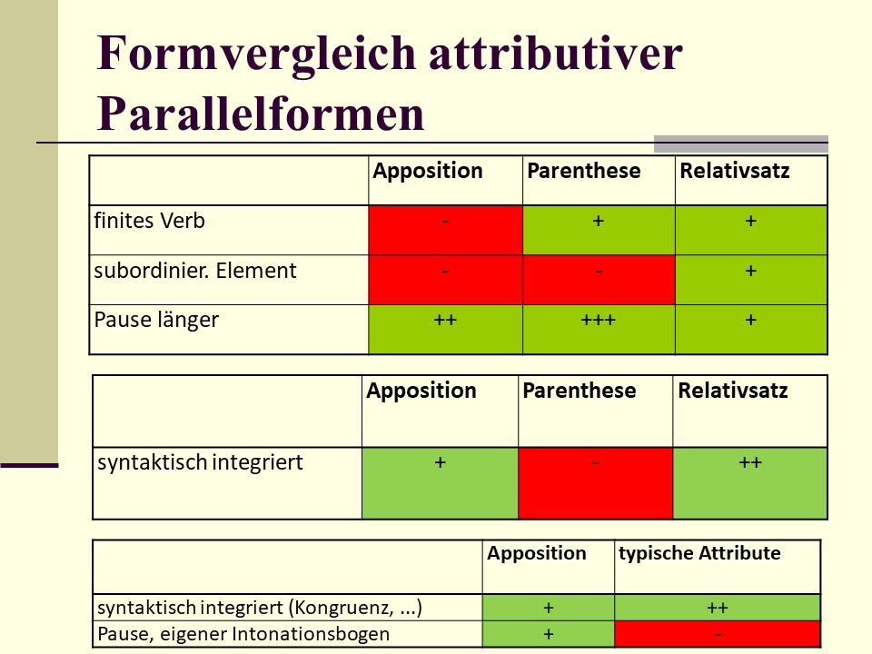
```

Die **Parenthese** ist überhaupt nicht syntaktisch in den umgebenden Text eingebunden.
Sie ist zwar eingeschoben, aber ihre Unabhängigkeit wird durch die Gedankenstriche deutlich gemacht.
Der (nicht-restriktive) **Relativsatz** ist syntaktisch völlig in den Redezusammenhang integriert.
Er ist als Nebensatz zum Attribut eines anderen Elements geworden.

Zwischen beiden steht die **Apposition**.

Sie ist weniger unabhängig als die Parenthese (Kommas statt Gedankenstriche, im gesprochenen Deutsch: kürzere Pausen möglich).
Sie ist jedoch weniger abhängig als der Relativsatz (deutlichere Pausen, eigener Tonbogen).
Die Kongruenz der nominalen Apposition mit ihrem nominalen oder pronominalen Regens vermag immerhin anzuzeigen, daß die Selbständigkeit begrenzt ist.

Auf der anderen Seite fällt die Apposition aus der Reihe der **anderen Attribute** eben dadurch heraus, daß sie deutlicher vom Kontext und vom Regens abgesetzt ist.
Im Grunde genommen ist sie als selbständige Äußerung zu verstehen, die sekundär syntaktisch eingebunden wurde.


----------------------------------------------------------------------

[[1]](#_ftnref1) Die **Apposition** ist nach [@engel1996deutsche: 864] nur ein nachgestelltes, durch Komma abgetrenntes Attribut.
Unterscheidbar sind eine **nominale** Apposition (mit nominalem Kern), eine **qualitative** Apposition (oft mit adjektivischem Kern, eine Eigenschaft angebend) und eine **situative** Apposition (die näheren Umstände angebend).
Die sogenannte **engere Apposition**, die in vielen anderen Grammatiken von der weiten Apposition (d.h. erkennbar an der Kommasetzung; s.o.) unterschieden wird, ist ein dem Nomen voran- oder nachgestelltes Attribut, das in der Grammatik von [@engel1996deutsche] als **Nomen varians** und **Nomen invarians** ausgegliedert wird, d.h.
nicht als Apposition gilt.

Näheres zur Apposition: [@engel1996deutsche: 806-811].

[[2]](#_ftnref2) Im Mannheimer Valenzmodell wird die *als*-Phrase zum Verb *verehren* wegen der spezifischen Anaphorisierung *als solchen* als Nominalergänzung eingeordnet.

[[3]](#_ftnref3) Die beiden sprachlichen Ausdrücke haben dieselbe Extension, denn sie beziehen sich auf dasselbe außersprachliche Objekt - die Person *Richard von Weizsäcker*.

[[4]](#_ftnref4) Die beiden sprachlichen Ausdrücke haben verschiedene Intension, d.h.
die beiden sprachlichen Ausdrücke haben verschiedene semantische Merkmale, bedeuten also inhaltlich nicht das Gleiche - *Richard von Weizsäcker* ist ja nicht nur Präsident, sondern auch Familienvater, Denker usw.

[[5]](#_ftnref5) In anderen Grammatiken ist meist die Rede von Nominalphrasen mit pronominalem Kern.

## Ko- und Subordination in NPs

Helbig & Buscha (1987) führen einige Beispiel für Ko- und Subordination von Attributen in Nominalphrasen an.   

Koordinierte Attribute können ihre Position wechseln (Kriterium der Verschiebbarkeit und damit ihrer Eigenständigkeit). Außerdem kann man zwischen koordinierten Attributen ein Komma setzen bzw. eine kurze Sprechpause einlegen (intonatorische Eigenständigkeit). 

```{r echo=FALSE, message=FALSE, warning=FALSE, out.height="100%", out.width="100%"}
knitr::include_graphics("pictures/ko_subordination_attribute1.jpg")
```

```{r echo=FALSE, message=FALSE, warning=FALSE, out.height="100%", out.width="100%"}
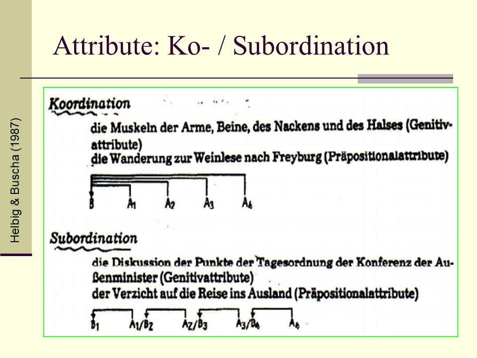
```

```{r echo=FALSE, message=FALSE, warning=FALSE, out.height="100%", out.width="100%"}
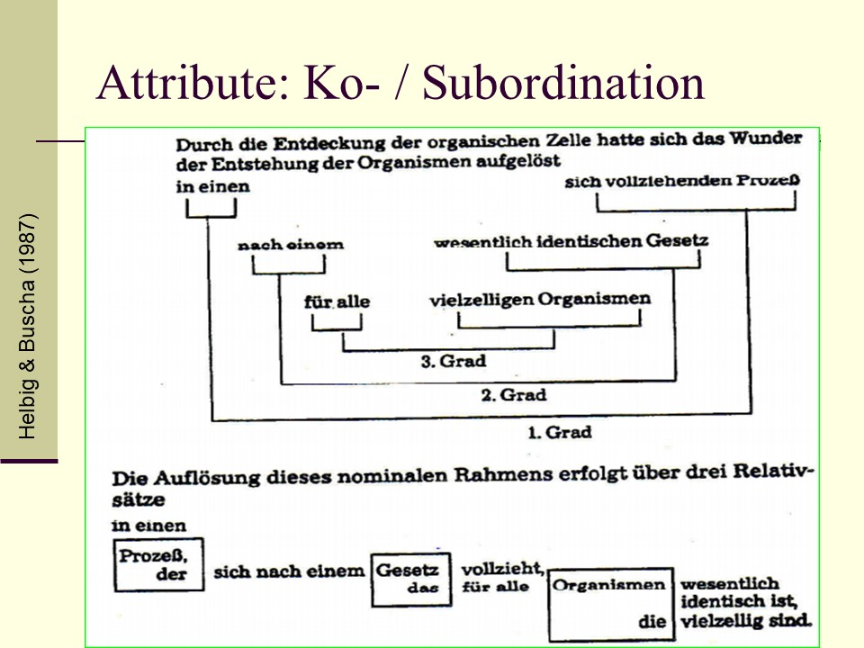
```

## Strukturelle Ambiguität

Ein Beispiel für strukturelle Ambiguität aus [@engel1996deutsche]. Die Präpositionalphrase *aus Dresden* bezieht sich entweder auf das attributive Nomen im Genitiv (*Pullover*) oder auf das im Dependenzstemma höher hängende attributive Nomen im Genitiv (*Besitzerin*).   

(1) der Dank der Besitzerin des roten Pullovers aus Dresden   

```{r echo=FALSE, message=FALSE, warning=FALSE, out.height="100%", out.width="100%"}
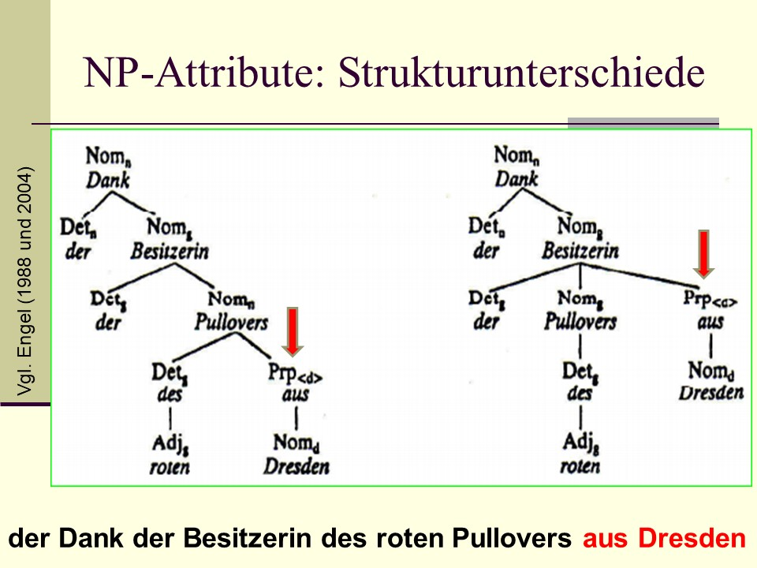
```

Ein anderes klassisches Beispiel: Wer trägt den Schlafanzug?

(2) I shot an elephant *in my pyjamas*.    
(3) Ich habe einen Elefanten *in meinem Schlafanzug* erschossen.   

Die Präpositionalphrase könnte eine Angabe zum Subjekt (*ich*) sein oder eine Angabe zum Objekt (*Elefant*).   


