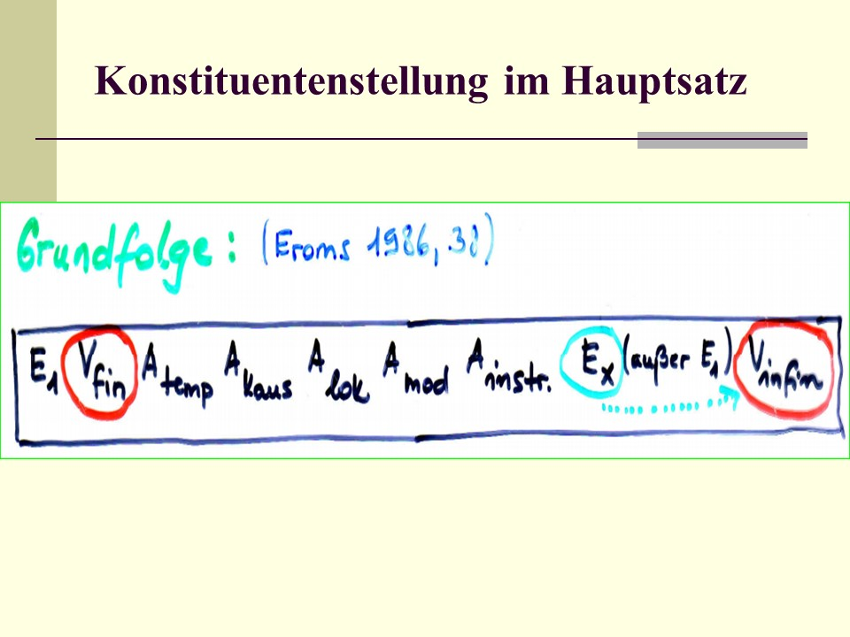
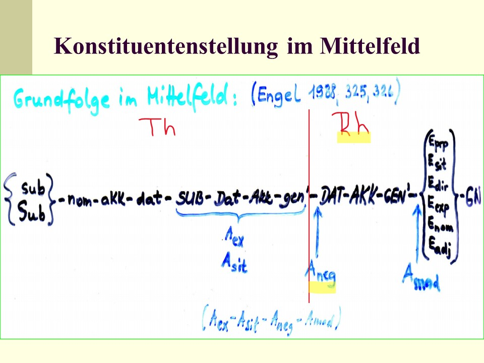
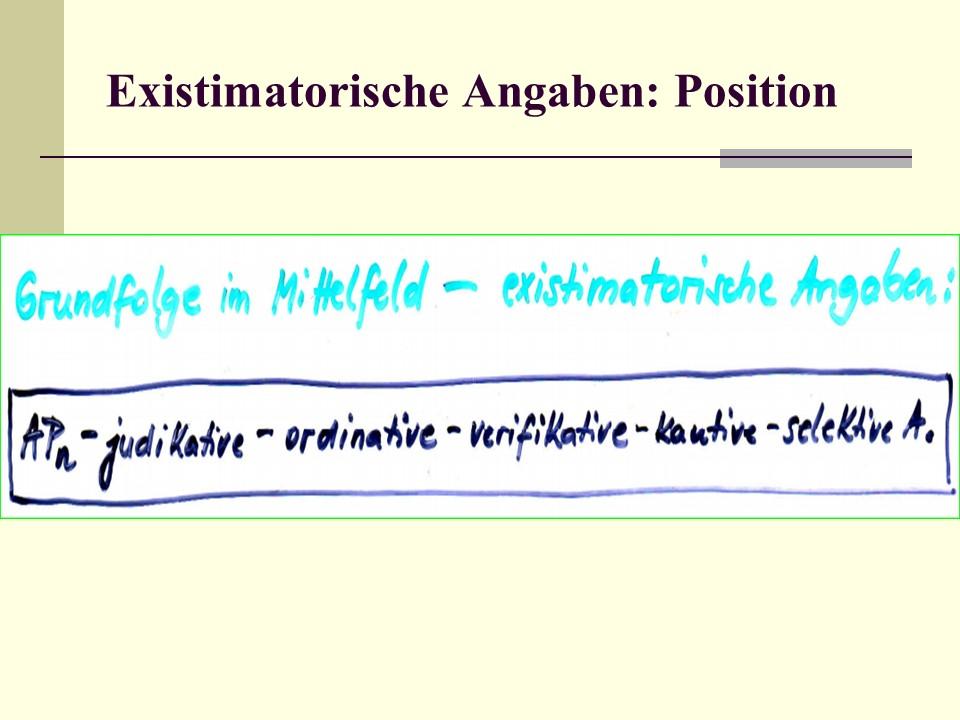
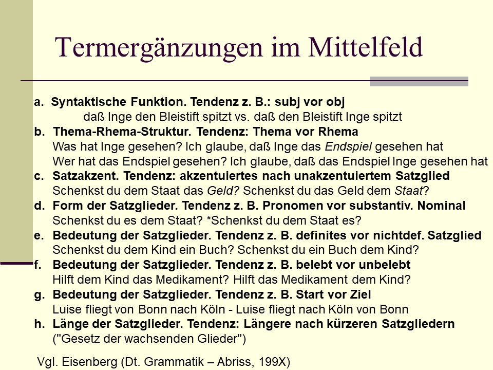
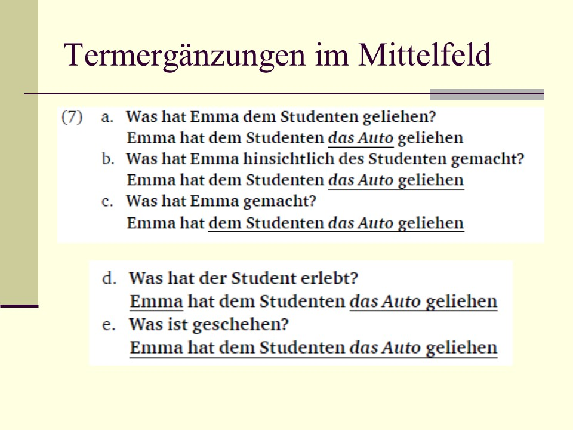
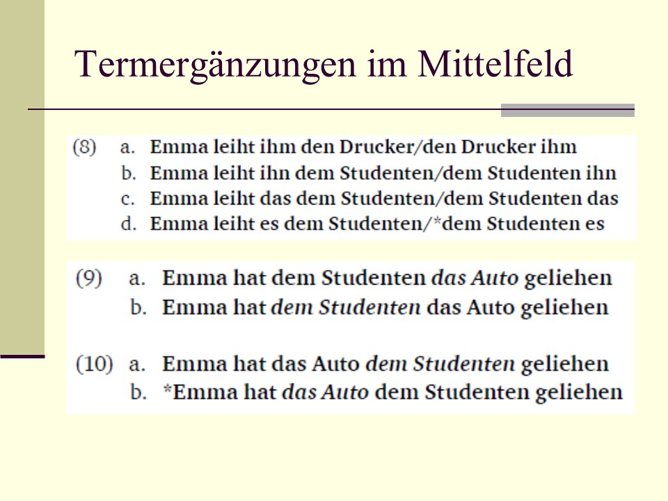
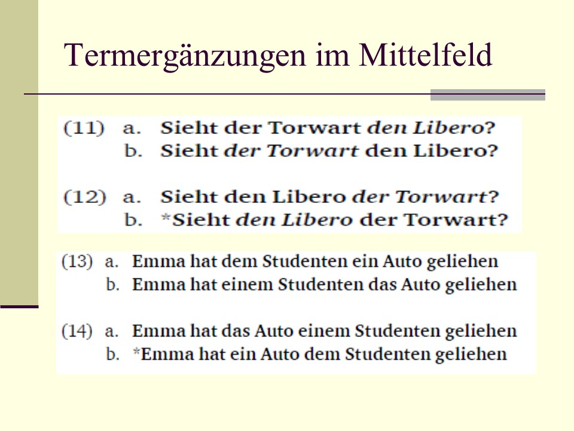
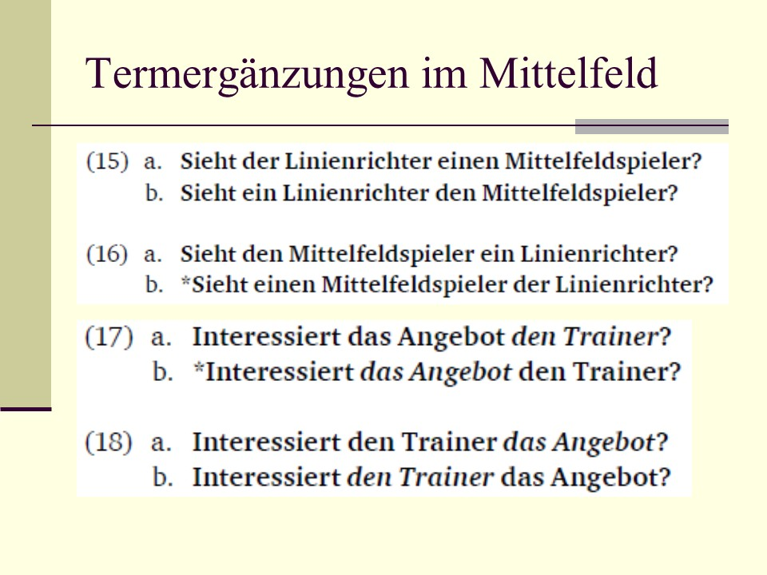
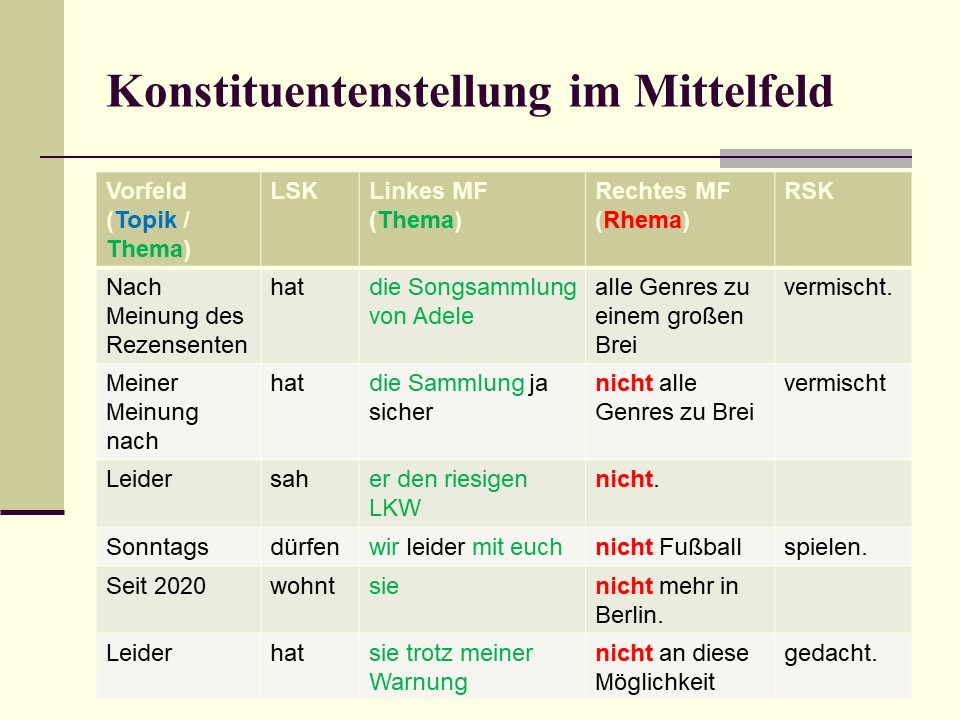
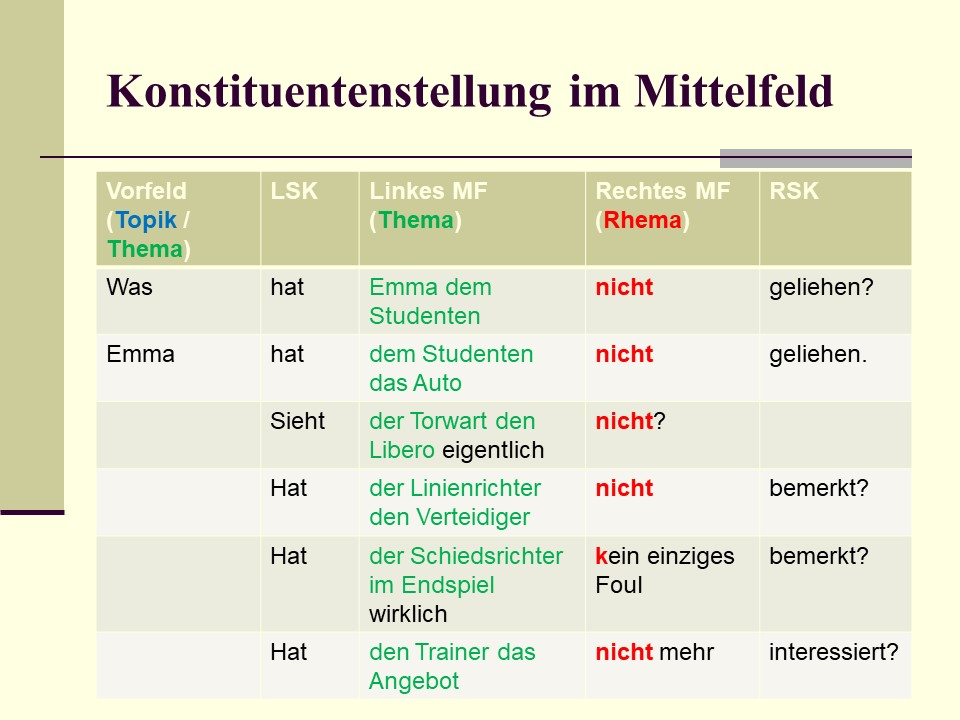

# Grundfolge und Phrasenverschiebungen

Im Kapitel über den Aufbau deutscher Sätze haben wir bereits das Feldermodell verwendet, wonach die Verbformen den Satz in drei Stellungsfelder zerlegen, und zwar in Vor-, Mittel- und Nachfeld. Schauen wir uns nun an, nach welchen Prinzipien die Stellungsfelder, und zwar insbesondere das Mittelfeld, mit Satzgliedern besetzt werden und nach welchen Prinzipien Verschiebungen von Satzkonstituenten bzw. Phrasen vorgenommen werden können!   

## Grundfolge nach Eroms (1986)

[@eroms1986stellung] hat im Rahmen seines Valenzmodells auch ein Schema für die Grundfolge der Ergänzungen und Angaben in deutschen Hauptsätzen (Aussagesätzen) vorgeschlagen:   

- die finite (V~f~) und infinite Verbform (V~i~) bilden den Satzrahmen,   
- das Subjekt (hier: E~1~) steht häufig im Vorfeld (also vor der linken Satzklammer);   
- im Mittelfeld stehen die Angabeklassen vor den Ergänzungsklassen (ausgenommen ist das Subjekt);   
- die Angabeklassen zeigen die Reihenfolge *temporale Angabe >> kausale Angabe >> lokale Angabe >> modale Angabe >> instrumentale Angabe*.   

```{r echo=FALSE, message=FALSE, warning=FALSE, out.height="100%", out.width="100%"}

```

Die von Eroms vorgeschlagene Grundfolge für das Mittelfeld deutscher Hauptsätze richtet sich nach dem **Prinzip der Verbnähe**: da die Ergänzungen von der Valenz des zentralen Verbs abhängen, stehen sie im Mittelfeld in der Nähe des zentralen Verbs, das bei diskontinierlichem Prädikat in der rechten Satzklammer steht. Die Angaben stehen verbferner (weiter weg von der rechten Satzklammer), da sie nicht valenzabhängig sind.   

(1) [ E~~sub~ Till Eulenspiegel] [ V~f~ hat] [ A~temp~ vorige Nacht] [ A~kaus~ aus lauter Verdruss] [ A~lok~ im Hühnerstall] [ E~dat~ den Hühnern] [ E~akk~ die Federn] [ V~i~ ausgerissen].   


## Grundfolge im Mittelfeld

### Ergänzungen

In der Grammatik von [@engel2008deutsche] wird die Grundfolge der Termergänzungen mit Hilfe der Kriterien *Wortklassenzugehörigkeit* (z.B. Pronomen vs. Nomen), *Referenzgefälle* (definit vs. indefinit) und *Ergänzungstyp* (z.B. Term- vs. Adverbialergänzung u.a.) festgelegt. Im folgenden Grundfolgeschema für das Mittelfeld sind:    
- pronominal realisierte Ergänzungen mit Kleinbuschstaben symbolisiert (z.B. *sub*),    
- Ergänzungen, die einen nominalen Kopf und definiten Artikel enthalten, mit einem großen Anfangsbuchstaben (z.B: *Akk*),    
- Ergänzungen, die einen nominalen Kopf und indefiniten Artikel enthalten, mit Großbuchstaben (z.B. *DAT*),   
- Termergänzungen und adverbiale Ergänzungen, die gewöhnlich als Präpositionalphrasen realisiert sind, mit einem großen E (z.B. *E~dir~*),   
- die Prädikativergänzung und Gefügenomina (d.h. Nomina von Konstruktionen mit prädikatsähnlicher Funktion) mit speziellem Symbol. 

### Angaben

Die Grundfolge der **Angabeklassen** wird angegeben mit:   
*A~exist~ / A~sit~ >> A~neg~ >> A~mod~* .   

Die *modifizierenden Angaben* stehen dem Verb am nächsten, deshalb stehen sie im Mittelfeld weit rechts in der Nähe der rechten Satzklammer. Die *existimatorischen* und die *situierenden* Angaben sind verbnäher, denn sie modifizieren den gesamten Sachverhalt bzw. bilden ein ein vom Sprecher abgegebenes Urteil über den im Satz ausgedrückten Sachverhalt. Die *negative Angabe* (gewöhnlich als Negationspartikel *nicht*, vor indefiniten Ergänzungen aber auch der negierte Determinativ *k-ein*) ist Bestandteil der neuen oder wichtigen Information und kommt daher in der Grundfolge vor dem rhematischen Bestandteil des Satzes zu stehen.   

```{r echo=FALSE, message=FALSE, warning=FALSE, out.height="100%", out.width="100%"}

```

*Existimatorische Angaben* erscheinen möglichst verbfern (weit weg von der rechten Satzklammer) und wegen ihrer Nicht-Verneinbarkeit vor einer negativen Angabe Mit existimatorischen Angaben sendet der Textproduzent Signale, welche Einstellung oder Meinungen er zum besprochenen Sachverhalt vertritt. 

Die Abtönungspartikeln stehen vor den anderen existimatorischen Angaben (2), und zwar entweder vor oder nach definiten Ergänzungen. Die negative Angabe folgt den existimatorischen Angaben ist Teil des Rhemas (3).   

(2) [ A~lok~ Auf der Brücke] [ ~LSK~ konnte] [ E~sub~ man] [ E~akk~ ~definit~ die Gefahr] [ A~ex~ ~Abtönungspartikel~ ja] [ A~ex~ ~verifikativ~ tastsächlich] [ A~ex~ ~judikativ~ bemerkenswerterweise] [ A~ex~ ~kautiv~ geradezu] [ rechtes MF: --] [ ~RSK~ spüren].   
(2) [ A~lok~ Auf der Brücke] [ ~LSK~ konnte] [ E~sub~ man] [ A~ex~ ~Abtönungspartikel~ ja] [ E~akk~ ~definit~ die Gefahr] [ A~ex~ ~verifikativ~ tastsächlich] [ A~ex~ ~judikativ~ bemerkenswerterweise] [ A~ex~ ~kautiv~ geradezu] [ A~neg~ nicht] [ ~RSK~ spüren].   

Die folgende Grundfolge im Falle mehrerer im Satz auftretender existimatorischer Angaben wird von [@engel2008deutsche] angegeben:   

```{r echo=FALSE, message=FALSE, warning=FALSE, out.height="100%", out.width="100%"}

```

In den Grammatiken von [@engel2008deutsche] und [@eisenberg2004satz] werden die folgenden Kriterien für die Reihenfolge von Ergänzungs- und Angabeklassen im Mittelfeld angegeben und besprochen.   

```{r echo=FALSE, message=FALSE, warning=FALSE, out.height="100%", out.width="100%"}

```

Es handelt sich um heterogene Kriteriuen: Wortklasse, syntaktische Funktion, Satzakzent, Bedeutung und Ausdruckskomplexität.   


## Termergänzungen im Mittelfeld

Es folgen mehrere Beispiele aus der Grammatik von [@eisenberg2004satz], anhand derer die verschiedenen Abfolgen der Termergänzungen (insbesondere Subjekt, Dativ- und Akkusativergänzung) illustriert und diskutiert werden.   

In Abhängigkeit von der Fragestellung (eine allgemeine Frage: *was ist passiert?* vs. eine spezifische Frage: *Wem hat Emma das Auto geliehen?*) sind verschiedene Reihenfolgen möglich, gleichzeitig werden aber auch syntaktische Beschränkungen oder semantische Präferenzen sichtbar.   

```{r echo=FALSE, message=FALSE, warning=FALSE, out.height="100%", out.width="100%"}

```

```{r echo=FALSE, message=FALSE, warning=FALSE, out.height="100%", out.width="100%"}

```

```{r echo=FALSE, message=FALSE, warning=FALSE, out.height="100%", out.width="100%"}

```

```{r echo=FALSE, message=FALSE, warning=FALSE, out.height="100%", out.width="100%"}

```


Zur Festlegung der unmarkierten und markierten Reihenfolge von Ergänzungen verwendet [@eisenberg2004satz] mehrere Tests:   
- den Akzenttest,   
- syntaktische Funktion,   
- Definitheit vs. Indefinitheit,   
- Abhängigkeit von der Semantik des Verbtyps.   

```{r echo=FALSE, message=FALSE, warning=FALSE, out.height="100%", out.width="100%"}
knitr::include_graphics("pictures/mf_termergaenzungen._eisenberg_erlaeuter5.jpg")
```


## Satznegation im Mittelfeld

Gemäß der Grundfolge tritt die Satznegation (Negationspartikel *nicht* oder Negationsartikel *k-ein*) im **rechten Teil des Mittelfeldes** auf, in dem rhematische Informationen übermittelt werden. 

```{r echo=FALSE, message=FALSE, warning=FALSE, out.height="100%", out.width="100%"}

```

Einige Beispiele zur Illustration der Stellung der negativen Angabe im Mittelfeld.   

```{r echo=FALSE, message=FALSE, warning=FALSE, out.height="100%", out.width="100%"}

```

```{r echo=FALSE, message=FALSE, warning=FALSE, out.height="100%", out.width="100%"}

```

