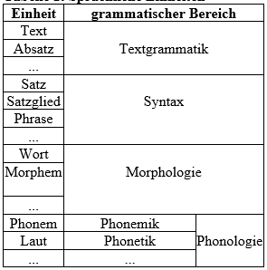
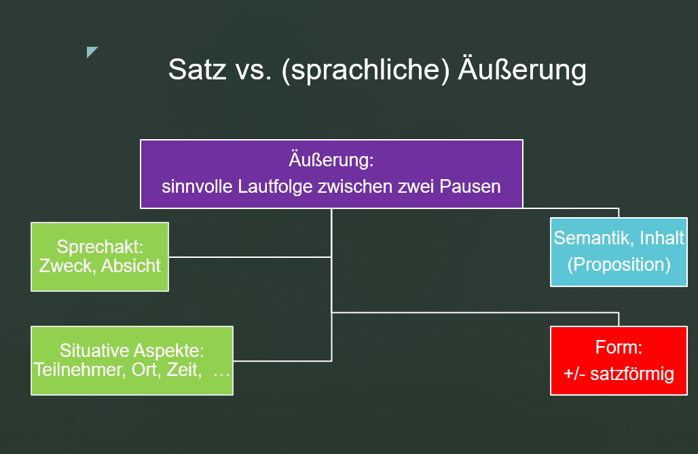
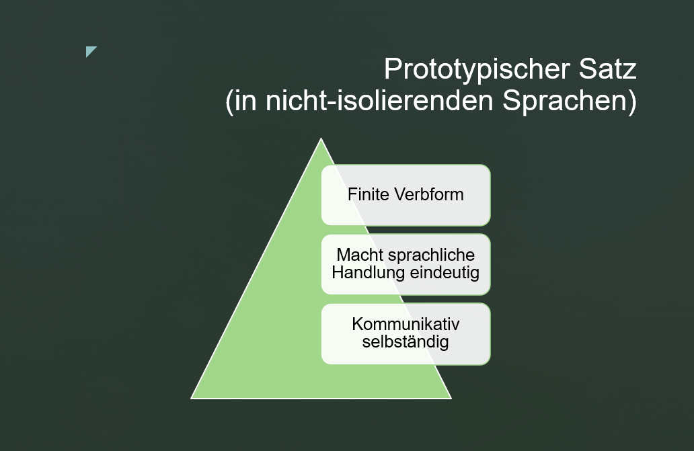
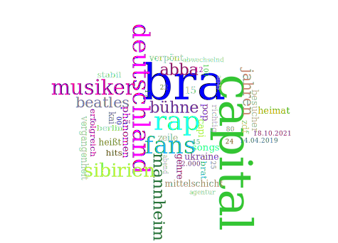
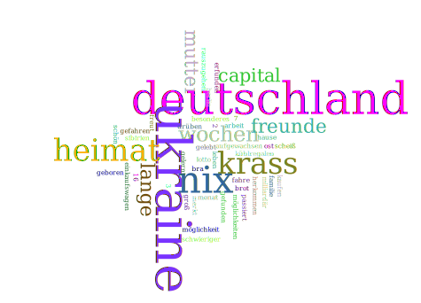

# Gegenstand und Sinn der Syntax

Im Alltag, sei es privat oder im Beruf, verständigen wir uns vorrangig mit Hilfe von mündlich oder schriftlich geführten Texten.
Will man den Aufbau eines Textes besser kennen lernen, ist es sinnvoll, ihn nach nachvollziehbaren Prinzipien und Methoden in kleinere Einheiten zu zerlegen.
In der Sprachwissenschaft hat sich eine längere Liste von Einheiten in Texten etabliert, die man verschiedenen Bereichen zuordnen kann.
Hier sollen vor allem diejenigen Bereiche erwähnt werden, die gemeinsam die Grammatik einer Sprache umreißen.



Der *Text* ist die umfangreichste und hierarchisch höchste kommunikative Einheit, die aus inhaltlich zusammenhängenden *Äußerungen* besteht und eine nachvollziehbare und sortenspezifische Struktur aufweist [@engel2008deutsche: 33].

## Äußerung

*Sprachliche Äußerung*: sinnvolle Lautfolge zwischen zwei Pausen Inhalt Absicht

Äußerung Satzförmig \<--> nicht-satzförmig

::: rmdnote
**`Äußerungen`** lassen sich als Laut- oder Schriftzeichenketten definieren, die von einem Sprecher zwischen zwei Pausen produziert werden und aus einem oder mehreren Sätzen bestehen können (Bußmann 21990: 52).
Im Gegensatz zu Sätzen sind sie *kommunikative* Einheiten und gehören somit auf die Ebene der *Performanz* oder Parole.
`Sätze` sind hingegen Einheiten des Sprachsystems und gehören somit auf die Ebene der *Kompetenz* oder Langue.
:::

*Äußerungen* können die Form (d.h. die Struktur, den Aufbau) von Sätzen (z.B. Hauptsätzen) oder satzförmigen Konstruktionen (z.B. Nebensätzen, Infinitivgruppen) haben, oder auch nicht-satzförmig (z.B. als Nominalphrase) auftreten [@engel2008deutsche: 33].




## Prototypischer Satz

Es gibt mehrere hundert Satzdefinitionen, die verschiedene Aspekte eines Satzes hervorheben. So wie bei vielen anderen Begriffen in der Linguistik ist eine allgemein gültige Definition nicht möglich (vgl. den *Wortbegriff*: Was ist ein Wort?)

**Prototypischer Satz**    
- Finites Verb    
- Eignen sich dazu, Sprechhandlungen eindeutig auszudrücken    
- Enthält kein unterordnendes Element (z.B. keinen Subjunktor).




## Syntax

Die *Syntax* gilt traditionell als Lehre vom Satzbau.

::: rmdnote
Die **`Syntax`** ist ein Teilbereich der Grammatik natürlicher Sprachen und bildet ein System von `Regeln`, die beschreiben, wie aus einem Inventar von `Grundelementen` (d.h. Morphemen, Wörtern, Satzgliedern) durch spezifische `syntaktische Mittel` (d.h. morphologische Markierung, Intonation, Reihenfolge) alle `wohlgeformten Sätze` einer Sprache abgeleitet werden können.
[@bussmann1990lexikon: 766]
:::


## Syntaktische Grundbeziehungen

In den folgenden Abschnitten sollen die folgenden syntaktischen Grundbeziehungen beschrieben werden:

1.  die zwei Seiten eines sprachlichen Zeichens - Inhalt vs. Ausdruck
2.  paradigmatische vs. syntagmatische Beziehungen zwischen sprachlichen Zeichen
3.  Konstituenzbeziehungen zwischen sprachlichen Zeichen
4.  Dependenzbeziehungen zwischen sprachlichen Zeichen

Jedes sprachliche Zeichen hat hat zwei Seiten:    
• die *Inhalts- oder Bedeutungsseite*    
• die *Ausdrucks- oder Formseite*.

Nur die *Ausdrucksseite* ist direkt zugänglich, während die Inhaltsseite erschlossen werden muß.
Die Form einer Münze z.B.
können wir mit unseren Sinnen wahrnehmen, welche Bedeutung sie jedoch für uns hat, müssen wir erst mit Hilfe unseres gespeicherten Wissens u.a.
erschließen.

In flektierenden bzw.
fusionierenden Sprachen (z.B. Deutsch, Slowenisch) wird ein und derselbe Inhalt häufig durch verschiedene Formen ausgedrückt (vgl. derselbe Sachverhalt in Aktiv vs. Passiv, verschiedene Suffixe für Personenbezeichnungen, verschiedene Suffixe für Plural usw.).
Umgekehrt gilt, daß ein Ausdruck oft polyfunktional bzw.
polysem ist, d.h.
daß er je nach sprachlicher oder außersprachlicher Umgebung mehrere Bedeutungen auszudrücken vermag (vgl. die verschiedenen Funktionen der Suffixe -en oder -er, der Partikeln ja, doch, eben, denn, der Tempora Präsens oder Perfekt usw.).
Eine eineindeutige Entsprechung (1:1 Entsprechung) zwischen Inhalt und Ausdruck besteht somit nicht.
Agglutinierende Sprachen (z.B. Türkisch) nähern sich diesem "Ideal" (als eines "Ideale" gilt 1:1 Entsprechung zwischen Inhalt und Form deshalb, weil das Gedächtnis weniger belastet ist als bei 1:n Entsprechungen).

Mehr über die Beziehung zwischen Inhalt und Ausdruck ist aus den Folien über die Kodierverfahren zu ersehen.

Die *syntaktische Form von Sätzen* verändert sich nach [@eisenberg2004satz: 45-47] auf verschiedene Weise:   
• durch *Variierung der Reihenfolge* von Satzelementen (Haben zwei Sätze dieselben Elemente und treten diese Satzelemente in verschiedener Reihenfolge auf, dann haben die beiden Sätze eine verschiedene Form, und zwar ohne Rücksicht auf Bedeutungsunterschiede oder Bedeutungsgleichheit der beiden Sätze);   
• durch *Intonation* (d.h. die Kombination aus Tonhöhe, Tondauer und Tonstärke) in der gesprochenen Sprache bzw.
durch Interpunktion (d.h. Komma, Punkt, Doppelpunkt, usw.) in der geschriebenen Sprache (Die Intonation ist zweifellos ein Formmittel, denn man hört, auf welchem Satzelement der Hauptakzent liegt, oder ob die Tonhöhe am Satzende steigt);   
• durch *morphologische Veränderung* von Einheiten im Satz (Verändert man die im Satz vorkommenden Elemente durch Präfixe, Suffixe, Infixe, Umlaut oder Ablaut, verändert man auch die syntaktische Form eines Satzes).

"Dadurch daß eine linguistische Einheit in einem bestimmten Kontext vorkommen kann, können zweierlei Relationen entstehen. Sie steht in paradigmatischer Relation zu all jenen Einheiten, die gleichfalls in demselben Kontext vorkommen können (gleichgültig, ob sie mit der ersten Einheit kontrastieren oder in freier Variation sind) und in syntagmatischer Relation zu jenen anderen Einheiten derselben Stufe, mit denen zusammen sie vorkommt und die ihren Kontext bilden." (Lyons 71989: 75) *Paradigmatische und syntagmatische Beziehungen* sind nicht nur auf syntaktischer Ebene, sondern auf allen Ebenen linguistischer Beschreibung bedeutend, also etwa auch auf phonologischer, morphologischer und semantischer Ebene (Lyons 71989: 76).
Die Elemente, die ein Paradigma bilden, sind somit füreinander austauschbar und können nicht gleichzeitig stehen.
Die Elemente, die ein Syntagma bilden, sind nicht füreinander austauschbar und kommen in demselben Kontext vor.
Elemente in syntagmatischer Beziehungen bilden eine Struktur.
Die Zahl der möglichen Strukturen ist theoretisch gesehen unendlich.
Ein Paradigma oder System ist hingegen eine endliche Menge von Wahlmöglichkeiten, die dem Sprecher in einem bestimmten Kontext zur Verfügung stehen.
Syntagmatische und paradigmatische Beziehungen werden zur Veranschaulichung oft in einem zweidimensionalen Koordinatensystem abgebildet.
Auf der horizontalen Achse werden die syntagmatischen Beziehungen und auf der vertikalen Achse die paradigmatischen Beziehungen abgebildet.
Die horizontale Achse wird auch als Strukturachse und die vertikale Achse auch als Systemachse oder Wahlachse bezeichnet (z.B. eine Satzstruktur mit Pronominalparadigma zur Veranschaulichung einzeichnen).

Speziell in der Syntax bestehen *syntagmatische* Beziehungen zwischen Konstituenten (d.h. Einheiten eines Satzes).
Für das Deutsche setzt Eisenberg (1989: 52) *vier Typen* solcher Beziehungen an, und zwar *Rektion*, *Identität*, *Kongruenz* und *Positionsbezug*.

1.  *Rektion*

Der Begriff Rektion (lat. regere „regieren"; engl. government; slow. vezavnost) wird in Abhängigkeit von der jeweiligen Grammatiktheorie verschieden verwendet.
Das regierende Element wird als Regens, das von ihm abhängige Element dagegen als Rektum oder Dependens bezeichnet.
In der traditionellen Grammatik sprach man von Rektion, wenn der Kasus eines Objektes vom Verb abhängig war.

(1) Verb: essen <akk>: Kinder essen gern [ ~akk~ Pfannkuchen].
(2) Präposition: zu <dat>: Morgen muß ich zu[m ~dat~ Zahnarzt].
(3) Nomen: Anweisung <gen>: die Anweisung [ ~gen~ meines Chefs]

Konstituenten, die durch Rektionsbeziehung miteinander verbunden sind, bilden zusammen eine höhere Konstituente.
Beispiel: Ein Substantiv (Paradigmenkategorie SUBSTANTIV) kann ein Genitivattribut binden, regiert also den Genitiv und legt damit die Form des Attributes fest (*das Haus meines Vaters*).

In Konkurrenz zur Rektion steht der von Tesnière geprägte Valenzbegriff (engl. valency; slow. vezljivost).
*Valenz* ist ein der aus der Chemie entlehnter Begriff (vgl. die Fähigkeit von Atomkernen eine bestimmte Anzahl von Elektronen zu binden mit der Fähigkeit von bestimmten Lexemen eine bestimmte Anzahl von anderen Lexemen oder Wortgruppen zu binden).

Nach Helbig & Buscha ist Valenz eine semantisch begründete Fähigkeit von lexikalischen Elementen (insbesondere Verben, Nomina, Adjektiven), Leerstellen im Satz zu eröffnen, die von Aktanten (d.h. Ergänzungen) besetzt werden können oder müssen.
Nach Eisenberg ist Valenz eine besondere Form von Rektion.

2.  *Identität*

"Eine Konstituente f1 steht in der Identitätsbeziehung zu einer Konstituente f2, wenn es bestimmte grammatische Kategorien gibt, denen beide Konstituenten zugeordnet sind." (Eisenberg 21989: 54) Als Beispiel: koordinierte Nominalphrasen, enge Apposition: der Bürger Danton.

3.  *Kongruenz*

Unter Kongruenz versteht man im allgemeinen die formale Übereinstimmung einer Wortform mit einer anderen oder mit anderen Wortformen.

Kongruenzerscheinungen sind in den Sprachen der Welt verschieden geregelt.
Übereinzelsprachlich häufig ist die Kongruenz zwischen dem Prädikat und dem Subjekt des Satzes, während andere Kongruenzerscheinungen (wie beispielsweise die Kongruenz zwischen Subjekt und adjektivischer Prädikatsergänzung) sprachspezifischer zu sein scheinen.

(4) [Der Elefant ~3.P.Sg.~] [trink-*t* ~3.P.Sg.~] Wasser. (Person und Numerus kongruieren)
(5) [Slon ~3.P.Sg.~ ] [pi-*je* ~3.P.Sg.~] vodo. (Kongruenz hinsichtlich Person und Numerus)

Die Kongruenz zwischen Subjekt und finiter Verbform ist besser zu erkennen, wenn man das Substantiv durch ein Personalpronomen ersetzt (z.B. *Er* trink-*t* Wasser).

Im Deutschen gibt es zwar eine Kongruenz zwischen dem finiten Verb und dem Subjekt des Satzes, aber keine zwischen Subjekt und adjektivischer Prädikatsergänzung wie im Slowenischen (oder Italienischen).

(6) Der Verkäufer ist noch jung. vs. Die Verkäuferin ist noch jung.
(7) Prodajalec je še mlad. vs. Prodajalka je še mlad-*a*.

Selbst die Kongruenz zwischen Subjekt und finitem Verb ist verschieden ausgebildet, je nachdem in welcher Form das Subjekt des Satzes auftritt.
Erscheint es im Deutschen als Nomen, kongruiert es mit dem finiten Verb eigentlich nur hinsichtlich Numerus, denn der Wert für die Personenkategorie kann nicht variieren (es handelt sich immer um die dritte Person, d.h. die besprochene Person oder Sache); erscheint es im Deutschen dagegen als Pronomen, kann es mit dem finiten Verb auch hinsichtlich Person kongruieren, denn man kann statt der dritten Person auch die erste oder zweite einsetzen.

(8) Der Mechaniker repariert gerade meinen Wagen.
(9) Er repariert gerade meinen Wagen. (3. Person Singular)
(10) Der Mechaniker sagt: "Ich repariere gerade ihren Wagen." (1. Person Singular)
(11) Ich fragte den Mechaniker: "Wann reparieren Sie meinen Wagen." (3. Person Plural)
(12) Meine Freundin fragte mich: "Reparierst du meinen Wagen oder soll ich lieber einen Fachmann damit beauftragen?" (2. Person Singular)

Da das Slowenische wie beispielsweise Italienisch eine sogenannte *Pro-Drop-Sprache* ist, sind Pronomen in der Funktion eines Subjekts nur dann obligatorisch, wenn man Sie aufgrund des Kontextes hervorheben möchte.
Ansonsten werden thematische Subjektpronomen in der slowenischen Standardsprache nicht realisiert.
In der Syntaxtheorie wird das nicht realisierte thematische Subjektpronomen als pro (kleingeschrieben !) notiert.

(13) [~Subj~ Mehanik] popravlja pravkar moj avto.
(14) Pravkar popravlja [~Subj pro~] moj avto. (3. Person Singular)
(15) Mehanik reče: "Pravkar popravljam [~Subj pro~] Vaš avto." (1. Person Singular)
(16) Vprašam mehanika: "Kdaj boste [~Subj pro~] popravili moj avto?" (2. Person Plural)
(17) Moja prijateljica me vpraša: "Ali boš TI popravil moj avto ali naj raje pokličem strokovnjaka?" (das Subjektpronomen wird realisiert und durch Kontrastbetonung hervorgehoben)

Im Slowenischen kann das Subjekt zusätzlich mit dem infiniten Verb hinsichtlich der Genuskategorie kongruieren.

(18) Prodajalec je odprl trgovino.
(19) Prodajal*ka* je odprl-*a* trgovino.

Wie oben gezeigt wurde, ist dies auch bei adjektivischen Prädikatsergänzungen der Fall.
Im Gegenwartsdeutschen ist diese Kongruenzerscheinung nicht bekannt.

Traditionell wird noch ein weiterer Fall von formaler Übereinstimmung als Kongruenz behandelt, nämlich die formale Übereinstimmung zwischen dem Nomen und seinen vorangestellten Begleitern, den Adjektiven und Artikelwörtern.
In der Grammatik von [@Eisenberg2004satz] finden wir dazu eine andere Ansicht.

4.  *Positionsbezug*

"Eine Konstituente f1 ist positionsbezogen auf eine Konstituente f2, wenn die Position von f2 relativ zu f1 festliegt." (Eisenberg 21989: 56) Als Beispiele können uns die Konstruktionen Präposition + N; Subjunktor + V-Letzt-Stellung dienen.

In Abhängigkeit vom Sprachtyp werden Wortverbindungen nach vorgegebenen Stellungsregeln behandelt.
In den sogenannten SVO-Sprachen, zu denen man das Englische, Französische und Slowenische aufgrund der charakteristischen Abfolge Subjekt vor Verb und Verb vor Objekt zählen könnte, gibt es eine Präferenz, einen regierten Ausdruck rechts vom Regens anzuordnen: z.B.
das Akkusativobjekt rechts vom regierenden Verb oder die Nominalphrase rechts von der regierenden Präposition.
Im Französischen ist die Rechts-Präferenz noch stärker ausgeprägt, denn Adjektive in einer Nominalphrase erscheinen rechts vom regierenden Nomen.
In einer älteren Entwicklungsstufe der slawischen Sprachen soll dies ebenfalls der Fall gewesen sein (z.B. wie in oče naš).

(20) The shop assistant has opened [ ~Obj~ the shop].
(21) Prodajalec je odprl [ ~akkobj~ trgovino].

In Sprachen mit dominanter SOV-Anordnung (mit der Abfolge Subjekt vor Objekt und Verb-Letzt-Stellung), zu denen man das Gegenwartsdeutsche zählen könnte, ist eine umgekehrte Präferenz zu erwarten, nämlich daß der regierende Ausdruck links vom Regens angeordnet wird: z.B.
das Akkusativobjekt links vom regierenden Verb oder die Nominalphrase links von der regierenden Präposition oder attributive Adjektive links vom regierenden Nomen.
Tatsächlich stehen Akkusativobjekte (und andere Objekte), wenn Sie als Nominalphrasen ausgedrückt werden, vor dem regierenden Verb in Infinitiv- oder Partizipialform und attributive Adjektive erscheinen vor dem regierenden Nomen.

(22) Der Verkäufer hat soeben [ ~akkobj~ das Geschäft] geöffnet.
(23) [Der ~adj~ blonde ~N~ Verkäufer] hat soeben das Geschäft geöffnet.

Was die Struktur der deutschen Präpositionalphrasen anbelangt, scheint die oben angestrebte Generalisierung nicht standzuhalten, denn es gibt im Deutschen viele Phrasen, in denen die Nominalphrase der regierenden Präposition folgt.
Andererseits ist zu beobachten, daß es im Gegenwartsdeutschen in Einklang mit der Generalisierung auch Postpositionen gibt, d.h.
Fügewörter, die der regierten Nominalphrase folgen und ihr nicht voranstehen.

(24) *nach* meiner Meinung vs. meiner Meinung *nach*
(25) *entlang* des Flusses vs. den Fluss *entlang*

Postpositionen sind in Sprachen mit dominanter SVO-Stellung selten oder überhaupt nicht vorhanden.
An der Tatsache, dass im Deutschen sowohl Präpositionen als auch Postpositionen vorkommen, obwohl letztere präferent zu erwarten gewesen wären, zeigt sich andererseits, dass eine Sprache häufig einen Mischtyp verschiedener Kodierungsstrategien darstellt.

3.  *KONSTITUENZ*

Sprachliche Ausdrücke treten notgedrungenerweise linear in einem Satz auf, d.h. zeitlich oder räumlich nacheinander, z.B.:

(26) Unsere Studierende haben die Pflichtlektüre nicht gelesen. 

Die *Linearität der menschlichen Rede* ist jedoch nicht das einzige Prinzip und bei weitem nicht das wichtigste.
Dies zeigt sich an einfachen Sätzen daran, daß für jeden kompetenten Sprecher der deutschen Sprache *engere Beziehungen* zwischen bestimmten Satzelementen offensichtlich sind:   
(a) zwischen *unsere* und *Studierende*,   
(b) zwischen *haben* und *gelesen*,   
(c) zwischen *die* und *Pflichtlektüre* und   
(d) zwischen *Studierende* und *haben*.
Diese engeren Beziehungen zwischen den angeführten Satzelementen zeigen sich auch auf grammatischer Ebene:   
(a) beide Wörter stehen im Nominativ Plural,   
(b) beide Verbformen bilden zusammen eine Tempusform (Perfekt genannt, mit Gegenwarts- als auch Vergangenheitsbezug),   
(c) beide Wörter stehen im Akkusativ Singular und sind feminine Deklinationsformen,   
(d) beide Wörter kongruieren miteinander, d.h. ihre morphologische Form stimmt bezüglich Person und Numerus überein (3. Person Plural).
Die enge Beziehung der beiden Wörter in (b) zeigt, daß sprachliche Ausdrücke in engeren Beziehungen zueinander stehen können, selbst wenn sie weit auseinander stehen.
Das oben angeführte Satzbeispiel offenbart, daß man neben der Linearität der menschlichen Rede mit weiteren grundlegenden Prinzipien zu rechnen hat, nämlich mit der *Konstituenz* und der *Dependenz* von Sätzen und ihren Teilen.

**Konstituenz** ist eine grundlegende syntaktische Beziehung bei der Beschreibung der hierarchischen Struktur von Sätzen oder deren Teilen.
Zwischen zwei linear auftretenden sprachlichen Ausdrücken A und B besteht eine Konstituenzbeziehung, wenn beide von einem weiteren Element C dominiert werden.
*Dominanz* zwischen zwei Elementen A und C liegt genau dann vor, wenn die Konstituente A eine Konstituente oder eine Teilkonstituente von C ist.
Das Element C besteht somit aus den Bestandteilen A und B.

$$
C <- {A + B}
$$

In dem oben angeführten Satzbeispiel besteht die Nominalphrase *Unsere Studierende* (C) aus den Bestandteilen *unsere* (A) und *Studierende* (B) oder die Nominalphrase *die Pflichtlektüre* (C) aus den Konstituenten *die* (A) und *Pflichtlektüre* (B).
Eine der beiden dominierten Konstituenten (A oder B) *vererbt* seine Eigenschaften (teilweise) an die dominierende Kategorie C.

Einerseits ist *Konstituenz* vergleichbar mit einer Relation in der *Semantik* (Bedeutungslehre), nämlich der Beziehung zwischen einem *Oberbegriff* und den entsprechenden *Unterbegriffen* (d.h. zwischen einem Hyperonym und seinen Hyponymen): z.B. das Hyperonym *Tier* und seine Hyponyme *Hund, Katze, Kuh, Pferd, Löwe, Zebra, Goldfisch* usw.

Andererseits richtet sich die "*Vererbung*" der Eigenschaften an das Hyperonym nach *Gemeinsamkeiten zwischen den Hyponymen*, wohingegen sich die *Vererbung* der Eigenschaften bei der syntaktischen Dominanzbeziehung nach den *Eigenschaften des Kopfes* der Phrase richtet (*Kopfprinzip*) und nicht nach den gemeinsamen Eigenschaften der Elemente der Phrase.

An dieser Stelle soll auch die Bedeutung der oben verwendeten Begriffe Kategorie und Phrase erläutert werden.
Eine **Phrase** ist eine Verbindung von Satzelementen (z.B. Wörtern), die gemeinsam an eine andere Stelle im Satz verschoben werden können.
Wenn beispielsweise von einer Nominalphrase die Rede ist, dann ist eine Wortverbindung aus der lexikalischen Kategorie Nomen und seinen (fakultativen) Begleitern (z.B. Adjektiven) gemeint, in der das Nomen den Kopf der Phrase darstellt, was daran ersichtlich ist, daß die gesamte Phrase die Eigenschaften der lexikalischen Kategorie Nomen übernimmt ("erbt").

Die Bestandteile der Nominalphrase *unsere Studierende* im oben verwendeten Satz können aufgrund ihrer Zusammengehörigkeit gemeinsam an eine andere Stelle im Satz verschoben werden (z.B. Die Pflichtlektüre haben *unsere Studierende* nicht gelesen), während einzelne Teile der Nominalphrase diese Fähigkeit gewöhnlich nicht haben (z.B. ^\*^Die Pflichtlektüre haben Studierende nicht *unsere* gelesen).

Wenn in diesem Zusammenhang von **Kategorie** die Rede ist, sind *grammatische Kategorien* gemeint.
Laut [@bussmann1990lexikon: 291-292] sind grammatische Kategorien Abstraktionsklassen linguistischer Einheiten, d.h. im Rahmen des Strukturalismus "Klassen von sprachlichen Ausdrücken, die bezüglich eines bestimmten Kontextes unter Wahrung der Grammatikalität füreinander ersetzbar sind", im Rahmen der generativen Transformationsgrammatik "Klassen von Ausdrücken, die bestimmte Strukturstellen im Satz ausfüllen können".

Traditionell versteht man darunter morphologische Kategorien (z.B. Person, Numerus, Genus) und syntaktische Kategorien (z.B. die Wortarten Nomen, Verb, Adjektiv usw., die phrasalen Kategorien Nominalphrase, Verbalphrase, Adjektivalphrase usw.).

Die *Wortarten* (z.B. Nomen, Adjektiv, Adverb, Verb) werden übrigens auch als *lexikalische Kategorien* bezeichnet im Gegensatz zu den Wortverbindungen, die dann als phrasale Kategorien eingeordnet werden (z.B. Nominalphrase, Adjektivalphrase, Verbalphrase, Adverbialphrase).
Von den lexikalischen und phrasalen Kategorien sind die syntaktischen Funktionen (z.B. Subjekt, Akkusativobjekt, Adverbialbestimmung) zu unterscheiden, d.h. grammatische Relationen, die außerhalb der Konstituente in Bezug auf andere Teile des Satzes (etwa des Verbs) bestimmt werden.
Ein und dieselbe lexikalische oder phrasale Kategorie kann in Sätzen verschiedene syntaktische Funktionen haben.
Im oben verwendeten Satz Unsere Studenten haben die Pflichtlektüre nicht gelesen hat die Nominalphrase Unsere Studenten die Funktion eines Subjekts (die man mit Wer oder was? erfragen kann), im Satz Dort sehe ich unsere Studenten hat dieselbe Nominalphrase die Funktion eines Akkusativobjekts (das man mit Wen oder was? erfragen kann).
Da syntaktische Funktionen wie beispielsweise Subjekt, Objekt oder Adverbialbestimmung Relationscharakter haben, lassen sich nicht isoliert vom Kontext aufzählen wie beispielsweise die Wortklassen Nomen, Adjektiv oder Verb.
Ein Adjektiv kann im Satz verschiedene Funktionen ausüben: es kann als Begleiter eines Nomens (das ist die sogenannte Attributfunktion) oder als Ergänzung zum Verb (das ist die sogenannte Prädikativfunktion, in Valenzmodellen auch Adjektivalergänzung genannt) auftreten.

4.  *DEPENDENZ*

Als Grundbeziehung zwischen (linear auftretenden) sprachlichen Elementen gilt auch das Prinzip der Dependenz, d.h.
der Abhängigkeit eines Elementes von einem anderen.
Sprachliche Elemente stehen somit wie andere Erscheinungen in unserer Welt in Hierarchiebeziehungen zueinander.
Das abhängige Element wird Dependens genannt, das nicht-abhängige dagegen Regens (vgl. syntagmatische Beziehung Rektion).

Die **Dependenz** ist eine syntaktische Grundbeziehung, bei der ein Element (das Dependens) nicht ohne ein anderes (das Regens) auskommen kann: z.B. in der Phrase ziemlich wichtige Persönlichkeiten kann die Partikel ziemlich nicht ohne das Adjektiv wichtig auftreten, da die Phrase \*ziemlich Persönlichkeiten keine wohlgeformte Phrase der deutschen Sprache wäre (also ungrammatisch).
Das Dependenzprinzip steht in den sogenannten Valenzgrammatiken bzw.
Valenzmodellen im Mittelpunkt.
Die Satzstruktur wird hierarchisch gegliedert, mit dem Verb (Verbalkomplex, Prädikat) an der Spitze.
Derartige Valenzmodelle werden übrigens als Valenzverbgrammatiken bezeichnet.
Über das Dependenzprinzip soll später noch im Vergleich mit der Konstituentengrammatik und im Rahmen des Valenzmodells gesprochen werden.


## Identifikationsverfahren

*Identifikationsverfahren* 1.
Verschiebeprobe 2.
Austauschprobe, Ersatzprobe (Fragetest) 3.
Eliminierungsprobe 4.
Hinzufuegungsprobe (5. Koordinationsprobe, Häufungsprobe, Akzentuierungsprobe mit Satz- oder Kontrastakzent)

### Verschiebeprobe

Die *Verschiebeprobe* wird auch Umstellprobe oder Permutationsprobe genannt. Dieses Verfahren dient dazu, Konstituenten eines Satzes zu ermitteln. Konstituenten des Satzes kann man in vielen Fällen mit der Kategorie Satzglied gleichsetzen. Ein Ausdruck, der aus einem oder mehreren Wörtern besteht, wird als Konstituente eines Satzes bezeichnet, wenn er sich im Satz frei verschieben läßt.

(1a) Der Professor hält *einen Vortrag über Textlinguistik*.   
(1b) *Einen Vortrag über Textlinguistik* hält der Professor.   

Die unterstrichene Phrase in (1a) läßt sich frei im Satz verschieben, z.B. an den Anfang des Satzes. Der Satz ist trotz der Verschiebung der hervorgehobenen Phrase grammatisch richtig (1b). Daraus können wir folgern, dass die hervorgehobene Phrase eine Konstituente des Satzes ist.

Nun folgt ein Beispiel, in dem die hervorgehobene sprachliche Einheit keine Satzkonstituente ist.

(2a) Der Professor hält einen Vortrag über Textlinguistik.   
(2b) ^\*^*Einen* hält der Professor Vortrag über Textlinguistik.   

Das unterstrichene sprachliche Element in (2a) läßt sich nicht frei im Satz verschieben. Stellt man es z.B. an den Anfang des Satzes, erhält man einen ungrammatischen Satz (2b). Daraus folgern wir, daß das unterstrichene sprachliche Element keine Konstituente des Satzes ist.
Es kann höchstens Teil einer Konstituente des Satzes sein.

### Ersatzproben

#### Kommutationsprobe

Die *Kommutationsprobe* ist eine Substitutions- oder *Ersetzungsprobe*.
Dieses Verfahren dient dazu, Konstituenten mit gleicher Funktion im Satz festzustellen.
Lassen sich zwei oder mehrere Ausdrücke füreinander austauschen, dann haben sie die gleiche Funktion im Satz.

(3) *Die Professorin* hält einen Vortrag über Textlinguistik. 
der Mann 
der Dozent 
die Frau 
Der da vorne 
die Studentin 
er 
sie 
... 

Die untereinander stehenden Ausdrücke haben im Satz die gleiche Funktion. Man sagt, sie kommutieren miteinander. Miteinander kommutierende Ausdrücke bilden ein Paradigma (auch als System bezeichnet).


#### Anaphorisierungsprobe

Die *Anaphorisierungsprobe* ist eine Substitutions- oder *Ersetzungsprobe*. Dieses Verfahren dient dazu, die Satzgliedklasse festzustellen, der eine Satzkonstituente angehört.
Anaphern sind Ausdrücke, die auf einen Ausdruck im Vortext hinweisen.
Das Pronomen er in (4) bezieht sich auf der Professor im davorstehenden Satz.

(4) *Die Professorin* hält einen Vortrag über Textlinguistik. *Sie* hat auch mehrere Bücher zu diesem Themenbereich veröffentlicht.

Der Ausdruck *die Professorin* kommutiert außerdem mit einer speziellen Anapher, und zwar mit dem Pronomen *sie*. Dies bedeutet, dass man die Phrase *die Professorin* in ein und demselben Satz durch das Pronomen *sie* ersetzen kann (5). Das ist deshalb möglich, weil sie im Satz dieselbe Satzgliedfunktion haben (nämlich Subjektfunktion).

(5) *Die Professorin* hält einen Vortrag über Textlinguistik. *Sie* ...

Für jede Satzgliedklasse (Ergänzungsklasse) kann man im Prinzip eine spezielle Anapher finden. Auf diese Weise ist eine Satzgliedklassifizierung möglich. Die Anaphorisierungsprobe wirkt so wie die Kommutationsprobe entlang der paradigmatischen Achse (y-Achse).


#### Fragewortprobe

Die *Fragewortprobe* ist ebenfalls eine Ersetzungsprobe, bei der man aber meist zusätzlich die Reihenfolge der Satzelemente verändert, da man das Fragewort gewöhnlich an den Satzanfang stellt. Sie dient wie die Anaphorisierungsprobe der Ermittlung der Satzgliedklasse. Eine Konstituente des Satzes wird durch ein entsprechendes Fragewort ersetzt, d.h. man versucht die betreffende Konstituente zu erfragen.

(6a) *Die Professorin* hält einen Vortrag über Textlinguistik.   
(6b) *Wer* hält einen Vortrag über Textlinguistik?   
(6c) Die Professorin hält einen Vortrag *worüber*?   
(6d) *Worüber* hält die Professorin einen Vortrag?   
(6e) (Die Professorin hält einen Vortrag) *über Textlinguistik*.   

Die Fragewortprobe besteht genau genommen aus zwei Tests:   
(a) der Verschiebe- oder Umstellprobe (siehe 6d) und   
(b) dem Einsetzen eines entsprechenden Fragewortes.   
Sie ist also ein syntagmatischer Test (a), gleichzeitig aber auch ein paradigmatischer (b). Deshalb wird vozugsweise eine Kommutations- oder Anaphorisierungsprobe zur Identifizierung von Satzelementklassen eingesetzt (außer in einigen Fällen, in denen die Fragewortprobe bessere Einsichten bietet, z.B. bei adverbialen Bestimmungen der Folge, den Konsekutivangaben).


### Eliminierungsprobe

Die *Eliminierungsprobe* (auch *Weglaßprobe* oder *Tilgungsprobe* genannt) dient zur Ermittlung von obligatorischen und fakultativ auftretenden Konstituenten des Satzes. In der Valenzgrammatik wird betont, daß die Unterscheidung zwischen Ergänzungen und Angaben mit ihr nicht möglich ist.

(6a) Die Professorin hält einen Vortrag über Textlinguistik.   
(6b) \*Die Professorin hält über Textlinguistik.   
(7a) Die Professorin spricht mit ihren Studierenden über Textlinguistik.   
(7b) Die Professorin spricht mit ihren Studierenden.   
(7c) Die Professorin spricht über Textlinguistik.   
(7d) Die Professorin spricht.   

In (6b) sehen wir, daß das Verb halten obligatorisch eine Akkusativergänzung verlangt (einen Vortrag), während das bedeutungsähnliche Verb sprechen fakultative Ergänzungen aufweist (7).
Läßt man obligatorische (d.h. syntaktisch notwendige) Ergänzungen weg, erhält man einen ungrammatischen Satz.
Ist eine Ergänzung lediglich fakultativ (d.h. syntaktisch nicht notwendig), bleibt der Satz grammatisch richtig.

Manchmal wird die sogenannte *Reduktionsprobe* von der Tilgungsprobe unterschieden. Während bei der *Tilgungsprobe* eine beliebige Konstituente weggelassen wird, insofern der Satz dadurch nicht ungrammatisch wird, können bei der *Reduktionsprobe* auch syntaktisch notwendige Konstituenten weggelassen werden. Während das weggelassene Element nach der Tilgungsprobe nicht mehr zu rekonstruieren ist, kann das weggelassene Element nach der Reduktionsprobe noch rekonstruiert werden, d.h. dass der Hörer in der Lage ist, die ausgelassene Konstituente zu ergänzen [@woellstein1997satzstruktur: 16].

(1) [Das Wasser] kocht. / [Es] kocht.  \* \_\_ kocht.
(2) Hühner essen [Eier], Menschen essen [Eier].  Hühner essen \_\_, Menschen essen Eier.

Ergibt sich wie in (2) eine elliptische Konstruktion, so wurde nur eine Konstituente getilgt.


### Hinzufügungsprobe

Die Hinzufügungsprobe (auch: Additionstest) ist das Gegenteil der Tilgungsprobe oder Eliminierungsprobe. Durch Hinzufügung eines sprachlichen Elements (eines Wortes, einer Phrase, eines Satzes) können wir feststellen, ob ein sprachliches Element mit einer Satzkonstruktion syntaktisch kompatibel (verträglich) ist.

(3) Die Studentin fährt.   
(4) Die Studentin spricht.   
(5) Die Studentin fährt [an die Uni].    
(6) Die Studentin spricht ^\*^[an die Uni].   

Die satzförmigen Äußerungen (3) und (4) sind wohlgeformt. In (5) und (6) fügen wir die Präpositionalphrase *an die Uni* zu den bereits bestehenden Satzkonstruktionen. Wir erkennen, dass die Präpositionalphrase nur mit (5) syntaktisch kompatibel ist, mit (6) dagegen nicht. Das liegt daran, dass das Verb *fahren* in (5) die Hinzufügung einer Phrase, mit der wir das (geographisch bestimmbare) Ziel einer Bewegung angeben, erlaubt ist. Das Verb *sprechen* in (6) gehört dagegen zu einer anderen Verbklasse. Es ist kein *Fortbewegungsverb*, sondern ein *Verb des Meinens und Sagens*. Daher ist die Hinzufügung einer Phrase, in der der Zielort angegeben wird, nicht erlaubt.

Dass die beiden Verben unterschiedlichen Klassen (mit verschiedener Semantik und Syntax) angehören, wird durch die folgenden Beispiele erhärtet.

(7) Die Studentin fährt [zu ihren Freundinnen]. (Zielort)   
(8) Die Studentin spricht [zu ihren Freundinnen]. (Adressaten)   
(9) Die Studentin fährt [mit ihren Freundinnen]. (Begleitung)   
(10) die Studentin spricht [mit ihren Freundinnen]. (Adressaten)   

Hier erhebt sich die Frage: wenn die Studentin zu ihren Freundinnen spricht, sind die Freundinnen dann das Ziel der Handlung *sprechen*? 

Hier fällt ein semantischer Unterschied zwischen dem "Ziel" des Verbs *fahren* und dem des Verb *sprechen* auf: wenn die Studentin fährt, verändert sie ihren Standort (von Punkt A nach Punkt B), wenn sie jedoch spricht, ist damit nicht gesagt, dass sie ihren Standort wechselt. Deshalb unterscheiden wir gewöhnlich zwischen den semantischen Klassen \{Ziel\} und \{Adressat\}. Erstere ist mit Fortbewegungsverben kompatibel, letztere dagegen mit Verben des Meinens und Sagens. Die Beispiele zeigen also, dass man die semantische Klasse \{Ziel\} nur mit dem Fortbewegungsverb *fahren* kombinieren kann, nicht mit dem Verb *sprechen*. Die semantischen Unterschiede haben demnach Konsequenzen in der syntaktischen Form des Satzes.


### Koordinationsprobe

Wenn sich zwei oder mehrere Elemente eines Satzes durch eine koordinierende Konjunktion (wie *und* oder *oder*) verbinden lassen, bilden sie eine Konstituente.

(1) [[Die Studenten] und [Professoren]] machen eine gemeinsame Exkursion.   
(2) [Der eine freut sich] und [der andere ärgert sich].   
(3) eine [reizvolle] und [intelligente] Frau   


### Häufungsprobe

Bestimmte Ausdrücke (etwa Partikeln) können gehäuft werden, d.h.
sie können gleichzeitig im Satz auftreten, ohne daß sie durch eine koordinierende Konjunktion (z.B. und) miteinander verbunden werden könnten, ohne daß sie frei im Satz verschiebbar wären (wie etwa Konstituenten im Satz) oder gemeinsam im Satz verschiebbar wären (wie etwa Bestandteile von Konstituenten).

(1) Der Junge hat ja eben keinen Hunger.   
(2) \*Der Junge hat ja und eben keinen Hunger.   
(3) \*Ja hat der Junge eben keinen Hunger.   
(4) \*Eben hat der Junge ja keinen Hunger.   
(5) \*Ja eben hat der Junge keinen Hunger.   


### Akzentuierung

Durch entsprechende Akzentuierung (Satzakzent, Kontrastakzent)) und Herstellung eines entsprechenden Kontextes zeigt sich erst, ob eine bestimmte Satzform in einer Sprache möglich ist.


### Identifikationsprobleme

Nachdem vier grundlegende Verfahren zur Identifizierung von Satzkonstituenten und ihrer Rolle im Satz vorgeführt wurden, soll in den nächsten Absätzen einige der möglichen *Schwierigkeiten* gezeigt werden, die *bei der Verwendung dieser Verfahren* auftreten können.
Die Verschiebeprobe liefert beispielsweise nicht in allen Fällen eindeutige Ergebnisse, d.h. man kann mit ihr nicht immer eindeutig nachweisen, daß ein sprachliches Element keine Konstituente des Satzes ist. In (3) ist dieses Problem veranschaulicht.

(3a) Die Professorin hält einen Vortrag [über Textlinguistik].   
(3b) [Über Textlinguistik] hält die Professorin einen Vortrag.   

Die hervorgehobene Präpositionalphrase in (3a) läßt sich frei im Satz verschieben, z.B. an den Anfang des Satzes. Ist diese Phrase dann etwa auch eine Konstituente des Satzes? Die *Verschiebeprobe* legt dies nahe. Dagegen spricht allerdings das *Dependenzprinzip* (ein semantisch begründetes Prinzip), denn man kann zeigen, daß die Präpositionalphrase über Textlinguistik vom Nomen *Vortrag* regiert (verlangt) wird und nicht vom Verb *halten*.

Das Nomen *Vortrag* fordert folgende Ergänzungen: 
- eine Person, die vorträgt (also spricht),   
- und einen Gegenstand, der von der Person vorgetragen wird.   
Die handelnde Person wird als Satzsubjekt am Satzanfang genannt und braucht daher nicht als Genitivattribut in der Nominalphrase wiederholt zu werden, der Gegenstand des Vortrags in der Präpositionalphrase.

Das Verb *halten* fordert 
- ebenfalls eine handelnde Person (als Subjekt im Satz)   
- und einen Gegenstand, fordert allerdings im Gegensatz zum Nomen *Vortrag*, daß der Gegenstand als Nomen im Akkusativkasus realisiert wird: vgl. (4) mit (5)

(4) *halten* <(Person: nom), (Gegenstand: akk)> 
(5) *Vortrag* <(Person: gen), (Gegenstand: prp)>. 

Die Präpositionalphrase *über Textlinguistik* kann demnach nicht der geforderte Gegenstand zum Verb *halten* sein, sondern nur die Nominalphrase *einen Vortrag*, die im Akkusativ steht. 

Ersetzt man die Präpositionalphrase *über Textlinguistik* in (3) durch eine Nominalphrase im Akkusativ *die Textlinguistik* , entstünde ebenfalls ein ungrammatischer Satz.

Die *Kommutationsprobe* (d.h. der Austausch der Präpositionalphrase durch eine Nominalphrase) zeigt somit, zwischen welchen Teilen des Satzes engere Abhängigkeitsbeziehungen bestehen.

Das *Abhängigkeitsprinzip* legt demnach über die Valenzbeziehungen zwischen den Satzelementen nahe, dass die Präpositionalphrase *über Textlinguistik* keine unmittelbare Konstituente des Satzes, sondern lediglich eine unmittelbare Konstituente der Nominalphrase *einen Vortrag* ist. Einen Teil einer Satzkonstituente (oder eines Satzgliedes) nennt man auch ein Attribut.

Die *Eliminierungsprobe* unterstützt in diesem Fall das Ergebnis, das die Kommutationsprobe erbracht hat, denn sie zeigt ebenfalls, dass die ausgelassene Nominalphrase ein obligatorischer Bestandteil des Satzes ist, während dies für die Präpositionalphrase nicht zutrifft: Lässt man nämlich *einen Vortrag* in (3) aus, dann erhalten wir einen ungrammatischen Satz (3c).

(3a) Die Professorin hält einen Vortrag [über Textlinguistik].
(3c) \*[Über Textlinguistik] hält die Professorin.

Die Nominalphrase einen Vortrag (samt Präpositionalattribut über Textlinguistik) ist somit eine obligatorische Ergänzung des Verbs.
Daß die Ergänzung einen Vortrag obligatorisch im Satz mit dem Verb halten vorkommen muß, zeigt die Eliminierungsprobe.

Die semantischen und syntaktischen Verhältnisse in (3) liegen allerdings noch komplizierter, denn bei genauerer Überlegung sieht man, daß das Nomen Vortrag und das Verb halten zusammen das Prädikat des Satzes bilden, d.h.
semantisch eine Einheit bilden.
Beide Varianten haben die Grundbedeutung: "etwas vor einem Auditorium sprachlich vermitteln".
Das kann man nachweisen, indem man beide Ausdrücke durch einen Ausdruck ersetzt, und zwar Vortrag halten durch vortragen.
Wenn Vortrag und halten nun gemeinsam das Prädikat bilden, könnte man die Präpositionalphrase über Textlinguistik dennoch für eine unmittelbare Konstituente des Satzes halten.
Dann wäre auch verständlich, warum sich die Präpositionalphrase frei im Satz verschieben läßt.

Versucht man nun das einfache Verb vortragen in (3) statt des komplexen Ausdrucks einen Vortrag halten einzusetzen, stößt man jedoch auf Schwierigkeiten.
Die beiden Varianten haben zwar dieselbe Grundbedeutung (4), das einfache Verb ist jedoch nicht in (3) einsetzbar.

(3a) Die Professorin hält einen Vortrag über Textlinguistik.
(3d) \*Die Professorin trägt über Textlinguistik vor.
(3e) Die Professorin trägt einen Text vor.

Das einfache Verb ist nicht in (3) einsetzbar, weil es eine andere syntaktische Valenz hat.
Es fordert nämlich (wie das Verb halten) keine Präpositionalphrase als Objekt (3d), sondern eine Nominalphrase mit einem Nomen im Akkusativ Text (3e).
Die Äußerung (3a) zeigt im Vergleich mit (3e) auch einen kleinen, aber wichtigen semantischen Unterschied, der parallel zum syntaktischen verläuft: Verwendet man das komplexe Prädikat einen Vortrag halten, dann nennt man in der Präpositionalphrase den Bereich, über den gesprochen wird.
Verwendet man hingegen das einfache Verb vortragen, dann nennt man im Akkusativkasus den Gegenstand und nicht den Bereich.
Der Gegenstand in (3e) ist ein Text, d.h.
eine inhaltlich zusammenhängende Folge von Äußerungen.
Dieser Text kann schriftlich fixiert sein und damit auch in konkreter Form auf Papier vorliegen.
Der Bereich ist ein abstrakterer Gegenstand als der Text.
Er ließe sich allenfalls mit einer Skizze konkretisieren.

Der Vergleich von (3a) mit (3f) ergibt noch einen weiteren syntaktischen und gleichzeitig semantischen Unterschied.

(3a) Die Professorin hält einen Vortrag über Textlinguistik.
(3f) Die Professorin trägt einen Text über Textlinguistik vor.

Das einfache Verb vortragen hat zwar dieselbe Grundbedeutung wie einen Vortrag halten (siehe oben), aber das komplexe Prädikat einen Vortrag halten enthält noch ein weiteres semantisches Merkmal, nämlich das Merkmal Gegenstand.
Dieses Merkmal wird durch das Nomen Vortrag realisiert.
Der Vortrag läßt sich ja genau genommen paraphrasieren als "Text, der vorgetragen wird".
Dies bedeutet, daß der Begriff ein Text in das Wort Vortrag hineinverlegt (inkorporiert) worden ist.
Demnach ist es richtiger, das komplexe Prädikat einen Vortrag halten mit dem komplexen Prädikat einen Text vortragen zu paraphrasieren (3g):

(3a) Die Professorin hält einen Vortrag über Textlinguistik.
(3g) Die Professorin trägt einen Text über Textlinguistik vor.

Die Äußerung (3a) mit dem Nominalisierungsverbgefüge einen Vortrag halten entpuppt sich damit als verkürzender Ausdruck für das morphologisch komplexe (und außerdem auch trennbare) Verb vortragen und dessen Akkusativobjekt einen Text.
Will der Sprecher lediglich den Bereich nennen, über den die Rede ist, verwendet er das Nominalisierungsverbgefüge.
Wenn er aber den konkreten Text(gegenstand) nennen will, verwendet er das komplexe Verb vortragen (z.B. ein Gedicht vortragen).
Die beiden Ausdrücke einen Vortrag über etwas halten und etwas über etwas vortragen sind demnach nur scheinbar völlig bedeutungsgleich, was sich durch ihre unterschiedliche Verwendbarkeit zeigt.

Was hat die Untersuchung von Äußerung (3) nun für die Lösung der Frage gebracht, ob die Präpositionalphrase über Textlinguistik in (3a) eine Konstituente des Satzes ist oder nicht?
Mein Lösungsvorschlag ist folgender:

Berücksichtigt man das Dependenzprinzip (und die damit zusammenhängenden Subkategorisierungsrahmen des Verbs halten und des Nomens Vortrag) ist es angemessener, davon auszugehen, dass die Präpositionalphrase über Textlinguistik semantisch und syntaktisch direkt vom Nomen Vortrag abhängig ist und lediglich aufgrund der besonders engen semantisch-syntaktischen Verbindung zwischen dem Verb halten und Vortrag syntaktisch weder eindeutig als Attribut noch als Satzkonstituente eingeordnet werden kann.

In (3a) ist die Präpositionalphrase zwar direkt abhängig vom Nomen Vortrag (und demnach dessen Attribut); da aber einen Vortrag halten eine semantische Einheit bildet und in Satz (3a) als komplexes Prädikat auftritt, scheint es folgerichtig, die vom komplexen Prädikat abhängige Präpositionalphrase auch als Konstituente des Satzes und damit als Satzglied zu behandeln.
Die Präpositionalphrase hat somit Zwitterstatus: gleichzeitig Attribut und Satzglied.

In (3g) hat das Verb vortragen im Gegensatz zum Verb halten in (3a) volle lexikalische Bedeutung und nicht lediglich Funktionsverbcharakter oder Nominalisierungsverbcharakter (d.h. halten hat vor allem eine strukturelle Funktion, die darin besteht, die zweite Stelle im Aussagesatz durch einen Ausdruck mit Finitheitsmerkmalen zu besetzen).
Die Nominalphrase einen Text mit einem Nomen im Akkusativ ist abhängig von einem Vollverb, als Ergänzung des Verbs einzuordnen (d.h. als eine valenzbedingte Art von Satzglied) und außerdem Konstituente des Satzes, da sie sich im Satz frei verschieben läßt.
Die Präpositionalphrase über Textlinguistik ist abhängig von einer Konstituente des Satzes, nämlich von dem Akkusativobjekt einen Text und daher lediglich Attribut.
Sie ist unmittelbare Konstituente des Akkusativobjekts und nur eine indirekte Konstituente des Satzes.

Die beiden folgenden Dependenzdiagramme sollen dies veranschaulichen: In (3a) steht das Nomen Vortrag auf erster Abhängigkeitsstufe, die Präpositionalphrase über Textlinguistik auf zweiter und dritter Abhängigkeitsstufe.
Die "Abhängigkeitsdistanz" beträgt somit 1.
In (3g) steht das Verb vortragen (das dieselbe Grundbedeutung hat wie das Nomen Vortrag) auf nullter Abhängigkeitsstufe, die Präpositionalphrase über Textlinguistik auf zweiter und dritter Abhängigkeitsstufe.
Die "Abhängigkeitsdistanz" ist also größer als in (3a) und beträgt 2.
Die Präpositionalphrase ist in (3a) nur indirekt abhängig vom regierenden Verb halten, direkt abhängig dagegen vom regierenden Nomen Vortrag, das mit dem Verb vortragen in (3g) stammgleich und von der Grundbedeutung her damit äquivalent ist.
Die Präpositionalphrase ist in (3g) nur indirekt abhängig vom regierenden Verb vortragen, direkt abhängig dagegen vom regierenden Nomen Text.
Das Nomen Vortrag hat zwar wie das Verb vortragen eine gemeinsame Bedeutungskomponente ("etwas vor einem Auditorium sprachlich vermitteln"), daneben aber auch noch die Bedeutungskomponente "Text".
Durch diese zusätzliche Bedeutungskomponente ist es ein ausgezeichneter Kandidat für die Objektstelle des Verbs vortragen.

::: rmdrobot
1.  Was ist eine sprachliche Äußerung?\
2.  Wie haben wir den prototypischen Satz definiert?\
3.  Welches Verhältnis besteht zwischen Äußerungen und Sätzen?\
4.  Welche syntaktischen Mittel können laut Eisenberg unterschieden werden?\
5.  Welche (syntaktischen) Identifikationsverfahren haben wir im Unterricht eingeführt?\
6.  Zeigen Sie an einem oder zwei geeigneten Textbeispielen den Unterschied zwischen kommunikativer Funktion, syntaktischer Funktion und Bedeutung!\
:::

::: rmdrobot
Lesen Sie den Text über den Rapper *Capital Bra* (<https://www.zdf.de/nachrichten/heute/das-phaenomen-capital-bra-100.html>)!
Sehen Sie sich den Video-Beitrag (mit Untertiteln an)!
*YouTube*-Video der Sendung *Germania* über *Capital Bra*: <https://www.youtube.com/watch?v=7_oNPNvjphs>

Beschreiben Sie, welchen Eindruck Sie beim Lesen von der Sprache in den beiden Texten erhalten haben?
Können Sie Unterschiede zwischen den beiden Texten erkennen?
*Wie* wird gesprochen bzw.
geschrieben?
:::

::: rmdrobot
Zur computergestützen Textanalyse verwenden wir nun *Voyant Tools*: <https://voyant-tools.org/>.
Adresse des Tutorials: <https://voyant-tools.org/docs/#!/guide/tutorial>.

Wir "füttern" das Programm mit beiden Texten (*ZDF*-Beitrag, Untertitel zum *YouTube*-Video).
Die Daten sollen uns bei unserer stilistischen Analyse behilflich sein.

Wir erhalten mehrere Angaben und Darstellungen von *Voyant Tools*: z.B.\
1.
*Wortwolke* (Cirrus): Welche (inhaltlich relevanten) Wortformen kommen im ZDF-Text am häufigsten vor, welche in den Germania-Untertiteln?
Wie erklären Sie sich die Unterschiede?
Schauen Sie sich auch die *Trends*-Darstellung an!\
2.
Haben Sie beim Lesen noch *weitere Unterschiede* in der Wortwahl bemerkt, die in den beiden Bilddarstellungen nicht sichtbar sind?\
3.
*Dokumentlänge*: Wie viele *Äußerungen* umfassen die beiden Texte?
Welcher ist länger?
Kann man den Unterschied mit Hilf der syntaktischen Einheit *Satz* beschreiben?\
4.
*Wortschatzdichte* (lexikalische Diversität): In welchem der beiden Texte werden mehr unterschiedliche Wortformen verwendet?
In welchem der beiden werden öfters dieselben Wortformen benutzt?\
5.
*Phrasen*: Welche Wortverbindungen werden in dem einen oder anderen Text wiederholt verwendet?\
6.
*Korrelationen*[^gegenstand-1] (Zusammenhänge): Welche Wörter kommen in dem einen oder anderen Text gemeinsam vor (hohe Korrelation + Signifikanz kleiner als 0,05)?
:::

[^gegenstand-1]: "The correlation coefficient is calculated by comparing the relative frequencies of terms (relative to each document for the corpus or relative to each segment of document). A coefficient that approaches 1 indicates that values correlate positively, they rise and fall together. A coefficient that approaches -1 indicates that values correlate negatively, frequencies rise for one term as it drops for the other. Coefficients that approach 0 indicate little correlation, positive or negative." - <https://voyant-tools.org/docs/#!/guide/correlations>



::: rmdrobot
Versuchen Sie eine stilistische Analyse des Songtexts *Normalität* von *Cpaital Bra* mit Unterstützung von *Voyant Tools*!

Video: <https://www.youtube.com/watch?v=KS7vWUEeQJE>\
Songtext: <https://genius.com/Ngee-normalitat-lyrics>
:::

Tabellen: Rmarkdown (T.P.)


```
## Das Phänomen Capital Bra - Erfolgreicher als die Beatles und Abba
## Datum: 14.04.2019 15:00 Uhr
## Aus Sibirien in die deutsche Hitparade: Capital Bra gilt als derzeit erfolgreichster Vertreter des Deutschraps. Einst war er provokant, doch längst ist er kommerziell erfolgreich.
## Es ist ein historischer Moment, ein Stück deutscher Musikgeschichte - daran will zumindest der Hallensprecher gar keinen Zweifel aufkommen lassen. Mehr Nummer-eins-Hits als die Legenden Abba und Beatles habe der Künstler bundesweit eingesammelt, heißt es vor dem Konzert von Deutschlands derzeit wohl erfolgreichstem Rapmusiker in Mannheim. Dann kommt Vladislav Balovatsky alias Capital Bra auf die Bühne und bringt mehr als 2.000 Jugendliche zum Singen und Tanzen. Der Mann mit der Mütze ist ein Phänomen - vom "Wachwechsel im Pop" schreibt bereits das Fachmagazin "Rolling Stone".
## Junge Fans
## Für Capital Bra ist Mannheim die erste Station seiner Tournee, die den 24-jährigen Berliner kreuz und quer durch Deutschland führt, außerdem nach Wien und Zürich. Textsicher singen die Besucher an diesem Abend Zeile für Zeile mit, ziehen die Endvokale wie der Sänger auf der Bühne: "Weit und breit keine Gegnaaaa, komm wir wechseln das Themaaaa, ich will 22-Zoll-Rädaaaa, und die Sitze aus Ledaaaa". Die Songs ähneln einander, es geht um Aufsteigerträume und dosierte Kritik am Staat sowie um Mädchen, Mode, Maschinen. In rund 80 Minuten spielt Capital Bra seine Hits, darunter "Cherry Lady" und "Neymar".
##     "Das ist richtig stabil." Kai, ein Fan
## Den meisten gefällt es. "Das ist richtig stabil", sagt der 17-jährige Kai aus Heidelberg. Und die 15-jährige Jana aus Karlsruhe schwärmt: "Also, ich feiere den." Fast pausenlos filmen sie abwechselnd den Musiker und sich mit dem Smartphone. Ruhelos tanzt Capital Bra, musikalisch unterstützt von einem DJ, auf der Bühne hin und her - im Dresscode der Straßengang: lässige Kleidung und Baseballcap. Auf seine Frage "Was geht ab, Bratans und Bratinas?", wie der Musiker seine Fans nennt, folgen "Capi Capi"-Sprechchöre. Es ist für die meisten der jungen Besucher eine ausgelassene Feier - und draußen wartet der Vater im Auto.
## Kleinkriminelle Vergangenheit
## Der in Sibirien geborene und in der Ukraine aufgewachsene Capital Bra steht für viele stellvertretend für den einst provokanten Straßenrap, der den Weg aus prekären Plattenbauten in situierte Vorstadtvillen gefunden hat. Die Musikform sei längst in der Mitte der Gesellschaft angekommen, sagt Marcus Kleiner, Professor für Medien- und Kommunikationswissenschaft an der SRH Hochschule der populären Künste Berlin. Fans seien vor allem 12- bis 25-Jährige.
## Capital Bra über seine neue Heimat Deutschland
## Capital Bra wurde in Sibirien geboren, ist in der Ukraine aufgewachsen - und kam mit sieben Jahren nach Deutschland. Wie das für ihn war, hat er bereits vor zwei Jahren den Kollegen von Germania erzählt - einem Format von funk, dem gemeinsamen Jugendangebot von ARD und ZDF. Deutschland sei längst seine Heimat, sagte Capital Bra damals. "Ich bin hier groß geworden, hab hier die Sprache gelernt, meine Freunde sind hier, meine Familie ist hier." Hier geht es zum ganzen Video auf YouTube.
## "Bra" steht für "Brat", das russische Wort für Bruder. "Brat" heißt auch ein russischer Kultfilm über einen Außenseiter. Der Rapper, der aus der Kälte kam, zog mit sieben Jahren mit seiner Mutter nach Berlin-Hohenschönhausen und wurde durch die Veranstaltung "Rap am Mittwoch" bekannt. Der Vergleich mit Abba und den Beatles hinkt indes - im digitalen Zeitalter entstehen Hitparaden ganz anders als damals.
## Der Reiz bestehe darin, dass Capital Bra aus seiner kleinkriminellen Vergangenheit und anderen kontroversen Themen aus seinem Leben kein Hehl mache und die Entwicklung vom "Bordstein zur Skyline" möglichst authentisch zu inszenieren versuche, sagt Experte Kleiner. Seinen heranwachsenden Fans vermittele der Musiker die Botschaft: "Jeder kann es schaffen." Und: "Bleib Dir treu." Damit erreiche er das für die Jugend wichtige "Empowerment" (etwa: Selbstbestimmung).
## Rap in Mittelschicht längst nicht mehr verpönt
## Dabei entbehrt der Erfolg eines aus Sibirien stammenden Rappers in Deutschland in diesen Tagen nicht einer gewissen Ironie. Erst vor kurzem kontrollierten in Russland Polizei und Geheimdienst Rap-Konzerte und unterbanden sie zum Teil. Rap und andere Formen der Popkultur beruhten auf drei Dingen, kritisierte Kremlchef Wladimir Putin: "Sex, Drogen und Protest." Aber eine offene Konfrontation mit der einflussreichen Subkultur vermeidet Moskaus Machtapparat bisher. Capital Bra schildere in seinen Songs zwar Gewalterfahrung, rufe aber nicht zur Gewalt auf, sagt Kleiner der Deutschen Presse-Agentur. Rap sei schon lange in der Mittelschicht nicht mehr verpönt. "Dort wird er als eine Art Verwilderungsunterhaltung konsumiert - ähnlich dem Stellvertretererlebnis beim Schauen von Thrillern oder Horrorfilmen."
## Capital Bra habe kein neues Genre geschaffen, sondern sich an ein erfolgreiches Genre erfolgreich angeschlossen, betont Kleiner. Der Musiker vereine auf eine für Fans attraktive Weise Wortspiele sowie den ungefilterten Ausdruck von Gefühlen und Gedanken und dynamischem Beat, meint der 45-jährige Wissenschaftler. "Er hat einen ganz guten Flow." In der renommierten Popakademie in Mannheim ist Rap längst Unterrichtsstoff. Manche sehen den Sprechgesang selbst schon als Pop.
## Quelle: Wolfgang Jung und Julia Giertz, dpa
## ZDF heute (https://www.zdf.de/nachrichten/heute/das-phaenomen-capital-bra-100.html, Zugang: 18.10.2021)
```

```{=html}
<div id="htmlwidget-20e4c4cae91949c585b1" style="width:100%;height:auto;" class="datatables html-widget"></div>
<script type="application/json" data-for="htmlwidget-20e4c4cae91949c585b1">{"x":{"filter":"top","vertical":false,"filterHTML":"<tr>\n  <td><\/td>\n  <td data-type=\"disabled\" style=\"vertical-align: top;\">\n    <div class=\"form-group has-feedback\" style=\"margin-bottom: auto;\">\n      <input type=\"search\" placeholder=\"All\" class=\"form-control\" style=\"width: 100%;\"/>\n      <span class=\"glyphicon glyphicon-remove-circle form-control-feedback\"><\/span>\n    <\/div>\n  <\/td>\n  <td data-type=\"character\" style=\"vertical-align: top;\">\n    <div class=\"form-group has-feedback\" style=\"margin-bottom: auto;\">\n      <input type=\"search\" placeholder=\"All\" class=\"form-control\" style=\"width: 100%;\"/>\n      <span class=\"glyphicon glyphicon-remove-circle form-control-feedback\"><\/span>\n    <\/div>\n  <\/td>\n  <td data-type=\"integer\" style=\"vertical-align: top;\">\n    <div class=\"form-group has-feedback\" style=\"margin-bottom: auto;\">\n      <input type=\"search\" placeholder=\"All\" class=\"form-control\" style=\"width: 100%;\"/>\n      <span class=\"glyphicon glyphicon-remove-circle form-control-feedback\"><\/span>\n    <\/div>\n    <div style=\"display: none;position: absolute;width: 200px;opacity: 1\">\n      <div data-min=\"1\" data-max=\"161\"><\/div>\n      <span style=\"float: left;\"><\/span>\n      <span style=\"float: right;\"><\/span>\n    <\/div>\n  <\/td>\n<\/tr>","extensions":["Buttons"],"fillContainer":true,"data":[["1","2","3","4","5","6","7","8","9","10","11","12","13"],["doc1","doc1","doc1","doc1","doc1","doc1","doc1","doc1","doc1","doc1","doc1","doc1","doc1"],["ADJ","ADP","ADV","AUX","CCONJ","DET","NOUN","NUM","PART","PRON","PROPN","SCONJ","VERB"],[74,100,50,28,37,110,161,16,5,51,121,1,66]],"container":"<table class=\"ColReorder fill-container\">\n  <thead>\n    <tr>\n      <th> <\/th>\n      <th>doc_id<\/th>\n      <th>upos<\/th>\n      <th>n<\/th>\n    <\/tr>\n  <\/thead>\n<\/table>","options":{"pageLength":10,"colReorder":true,"dom":"Bfrtip","buttons":["colvis","copy","csv","excel","pdf","print"],"columnDefs":[{"className":"dt-right","targets":3},{"orderable":false,"targets":0}],"order":[],"autoWidth":false,"orderClasses":false,"orderCellsTop":true,"rowCallback":"function(row, data, displayNum, displayIndex, dataIndex) {\nvar value=data[2]; $(row).css({'background-color':value == 0 ? \"gray30\" : value == 1 ? \"lightblue\" : null});\n}"}},"evals":["options.rowCallback"],"jsHooks":[]}</script>
```

```{=html}
<div id="htmlwidget-927f4d924d998bedb1a2" style="width:100%;height:auto;" class="datatables html-widget"></div>
<script type="application/json" data-for="htmlwidget-927f4d924d998bedb1a2">{"x":{"filter":"top","vertical":false,"filterHTML":"<tr>\n  <td><\/td>\n  <td data-type=\"character\" style=\"vertical-align: top;\">\n    <div class=\"form-group has-feedback\" style=\"margin-bottom: auto;\">\n      <input type=\"search\" placeholder=\"All\" class=\"form-control\" style=\"width: 100%;\"/>\n      <span class=\"glyphicon glyphicon-remove-circle form-control-feedback\"><\/span>\n    <\/div>\n  <\/td>\n  <td data-type=\"character\" style=\"vertical-align: top;\">\n    <div class=\"form-group has-feedback\" style=\"margin-bottom: auto;\">\n      <input type=\"search\" placeholder=\"All\" class=\"form-control\" style=\"width: 100%;\"/>\n      <span class=\"glyphicon glyphicon-remove-circle form-control-feedback\"><\/span>\n    <\/div>\n  <\/td>\n  <td data-type=\"integer\" style=\"vertical-align: top;\">\n    <div class=\"form-group has-feedback\" style=\"margin-bottom: auto;\">\n      <input type=\"search\" placeholder=\"All\" class=\"form-control\" style=\"width: 100%;\"/>\n      <span class=\"glyphicon glyphicon-remove-circle form-control-feedback\"><\/span>\n    <\/div>\n    <div style=\"display: none;position: absolute;width: 200px;opacity: 1\">\n      <div data-min=\"1\" data-max=\"32\"><\/div>\n      <span style=\"float: left;\"><\/span>\n      <span style=\"float: right;\"><\/span>\n    <\/div>\n  <\/td>\n<\/tr>","extensions":["Buttons"],"fillContainer":true,"data":[["1","2","3","4","5","6"],["und","sowie","aber","dass","oder","sondern"],["CCONJ","CCONJ","CCONJ","SCONJ","CCONJ","CCONJ"],[32,2,1,1,1,1]],"container":"<table class=\"ColReorder fill-container\">\n  <thead>\n    <tr>\n      <th> <\/th>\n      <th>token<\/th>\n      <th>upos<\/th>\n      <th>n<\/th>\n    <\/tr>\n  <\/thead>\n<\/table>","options":{"pageLength":10,"colReorder":true,"dom":"Bfrtip","buttons":["colvis","copy","csv","excel","pdf","print"],"columnDefs":[{"className":"dt-right","targets":3},{"orderable":false,"targets":0}],"order":[],"autoWidth":false,"orderClasses":false,"orderCellsTop":true,"rowCallback":"function(row, data, displayNum, displayIndex, dataIndex) {\nvar value=data[2]; $(row).css({'background-color':value == 0 ? \"gray30\" : value == 1 ? \"lightblue\" : null});\n}"}},"evals":["options.rowCallback"],"jsHooks":[]}</script>
```

```
## [1] "Konjunktor:  und"     "Konjunktor:  sowie"   "Konjunktor:  aber"   
## [4] "Konjunktor:  oder"    "Konjunktor:  sondern"
```

```
## [1] "Subjunktor:  dass"
```

## Diverses
