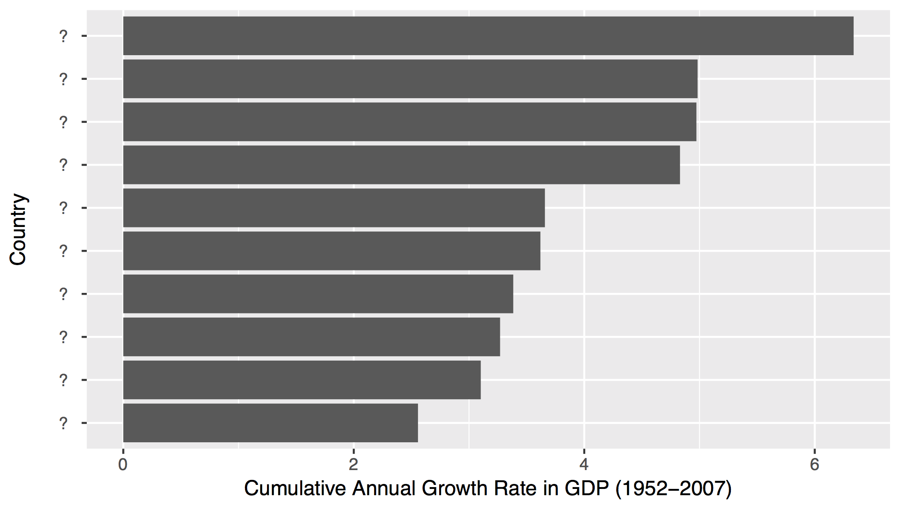

## Gapminder data

### gapminder 

The `gapminder` data set contains demographic statistics popularized by Hans Rosling's TED talks.

<div class="tutorial-exercise" data-label="ex1" data-caption="Code" data-completion="1" data-diagnostics="1" data-startover="1" data-lines="0">

```text
library(gapminder)
gapminder
```

<script type="application/json" data-opts-chunk="1">{"fig.width":7,"fig.height":5,"fig.retina":2,"fig.align":"default","fig.keep":"high","fig.show":"asis","out.width":672,"warning":true,"error":false,"message":true,"exercise.df_print":"default","exercise.checker":"NULL"}</script></div>

### Goal

Which countries had the fastest growing GDP's between 1952 and 2007?



## The Tidyverse

### Functions

In R, you manipulate data by passing the data to functions.

<div class="tutorial-exercise" data-label="ex2" data-caption="Code" data-completion="1" data-diagnostics="1" data-startover="1" data-lines="0">

```text
round(1234.567, digits = 2)
nrow(gapminder)
```

<script type="application/json" data-opts-chunk="1">{"fig.width":7,"fig.height":5,"fig.retina":2,"fig.align":"default","fig.keep":"high","fig.show":"asis","out.width":672,"warning":true,"error":false,"message":true,"exercise.df_print":"default","exercise.checker":"NULL"}</script></div>

The tidyverse is a collection of R packages that contain functions. You must load the packages to use the functions.

### Load the Tidyverse

<div class="tutorial-exercise" data-label="ex3" data-caption="Code" data-completion="1" data-diagnostics="1" data-startover="1" data-lines="0">

```text
## install.packages("tidyverse")
library("tidyverse")
```

<script type="application/json" data-opts-chunk="1">{"fig.width":7,"fig.height":5,"fig.retina":2,"fig.align":"default","fig.keep":"high","fig.show":"asis","out.width":672,"warning":true,"error":false,"message":true,"exercise.df_print":"default","exercise.checker":"NULL"}</script></div>

### Tidy Tools

Tidyverse functions are designed to be:

1. **Simple** - They do one thing, and they do it  well
2. **Composable** - They can be combined with other functions for multi-step operations

### Which countries have the largest populations?


<div class="tutorial-exercise" data-label="ex4" data-caption="Code" data-completion="1" data-diagnostics="1" data-startover="1" data-lines="0">

```text
gapminder
```

```
# A tibble: 1,704 x 6
   country     continent  year lifeExp      pop gdpPercap
   <fct>       <fct>     <int>   <dbl>    <int>     <dbl>
 1 Afghanistan Asia       1952    28.8  8425333      779.
 2 Afghanistan Asia       1957    30.3  9240934      821.
 3 Afghanistan Asia       1962    32.0 10267083      853.
 4 Afghanistan Asia       1967    34.0 11537966      836.
 5 Afghanistan Asia       1972    36.1 13079460      740.
 6 Afghanistan Asia       1977    38.4 14880372      786.
 7 Afghanistan Asia       1982    39.9 12881816      978.
 8 Afghanistan Asia       1987    40.8 13867957      852.
 9 Afghanistan Asia       1992    41.7 16317921      649.
10 Afghanistan Asia       1997    41.8 22227415      635.
# ... with 1,694 more rows
```

<script type="application/json" data-opts-chunk="1">{"fig.width":7,"fig.height":5,"fig.retina":2,"fig.align":"default","fig.keep":"high","fig.show":"asis","out.width":672,"warning":true,"error":false,"message":true,"exercise.df_print":"default","exercise.checker":"NULL"}</script></div>

<div class="tutorial-exercise-support" data-label="ex4-solution" data-caption="Code" data-completion="1" data-diagnostics="1" data-startover="1" data-lines="0">

```text
arrange(gapminder, desc(pop))
```

</div>

### Which countries had the largest population _in 2007_?


<div class="tutorial-exercise" data-label="ex5" data-caption="Code" data-completion="1" data-diagnostics="1" data-startover="1" data-lines="0">

```text
gapminder2007 <- gapminder
gapminder2007
```

```
# A tibble: 1,704 x 6
   country     continent  year lifeExp      pop gdpPercap
   <fct>       <fct>     <int>   <dbl>    <int>     <dbl>
 1 Afghanistan Asia       1952    28.8  8425333      779.
 2 Afghanistan Asia       1957    30.3  9240934      821.
 3 Afghanistan Asia       1962    32.0 10267083      853.
 4 Afghanistan Asia       1967    34.0 11537966      836.
 5 Afghanistan Asia       1972    36.1 13079460      740.
 6 Afghanistan Asia       1977    38.4 14880372      786.
 7 Afghanistan Asia       1982    39.9 12881816      978.
 8 Afghanistan Asia       1987    40.8 13867957      852.
 9 Afghanistan Asia       1992    41.7 16317921      649.
10 Afghanistan Asia       1997    41.8 22227415      635.
# ... with 1,694 more rows
```

<script type="application/json" data-opts-chunk="1">{"fig.width":7,"fig.height":5,"fig.retina":2,"fig.align":"default","fig.keep":"high","fig.show":"asis","out.width":672,"warning":true,"error":false,"message":true,"exercise.df_print":"default","exercise.checker":"NULL"}</script></div>

<div class="tutorial-exercise-support" data-label="ex5-solution" data-caption="Code" data-completion="1" data-diagnostics="1" data-startover="1" data-lines="0">

```text
gapminder2007 <- filter(gapminder, year == 2007)
arrange(gapminder2007, desc(pop))
```

</div>


### A better way

Use the pipe operator (%>%) to compose tidyverse functions.

<div class="tutorial-exercise" data-label="ex6" data-caption="Code" data-completion="1" data-diagnostics="1" data-startover="1" data-lines="0">

```text
gapminder2007 <- filter(gapminder, year == 2007)
arrange(gapminder2007, desc(pop))
```

```
# A tibble: 142 x 6
   country       continent  year lifeExp        pop gdpPercap
   <fct>         <fct>     <int>   <dbl>      <int>     <dbl>
 1 China         Asia       2007    73.0 1318683096     4959.
 2 India         Asia       2007    64.7 1110396331     2452.
 3 United States Americas   2007    78.2  301139947    42952.
 4 Indonesia     Asia       2007    70.6  223547000     3541.
 5 Brazil        Americas   2007    72.4  190010647     9066.
 6 Pakistan      Asia       2007    65.5  169270617     2606.
 7 Bangladesh    Asia       2007    64.1  150448339     1391.
 8 Nigeria       Africa     2007    46.9  135031164     2014.
 9 Japan         Asia       2007    82.6  127467972    31656.
10 Mexico        Americas   2007    76.2  108700891    11978.
# ... with 132 more rows
```

<script type="application/json" data-opts-chunk="1">{"fig.width":7,"fig.height":5,"fig.retina":2,"fig.align":"default","fig.keep":"high","fig.show":"asis","out.width":672,"warning":true,"error":false,"message":true,"exercise.df_print":"default","exercise.checker":"NULL"}</script></div>

<div class="tutorial-exercise-support" data-label="ex6-solution" data-caption="Code" data-completion="1" data-diagnostics="1" data-startover="1" data-lines="0">

```text
gapminder %>% 
  filter(year == 2007) %>% 
  arrange(desc(pop))
```

</div>


### Which countries had the largest life expectancy in 2007?


<div class="tutorial-exercise" data-label="ex7" data-caption="Code" data-completion="1" data-diagnostics="1" data-startover="1" data-lines="0">

```text
gapminder
```

```
# A tibble: 1,704 x 6
   country     continent  year lifeExp      pop gdpPercap
   <fct>       <fct>     <int>   <dbl>    <int>     <dbl>
 1 Afghanistan Asia       1952    28.8  8425333      779.
 2 Afghanistan Asia       1957    30.3  9240934      821.
 3 Afghanistan Asia       1962    32.0 10267083      853.
 4 Afghanistan Asia       1967    34.0 11537966      836.
 5 Afghanistan Asia       1972    36.1 13079460      740.
 6 Afghanistan Asia       1977    38.4 14880372      786.
 7 Afghanistan Asia       1982    39.9 12881816      978.
 8 Afghanistan Asia       1987    40.8 13867957      852.
 9 Afghanistan Asia       1992    41.7 16317921      649.
10 Afghanistan Asia       1997    41.8 22227415      635.
# ... with 1,694 more rows
```

<script type="application/json" data-opts-chunk="1">{"fig.width":7,"fig.height":5,"fig.retina":2,"fig.align":"default","fig.keep":"high","fig.show":"asis","out.width":672,"warning":true,"error":false,"message":true,"exercise.df_print":"default","exercise.checker":"NULL"}</script></div>

<div class="tutorial-exercise-support" data-label="ex7-solution" data-caption="Code" data-completion="1" data-diagnostics="1" data-startover="1" data-lines="0">

```text
gapminder %>% 
  filter(year == 2007) %>% 
  arrange(desc(lifeExp)) %>% 
  select(country, lifeExp)
```

</div>

### What is the gdp of each country?


<div class="tutorial-exercise" data-label="ex8" data-caption="Code" data-completion="1" data-diagnostics="1" data-startover="1" data-lines="0">

```text
gapminder
```

```
# A tibble: 1,704 x 6
   country     continent  year lifeExp      pop gdpPercap
   <fct>       <fct>     <int>   <dbl>    <int>     <dbl>
 1 Afghanistan Asia       1952    28.8  8425333      779.
 2 Afghanistan Asia       1957    30.3  9240934      821.
 3 Afghanistan Asia       1962    32.0 10267083      853.
 4 Afghanistan Asia       1967    34.0 11537966      836.
 5 Afghanistan Asia       1972    36.1 13079460      740.
 6 Afghanistan Asia       1977    38.4 14880372      786.
 7 Afghanistan Asia       1982    39.9 12881816      978.
 8 Afghanistan Asia       1987    40.8 13867957      852.
 9 Afghanistan Asia       1992    41.7 16317921      649.
10 Afghanistan Asia       1997    41.8 22227415      635.
# ... with 1,694 more rows
```

<script type="application/json" data-opts-chunk="1">{"fig.width":7,"fig.height":5,"fig.retina":2,"fig.align":"default","fig.keep":"high","fig.show":"asis","out.width":672,"warning":true,"error":false,"message":true,"exercise.df_print":"default","exercise.checker":"NULL"}</script></div>

<div class="tutorial-exercise-support" data-label="ex8-solution" data-caption="Code" data-completion="1" data-diagnostics="1" data-startover="1" data-lines="0">

```text
gapminder %>% 
  mutate(gdp = pop * gdpPercap)
```

</div>


### What was the maximum gdp?


<div class="tutorial-exercise" data-label="ex9" data-caption="Code" data-completion="1" data-diagnostics="1" data-startover="1" data-lines="0">

```text
gapminder %>% 
  mutate(gdp = pop * gdpPercap)
```

```
# A tibble: 1,704 x 7
   country     continent  year lifeExp      pop gdpPercap          gdp
   <fct>       <fct>     <int>   <dbl>    <int>     <dbl>        <dbl>
 1 Afghanistan Asia       1952    28.8  8425333      779.  6567086330.
 2 Afghanistan Asia       1957    30.3  9240934      821.  7585448670.
 3 Afghanistan Asia       1962    32.0 10267083      853.  8758855797.
 4 Afghanistan Asia       1967    34.0 11537966      836.  9648014150.
 5 Afghanistan Asia       1972    36.1 13079460      740.  9678553274.
 6 Afghanistan Asia       1977    38.4 14880372      786. 11697659231.
 7 Afghanistan Asia       1982    39.9 12881816      978. 12598563401.
 8 Afghanistan Asia       1987    40.8 13867957      852. 11820990309.
 9 Afghanistan Asia       1992    41.7 16317921      649. 10595901589.
10 Afghanistan Asia       1997    41.8 22227415      635. 14121995875.
# ... with 1,694 more rows
```

<script type="application/json" data-opts-chunk="1">{"fig.width":7,"fig.height":5,"fig.retina":2,"fig.align":"default","fig.keep":"high","fig.show":"asis","out.width":672,"warning":true,"error":false,"message":true,"exercise.df_print":"default","exercise.checker":"NULL"}</script></div>

<div class="tutorial-exercise-support" data-label="ex9-solution" data-caption="Code" data-completion="1" data-diagnostics="1" data-startover="1" data-lines="0">

```text
gapminder %>% 
  mutate(gdp = pop * gdpPercap) %>% 
  summarise(max_gdp = max(gdp))
```

</div>

### What was the first gdp? The last gdp?

<div class="tutorial-exercise" data-label="ex10" data-caption="Code" data-completion="1" data-diagnostics="1" data-startover="1" data-lines="0">

```text
gapminder %>% 
  mutate(gdp = pop * gdpPercap)
```

```
# A tibble: 1,704 x 7
   country     continent  year lifeExp      pop gdpPercap          gdp
   <fct>       <fct>     <int>   <dbl>    <int>     <dbl>        <dbl>
 1 Afghanistan Asia       1952    28.8  8425333      779.  6567086330.
 2 Afghanistan Asia       1957    30.3  9240934      821.  7585448670.
 3 Afghanistan Asia       1962    32.0 10267083      853.  8758855797.
 4 Afghanistan Asia       1967    34.0 11537966      836.  9648014150.
 5 Afghanistan Asia       1972    36.1 13079460      740.  9678553274.
 6 Afghanistan Asia       1977    38.4 14880372      786. 11697659231.
 7 Afghanistan Asia       1982    39.9 12881816      978. 12598563401.
 8 Afghanistan Asia       1987    40.8 13867957      852. 11820990309.
 9 Afghanistan Asia       1992    41.7 16317921      649. 10595901589.
10 Afghanistan Asia       1997    41.8 22227415      635. 14121995875.
# ... with 1,694 more rows
```

<script type="application/json" data-opts-chunk="1">{"fig.width":7,"fig.height":5,"fig.retina":2,"fig.align":"default","fig.keep":"high","fig.show":"asis","out.width":672,"warning":true,"error":false,"message":true,"exercise.df_print":"default","exercise.checker":"NULL"}</script></div>

<div class="tutorial-exercise-support" data-label="ex10-solution" data-caption="Code" data-completion="1" data-diagnostics="1" data-startover="1" data-lines="0">

```text
gapminder %>% 
  mutate(gdp = pop * gdpPercap) %>% 
  summarise(first_gdp = first(gdp), last_gdp = last(gdp))
```

</div>

### What was the first and last gdp for each country?


<div class="tutorial-exercise" data-label="ex11" data-caption="Code" data-completion="1" data-diagnostics="1" data-startover="1" data-lines="0">

```text
gapminder %>% 
  mutate(gdp = pop * gdpPercap) %>% 
  summarise(first_gdp = first(gdp), last_gdp = last(gdp))
```

```
# A tibble: 1 x 2
    first_gdp    last_gdp
        <dbl>       <dbl>
1 6567086330. 5782658337.
```

<script type="application/json" data-opts-chunk="1">{"fig.width":7,"fig.height":5,"fig.retina":2,"fig.align":"default","fig.keep":"high","fig.show":"asis","out.width":672,"warning":true,"error":false,"message":true,"exercise.df_print":"default","exercise.checker":"NULL"}</script></div>

<div class="tutorial-exercise-support" data-label="ex11-solution" data-caption="Code" data-completion="1" data-diagnostics="1" data-startover="1" data-lines="0">

```text
gapminder %>% 
  mutate(gdp = pop * gdpPercap) %>% 
  group_by(country) %>% 
  summarise(first_gdp = first(gdp), last_gdp = last(gdp))
```

</div>

### What was the cumulative annual growth for each country between 1952 and 1957?

<div class="tutorial-exercise" data-label="ex12" data-caption="Code" data-completion="1" data-diagnostics="1" data-startover="1" data-lines="0">

```text
gapminder %>% 
  mutate(gdp = pop * gdpPercap) %>% 
  group_by(country) %>% 
  summarise(gdp1952 = first(gdp), gdp2007 = last(gdp))
```

```
# A tibble: 142 x 3
   country           gdp1952       gdp2007
   <fct>               <dbl>         <dbl>
 1 Afghanistan   6567086330.  31079291949.
 2 Albania       2053669902.  21376411360.
 3 Algeria      22725632678. 207444851958.
 4 Angola       14899557133.  59583895818.
 5 Argentina   105676319105. 515033625357.
 6 Australia    87256254102. 703658358894.
 7 Austria      42516266683. 296229400691.
 8 Bahrain       1188460759.  21112675360.
 9 Bangladesh   32082059995. 209311822134.
10 Belgium      72838686716. 350141166520.
# ... with 132 more rows
```

<script type="application/json" data-opts-chunk="1">{"fig.width":7,"fig.height":5,"fig.retina":2,"fig.align":"default","fig.keep":"high","fig.show":"asis","out.width":672,"warning":true,"error":false,"message":true,"exercise.df_print":"default","exercise.checker":"NULL"}</script></div>

<div class="tutorial-exercise-support" data-label="ex12-solution" data-caption="Code" data-completion="1" data-diagnostics="1" data-startover="1" data-lines="0">

```text
gapminder %>% 
  mutate(gdp = pop * gdpPercap) %>% 
  group_by(country) %>% 
  summarise(gdp1952 = first(gdp), gdp2007 = last(gdp)) %>% 
  mutate(cagr = ((gdp2007 / gdp1952) ^ (1/55) - 1) * 100) %>% 
  arrange(desc(cagr)) %>% 
  select(country, cagr)
```

</div>

### Tidy data

Each tidyverse function expects and returns the same type of data: _tidy data_. 
A tabular data set is tidy iff:

1. Each variable is in its own column
2. Each observation is in its own row

## Visualization

### What did GDP growth look like?

Let's focus on the 10 biggest economies (in 1952). What are they?

<div class="tutorial-exercise" data-label="ex13" data-caption="Code" data-completion="1" data-diagnostics="1" data-startover="1" data-lines="0">

```text
gapminder
```

<script type="application/json" data-opts-chunk="1">{"fig.width":7,"fig.height":5,"fig.retina":2,"fig.align":"default","fig.keep":"high","fig.show":"asis","out.width":672,"warning":true,"error":false,"message":true,"exercise.df_print":"default","exercise.checker":"NULL"}</script></div>

<div class="tutorial-exercise-support" data-label="ex13-solution" data-caption="Code" data-completion="1" data-diagnostics="1" data-startover="1" data-lines="0">

```text
gapminder %>% 
  filter(year == 1952) %>% 
  mutate(gdp = pop * gdpPercap) %>% 
  arrange(desc(gdp)) %>% 
  select(country, gdp)
```

</div>

### Visualize the Top 10


```r
top_10 <- c("United States", "United Kingdom", "Germany", "France", 
            "Japan", "Italy", "China", "India", "Canada", "Brazil")
```


```r
ggplot(data = <DATA>) +
  <GEOM_FUNCTION>(mapping = aes(<MAPPINGS>))
```

<div class="tutorial-exercise" data-label="ex14" data-caption="Code" data-completion="1" data-diagnostics="1" data-startover="1" data-lines="0">

```text
gapminder
```

```
# A tibble: 1,704 x 6
   country     continent  year lifeExp      pop gdpPercap
   <fct>       <fct>     <int>   <dbl>    <int>     <dbl>
 1 Afghanistan Asia       1952    28.8  8425333      779.
 2 Afghanistan Asia       1957    30.3  9240934      821.
 3 Afghanistan Asia       1962    32.0 10267083      853.
 4 Afghanistan Asia       1967    34.0 11537966      836.
 5 Afghanistan Asia       1972    36.1 13079460      740.
 6 Afghanistan Asia       1977    38.4 14880372      786.
 7 Afghanistan Asia       1982    39.9 12881816      978.
 8 Afghanistan Asia       1987    40.8 13867957      852.
 9 Afghanistan Asia       1992    41.7 16317921      649.
10 Afghanistan Asia       1997    41.8 22227415      635.
# ... with 1,694 more rows
```

<script type="application/json" data-opts-chunk="1">{"fig.width":7,"fig.height":5,"fig.retina":2,"fig.align":"default","fig.keep":"high","fig.show":"asis","out.width":672,"warning":true,"error":false,"message":true,"exercise.df_print":"default","exercise.checker":"NULL"}</script></div>

<div class="tutorial-exercise-support" data-label="ex14-solution" data-caption="Code" data-completion="1" data-diagnostics="1" data-startover="1" data-lines="0">

```text
gapminder %>% 
  filter(country %in% top_10) %>% 
  mutate(gdp = pop * gdpPercap) %>% 
  ggplot() +
    geom_line(mapping = aes(x = year, y = gdp, color = country))
```

</div>


### Scaled data

Let's scale the data within each country to make growth easier to compare

<div class="tutorial-exercise" data-label="ex15" data-caption="Code" data-completion="1" data-diagnostics="1" data-startover="1" data-lines="0">

```text
gapminder %>% 
  filter(country %in% top_10) %>% 
  mutate(gdp = pop * gdpPercap)
```

```
# A tibble: 120 x 7
   country continent  year lifeExp       pop gdpPercap     gdp
   <fct>   <fct>     <int>   <dbl>     <int>     <dbl>   <dbl>
 1 Brazil  Americas   1952    50.9  56602560     2109. 1.19e11
 2 Brazil  Americas   1957    53.3  65551171     2487. 1.63e11
 3 Brazil  Americas   1962    55.7  76039390     3337. 2.54e11
 4 Brazil  Americas   1967    57.6  88049823     3430. 3.02e11
 5 Brazil  Americas   1972    59.5 100840058     4986. 5.03e11
 6 Brazil  Americas   1977    61.5 114313951     6660. 7.61e11
 7 Brazil  Americas   1982    63.3 128962939     7031. 9.07e11
 8 Brazil  Americas   1987    65.2 142938076     7807. 1.12e12
 9 Brazil  Americas   1992    67.1 155975974     6950. 1.08e12
10 Brazil  Americas   1997    69.4 168546719     7958. 1.34e12
# ... with 110 more rows
```

<script type="application/json" data-opts-chunk="1">{"fig.width":7,"fig.height":5,"fig.retina":2,"fig.align":"default","fig.keep":"high","fig.show":"asis","out.width":672,"warning":true,"error":false,"message":true,"exercise.df_print":"default","exercise.checker":"NULL"}</script></div>

<div class="tutorial-exercise-support" data-label="ex15-solution" data-caption="Code" data-completion="1" data-diagnostics="1" data-startover="1" data-lines="0">

```text
gapminder %>% 
  filter(country %in% top_10) %>% 
  mutate(gdp = pop * gdpPercap) %>% 
  group_by(country) %>% 
  mutate(scaled_gdp = gdp / first(gdp)) %>% 
  ggplot() +
    geom_line(mapping = aes(x = year, y = scaled_gdp, color = country))
```

</div>

### Cumulative Annual Growth Rates

<div class="tutorial-exercise" data-label="ex16" data-caption="Code" data-completion="1" data-diagnostics="1" data-startover="1" data-lines="0">

```text
gapminder %>% 
  filter(country %in% top_10) %>% 
  mutate(gdp = pop * gdpPercap) %>% 
  group_by(country) %>% 
  summarise(start = first(gdp), end = last(gdp)) %>% 
  mutate(cagr = ((end/start) ^ (1 / 55) - 1) * 100) %>% 
  arrange(desc(cagr)) %>% 
  select(country, cagr)
```

```
# A tibble: 10 x 2
   country         cagr
   <fct>          <dbl>
 1 China           6.34
 2 Japan           4.98
 3 Brazil          4.97
 4 India           4.83
 5 Canada          3.66
 6 Italy           3.62
 7 France          3.38
 8 United States   3.27
 9 Germany         3.10
10 United Kingdom  2.56
```

<script type="application/json" data-opts-chunk="1">{"fig.width":7,"fig.height":5,"fig.retina":2,"fig.align":"default","fig.keep":"high","fig.show":"asis","out.width":672,"warning":true,"error":false,"message":true,"exercise.df_print":"default","exercise.checker":"NULL"}</script></div>

<div class="tutorial-exercise-support" data-label="ex16-solution" data-caption="Code" data-completion="1" data-diagnostics="1" data-startover="1" data-lines="0">

```text
gapminder %>% 
  filter(country %in% top_10) %>% 
  mutate(gdp = pop * gdpPercap) %>% 
  group_by(country) %>% 
  summarise(start = first(gdp), end = last(gdp)) %>% 
  mutate(cagr = ((end/start) ^ (1 / 55) - 1) * 100) %>% 
  arrange(desc(cagr)) %>% 
  select(country, cagr) %>% 
  ggplot() +
    geom_col(mapping = aes(x = country, y = cagr))
```

</div>

### Aspirational

<div class="tutorial-exercise" data-label="ex17" data-caption="Code" data-completion="1" data-diagnostics="1" data-startover="1" data-lines="0">

```text
library(forcats)

gapminder %>% 
  filter(country %in% top_10) %>% 
  mutate(gdp = pop * gdpPercap) %>% 
  group_by(country) %>% 
  summarise(start = first(gdp), end = last(gdp)) %>% 
  mutate(cagr = ((end/start) ^ (1 / 55) - 1) * 100) %>% 
  arrange(desc(cagr)) %>% 
  ggplot() +
    geom_col(mapping = aes(x = fct_reorder(country, cagr), y = cagr)) +
    labs(x = "Country", y = "Cumulative Annual Growth Rate in GDP (1952-2007)") +
    coord_flip()
```

<script type="application/json" data-opts-chunk="1">{"fig.width":7,"fig.height":5,"fig.retina":2,"fig.align":"default","fig.keep":"high","fig.show":"asis","out.width":672,"warning":true,"error":false,"message":true,"exercise.df_print":"default","exercise.checker":"NULL"}</script></div>


<!--html_preserve-->
<script type="application/shiny-prerendered" data-context="server-start">
library(learnr)
library(gapminder)
library(tidyverse)

top_10 <- c("United States", "United Kingdom", "Germany", "France", 
            "Japan", "Italy", "China", "India", "Canada", "Brazil")
</script>
<!--/html_preserve-->
<!--html_preserve-->
<script type="application/shiny-prerendered" data-context="server">
learnr:::register_http_handlers(session, metadata = NULL)
</script>
<!--/html_preserve-->
<!--html_preserve-->
<script type="application/shiny-prerendered" data-context="server">
session$onSessionEnded(function() {
        learnr:::session_stop_event(session)
      })
</script>
<!--/html_preserve-->
<!--html_preserve-->
<script type="application/shiny-prerendered" data-context="server">
`tutorial-exercise-ex1-result` <- learnr:::setup_exercise_handler(reactive(req(input$`tutorial-exercise-ex1-code-editor`)), session)
output$`tutorial-exercise-ex1-output` <- renderUI({
  `tutorial-exercise-ex1-result`()
})
</script>
<!--/html_preserve-->
<!--html_preserve-->
<script type="application/shiny-prerendered" data-context="server">
`tutorial-exercise-ex2-result` <- learnr:::setup_exercise_handler(reactive(req(input$`tutorial-exercise-ex2-code-editor`)), session)
output$`tutorial-exercise-ex2-output` <- renderUI({
  `tutorial-exercise-ex2-result`()
})
</script>
<!--/html_preserve-->
<!--html_preserve-->
<script type="application/shiny-prerendered" data-context="server">
`tutorial-exercise-ex3-result` <- learnr:::setup_exercise_handler(reactive(req(input$`tutorial-exercise-ex3-code-editor`)), session)
output$`tutorial-exercise-ex3-output` <- renderUI({
  `tutorial-exercise-ex3-result`()
})
</script>
<!--/html_preserve-->
<!--html_preserve-->
<script type="application/shiny-prerendered" data-context="server">
`tutorial-exercise-ex4-result` <- learnr:::setup_exercise_handler(reactive(req(input$`tutorial-exercise-ex4-code-editor`)), session)
output$`tutorial-exercise-ex4-output` <- renderUI({
  `tutorial-exercise-ex4-result`()
})
</script>
<!--/html_preserve-->
<!--html_preserve-->
<script type="application/shiny-prerendered" data-context="server">
`tutorial-exercise-ex5-result` <- learnr:::setup_exercise_handler(reactive(req(input$`tutorial-exercise-ex5-code-editor`)), session)
output$`tutorial-exercise-ex5-output` <- renderUI({
  `tutorial-exercise-ex5-result`()
})
</script>
<!--/html_preserve-->
<!--html_preserve-->
<script type="application/shiny-prerendered" data-context="server">
`tutorial-exercise-ex6-result` <- learnr:::setup_exercise_handler(reactive(req(input$`tutorial-exercise-ex6-code-editor`)), session)
output$`tutorial-exercise-ex6-output` <- renderUI({
  `tutorial-exercise-ex6-result`()
})
</script>
<!--/html_preserve-->
<!--html_preserve-->
<script type="application/shiny-prerendered" data-context="server">
`tutorial-exercise-ex7-result` <- learnr:::setup_exercise_handler(reactive(req(input$`tutorial-exercise-ex7-code-editor`)), session)
output$`tutorial-exercise-ex7-output` <- renderUI({
  `tutorial-exercise-ex7-result`()
})
</script>
<!--/html_preserve-->
<!--html_preserve-->
<script type="application/shiny-prerendered" data-context="server">
`tutorial-exercise-ex8-result` <- learnr:::setup_exercise_handler(reactive(req(input$`tutorial-exercise-ex8-code-editor`)), session)
output$`tutorial-exercise-ex8-output` <- renderUI({
  `tutorial-exercise-ex8-result`()
})
</script>
<!--/html_preserve-->
<!--html_preserve-->
<script type="application/shiny-prerendered" data-context="server">
`tutorial-exercise-ex9-result` <- learnr:::setup_exercise_handler(reactive(req(input$`tutorial-exercise-ex9-code-editor`)), session)
output$`tutorial-exercise-ex9-output` <- renderUI({
  `tutorial-exercise-ex9-result`()
})
</script>
<!--/html_preserve-->
<!--html_preserve-->
<script type="application/shiny-prerendered" data-context="server">
`tutorial-exercise-ex10-result` <- learnr:::setup_exercise_handler(reactive(req(input$`tutorial-exercise-ex10-code-editor`)), session)
output$`tutorial-exercise-ex10-output` <- renderUI({
  `tutorial-exercise-ex10-result`()
})
</script>
<!--/html_preserve-->
<!--html_preserve-->
<script type="application/shiny-prerendered" data-context="server">
`tutorial-exercise-ex11-result` <- learnr:::setup_exercise_handler(reactive(req(input$`tutorial-exercise-ex11-code-editor`)), session)
output$`tutorial-exercise-ex11-output` <- renderUI({
  `tutorial-exercise-ex11-result`()
})
</script>
<!--/html_preserve-->
<!--html_preserve-->
<script type="application/shiny-prerendered" data-context="server">
`tutorial-exercise-ex12-result` <- learnr:::setup_exercise_handler(reactive(req(input$`tutorial-exercise-ex12-code-editor`)), session)
output$`tutorial-exercise-ex12-output` <- renderUI({
  `tutorial-exercise-ex12-result`()
})
</script>
<!--/html_preserve-->
<!--html_preserve-->
<script type="application/shiny-prerendered" data-context="server">
`tutorial-exercise-ex13-result` <- learnr:::setup_exercise_handler(reactive(req(input$`tutorial-exercise-ex13-code-editor`)), session)
output$`tutorial-exercise-ex13-output` <- renderUI({
  `tutorial-exercise-ex13-result`()
})
</script>
<!--/html_preserve-->
<!--html_preserve-->
<script type="application/shiny-prerendered" data-context="server">
`tutorial-exercise-ex14-result` <- learnr:::setup_exercise_handler(reactive(req(input$`tutorial-exercise-ex14-code-editor`)), session)
output$`tutorial-exercise-ex14-output` <- renderUI({
  `tutorial-exercise-ex14-result`()
})
</script>
<!--/html_preserve-->
<!--html_preserve-->
<script type="application/shiny-prerendered" data-context="server">
`tutorial-exercise-ex15-result` <- learnr:::setup_exercise_handler(reactive(req(input$`tutorial-exercise-ex15-code-editor`)), session)
output$`tutorial-exercise-ex15-output` <- renderUI({
  `tutorial-exercise-ex15-result`()
})
</script>
<!--/html_preserve-->
<!--html_preserve-->
<script type="application/shiny-prerendered" data-context="server">
`tutorial-exercise-ex16-result` <- learnr:::setup_exercise_handler(reactive(req(input$`tutorial-exercise-ex16-code-editor`)), session)
output$`tutorial-exercise-ex16-output` <- renderUI({
  `tutorial-exercise-ex16-result`()
})
</script>
<!--/html_preserve-->
<!--html_preserve-->
<script type="application/shiny-prerendered" data-context="server">
`tutorial-exercise-ex17-result` <- learnr:::setup_exercise_handler(reactive(req(input$`tutorial-exercise-ex17-code-editor`)), session)
output$`tutorial-exercise-ex17-output` <- renderUI({
  `tutorial-exercise-ex17-result`()
})
</script>
<!--/html_preserve-->
