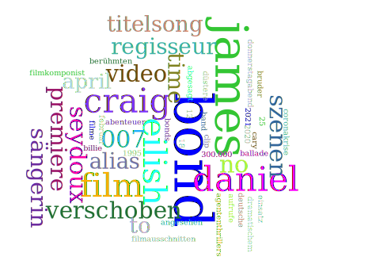

# Satztypologie

## Phrasen und Köpfe

Die meisten Texte bestehen vorzugsweise aus satzförmigen Äußerungen. In diesem Kapitel beschäftigen wir uns daher mit den verschiedenen Form- und Funktionstypen von Sätzen.

Ein prototypischer Satz besteht aus zumindest einem finiten Verb (z.B. *Sprich!*), ist kommunikativ selbständig und macht eine sprachliche Handlung eindeutig (hier: Aufforderung an den Gesprächspartner zum Sprechen). Die meisten Sätze bestehen aus mehr als einem Satzelement. Umgangssprachlich ist oft die Rede davon, dass ein Satz aus Wörtern zusammengesetzt ist. Das ist nicht völlig richtig, was sich am Beispiel des folgenden deutschen Satzes erweist:

(1) Studentin fährt in Stadt.   

Die Substantive *Studentin* und *Stadt* sind im Satz nicht syntaxfähig. Es fehlen grammatische Bindemittel, d.h. bestimmte Funktionswörter, die gemeinsam mit autosemantischen Ausdrücken eine semantische und syntaktische Verbindung eingehen, die man Phrasen nennt. Sätze bestehen demnach aus *Phrasen* von semantisch und syntaktisch zusammengehörigen Wörtern, nicht aus einzelnen Wörtern: die Studentin, die Stadt in (2).

(2) [Die Studentin] fährt in [die Stadt].   

Zwei oder mehrere Phrasen können zusammengesetzt sein, z.B. die *Präpositionalphrase* im Beispiel (3), die aus der Präposition (P) *in* und der Nominalphrase (NP) *die Stadt* besteht. 

(3) Die Studentin fährt [ ~P~ in [ ~NP~ die Stadt]].

In den meisten syntaktischen Phrasen kann ein Element als *Kopf* oder Gliedkern identifiziert werden. Eine syntaktische erbt ihre Eigenschaften vom Kopf der Phrase, z.B. in der Phrase *die Stadt* gibt das Substantiv oder Nomen *Stadt* seine Eigenschaften an seine Begleiter (z.B. Artikel, Adjektiv) weiter. Deshalb bezeichnet man eine solche Phrase als *Nominalphrase*.

Im Beispiel (3) ist dagegen die Präposition der Kopf einer Phrase, denn die Präposition *in* regiert (hier in Zusammenarbeit mit dem Hauptverb *fahren*) den Kasus der Nominalphrase *die Stadt*. 

:::rmdnote
**`Phrasenprinzip`**

Eine **`Phrase`** ist eine Verbindung von semantisch und syntaktisch zusammengehörigen Satzelementen. Um Wörter im Satz verwenden zu können, müssen sie  häufig (nicht immer) durch andere (syntaktisch kompatible Wörter) zu Phrasen ergänzt werden. Wie sie zu ergänzen sind, das steuert ihr *Selektionsrahmen* (d.h. ihre lexikalischen Eigenschaften, -> *Rektion*, *Valenz*). 
:::

Beispiel: Dass [in den Lesesaal stellen] in dem Satz *Sarah würde das Buch in den Lesesaal stellen* eine Einheit bildet, ersieht man aus:   
(i)	Man kann diesen Komplex gesamthaft verschieben (z.B. an den Satzanfang):   
		[In den Lesesaal stellen] würde Sarah das Buch.   
(ii)	Man kann den Komplex gesamthaft durch ein Verb ersetzen (z.B. *lesen*):   
	Sarah würde das Buch [in den Lesesaal stellen ].   
	Sarah würde das Buch [lesen].   
Der ganze Komplex [in den Lesesaal stellen] hat trotz Ergänzung immer noch **verbalen Charakter**.

Das ist ein starkes Argument dafür, dass der Komplex [das Buch in den Lesesaal stellen] verbale Prägung hat und eine Phrase ist: eine *Verbalphrase* (VP). Das Fragment *Sarah würde* [...] ruft zur Ergänzung eine Verbalphrase auf. 

:::rmdnote
**`Kopfprinzip`**
in endozentrischen Phrasen.

Phrasen haben einen **`Kopf`** (Gliedkern).   
Die Eigenschaften des Kopfes übertragen sich auf die gesamte Phrase (Vererbung).   
Die Position des Kopfes hängt vom Sprachtyp ab (SVO, SOV, …).   
:::

In den folgenden englischen, deutschen und slowenischen Beispielen stellen die Präposition oder das Hauptverb den Kopf de jeweiligen Phrase dar.

(4) *in* the bank; this *amused* the man - that this *amused* the man   
(5) *in* der Bank;  *nach* meiner Meinung - meiner Meinung *nach*   
(6) dies *belustigte* den Mann - dass dies den Mann *belustigte*   
(7) *v* banki; to *zabava* moža - da to *zabava* moža / to moža *zabava*

Die meisten der untersuchten Sprachen im Korpus von Dryer [Wals](https://wals.info/feature/81A#2/18.0/153.1) zeigen entweder die SVO- oder die SOV-Reihenfolge. In den meisten Sprachen der Welt dominiert demnach die Abfolge **Subjekt vor Objekt**. Das hängt damit zusammen, dass eine handelnde Person häufig als Satzsubjekt ausgedrückt wird, während konkrete oder abstrakte Gegenstände, die von der Handlung betroffen sind oder erzeugt werden, als (direktes) Objekt ausgedrückt werden. Das entspricht auch der *anthropozentrischen Sichtweise* des Menschens, wonach der Mensch im Zentrum menschlichen Denkens steht und daher gern als Ausgangspunkt eines Gedankens verwendet wird.

Deutsche Beispielsätze:   
(8) Die Studentin *trink-t* am liebsten Bohnenkaffee.   
(9) Die Studentin *ha-t* am liebsten Bohnenkaffee ge*trunk*en.   
(10) Die Lehrerin meinte, 
	*dass* ihre Studentin am liebsten Bohnenkaffee *trink-t*.   
(11)	Die Lehrerin meinte, 
	*dass* ihre Studentin am liebsten Bohnenkaffee ge*trunk*en *ha-t*.   
(12)	Am liebsten *trink-t* die Studentin Bohnenkaffee.   

Slowenische Beispielsätze:   
(13) Študentka najraje *pi-je* pravo kavo.   
(14) Študentka *je* najraje *pila* pravo kavo.   
(15) Učiteljica je menila, 
	*da* njena študentka najraje *pi-je* pravo kavo.   
(16)	 Učiteljica je menila, 
	 *da* *je* njena študentka najraje *pila* pravo kavo.   
(17)	Najraje študentka *pi-je* pravo kavo.   

Verwendet man lediglich Nominalphrasen, die als Kopf einen Substantiv enthalten, dann können Englisch und Slowenisch als SVO-Sprachen eingeordnet werden. Deutsch wurde aufgrund mehrerer Argumente (z.B. der Rektionsrichtung in Infinitivkonstruktionen wie z.B. *ein Buch lesen* oder der Endstellung des finiten Verbs in Nebensätzen) als SOV-Sprache eingeordnet. Es gibt aber Argumente dagegen (z.B. Hauptsätze, die in Texten am häufigsten vertreten sind, zeigen meist SVO-Abfolgen, solange kein Auxiliarverb auftritt, denn dann erscheint das Hauptverb wiederum nach dem Objekt). Im Dryers Ansatz [Wals](https://wals.info/feature/81A#2/18.0/153.1) wird Deutsch aufgrund der einander widersprechenden Argumente den Mischtypen (im Hauptsatz hauptsächlich SVO, in Nebensätzen SOV) zugeordnet, einer heterogenen Klasse von Sprachen.


:::rmdrobot
Lesen Sie den folgenden Witz und stellen Sie fest, wo satzförmige Äußerungen auftreten, welche satzförmigen Äußerungen einfach bzw. welche komplex sind und welche komplexe Äußerungen nebengeordnete bzw. untergeordnete Sätze enthalten!

*Dialog zwischen Mann und Frau*:
>Sie: "Sag mal, wenn ich sterben würde, tätest Du wieder heiraten?"   
Er: "Aber nicht doch."   
Sie: "Wieso nicht? Gefällt es Dir nicht, verheiratet zu sein?"   
Er: "So gesehen hast Du Recht, also ich denke schon, dass ich wieder heiraten würde."   
PAUSE   
Sie: "Würdest Du mit ihr in unserem Bett schlafen?"   
Er: "Ja, ich glaube, das würde ich."   
Sie: "Und Du würdest ihr meine Kleider zum Anziehen geben?"   
Er: "Wenn sie ihr gefallen würden, dann täte ich das. Ja, ich würde sie ihr geben."   
PAUSE   
Sie: "Und die Bilder von mir, würdest Du sie durch ihre Bilder ersetzen?"   
Er: "Ja, das würde ich wohl tun."   
Sie: "Lass mich raten, Du würdest sie sogar mit meinen Schlägern Golf spielen lassen, hab ich Recht?"   
Er: "Niemals im Leben nicht! Sie ist Linkshänderin..."   

:::


:::rmdrobot
Song des aktuellen Bond-Films:
[NoTimeToDie_YouTube](https://youtu.be/BboMpayJomw)


```{=html}
<div class="vembedr">
<div>
<iframe src="https://www.youtube.com/embed/BboMpayJomw" width="533" height="300" frameborder="0" allowfullscreen=""></iframe>
</div>
</div>
```

Lesen Sie den folgenden Text und stellen Sie fest, wo satzförmige Äußerungen auftreten, welche satzförmigen Äußerungen einfach bzw. welche komplex sind und welche komplexe Äußerungen nebengeordnete bzw. untergeordnete Sätze enthalten! In welchen Äußerungen und Wie oft kommt das Subjekt als erste Satzkonstituente vor?

[Spiegel NoTimeToDie](https://www.spiegel.de/kultur/musik/james-bond-song-von-billie-eilish-no-time-to-die-video-mehrere-millionen-mal-aufgerufen-a-5390be6e-ade2-430e-8e63-13d10b1b5685)

>Wer sich auf den neuen James-Bond-Film gefreut hat, muss sich noch etwas gedulden: Die Premiere für "No Time To Die" wurde erneut verschoben. Dieses Mal auf April 2021.
Doch für alle Neugierigen gibt es einige Szenen nun vorab zu sehen: Sängerin Billie Eilish hat das Video zum Titelsong des Streifens veröffentlicht.
Die 18-jährige Eilish ist darin in Schwarz-Weiß-Optik vor einem Mikrofon zu sehen - im Wechsel mit Szenen aus dem kommenden Bond-Abenteuer. In den meisten Filmausschnitten treten Daniel Craig alias James Bond und Léa Seydoux alias Bonds geliebte Madeleine Swann auf.
Regisseur des Musikvideos ist Daniel Kleinmann, der seit "GoldenEye" (1995) die berühmten Vorspannsequenzen für fast alle James-Bond-Filme gestaltet hat.
Das Lied, eine leicht düstere Ballade mit dramatischem Finale im klassischen 007-Sound, hatte die fünffache Grammy-Gewinnerin Eilish zusammen mit ihrem Bruder Finneas geschrieben. Auch der deutsche Filmkomponist Hans Zimmer, der für den orchestralen Soundtrack des Agententhrillers verantwortlich zeichnet, und der frühere Gitarrist der Band The Smiths, Johnny Marr, wirkten an "No Time To Die" mit.
Der Clip, den die US-Sängerin am Donnerstagabend auf ihrem YouTube-Kanal online stellte, hatte nach einer Stunde bereits über 300.000 Aufrufe. Mittlerweile wurde das Video mehr als sieben Millionen Mal angesehen.
Der Titelsong war bereits im Februar veröffentlicht worden. Ursprünglich sollte der 25. James-Bond-Film im April 2020 in die Kinos kommen. Wegen der Coronakrise wurde der Starttermin zunächst auf den 12. November verschoben. Nun, sechs Wochen vor der geplanten Premiere, wurde auch diese wieder abgesagt.
Für Hauptdarsteller Daniel Craig ist es der letzte Einsatz als Geheimagent 007. Neben Craig und Seydoux spielen Lashana Lynch und Rami Malek in dem Film von Regisseur Cary Joji Fukunaga mit.   

<!-- -->

Wortwolke: [voyant tools](https://voyant-tools.org)
:::


## next
