# Satztypologie

## Phrasen und Köpfe

Die meisten Texte bestehen vorzugsweise aus satzförmigen Äußerungen.
In diesem Kapitel beschäftigen wir uns daher mit den verschiedenen Form- und Funktionstypen von Sätzen.

Ein prototypischer Satz besteht aus zumindest einem finiten Verb (z.B. *Sprich!*), ist kommunikativ selbständig und macht eine sprachliche Handlung eindeutig (hier: Aufforderung an den Gesprächspartner zum Sprechen).
Die meisten Sätze bestehen aus mehr als einem Satzelement.
Umgangssprachlich ist oft die Rede davon, dass ein Satz aus Wörtern zusammengesetzt ist.
Das ist nicht völlig richtig, was sich am Beispiel des folgenden deutschen Satzes erweist:

(1) Studentin fährt in Stadt.

Die Substantive *Studentin* und *Stadt* sind im Satz nicht verwendungsfähig.
Es fehlen grammatische Bindemittel, d.h.
bestimmte Funktionswörter, die gemeinsam mit autosemantischen Ausdrücken eine semantische und syntaktische Verbindung eingehen, die man Phrasen nennt.
Sätze bestehen demnach aus *Phrasen* von semantisch und syntaktisch zusammengehörigen Wörtern, nicht aus einzelnen Wörtern: die Studentin, die Stadt in (2).

(2) [Die Studentin] fährt in [die Stadt].

Zwei oder mehrere Phrasen können zusammengesetzt sein, z.B.
die *Präpositionalphrase* im Beispiel (3), die aus der Präposition (P) *in* und der Nominalphrase (NP) *die Stadt* besteht.

(3) Die Studentin fährt [ ~P~ in [ ~NP~ die Stadt]].

In den meisten syntaktischen Phrasen kann ein Element als *Kopf* oder Gliedkern identifiziert werden.
Eine syntaktische erbt ihre Eigenschaften vom Kopf der Phrase, z.B.
in der Phrase *die Stadt* gibt das Substantiv oder Nomen *Stadt* seine Eigenschaften an seine Begleiter (z.B. Artikel, Adjektiv) weiter.
Deshalb bezeichnet man eine solche Phrase als *Nominalphrase*.

Im Beispiel (3) ist dagegen die Präposition der Kopf einer Phrase, denn die Präposition *in* regiert (hier in Zusammenarbeit mit dem Hauptverb *fahren*) den Kasus der Nominalphrase *die Stadt*.


::: rmdnote
**`Phrasenprinzip`**

Eine **`Phrase`** ist eine Verbindung von semantisch und syntaktisch zusammengehörigen Satzelementen.
Um Wörter im Satz verwenden zu können, müssen sie häufig (nicht immer) durch andere (syntaktisch kompatible Wörter) zu Phrasen ergänzt werden.
Wie sie zu ergänzen sind, das steuert ihr *Selektionsrahmen* (d.h. ihre lexikalischen Eigenschaften, -\> *Rektion*, *Valenz*).
:::

Beispiel: Dass [in den Lesesaal stellen] in dem Satz *Sarah würde das Buch in den Lesesaal stellen* eine Einheit bildet, ersieht man aus:\
(i) Man kann diesen Komplex gesamthaft verschieben (z.B. an den Satzanfang):\
[In den Lesesaal stellen] würde Sarah das Buch.\
(ii) Man kann den Komplex gesamthaft durch ein Verb ersetzen (z.B. *lesen*):\
Sarah würde das Buch [in den Lesesaal stellen ].\
Sarah würde das Buch [lesen].\
Der ganze Komplex [in den Lesesaal stellen] hat trotz Ergänzung immer noch **verbalen Charakter**.

Das ist ein starkes Argument dafür, dass der Komplex [das Buch in den Lesesaal stellen] verbale Prägung hat und eine Phrase ist: eine *Verbalphrase* (VP).
Das Fragment *Sarah würde* [...] ruft zur Ergänzung eine Verbalphrase auf.

::: rmdnote
**`Kopfprinzip`** in endozentrischen Phrasen.

Phrasen haben einen **`Kopf`** (Gliedkern).\
Die Eigenschaften des Kopfes übertragen sich auf die gesamte Phrase (Vererbung).\
Die Position des Kopfes hängt vom Sprachtyp ab (SVO, SOV, ...).
:::

In den folgenden englischen, deutschen und slowenischen Beispielen stellen die Präposition oder das Hauptverb den Kopf de jeweiligen Phrase dar.

(4) *in* the bank; this *amused* the man - that this *amused* the man\
(5) *in* der Bank; *nach* meiner Meinung - meiner Meinung *nach*\
(6) dies *belustigte* den Mann - dass dies den Mann *belustigte*\
(7) *v* banki; to *zabava* moža - da to *zabava* moža / to moža *zabava*

Die meisten der untersuchten Sprachen im Korpus von Dryer [Wals](https://wals.info/feature/81A#2/18.0/153.1) zeigen entweder die SVO- oder die SOV-Reihenfolge.
In den meisten Sprachen der Welt dominiert demnach die Abfolge **Subjekt vor Objekt**.
Das hängt damit zusammen, dass eine handelnde Person häufig als Satzsubjekt ausgedrückt wird, während konkrete oder abstrakte Gegenstände, die von der Handlung betroffen sind oder erzeugt werden, als (direktes) Objekt ausgedrückt werden.
Das entspricht auch der *anthropozentrischen Sichtweise* des Menschens, wonach der Mensch im Zentrum menschlichen Denkens steht und daher gern als Ausgangspunkt eines Gedankens verwendet wird.


Deutsche Beispielsätze:\
(8) Die Studentin *trink-t* am liebsten Bohnenkaffee.\
(9) Die Studentin *ha-t* am liebsten Bohnenkaffee ge*trunk*en.\
(10) Die Lehrerin meinte, *dass* ihre Studentin am liebsten Bohnenkaffee *trink-t*.\
(11) Die Lehrerin meinte, *dass* ihre Studentin am liebsten Bohnenkaffee ge*trunk*en *ha-t*.\
(12) Am liebsten *trink-t* die Studentin Bohnenkaffee.

Slowenische Beispielsätze:\
(13) Študentka najraje *pi-je* pravo kavo.\
(14) Študentka *je* najraje *pila* pravo kavo.\
(15) Učiteljica je menila, *da* njena študentka najraje *pi-je* pravo kavo.\
(16) Učiteljica je menila, *da* *je* njena študentka najraje *pila* pravo kavo.\
(17) Najraje študentka *pi-je* pravo kavo.

Verwendet man lediglich Nominalphrasen, die als Kopf einen Substantiv enthalten, dann können Englisch und Slowenisch als SVO-Sprachen eingeordnet werden.
Deutsch wurde aufgrund mehrerer Argumente (z.B. der Rektionsrichtung in Infinitivkonstruktionen wie z.B. *ein Buch lesen* oder der Endstellung des finiten Verbs in Nebensätzen) als SOV-Sprache eingeordnet.
Es gibt aber Argumente dagegen (z.B. Hauptsätze, die in Texten am häufigsten vertreten sind, zeigen meist SVO-Abfolgen, solange kein Auxiliarverb auftritt, denn dann erscheint das Hauptverb wiederum nach dem Objekt).
Im Dryers Ansatz [Wals](https://wals.info/feature/81A#2/18.0/153.1) wird Deutsch aufgrund der einander widersprechenden Argumente den Mischtypen (im Hauptsatz hauptsächlich SVO, in Nebensätzen SOV) zugeordnet, einer heterogenen Klasse von Sprachen.


## Einfache vs. komplexe Äußerungen

*Satzförmige Äußerungen* können aus einem oder mehreren Sätzen zusammengesetzt sein.
Eine *einfache Äußerung* enthält ein einziges Prädikat, dass aus einem oder mehreren Verbformen bestehen kann (ein- oder mehrteiliges Prädikat).
Im Prädikat wird mit Hilfe eines einzelnen Verbs oder durch das Zusammenwirken mehrerer Verbformen eine Handlung, ein Vorgang oder ein Zustand ausgedrückt.
Außer dem Prädikat kann eine einfache satzförmige Äußerung noch weitere Satzkonstituenten enthalten (z.B. ein Subjekt oder ein Objekt).

*Komplexe Äußerungen* enthalten zwei oder mehrere miteinander verknüpfte Sätze.
Jeder Satz verfügt über ein Prädikat, das ein - oder mehrteilig sein kann.
Sätze in komplexen Äußerungen können einander nebengeordnet oder ober- bzw.
untergeordnet sein.
Nebengeordnete Sätze in einer komplexen Äußerung sind prinzipiell kommunikativ selbständig, daher kann man sie (a) voneinander trennen (z.B. durch Pause bzw. Punkt) oder (b) ihre Reihenfolge verändern (außer wenn die semantischen Beziehungen dies nicht erlauben) oder (c) sie mit nebenordneten Konjunktionswörtern wie z.B.
*und, oder* verbinden.[^satztypologie-1]

[^satztypologie-1]: In vielen deutschen Grammatiken ist statt von *Äußerungen* traditionell von *Sätzen* die Rede.
    Dann werden *einfache Sätze* von *zusammengesetzten Sätzen* unterschieden.
    Letztere werden auch als *Ganzsätze* bezeichnet, die nach dieser Redeweise aus mehreren *Teilsätzen* bestehen.


::: rmdrobot
Lesen Sie den folgenden Witz und stellen Sie fest, wo satzförmige Äußerungen auftreten, welche satzförmigen Äußerungen einfach bzw.
welche komplex sind und welche komplexe Äußerungen nebengeordnete bzw.
untergeordnete Sätze enthalten!

*Dialog zwischen Mann und Frau*:\
\>Sie: "Sag mal, wenn ich sterben würde, tätest Du wieder heiraten?"\
Er: "Aber nicht doch."\
Sie: "Wieso nicht? Gefällt es Dir nicht, verheiratet zu sein?"\
Er: "So gesehen hast Du Recht, also ich denke schon, dass ich wieder heiraten würde."\
PAUSE\
Sie: "Würdest Du mit ihr in unserem Bett schlafen?"\
Er: "Ja, ich glaube, das würde ich."\
Sie: "Und Du würdest ihr meine Kleider zum Anziehen geben?"\
Er: "Wenn sie ihr gefallen würden, dann täte ich das. Ja, ich würde sie ihr geben."\
PAUSE\
Sie: "Und die Bilder von mir, würdest Du sie durch ihre Bilder ersetzen?"\
Er: "Ja, das würde ich wohl tun."\
Sie: "Lass mich raten, Du würdest sie sogar mit meinen Schlägern Golf spielen lassen, hab ich Recht?"\
Er: "Niemals im Leben nicht! Sie ist Linkshänderin..."
:::

::: rmdrobot
Song des aktuellen Bond-Films: [NoTimeToDie_YouTube](https://youtu.be/BboMpayJomw)


```{=html}
<div class="vembedr">
<div>
<iframe src="https://www.youtube.com/embed/BboMpayJomw" width="533" height="300" frameborder="0" allowfullscreen="" data-external="1"></iframe>
</div>
</div>
```

Lesen Sie den folgenden Text und stellen Sie fest, wo satzförmige Äußerungen auftreten, welche satzförmigen Äußerungen einfach bzw.
welche komplex sind und welche komplexe Äußerungen nebengeordnete bzw.
untergeordnete Sätze enthalten!
In welchen Äußerungen und Wie oft kommt das Subjekt als erste Satzkonstituente vor?

[Spiegel NoTimeToDie](https://www.spiegel.de/kultur/musik/james-bond-song-von-billie-eilish-no-time-to-die-video-mehrere-millionen-mal-aufgerufen-a-5390be6e-ade2-430e-8e63-13d10b1b5685)

> Wer sich auf den neuen James-Bond-Film gefreut hat, muss sich noch etwas gedulden: Die Premiere für "No Time To Die" wurde erneut verschoben.
> Dieses Mal auf April 2021.
> Doch für alle Neugierigen gibt es einige Szenen nun vorab zu sehen: Sängerin Billie Eilish hat das Video zum Titelsong des Streifens veröffentlicht.
> Die 18-jährige Eilish ist darin in Schwarz-Weiß-Optik vor einem Mikrofon zu sehen - im Wechsel mit Szenen aus dem kommenden Bond-Abenteuer.
> In den meisten Filmausschnitten treten Daniel Craig alias James Bond und Léa Seydoux alias Bonds geliebte Madeleine Swann auf.
> Regisseur des Musikvideos ist Daniel Kleinmann, der seit "GoldenEye" (1995) die berühmten Vorspannsequenzen für fast alle James-Bond-Filme gestaltet hat.
> Das Lied, eine leicht düstere Ballade mit dramatischem Finale im klassischen 007-Sound, hatte die fünffache Grammy-Gewinnerin Eilish zusammen mit ihrem Bruder Finneas geschrieben.
> Auch der deutsche Filmkomponist Hans Zimmer, der für den orchestralen Soundtrack des Agententhrillers verantwortlich zeichnet, und der frühere Gitarrist der Band The Smiths, Johnny Marr, wirkten an "No Time To Die" mit.
> Der Clip, den die US-Sängerin am Donnerstagabend auf ihrem YouTube-Kanal online stellte, hatte nach einer Stunde bereits über 300.000 Aufrufe.
> Mittlerweile wurde das Video mehr als sieben Millionen Mal angesehen.
> Der Titelsong war bereits im Februar veröffentlicht worden.
> Ursprünglich sollte der 25.
> James-Bond-Film im April 2020 in die Kinos kommen.
> Wegen der Coronakrise wurde der Starttermin zunächst auf den 12.
> November verschoben.
> Nun, sechs Wochen vor der geplanten Premiere, wurde auch diese wieder abgesagt.
> Für Hauptdarsteller Daniel Craig ist es der letzte Einsatz als Geheimagent 007.
> Neben Craig und Seydoux spielen Lashana Lynch und Rami Malek in dem Film von Regisseur Cary Joji Fukunaga mit.

<!-- -->

Wortwolke: [voyant tools](https://voyant-tools.org)
:::

Tabellen: Rmarkdown (T.P)


```{=html}
<div id="htmlwidget-cda52a4f5b47780261e6" style="width:100%;height:auto;" class="datatables html-widget"></div>
<script type="application/json" data-for="htmlwidget-cda52a4f5b47780261e6">{"x":{"filter":"top","vertical":false,"filterHTML":"<tr>\n  <td><\/td>\n  <td data-type=\"disabled\" style=\"vertical-align: top;\">\n    <div class=\"form-group has-feedback\" style=\"margin-bottom: auto;\">\n      <input type=\"search\" placeholder=\"All\" class=\"form-control\" style=\"width: 100%;\"/>\n      <span class=\"glyphicon glyphicon-remove-circle form-control-feedback\"><\/span>\n    <\/div>\n  <\/td>\n  <td data-type=\"character\" style=\"vertical-align: top;\">\n    <div class=\"form-group has-feedback\" style=\"margin-bottom: auto;\">\n      <input type=\"search\" placeholder=\"All\" class=\"form-control\" style=\"width: 100%;\"/>\n      <span class=\"glyphicon glyphicon-remove-circle form-control-feedback\"><\/span>\n    <\/div>\n  <\/td>\n  <td data-type=\"integer\" style=\"vertical-align: top;\">\n    <div class=\"form-group has-feedback\" style=\"margin-bottom: auto;\">\n      <input type=\"search\" placeholder=\"All\" class=\"form-control\" style=\"width: 100%;\"/>\n      <span class=\"glyphicon glyphicon-remove-circle form-control-feedback\"><\/span>\n    <\/div>\n    <div style=\"display: none;position: absolute;width: 200px;opacity: 1\">\n      <div data-min=\"2\" data-max=\"55\"><\/div>\n      <span style=\"float: left;\"><\/span>\n      <span style=\"float: right;\"><\/span>\n    <\/div>\n  <\/td>\n<\/tr>","extensions":["Buttons","ColReorder","RowReorder","FixedColumns","KeyTable","Scroller"],"fillContainer":true,"data":[["1","2","3","4","5","6","7","8","9","10","11","12"],["doc1","doc1","doc1","doc1","doc1","doc1","doc1","doc1","doc1","doc1","doc1","doc1"],["ADJ","ADP","ADV","AUX","CCONJ","DET","NOUN","NUM","PART","PRON","PROPN","VERB"],[20,36,17,15,5,40,55,10,2,15,55,19]],"container":"<table class=\"display fill-container\">\n  <thead>\n    <tr>\n      <th> <\/th>\n      <th>doc_id<\/th>\n      <th>upos<\/th>\n      <th>n<\/th>\n    <\/tr>\n  <\/thead>\n<\/table>","options":{"pageLength":10,"autowidth":true,"colReorder":true,"rowReorder":true,"order":[["0","asc"]],"keys":true,"deferRender":true,"scrollY":600,"scroller":true,"scrollX":true,"fixedColumns":{"leftColumns":1,"rightColumns":1},"dom":"Bfrtip","buttons":["colvis","copy","csv","excel","pdf","print"],"columnDefs":[{"className":"dt-right","targets":3},{"orderable":false,"targets":0}],"autoWidth":false,"orderClasses":false,"orderCellsTop":true,"rowCallback":"function(row, data, displayNum, displayIndex, dataIndex) {\nvar value=data[2]; $(row).css({'background-color':value == 0 ? \"gray30\" : value == 1 ? \"lightblue\" : null});\n}"}},"evals":["options.rowCallback"],"jsHooks":[]}</script>
```

```{=html}
<div id="htmlwidget-9311e65967b4a5d2ccc0" style="width:100%;height:auto;" class="datatables html-widget"></div>
<script type="application/json" data-for="htmlwidget-9311e65967b4a5d2ccc0">{"x":{"filter":"top","vertical":false,"filterHTML":"<tr>\n  <td><\/td>\n  <td data-type=\"character\" style=\"vertical-align: top;\">\n    <div class=\"form-group has-feedback\" style=\"margin-bottom: auto;\">\n      <input type=\"search\" placeholder=\"All\" class=\"form-control\" style=\"width: 100%;\"/>\n      <span class=\"glyphicon glyphicon-remove-circle form-control-feedback\"><\/span>\n    <\/div>\n  <\/td>\n  <td data-type=\"disabled\" style=\"vertical-align: top;\">\n    <div class=\"form-group has-feedback\" style=\"margin-bottom: auto;\">\n      <input type=\"search\" placeholder=\"All\" class=\"form-control\" style=\"width: 100%;\"/>\n      <span class=\"glyphicon glyphicon-remove-circle form-control-feedback\"><\/span>\n    <\/div>\n  <\/td>\n  <td data-type=\"integer\" style=\"vertical-align: top;\">\n    <div class=\"form-group has-feedback\" style=\"margin-bottom: auto;\">\n      <input type=\"search\" placeholder=\"All\" class=\"form-control\" style=\"width: 100%;\"/>\n      <span class=\"glyphicon glyphicon-remove-circle form-control-feedback\"><\/span>\n    <\/div>\n    <div style=\"display: none;position: absolute;width: 200px;opacity: 1\">\n      <div data-min=\"1\" data-max=\"4\"><\/div>\n      <span style=\"float: left;\"><\/span>\n      <span style=\"float: right;\"><\/span>\n    <\/div>\n  <\/td>\n<\/tr>","extensions":["Buttons","ColReorder","RowReorder","FixedColumns","KeyTable","Scroller"],"fillContainer":true,"data":[["1","2"],["und","doch"],["CCONJ","CCONJ"],[4,1]],"container":"<table class=\"display fill-container\">\n  <thead>\n    <tr>\n      <th> <\/th>\n      <th>token<\/th>\n      <th>upos<\/th>\n      <th>n<\/th>\n    <\/tr>\n  <\/thead>\n<\/table>","options":{"pageLength":10,"autowidth":true,"colReorder":true,"rowReorder":true,"order":[["0","asc"]],"keys":true,"deferRender":true,"scrollY":600,"scroller":true,"scrollX":true,"fixedColumns":{"leftColumns":2,"rightColumns":1},"dom":"Bfrtip","buttons":["colvis","copy","csv","excel","pdf","print"],"columnDefs":[{"className":"dt-right","targets":3},{"orderable":false,"targets":0}],"autoWidth":false,"orderClasses":false,"orderCellsTop":true,"rowCallback":"function(row, data, displayNum, displayIndex, dataIndex) {\nvar value=data[2]; $(row).css({'background-color':value == 0 ? \"gray30\" : value == 1 ? \"lightblue\" : null});\n}"}},"evals":["options.rowCallback"],"jsHooks":[]}</script>
```

```
## [1] "Konjunktor:  und"  "Konjunktor:  doch"
```

```
## [1] "Subjunktor:  "
```

## Verbstellungstypen

In welchen Fällen können wir satzförmige Äußerungen als wohlgeformte deutsche Sätze einordnen?
Um dies systematisch beurteilen und entsprechende grammatische Regel bilden zu können, ist es sinnvoll, Sätze nach verschiedenen Gesichtspunkten oder Kriterien zu klassifizieren oder zu typisieren.
Ein gängiges Kriterium für die Unterscheidung von Satztypen im Deutschen, sogenannten **Stellungstypen**, ist die *Stellung der finiten Verbform im Satz*.
Nach diesem Kriterium lassen sich drei Satztypen unterscheiden: - **V-1-Sätze** (auch Stirnsätze genannt), in denen die finite Verbform als erster Bestandteil eines Satzes erscheint;\
- **V-2-Sätze** (auch Kernsätze genannt), in denen die finite Verbform nach einer Satzkonstituente als zweiter Bestandteil eines Satzes auftritt;\
- **V-Letzt-Sätze** (auch Spannsätze genannt), in denen die finite Verbform als letzter Bestandteil eines Satzes erscheint.

Hier sind drei Beispiele aus dem Witz *Dialog zwischen Mann und Frau* (s.o.):\
(1) *Gefällt* es Dir nicht, verheiratet zu sein?\
(2) [Sie] *ist* Linkshänderin.
(3) ..., also ich denke schon, dass ich wieder heiraten *würde*.

Beispiel (1) zeigt einen V-1-Satz (mit der finiten Verbform *gefällt*), Beispiel (2) einen V-2-Satz (mit der finiten Verbform *ist*) und Beispiel (3) einen V-Letzt-Satz (mit der finiten Verbform *würde*).

Hier sind drei weitere Beispiele aus einer *Eulenspiegel*-Geschichte (s.u.):\
(4) *Verschwinde* von hier!\
(5) [In der Nacht] *hörte* der Bauer immer wieder lautes Gegacker.\
(6) Als sie das Wirtshaus verlassen *hatten*, gingen sie wieder zum Bauernhof zurück ...

Beispiel (4) zeigt einen V-1-Satz (finite Verbform: *verschwinde*), Beispiel (5) einen V-2-Satz (finite Verbform: *hörte*) und Beispiel (6) einen V-Letzt-Satz (finite Verbform: *hatten*).

In (1) und (4) ist die jeweilige finite Verbform (*gefällt, verschwinde*) der erste (hör- oder sichtbare) Bestandteil des Satzes.
Deshalb können wir derartige Sätze als V-1-Sätze (Stirnsätze) einordnen.
In (2) und (5) handelt es sich um V-2-Sätze, da vor der jeweiligen finiten Verbform (*ist, hörte*) eine Satzkonstituente steht, und zwar die aus einem Wort bestehende Nominalphrase [*Sie*] bzw.
die Präpositionalphrase [*in der Nacht*].
In (3) und (6) sehen wir Sätze, die mit einem speziellen Einleitewort beginnen (*dass* bzw. *als*), die wir als Subjunktoren bezeichnen, also Konnektoren, die einen untergeordneten Satz (Nebensatz) einleiten.
Eine V-1 oder V-2-Stellung ist in derartigen Sätzen nicht möglich.
Stattdessen müssen wir die finite Verbform (*würde, hatten*) in der V-Letzt-Position realisieren, um einen wohlgeformten Satz zu erhalten.
In den beiden Nebensätzen der Beispiele (3) und (6) war außerdem zu berücksichtigen, dass wir mit einem mehrteiligen Prädikat zu tun haben.
In solchen Fällen ist es wichtig, die finite Verbform (*würde* bzw. *hatten*) von der infiniten Verbform (dem Infinitiv *heiraten* bzw. dem Partizip Perfekt *verlassen*) zu unterscheiden.
Die finite Verbform drückt die Kategorien Person und Numerus aus und kongruiert in dieser Hinsicht mit dem Subjekt, die infinite Verbform (im Deutschen) dagegen nicht.

In Texten kommen immer wieder Beispiele vor, die nicht so eindeutig als V-1, V-2 oder V-Letzt-Sätze eingeordnet werden können wie die oben angeführten.
Wir greifen ein paar Beispiele aus den bisher verwendeten Texten heraus:

(7) Und du *würdest* ihr meine Kleider zum Anziehen geben?\
(8) Ja, das *würde* ich wohl tun.\
(9) So, so, mit den Hühnern *soll* ich schlafen gehen!\
(10) ..., wenn ich sterben würde, *tätest* Du wieder heiraten?\
(11) Als sie das Wirtshaus verlassen hatten, *gingen* sie wieder zum Bauernhof zurück ...

In den Beispielen (7) bis (11) können die selbständigen Sätze (Hauptsätze) alle als V-2-Sätze eingeordnet werden.
Hier zeigt sich, dass wir uns im Klaren darüber sein müssen, welche Wörter Bestandteil eines Satzes sind und welche nicht.
Konnektoren wie z.B.
*und* im Beispiel (7) sind keine Satzkonstituenten (Satzbestandteile).
Eine Satzkonstituente sollte im Satz verschiebbar und ersetzbar sein.
Der Konnektor *und* kann nicht an andere Stellen im Satz verschoben werden und erfüllt damit ein grundlegendes Kriterium für eine Satzkonstituente nicht.

(12) \*Du würdest *und* ihr meine Kleider zum Anziehen geben?

Der Konnektor *und* ist durch Ausdrücke wie z.B.
*oder, aber* ersetzen.
Die Ausdrücke üben dieselbe syntaktische Funktion aus, nämlich die Verknüpfung von nebengeordneten Phrasen oder Sätzen (Konjunkten).
Diese Konnektoren haben **gemeinsam**,\
- nicht frei verschiebbar zu sein, wie das für Satzkonstituenten verlangt wird;\
- (meist) an eine einzige Position gebunden zu sein (vor einem Satz bzw. zwischen zwei Sätzen),\
- nur durch bestimmte Ausdrücke ersetzbar zu sein (eine relativ kleine Gruppe, die wir als Konjunktoren bezeichnen),\
- nicht erfragbar bzw.
nicht als Antwort auf eine Ergänzungsfrage (W-Frage) dienen zu können, wie das für Satzkonstituenten charakteristisch ist.\
Konjunktoren sind keine Satzkonstituenten, sie stehen somit vor einer Satzkonstruktion und verknüpfen diese mit einem anderen Konjunkt.
Aufgrund der vorgebrachten Kriterien werden sie bei der Beurteilung, zu welchem Stellungstyp ein Satz gehört (V-1, V-2 oder V-Letzt), nicht berücksichtigt.

Zu einer ähnlichen Schlussfolgerung gelangen wir auch in solchen Fällen, in denen ein Konnektor einen untergeordneten Satz einleitet, wie zum Beispiel die Subjunktoren *dass* in (3) und *als* in (6).
Auch Subjunktoren zählen wir demnach nicht als Satzkonstituenten.
Im Unterschied zu den Konjunktoren beeinflussen die Subjunktoren jedoch die Stellung der finiten Verbform, denn sobald ein Subjunktor verwendet wird, steht die finite Verbform in der V-Letzt-Position.
Auf diesen Umstand kommen wir im Zusammenhang mit einem anderen Ansatz, der im deutschen Satz Stellungsfelder etabliert, noch zurück.

Im Beispiel (8) erscheint die finite Verbform *würde* erst als drittes Wort.
Wir dürfen jedoch nicht einfach nur Wörter abzählen, sondern die hierarchische Struktur des Satzes berücksichtigen.
Zuerst müssen wir daher die Konstituenten des Satzes ermitteln, und zwar mit Hilfe unserer Identifikationsverfahren (allen voran: der Verschiebe- und Ersatzprobe).
Wir sollten also in Erfahrung bringen, ob die Partikel *ja* am Anfang des Beispiels (8) an andere Stellen im Satz verschoben werden kann und ob die kommunikative und syntaktische Funktion in anderen Positionen erhalten bleibt.
Außerdem sollten wir in schriftlichen Äußerungen auch Interpunktionszeichen berücksichtigen, in diesem Fall das Komma.
Welche Funktionen hat das Komma in deutschen Äußerungen?
Die grundlegende syntaktische Funktion des Kommas ist die Abgrenzung von Sätzen (Sätze werden durch Kommas voneinander abgegrenzt).
Eine weitere (prosodische) Funktion des Kommas ist es, eine (nicht obligatorische) Sprechpause zu kennzeichnen.
Im Beispiel (8) können wir beide Funktionen erkennen: Nach der Partikel *ja* kann man eine kurze Sprechpause einlegen und damit zeigen, dass damit eine gedankliche Einheit abgeschlossen ist.
Die Partikel *ja* ist somit eine gebündelte Antwort auf eine Entscheidungsfrage und ließe sich durch den expliziten Satz *ich würde sie durch ihre Bilder ersetzen* austauschen.
Deshalb bezeichnet man derartige Verwendungen der Partikel *ja* auch als **Satzäquivalente**.
Zu einer entsprechenden Schlussfolgerung gelangen wir auch im Beispiel (9), in dem das Adverb *so* wie ein Satzäquivalent verwendet wird und daher vom darauf folgenden Satz durch Komma abgegrenzt wird.

Die Beispiel (10) und (11) zeigen ebenfalls Hauptsätze mit der finiten Verbform in V-2-Stellung.
Auch hier gilt es, die hierarchische Struktur der komplexen Äußerung zu berücksichtigen.
Die Nebensätze stellen eine Konstituente im jeweiligen Hauptsatz dar.
Das wird besonders gut sichtbar, wenn wir die Nebensätze durch eine Anapher ersetzen (in diesen beiden Fällen mit *dann*:

(13) [wenn ich sterben würde = *dann*] *tätest* Du wieder heiraten?\
(14) [Als sie das Wirtshaus verlassen hatten = *dann*], *gingen* sie wieder zum Bauernhof zurück.

Nun wird sichtbar, dass der jeweilige Nebensatz die erste Satzkonstituente des Hauptsatzes darstellt und die finite Verbform (*tätest* bzw. *gingen*) demnach die V-2-Position im Hauptsatz besetzt.

Was stellen wir mit sprachlichen Äußerungen an, die keine finite Verbform enthalten?
Hier sind zwei Beispiele aus unseren bisherigen Texten:

(15) Wieso nicht?
(16) Gefällt es Dir nicht, verheiratet *zu sein*?

Eine Alternative ist, dass man derartige Konstruktionen nicht berücksichtigt.
Die andere Möglichkeit ist zum Vergleich eine satzartige Konstruktion zu schaffen, in der eine finite Verbform auftritt.
Die beiden folgenden Beispiele zeigen das Ergebnis der zweiten Alternative (die hinzugefügten oder ersetzten Wortformen stehen in runden Klammern):

(15) Wieso (*würdest*) (du) (das) nicht (tun)?
(16) Gefällt es Dir nicht, dass du verheiratet (*bist*)?

Nach der Vervollständigung der Sätze mit Hilfe des Kontexts erweist sich die W-Frage (*Wieso nicht?*) als äquivalent zu einer Frage vom V-2-Stellungstyp und die Infinitivkonstruktion (*verheiratet zu sein*) als äquivalent zu einem Nebensatz vom V-Letzt-Stellungstyp.

Die bisherige Beispiele deuten auch darauf hin, dass bestimmte Stellungstypen mit bestimmten **kommunikativen Absichten** und den daraus resultierenden charakteristischen Satzformen zusammenhängen:\
- Entscheidungsfragesätze (*Gefällt es dir nicht?*) und Imperativsätze (*Verschwinde von hier!*) sind meist V-1-Sätze,\
- Aussagesätze (*Sie ist Linkshänderin*) und Ergänzungsfragesätze (*Warum stinkst du nach Huhn?*) sind meist V-2-Sätze und\
- Nebensätze (*Als sie das Wirtshaus verlassen hatten, ...*) sind V-Letzt-Sätze.

## Stellungsfelder

Die finite Verbform und die infinite(n) Verbform(en) zerlegen deutsche Sätze in **drei Stellungsfelder**: in das Vorfeld, Mittelfeld und Nachfeld (Tabelle 1).


<!-- Tabelle 1: Stellungsfelder und Satzklammer in deutschen Hauptsätzen -->

<!-- SYMBOLE: LSK (Linke Satzklammer) oder C^0^ Position des Komplementierers (angl. complementizer), V^0^ zugrunde liegende Verbposition oder RSK (Rechte Satzklammer) -->

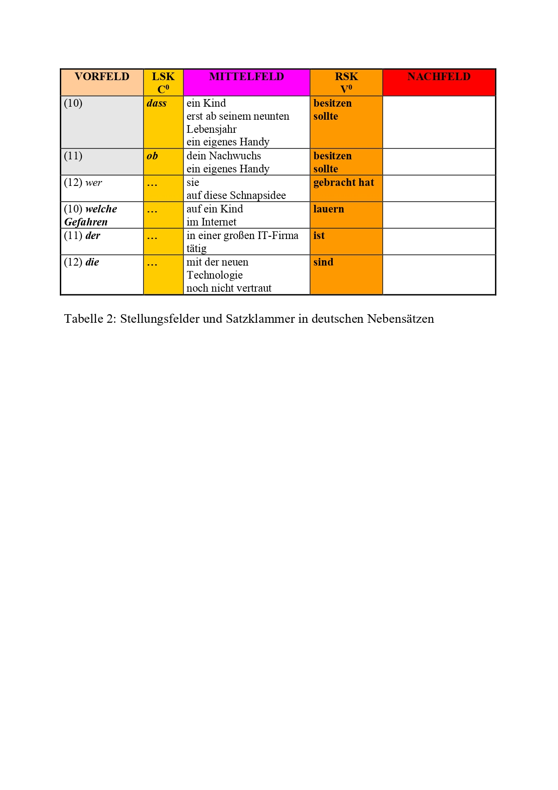

<!-- Tabelle 2: Stellungsfelder und Satzklammer in deutschen Nebensätzen -->


<!-- Tabelle 3: Satzklitika und Satzklammer in deutschen Sätzen -->

**Anmerkungen zu Tabelle 1, 2 und 3:**

-   **Die finite Verbform in deutschen Hauptsätzen** besetzt die **zweite syntaktische Position** (die man mit C^0^, d.h. der Kopf-Position in der Komplementiererphrase CP im Rahmen der Rektions-und Bindungstheorie, gleichsetzen kann).\
-   **Hauptsätze**: Während das Vorfeld in Aussagesätzen und Ergänzungsfragesätzen von einer Phrase gefüllt wird, bleibt das **Vorfeld in Entscheidungsfragesätzen** (Ja-/Nein-Fragen) unbesetzt (weil das finite Verb die erste sichtbare oder hörbare Wortform ist, spricht man oft von **V-1-Stellung**). Auch **Imperativsätze** und **uneingeleitete Wunschsätze** gehören zu den Sätzen mit V-1-Stellung, zuweilen auch Exklamativsätze ("Ausrufesätze").\
-   **In Nebensätzen** (abhängigen Sätzen mit einem Subjunktor, Interrogativpronomen, Interrogativadverb oder Relativpronomen als Einleitungselement) besetzt die finite Verbform hingegen den Knoten V^0^, d.h. die angenommene zugrunde liegende Verbposition in der Verbalphrase (weil das finite Verb in Nebensätzen oft als letzte hörbare oder sichtbare Wortform auftritt, spricht man oberflächensyntaktisch oft von **V-Letzt-Stellung**).\
-   **Einleitungselemente** von Nebensätzen **verhindern die Zweitstellung** der finiten Verbform. Gemäß der Rektions- und Bindungstheorie stehen **Subjunktoren** wie z.B. *dass*, *ob, nachdem, wenn* (Einleitungselemente, aber keine Satzglieder) selbst im Knoten C^0^ und lassen daher kein finites Verb zu.  **W-/d-Phrasen** wie z.B.*was, wann, warum, was für ein; der, die, das*  (gleichzeitig Einleitungselemente und Satzglieder) sind maximale Phrasen (sie beziehen sich auf Nominalphrasen oder Präpositionalphrasen und können eine solche Struktur aufweisen) und treten daher im Vorfeld des Satzes auf, d.h. in der Spezifizierposition der Komplementiererphrase. Sie stellen eine syntaktische Beziehung zum Kopf der Komplementiererphrase C^0^ her, die die Zweitstellung des finiten Verbs verhindert, wenn der Satz mit w-/d-Phrase als Einleitungselement ein abhängiger Satz ist (eine Lösung im Rahmen der Rektions- und Bindungstheorie: der Knoten C^0^ ist nicht wirklich leer, sondern wird aufgrund einer speziellen Art von Kongruenz zwischen der Position C^0^ und der w-/d-Phrase, die in der Spezifiziererposition im Vorfeld steht, von einem nicht hör- oder sichtbaren Merkmal [+C] freigehalten, der zum lexikalischen Eintrag des Einleitungselementes gehört und Verb-Letzt-Stellung auslöst oder nicht; Subjunktoren haben den lexikalischen Eintrag [+C], w-/d-Phrasen haben den lexikalischen Eintrag [+/-C], d.h. wenn ein Satz mit w-/d-Phrase als Einleitungselement in einen anderen Satz eingebettet und von einem Verb im Obersatz regiert wird, weiß ein deutscher Muttersprachler, dass der abhängige Satz mit Verb-Letzt-Stellung realisierbar ist).\
-   Die finiten Verbformen können **je nach Satztyp** (Hauptsatz oder Nebensatz) entweder nur an einer **syntaktischen Position** oder sogar an zwei verschiedenen syntaktischen Positionen auftreten können: in Hauptsätzen treten die Teile der Verbalphrasen **diskontinuierlich** auf (eine im Sprachenvergleich markiertere Option), in Nebensätzen hingegen in **Kontaktposition** (eine im Sprachenvergleich weniger markierte Möglichkeit). Hauptsätze zeigen eine **komplexere Satzstruktur** als die von der Funktion her spezialisierteren Nebensätze.\
-   Das **Nachfeld** eines deutschen Satzes steht im Gegensatz zu Vor- und Mittelfeld meist leer und kann lediglich nach besonderen Regularitäten von bestimmten (in der Regel formal komplexeren) Satzkonstituenten besetzt werden (in der germanistischen Literatur spricht man oft von **Ausklammerung oder Ausrahmung**).

Vgl. auch [@abraham1995deutsche]

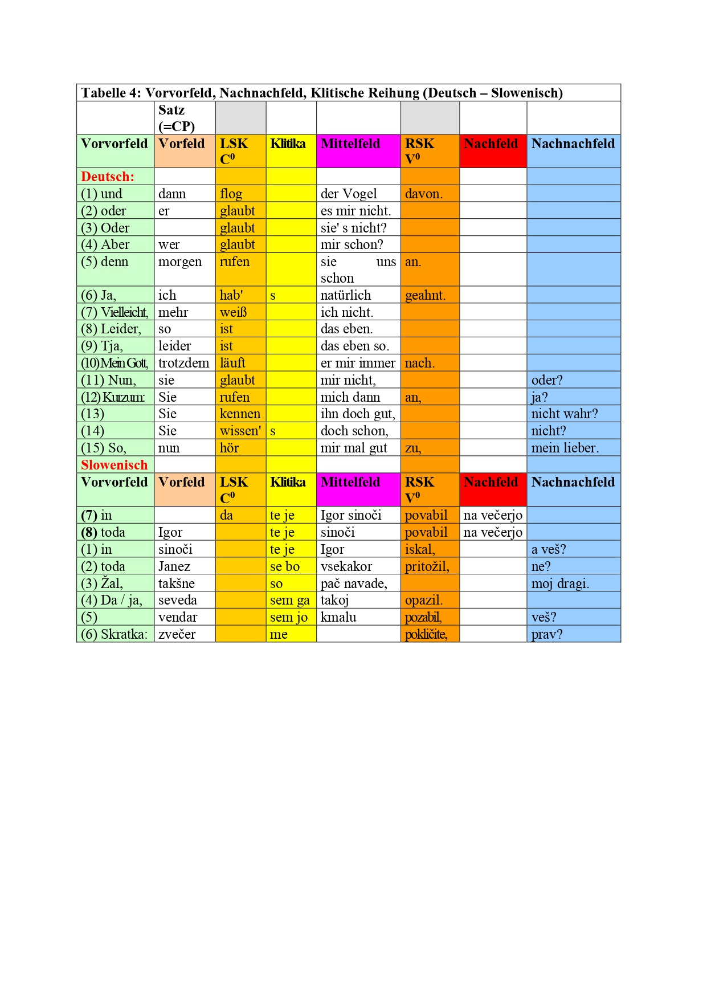

<!-- Tabelle 4: Vorvorfeld, Nachnachfeld, Klitische Reihung (Deutsch -- Slowenisch) -->

**Anmerkungen zur Tabelle 4:**

-   Vorvorfeld und Nachnachfeld **gehören nicht zum Satz**(verband) selbst, sondern sind locker damit verbunden: eigener Intonationsbogen, Pause nach Vorvorfeldelement möglich, in der Interpunktion durch Doppelpunkt oder Komma gekennzeichnet; keine Satzglieder im Satz, sondern eher Satzäquivalente. Auch nach den koordinierenden Konjunktionen kann eine Pause auftreten (die in der Schrift gewöhnlich durch einen Doppelpunkt markiert wird).\
-   Als **Elemente im Vorvorfeld deutscher Sätze** erscheinen: koordinierende Konjunktionen (Junktoren), Interjektionen, Satzadverbien (Modalwörter) bzw. Satzadverbiale, Gliederungspartikeln (Antwortpartikeln). Entsprechendes gilt für slowenische Sätze.\
-   Als **Elemente im Nachnachfeld deutscher Sätze** erscheinen: Gliederungspartikeln, NPs (Adressat), Negationspartikeln u.a. Entsprechendes gilt für slowenische Sätze.


<!-- Tabelle 5: Erweiterung der STELLUNGSFELDER IN SLOWENISCHEN SÄTZEN -->

**Anmerkungen zur Tabelle 5:**

Nach den Vorgaben der Rektions- und Bindungstheorie (vgl. [@cook1996mark] und [@haftka2019deutsch]) ergibt sich ein differenzierteres Bild der Stellungsfelder in slowenischen Sätzen (Tabelle 2), deren Besonderheiten man im Vergleich zu den Stellungsfeldern in deutschen Sätzen folgendermaßen beschreiben kann:\
- Die syntaktische **Position eine slowenischen Verbs** im Satz scheint **von seiner Form abhängig** zu sein: die klitisierten Formen des Auxiliarverbs *biti* (dt. "sein") erscheinen in der klitischen Reihung unmittelbar nach der Position C^0^, Vollverben vor allem in den tieferen Positionen V^0^ und I^0^, die Imperativformen möglicherweise auch vor der klitischen Reihung im Knoten C^0^ (d.h. dort, wo deutsche finite Verbformen erscheinen).\
- Ein slowenischer Aussagesatz wird durch die klitische Reihung[[1]](#_ftn1) sowie durch Verbformen in I^0^ und V^0^ in **vier Stellungsfelder** geteilt, die wir als Vorfeld, linkes (thematisches) Mittelfeld, rechtes (rhematisches) Mittelfeld und Nachfeld bezeichnen.
Während ein deutscher Aussagesatz immer ein langes Mittelfeld aufweist (d.h. nicht durch eine finite Verbform zerlegt wird), kann ein slowenischer über ein langes Mittelfeld (bei diskontinuierlicher Position der Verbformen in der klitischen Reihung und in V^0^) oder ein kurzes Mittelfeld (bei diskontinuierlicher Position der Verbfomen in I^0^ und V^0^) verfügen.\
- Während in deutschen Sätzen das Nachfeld oft leer ist, kommt es in slowenischen Sätzen häufiger vor, dass das (linke oder rechte) **Mittelfeld leer** ist und **stattdessen das Nachfeld** mit einem oder mehreren rhematischen Satzgliedern **besetzt** ist.\
- **Negationswörter** wie *ne* und seine flektierten Fomen sowie **Partikeln mit abtönender Bedeutung** (z.B. *pač,* dt. "halt", "eben", "doch") bilden die Grenze zwischen dem linken (thematischen) und dem rechten (rhematischen) Mittelfeld und somit auch die Grenze zwischen Thema und Rhema.
Entsprechendes gilt auch für die deutsche Negationspartikel *nicht* und die deutschen Abtönungspartikeln (z.B. *halt, eben, doch, ja*).\
- Das im heutigen Standardslowenischen **unflektierte Lexem** *bi* (dt. "würde") scheint in negierten Sätzen sowohl in der klitischen Reihung unmittelbar nach dem Knoten C^0^ als auch als Klitikon vor der syntaktischen Position I^0^ auftreten zu können, und zwar unmittelbar vor der Satznegation *ne* (dt. "nicht").
In affirmativen slowenischen Sätzen erscheint das unflektierte Lexem *bi* in der klitischen Reihung unmittelbar nach dem Knoten C^0^.

------------------------------------------------------------------------

[[1]](#_ftnref1)  In der klitischen Reihung in einem slowenischen Satz erscheinen die klitisierten Formen des Auxiliarverbs *biti* (dt. "sein"),  das klitisierte  Reflexivpronomen *se* (dt. "sich"), die klitisierten Personalpronomina im Genitiv, Dativ und Akkusativ (z.B. *mu, ga, jim*, dt. "ihm", "ihn", "ihnen") und unflektierte Lexeme (z.B. *bi*, dt. "würde"; *naj*, dt. "soll").

## Komplexe satzförmige Äußerungen

Komplexe satzförmige Äußerungen (in vielen Grammatiken oft als „zusammengesetzte Sätze" bezeichnet) entstehen durch die Zusammenfügung mehrerer Grundstrukturen zu einer komplexen Einheit.
Die Zusammenfügung erfolgt durch *koordinative* oder *subordinative* Verbindung.

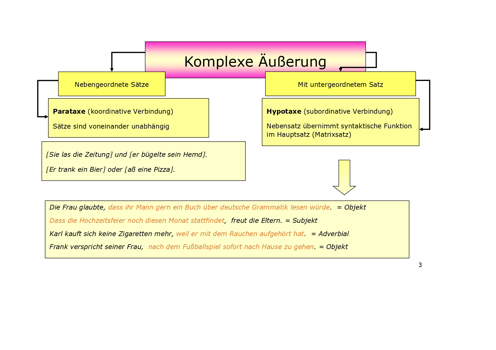

In den folgenden Abschnitten werden zuerst die **Satzverbindungen** (koordinative Verbindungen von Sätzen) gemäß der Klassifizierung von [@helbig2001deutsche] beschrieben, in darauf folgenden Abschnitten die **Satzgefüge** (subordinative oder subordinierende Verbindungen von Sätzen).

### Koordinative Verbindung

Wird das Prinzip der koordinativen Verbindung auf zwei oder mehrere Hauptsätze angewandt, so entsteht eine **Satzverbindung (auch: Satzreihe** genannt).
Das Prinzip der koordinativen Verbindung (Nebenordnung) tritt jedoch auch bei Nebensätzen (NS) und Satzgliedern (SG) auf.

#### Formen der Koordination

Die beiden Teile der Satzverbindung können *asyndetisch* oder *syndetisch* verknüpft sein.

##### Asyndetische Konstruktion

Bei der asyndetischen Konstruktion fehlt ein formales Verknüpfungszeichen (Konjunktion, Konjunktionaladverb) zwischen den beiden Teilen der Satzverbindung.
Trotzdem wird der enge Zusammenhang der beiden Sätze durch die Semantik und durch die Intonation deutlich.
Der erste Satz der asyndetischen Konstruktion hat progrediente Intonation.

(1) Die Lesefähigkeit wird entwickelt, die Sprachbeherrschung wird verbessert. (. . . . - . .)
(2) Sei pünktlich , der Zug wartet nicht!

##### Syndetische Konstruktion

Bei der syndetischen Konstruktion sind die beiden Teile der Satzverbindung durch ein **formales Verknüpfungszeichen (einen Konnektor)** verbunden,und zwar (a) durch einen **(Kon)junktor** oder (b) durch ein Konjunktionaladverb.
Die Konnektoren leiten den zweiten Satz ein.
Im Gegensatz zu den Junktoren sind die **Konjunktionaladverbien** wie Adverbien und andere Satzkonstituenten selbständig im Satz verschiebbar.

(3) Peter studiert in Leipzig, ~VVF~ aber ~VF~ seine Schwester (aber) ~LSK~ studiert ~MF~ in Berlin.
(4) Peter studiert in Leipzig, ~VF~ dagegen ~LSK~ studiert ~MF~ seine Schwester in Berlin.
(5) Peter studiert in Leipzig, ~VF~ seine Schwester ~LSK~ studiert ~MF~ dagegen in Berlin.

#### Inhaltliche Beziehungen der Koordination

Die **koordinative Verknüpfung** mehrerer Sätze in einer Äußerung (in vielen Grammatiken ist oft von „Teilsätzen" eines „Satzes" oder „Ganzsatzes" die Rede) ist nicht nur eine Funktion der Konjunktionen, sondern das Resultat des **Zusammenwirkens mehrerer Faktoren**:\
- der *semantischen* Bedeutung der koordinierten Sätze (Konjunkte),\
- der *logischen* Beziehungen der Konjunktbedeutungen und\
- der operativen *Bedeutungen oder Konjunktionen*.

Die koordinative Verknüpfung realisiert sich nicht nur durch die aktuelle oder latente Anwesenheit von Konjunktionen, sondern auch durch bestimmte Beziehungen der Konjunkte.
Dadurch werden mehrere Arten der Satzverbindung unterscheidbar.
[@helbig2001deutsche] unterscheiden die unten folgenden **semantischen Arten von Satzverbindungen**.

##### Kopulative Satzverbindung (+)

Die beiden Hauptsätze werden nur aneinandergereiht, ohne dass eine logische Verbindung zwischen ihnen hergestellt wird.
Das kopulative (oder **additive**) Verhältnis wird hergestellt durch:\
(a) **Konjunktoren** (*und, sowohl....als auch, weder.... noch, nicht nur..... sondern auch*),\
(b) **Konjunktionaladverbien** (*auch, außerdem, ferner, zudem, überdies, ebenso, ebenfalls, gleichfalls*) oder\
(c) **asyndetisch**.

(6) Der Ingenieur war viel im Ausland, *und* er lernte die Lebensbedingungen in fremden Ländern kennen.\
(7) Der Ingenieur war viel im Ausland, er lernte die Lebensbedingungen in fremden Ländern kennen.

##### Disjunktive Satzverbindung (+/-)

Durch den Sachverhalt des zweiten Hauptsatzes wird der Sachverhalt des ersten Hauptsatzes ausgeschlossen.
Im Unterschied zur kopulativen Satzverbindung gelten nicht die beiden Konjunkte zugleich, sondern es werden 2 Alternativen ausgedrückt, zwischen denen eine Wahl erfolgen muss.
Das **disjunktive (alternative)** Verhältnis wird hergestellt durch:\
(a) **Konjunktoren** (*oder, entweder... oder*) oder (b) **Konjunktionaladverbien** (*sonst, andernfalls*).

(8) Er ist *entweder* schon zur Arbeit gegangen, *oder* er ist noch zu Hause.\
(9) Er muß dringend zum Zahnarzt gehen, *sonst* werden seine Zahnschmerzen noch schlimmer.

##### Adversative Satzverbindung

Wie bei der kopulativen Satzverbindung gelten beide Sachverhalte; aber im Unterschied zu dieser wird der Sachverhalt des zweiten Hauptsatzes dem Sachverhalt des ersten Hauptsatzes entgegengesetzt.
Das **adversative Verhältnis** wird hergestellt durch:\
(a) **Konjunktoren** (*aber, doch, jedoch, sondern*),\
(b) **Konjunktionaladverbien** (*dagegen, hingegen, indessen, vielmehr*) oder\
(c) **asyndetisch**.

(10) Er beherrscht die Theorie seines Faches, *aber* er hat noch wenig praktische Erfahrung.\
(11) Maria hat die Prüfung bestanden, *aber* ihr Freund hat sie nicht bestanden.\
(12) Einsichten sind gut, Veränderungen sind besser.\
(13) Vertrauen ist gut, Kontrolle ist besser.

##### Restriktive Satzverbindung

Die restriktive Satzverbindung ähnelt der adversativen (s.o.), der zweite Hauptsatz schränkt den Sachverhalt des ersten Hauptsatzes jedoch ein.
Das restriktive Verhältnis wird hergestellt durch:\
(a) **Konjunktoren** (*aber, doch, allein, jedoch*) oder\
(b) **Konjunktionaladverbien** (*freilich, zwar... (aber), wohl... (aber), nur, indessen*).

(14) Maria hat die Prüfung bestanden, *aber* sie hat eine schlechte Note bekommen.\
(15) Er hat Thüringen mehrmals besucht; *jedoch* in Eisenach ist er noch nicht gewesen.\
(16) Er hat zwar Thüringen mehrmals besucht, *aber* in Eisenach ist er noch nicht gewesen.

##### Kausale Satzverbindung

Der zweite Hauptsatz enthält den **Grund** für den Sachverhalt des ersten Hauptsatzes oder eine **Rechtfertigung** für den Sachverhalt im ersten Hauptsatz.
Das kausale Verhältnis wird hergestellt durch:\
(a) **Konjunktoren** (*denn*),\
(b) **Konjunktionaladverb** (*nämlich*) oder\
(c) **asyndetisch**.

(17) Er konnte das Problem nicht lösen, *denn* ihm fehlte die Sachkenntnis.\
(18) Er kannte das Mädchen ziemlich gut, er begegnete ihr *nämlich* fast jeden Tag im Aufzug.\
(19) Die Studenten müssen fleißig lernen; nur durch gute Kenntnisse können sie später ihre Anforderungen im Beruf erfüllen.

Der **Konjunktor** *denn* und der **Subjunktor** *weil* sind sich semantisch ähnlich, unterscheiden sich jedoch hinsichtlich ihrer syntaktischen Position: *denn* steht im Vorvorfeld (VVF), *weil* besetzt die linke Satzklammer (LSK) und löst somit die V-Letzt-Stellung (RSK) des finiten Verbs aus.

In der **Umgangssprache** werden *weil-*Sätze zunehmend mit finitem Verb in LSK-Stellung (V-2-Stellung) und potentieller Sprechpause nach der Konjunktion verwendet (durch Doppelpunkt markierbar).

Allerdings geben *weil*-Sätze mit V-2-Stellung (LSK) gewöhnlich keine Ursache für den Sachverhalt im Hauptsatz an, sondern eher wie *denn*-Sätze eine **Rechtfertigung** oder eine dem Sprecher **plausibel** erscheinende Erklärung für den Sachverhalt im Hauptsatz.

Die Stellung des finiten Verbs (LSK oder RSK) scheint somit ein syntaktisches Zeichen für die unterschiedlichen Bedeutungen von *weil*-Sätzen zu sein: wird eine **Ursache** angegeben, tendiert man eher zur V-Letzt-Stellung des finiten Verbs (RSK), wird dagegen ein kausaler Inhalt wie in *denn*-Sätzen ausgedrückt, tendiert man in der Umgangssprache eher zur V-2-Stellung der finiten Verbform (LSK).

##### Konsekutive Satzverbindung

Der zweite Hauptsatz gibt die Folge des im ersten Hauptsatz genannten Sachverhaltes an.
Das konsekutive Verhältnis wird durch:\
(a) **Konjunktionaladverbien** ausgedrückt (also, folglich, daher, darum. demnach, deshalb, deswegen, mithin, somit, infolgedessen) oder\
(b) bleibt formal unbezeichnet (**asyndetisch**).

(20) Dem Schüler fehlte die Sachkenntnis, *deshalb* konnte er das Problem nicht lösen.\
(21) Der Schüler konnte das Problem nicht lösen, ihm fehlte die Sachkenntnis.

Neben konsekutiven Satzverbindungen gibt es auch konsekutive Nebensätze.
**Konsekutive Nebensätze** werden gewöhnlich durch den Subjunktor *so dass* eingeleitet (was V-Letzt-Stellung des finiten Verbs auslöst).

Von einem Hauptsatz, eingeleitet durch ein Konjunktionaladverb, unterscheidet sich ein konsekutiver Nebensatz durch seine syntaktische (und intonatorische) **Unselbständigkeit**: ein konsekutiver Hauptsatz kann ohne Folgen für die grammatische Richtigkeit des Satzes isoliert verwendet werden, ein konsekutiver Nebensatz dagegen nicht.

Ein weiterer Unterschied ist die **Nicht-Verschiebbarkeit** des konsekutiven Nebensatzes: asyndetisch verknüpfte konsekutive Satzverbindungen erlauben es, die Reihenfolge der Hauptsätze zu verändern, konsekutive Nebensätze müssen dagegen dem Hauptsatz folgen.

Konsekutive Nebensätze erweisen sich aufgrund der Ersatzprobe als **Satzglieder** (durch den Subjunktor *so dass* eingeleitete) oder **Attribut** (z.B. wenn der Subjunktor *dass* sich auf ein Bezugselement im übergeordneten Satz bezieht, meist auf das unflektierbare Adverb *so*).

(22) Dem Jungen fehlte die Mutter so sehr, dass er aus dem Feriencamp ausriss.

##### Konzessive Satzverbindung

Der zweite Hauptsatz gibt eine Folge an, die im Gegensatz zu der im ersten Hauptsatz genannten Voraussetzung steht: **unerwartete Folge oder Konsequenz**.
Deshalb schließt das konzessive Verhältnis ein kausales Verhältnis (von Grund und Folge) und ein adversatives Verhältnis (den Gegensatz zwischen Grund und Folge) ein.
Die konzessive Satzverbindung wird signalisiert durch:\
(a) **Konjunktionaladverbien** (*trotzdem, gleichwohl, nichtsdestoweniger, dessenungeachtet*),\
(b) **zweiteilig** durch das **Konjunktionaladverb** *zwar* im Mittelfeld des 1.
HS und den **Konjunktor** *aber* im Vorvorfeld des 2.
HS, oder\
(c) **zweiteilig** durch den Konjunktor *aber* im Vorvorfeld des 2.
HS und fakultatives **Konjunktionaladverb** *trotzdem* im Mittelfeld des 2.HS:

(23) Es regnete in Strömen; *trotzdem* gingen wir spazieren.\
(24) Es regnete *zwar* in Strömen, *aber* wir gingen (*trotzdem*) spazieren.\
(25) Ich habe ihn zu meiner Geburtstags-Party eingeladen, *aber* er ist *dennoch* nicht gekommen.

Im Deutschen gibt es relativ viele Möglichkeiten, ein konzessives Verhältnis auszudrücken: die Ausdrucksmöglichkeiten reichen von Konjunktionaladverbien über Präpositionalphrasen bis zu Haupt-, Neben- und Infinitivsätzen sowie Partizipialkonstruktionen.

#### Position der Konnektoren

##### Grundfolge nach Junktor

Die Junktoren (Konjunktoren) *und, aber, denn, oder, sondern* stehen im Vorvorfeld (VVF).
Sie sind nämlich keine Satzglieder (Kriterien: nicht verschiebbar, nur eingeschränkt ersetzbar) und besetzen keine syntaktische Position im Satz, sondern eine Position vor einem Satz.

Nach dem Junktor im VVF folgt in einem Aussagesatz irgendein Satzglied (Subjekt, Objekt oder Adverbialbestimmung) in der Vorfeld-Position („1. Stelle im Satz") und das konjugierte Verb (finite Verbform: $V_{fin}$) in der linken Satzklammer (LSK oder Kopf $C^0$ der Komplementiererphrase, der „2. Stelle im Satz").


##### Positionen nach Junktor bei Umstellung

Nach *und, aber, oder, denn, sondern* kann, wie in jedem konstativen Hauptsatz (Aussagesatz), auch eine Umstellung erfolgen: statt des Subjekts steht ein anderes Satzglied im Vorfeld (1), darauf folgt das konjugierte Verb (= $V_{fin}$) in LSK (2) und dann erst das Subjekt (in der Form eines Substantivs oder Pronomens) im Mittelfeld meist die erste Position des Mittelfeldes).


##### Positionen nach Junktor (Umstellung bei Pronomen)

Wenn ein unbetontes (thematisches) Pronomen im Hauptsatz vorkommt, steht es gewöhnlich direkt hinter dem konjugierten Verb (= $V_{fin}$).
Das Subjekt oder ein anderes Satzglied erscheint dann erst in der darauf folgenden Position im Mittelfeld (4).


##### Auslassung des Subjekts nach und in zusammengezogenen Sätzen

1.  Wenn zwei Hauptsätze das gleiche Subjekt haben und mit und verbunden sind, dann ist es stilistisch besser, das Subjekt nach und wegzulassen. Es entsteht ein Hauptsatz mit zwei Satzaussagen, und das Komma fällt weg. Nach [@helbig2001deutsche] handelt es sich allerdings in solchen Fällen um einen zusammengezogenen Satz mit zwei Teilsätzen (Hauptsätzen), von denen einer aufgrund der Auslassung des Subjekts unvollständig ist. Das Kriterium ist der Grad der Unterschiedlichkeit der beiden Teilsätze: unterscheiden sich (wie oben beispielsweise) zwei von drei Satzgliedern, gehen sie von zwei Hauptsätzen aus, unterscheiden sich zwei Teilsätze jedoch nur durch ein Satzglied, wird lediglich ein Hauptsatz angesetzt.

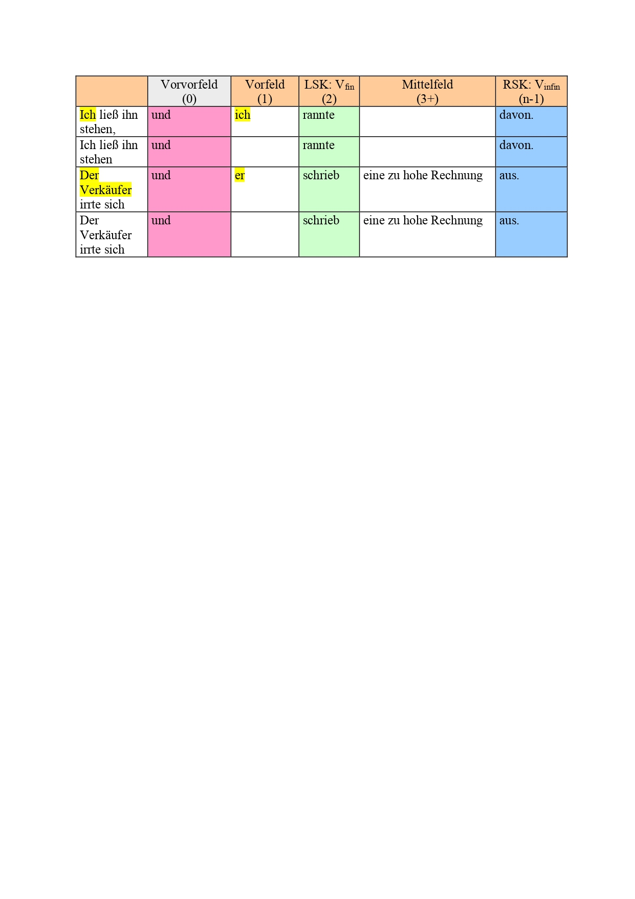

2.  Man kann auch mehrere Satzaussagen reihen. Wenn das Subjekt gleich ist, wird es nicht wiederholt:

<!-- -->

(26) Er kam nach Hause, sagte kein Wort, holte eine Flasche Bier aus dem Kühlschrank und setzte sich vor den Fernsehapparat.

<!-- -->

3.  Wenn das Subjekt nach *und* nicht in der Vorfeld-Position (1. Stelle) steht, also bei einer Abweichung von der Grundfolge, muss es wiederholt werden (in den folgenden Beispielen im Mittelfeld, Position 3):


Ein Satzglied im Vorfeld des zweiten Hauptsatzes (Position 1) verhindert somit, dass das finite Verb im zweiten Hauptsatz (Position 2) mit dem gleichen Subjekt wie im ersten Hauptsatz verbunden wird.
Steht das Vorfeld (Position 1) hingegen leer, kann sie koindiziert werden (d.h. im Vorfeld tritt ein Nullelement *e* mit demselben Index *i* wie das Subjekt im ersten Hauptsatz auf, was soviel bedeutet wie Bezug auf die gleiche Person oder Sache).


Die Position nach dem finiten Verb (d.h. die erste Position im Mittelfeld, Position 3) darf in solchen Sätzen von einem weiteren Satzglied (beispielsweise einer Adverbialbestimmung) besetzt werden, jedoch nicht von einem Subjekt.
Letzterer Fehler wird gelegentlich von slowenischen Deutschlernern begangen, die die "Inversionsregel" (finites Verb vor Subjekt) in bestimmten Satztypen bereits erlernt haben.


Man kann daher davon ausgehen, dass beide Positionen (Vorfeld = Position 1 und Anfang des Mittelfeldes = Position 3) zwar mit dem Subjekt im ersten Hauptsatz koindiziert werden können (d. h. auf die gleiche Person oder Sache bezogen werden können).
Die Relation der Koindizierung kann man sich auch als "Kopiervorgang" vorstellen, nämlich als Kopieren des Indices i von einer entsprechenden Position im ersten Hauptsatz (in diesem steht das Subjekt nämlich ebenfalls in Position 1 bzw. Position 3) in die Position 1 und Position 3 im zweiten Hauptsatz (der Kopiervorgang wird in der folgenden Tabelle durch Pfeile angedeutet).
Der Konjunktor und ist für "Kopiervorgänge" durchlässig (d.h. er blockiert sie nicht).

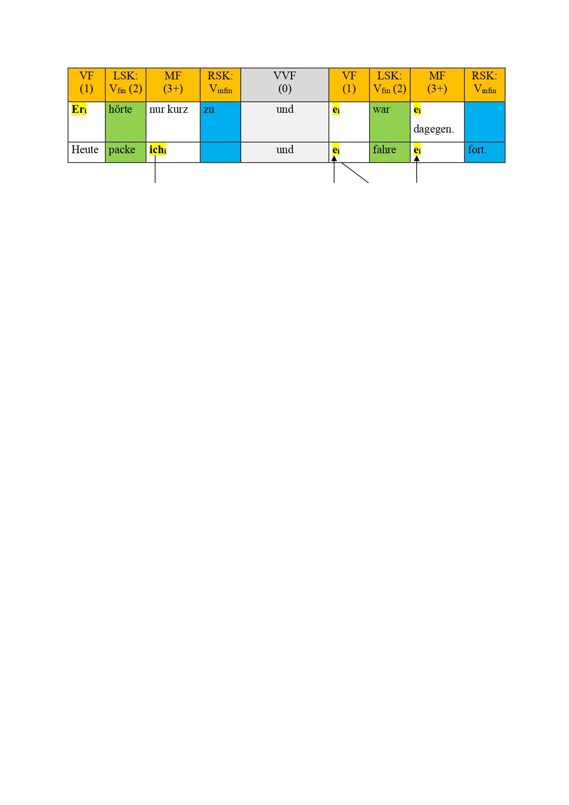

4.  Nach *aber* muss man das Subjekt (fast obligatorisch) wiederholen, nach *oder, sondern* kann oder sollte man das Subjekt wiederholen, auch wenn es gleich ist:

<!-- -->

(27) Er verlor sein Vermögen, *aber* er war nicht unglücklich.\
(28) Entweder fehlt sie ihm, *oder* (sie) lässt ihn in Ruhe.\
(29) Sie beklagten sich nicht, *sondern* sie begannen von vorn.

Folgt der Junktor *aber* dem finiten Verb, muss man das Subjekt allerdings auslassen.

(30) Er verlor sein Vermögen, war *aber* nicht unglücklich.

Die adversativen Junktoren unterscheiden sich somit von dem kopulativen Junktor *und* hinsichtlich ihrer Anforderungen für die Besetzung der Subjektstelle: Sätze, die durch adversative Junktoren verbunden sind, sind syntaktisch gesehen selbständiger oder weniger integriert, während durch *und* verbundene Sätze sich aufgrund ihres additiven Verhältnisses eher syntaktisch zusammenfassen und verkürzen lassen.

5.  Nach dem Konjunktor *denn* muss das Subjekt in jedem Fall stehen:

<!-- -->

(31) Er ist nicht mehr ausgegangen, *denn* er war müde.

##### Junktor *aber*

Der Junktor *aber* verbindet semantisch *gegensätzliche* Satzglieder oder Sätze.
Die Verbindungen *aber erst*, \*aber doch\*\* können auch eine *Einschränkung* ausdrücken:

(32) Er bot mir Kekse und Schokolade an, *aber* keinen Kaffe.\
(33) Sie kamen endlich an, *aber erst* nach langem Suchen.\
(34) Gewiß, er hat sein Ziel erreicht, *aber doch* nicht ohne unsere Hilfe.

Der Junktor *aber* muss nicht vor dem Satz (= Vorvorfeld, Null-Position) stehen, sondern kann wie ein **Enklitikon** (d. h. ein unbetonbares Satzelement) einem betonten Satzelement folgen, beispielsweise dem ersten Satzglied oder dem finiten Verb) oder wie andere thematische Elemente im linken Teil des Mittelfeldes verwendet werden.

In den folgenden Beispielen sehen wir den Junktor *aber* als Enklitikon angehängt an ein betonbares Vorfeld- oder Mittelfeldelement -- an das thematische Lokaladverb *hier*, das in den Beispielen in Vorfeld- und Mittelfeldstellung vorkommt und kontrastbetont ist; die Satznegation ist Teil des Rhemas - der neuen oder wichtigen Information).


##### Junktoren *allein, doch, jedoch*

Im gleichen Sinn wie *aber* werden *allein, doch*, und *jedoch* gebraucht.
Dabei steht *allein* immer im Vorvorfeld (Position Null), *doch* und *jedoch* können hingegen sowohl im Vorvorfeld als auch im Vorfeld auftreten:

(35) Er versuchte, den Gipfel des Berges zu erreichen, *allein* er schaffte es nicht.\
(36) Er beeilte sich sehr, *doch* er kam trotzdem zu spät.\
(37) Er beeilte sich sehr, *doch* kam er trotzdem zu spät.\
(38) Er wollte gern Maler werden, *jedoch* er hatte zu wenig Talent.\
(39) Er wollte gern Maler werden, *jedoch* hatte er zu wenig Talent.

##### Junktoren *oder, entweder ... oder*

Der Junktor *oder* verbindet *alternative* Satzglieder oder Sätze.
Zur *Hervorhebung* einer Alternative verwendet man die zweiteilige koordinierende Konjunktion *entweder ... oder*.
Beide Konjunktionen können sowohl Satzglieder, Teile von Satzgliedern oder ganze Sätze verbinden.
Der erste Teil des zweiteiligen Junktors *entweder* kann im Vorfeld oder im Mittelfeld erscheinen, während der zweite Teil *oder* obligatorisch am Anfang des zweiten Konjunkts (d.h. im Vorvorfeld des zweiten HS) steht.
Außerdem kann *entweder* (wie einige der zuvor besprochenen Junktoren) im Vorvorfeld oder im Vorfeld stehen.

(40) Du bringst ihr *entweder* Blumen mit *oder* Süßigkeiten.\
(41) *Entweder* ist er wirklich krank, *oder* er tut nur so.

##### Konjunktionaladverbien

Während die Junktoren im Vorvorfeld (Null-Position), stehen andere koordinative Konnektoren im Vorfeld (Position 1) oder sogar im Mittlfeld.
Diese Eigenschaft ist charakteristisch für Satzglieder.
Konnektoren in Vorfeldposition werden aufgrund ihrer syntaktischen Eigenschaften auch **Konjunktionaladverbien** genannt.
Sie leiten einen Hauptsatz ein und geben dessen Sinnrichtung an.

Konjunktionaladverbien im Vorfeld (a) und bei Umstellung (b):

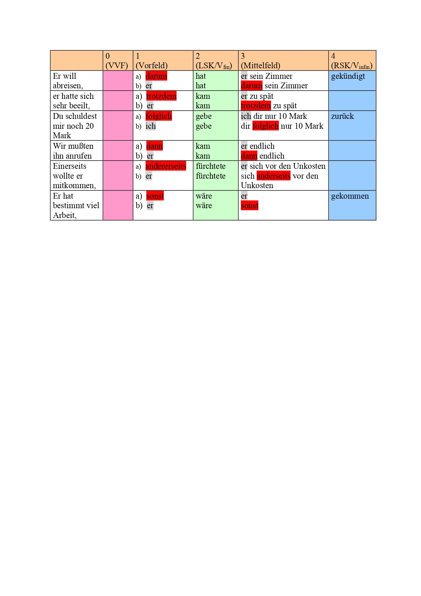

Zu a) Die Konjunktionaladverbien stehen meistens zwischen den Sätzen in Vorfeldposition, dann folgt das konjugierte Verb in der LSK (Position 2) und ein Satzglied im Mittelfeld -- in den Beispielen das Subjekt.

Zu b) Die meisten Konjunktionaladverbien iVorfeld können nach den Regeln der Umstellung auch im Mittelfeld stehen, und zwar auch nach unbetontem (thematischem) Pronomen.

### Subordinative Verbindung

In einer subordinativen Verbindung werden zumindest zwei Sätze miteinander verknüpft, von denen einer dem anderen untergeordnet und daher unselbständig ist.
Den übergeordneten Satz nennt man in vielen Grammatiken *Hauptsatz* (HS), den untergeordneten dagegen *Nebensatz* (NS).
Diese Bezeichnungen sind manchmal irreführend, da ja die Hauptinformation, wichtigste oder neuer Information oft im Nebensatz steckt und daher eigentlich als Hauptsatz bezeichnet werden könnte.
Daher gibt es Grammatiken, in denen diese beide Ausdrücke durch andere ersetzt werden: z.B.
Hauptsatz durch *Matrixsatz* und Nebensatz durch *eingebetteter Satz, Konstituentensatz* oder funktionsspezifischere wie *Gliedsatz, Attributsatz*.
Trotz berechtigter Kritik behalten wir die traditionellen Begriffe *Hauptsatz* und *Nebensatz* aufgrund ihrer allgemeinen Bekanntheit in den meisten Abschnitten unserer grammatischen Beschreibungen bei.

#### Formen der Subordination

Unter *formalen* Gesichtspunkten sind sind zumindest sechs Typen von abhängigen bzw.
*untergeordneten* satzartigen Konstruktionen unterscheidbar:\
- Nebensätze mit V-Letzt-Stellung und Subjunktor als Einleitewort (Subjunktionalsätze),\
- Nebensätze mit V-Letzt-Stellung und Relativpronomen, Relativadverb, Interrogativpronomen oder Interrogativadverb in Doppelfunktion (Einleitewort + Satzglied), ("Pronominalnebensätze"),\
- uneingeleitete V-2-Sätze ("abhängige Hauptsätze"),\
- uneingeleitete V-1-Sätze,\
- satzwertige Infinitivkonstruktionen (mit oder ohne Einleitewort),\
- satzwertige Partizipialkonstruktionen.

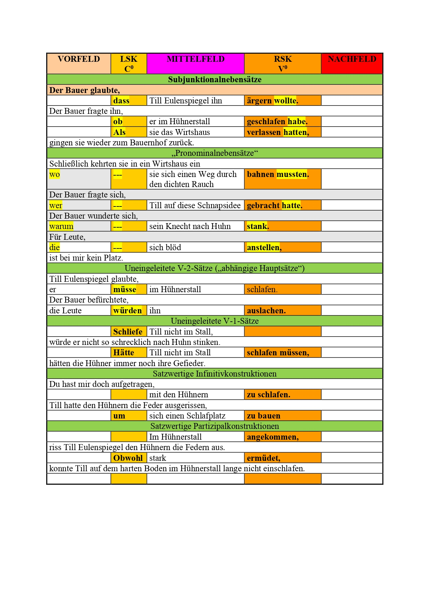

#### Syntaktische Funktionen der Nebensätze

Nebensätze treten in den folgenden syntaktischen Funktionen auf:\
- als Subjekt eines übergeordneten Satzes (*Subjektsatz*),\
- als Objekt eines übergeordneten Satzes (*Objektsatz*),\
- als Prädikativ eines übergeordneten Satzes (*Prädikativsatz*),\
- als Adverbialbestimmung eines übergeordneten Satzes (*Adverbialsatz*),\
- als Attribut eines Nomens, Pronomens oder Adverbs im übergeordneten Satz (*Attributsatz*).

(42) *Wer es glaubt*, wird selig. (Subjektsatz)\
(43) Der Bauer bemerkte, *dass Till nach Huhn stank*. (Objektsatz)\
(44) Der Bauer wartete darauf, *dass Till aufstand*. (Objektsatz)\
(45) Du magst dir Perücken aufsetzen und dich verstellen ... Du bleibst doch, *was du bist*. (Prädikativsatz)
(46) *Als sie das Wirtshaus verlassen hatten*, kehrten sie zum Bauernhof zurück. (Adverbialsatz)\
(47) Der Bauer, *den Till zum Narren gehalten hatte*, verjagte seinen Knecht vom Hof. (Attributsatz)

Die syntaktischen Funktionen werden im Rahmen der Ergänzungs- und Angabeklassen des Mannheimer Valenzmodells eingehender besprochen.


#### Inhaltliche Beziehungen der Subordination

Die Bedeutungsklassen von Subjekt-, Objekt- und Prädikativnebensätzen kann man im Rahmen eines semantisierten Valenzmodells oder der Kasustheorie eingehender besprechen.
Die Verbsemantik und die davon ausgehende Verbvalenz setzen die Rahmenbedingungen für das Auftreten von Bedeutungsklassen.
So ist das Subjekt (und damit auch ein *Subjektnebensatz*) bei *Handlungsverben* (z.B. *fahren, lernen, lesen, kaufen, operieren, verarbeiten*, ...) gewöhnlich mit der semantischen Rolle *Agens* (Verursacher einer Handlung) assoziiert, das *Akkusativobjekt* mit einem betroffenen oder erzeugten Gegensatand (dem *Patiens*).
Das Prädikativ dient als Einordnungsinstanz (*Subsumptiv*).
Zahlreiche Bedeutungsklassen werden gewöhnlich bei Adverbialbestimmungen unterschieden.
Eingehender wird die semantische Klassifizierung der Adverbialbestimmungen im Rahmen der Ergänzungs- und Angabeklassen besprochen.

Engel [@engel1996deutsche: 219] unterscheidet **vier Großklassen** von **Angaben**:    
• modifizierende (modifikative) verbbezogene Angaben ($A_{mod}$),\
• situierende (situative) satzbezogene Angaben ($A_{sit}$),\
• negative Angaben (Aneg),\
• existimatorische äußerungsbezogene Angaben ($A_{ex}$).

Modifizierende, situierende und existimatorische können satzförmig sein.

(48) Sie fuhr den Wagen, *als ob sie von hundert Polizisten verfolgt würde*. (Modifizierender Angabesatz)

Die situierenden Angaben lassen sich in zahlreiche semantische Klassen gliedern, die in den meisten Fällen auch satzförmig realsieirt sein können:\
• temporale ($A_{temp}$),\
• lokale und direktive ($A_{lok}$) und ($A_{dir}$),\
• kausale ($A_{kaus}$),\
• konditionale ($A_{kond}$),\
• konsekutive ($A_{kons}$),\
• konzessive ($A_{konz}$),\
• finale ($A_{fin}$),\
• instrumentale ($A_{inst}$),\
• restriktive ($A_{rest}$),\
• komitative ($A_{kom}$).

(49) *Als Till in den Hühnerstall ging*, fingen die Hühner an zu gackern. (temporaler Nebensatz)\
(50) *Wo heute diese Häuser stehen*, gab es früher mal einen Eichennwald. (Lokaler Nebensatz)\
(51) Till ging in den Hühnerstall, *weil der Bauer es ihm befohlen hatte*. (kausaler Nebensatz)\
(52) *Wenn sie ihre Bewerbung bis zum ersten dieses Monats vervollständigen*, haben Sie noch eine Chance auf das Stipendium. (Konditionaler Nebensatz)\
(53) Die Lehrerin rückte ihre Maske zurecht, *so dass ihre Nase bedeckt war*. (konsekutiver Nebensatz)\
(54) *Obwohl es in Strömen regnete*, ging er ohne Regenschirm weg. (konzessiver Nebensatz)\
(55) Till ging in den Hühnerstall, *um sich dort einen Schlafplatz zu suchen*. (finaler Nebensatz)\
(56) *Was seine sportlichen Leistungen anbelangt*, gehört er zur Spitzenklasse. (restriktiver Nebensatz)\
(57) Die drei Bandmitglieder nahmen schnell eine erste Version des neuen Songs auf, *ohne auf ihren Gitarristen zu warten*. (kommitativer Nebensatz)\
(58) *Wie sich leicht nachweisen lässt*, hat sie in allem recht. (existimatorischer - verifikativer Nebensatz)

Die syntaktischen Funktionen und semantischen Klassen werden im Rahmen des Valenzmodells eingehender besprochen.


#### Relativsätze

Nach [@engel1996deutsche: 292-295] sind Relativsätze nominale Angaben und haben ähnlich den Adjektiven die semantische Funktion, ein Nomen näher zu bestimmen (zu qualifizieren, klassifizieren usw.). Wie alle Attributsätze haben sie ihre reguläre Stelle hinter dem Nomen. Voranstellung ist in dichterischer oder rhetorisch ausschmückender Rede, ebenso bei ironischer Verwendung derselben Ausdrucksformen möglich. Die Voranstellung des Relativsatzes bewirkt die Hervorhebung des Attributsatzes, sind aber in der Standardsprache nicht üblich.

(56a)	Den Mann, der all dies durchgestanden hat, will ich mir zukommen lassen. (nachgest.)
(56b)	Der all dies durchgestanden hat, den Mann will ich mir kommen lassen. (vorangestellt)

Relativsätze können restriktiv oder nicht-restriktiv sein. **Restriktive** Relativsätze sind in der Regel obligatorisch, weil sie für das Verständnis des Satzes notwendig sind. Mit restriktiven Relativsätzen schränkt man ähnlich wie mit einigen Gradpartikeln (z.B. nur) den Bezug auf eine bestimmte Teilmenge von Objekten ein (57). 

(57)	Ein Junge hatte vier Großväter. Sein Freund wollte wissen, was sie von Beruf waren. 	Der Junge antwortete: 
(57a)	Derjenige Großvater, der Chemiker war, lebte in München. (r)
(57b)	Derjenige Großvater, der Bäcker war, lebte in Köln. (r)
(57c)	Derjenige Großvater, der Arzt war, lebte in Hamburg. (r)
(57d)	Derjenige Großvater, der Politiker war, lebte in Berlin. (r)

Von **nicht-restriktiven** Relativsätzen (58) spricht man, wenn lediglich ein Merkmal zum Bezugsnomen hinzugefügt wird. Wird ein nicht-restriktiver Relativsatz zu einem Nomen hinzugefügt oder weggelassen, verändert sich der Bezug auf die Anzahl der außersprachlichen Objekte nicht. In nicht-restriktiven Relativsätzen können Abtönungspartikeln (vor allem ja, doch, eben, halt, eigentlich), solche Partikeln wie übrigens, und Elemente wie wie du weißt und bekanntlich verwendet werden. Außerdem können nicht-restriktive Relativsätze durch Pause vom Bezugselement getrennt werden (intonatorisch größere Selbständigkeit). 

(58)	Ein Junge lebte in München. Dort lebte auch sein Großvater. Der Freund des Jungen 	wollte mehr über den Großvater erfahren. Der Junge erzählte:
Mein Großvater, der (übrigens) Chemiker war, war ein kluger Mann. Trotzdem lebte er in ständigen Geldsorgen. ... (n-r)

Nach [@eisenberg1994grundriss: 254] wird der Relativsatz in (1a) appositiv genannt, weil er - im Gegensatz zu dem in (1b) - keinen Einfluß auf die Extension der übergeordneten NGr (=NP) hat, Oberbürgermeister Eichel wird hinsichtlich des Begriffsumfanges vom Relativ¬satz nicht verändert. (Wort mit Hauptakzent durch Großbuchstaben gekennzeichnet)   

(1a) 	Oberbürgermeister EICHEL, der mit den Grünen koaliert, hat noch auf Jahre eine sichere Mehrheit.

(1b)	Ein OBERBÜRGERMEISTER, der mit den Grünen koaliert, hat noch auf Jahre eine sichere Mehrheit. 
(Mit Betonung auf ein ergäbe sich ein Zahlwort und ein n-r Relativsatz!)

Eisenberg [@eisenberg1994grundriss: 228-229] betrachtet das semantische Verhältnis von Relativsatz und Kernsubstantiv. »(8) und (9) zeigen, daß dieses Verhältnis in einem wichtigen Punkt uneinheitlich ist.

(8)	a. Die Pädagogik ist eine Disziplin, die der Menschheit immer Segen gebracht hat   
b. Diejenigen Bäume, die morsch sind, werden gefällt   
c. Jeder Linguist, der was auf sich hält, geht zweimal jährlich zum Friseur   

(9)	a. Seine Eltern, die wohlhabende Leute sind, ließen ihn verkommen 
b. Du, der du immer Glück gehabt hast, solltest dich da heraushalten 
c. Die Sonne, die jetzt eigentlich sieben Stunden täglich scheinen sollte, ist überhaupt nicht zu sehen 

Die Relativsätze in (8) werden restriktiv genannt, weil die NGr mit Relativsatz extensional eingeschränkt ist gegenüber der ohne Relativsatz. In (8c) etwa kann jeder Linguist sich auf jedes Element der Menge der Linguisten beziehen, jeder Linguist, der was auf sich hält aber nur auf jedes Element einer Teilmenge der Linguisten, denn nicht alle Linguisten halten etwas auf sich. 

Die Relativsätze in (9) werden nichtrestriktiv oder appositiv genannt,. weil der Relativsatz nichts an der Extension der NGr, in der er enthalten ist, ändert. Seine Eltern, die wohlhabende Leute sind in (9a) etwa bezieht sich auf dieselben Personen wie seine Eltern allein. 

Beide Arten von Relativsätzen geben uns eine »nähere Bestimmung« des modifizierten Nominals. Bei den restriktiven betrifft diese Bestimmung aber den Umfang der bezeichneten Klasse, bei den nichtrestriktiven nicht. Erstere tragen zur Identifizierung des Bezeichneten bei, letztere nicht.

Viele Relativsätze können in Isolierung sowohl restriktiv als auch nichtrestriktiv gelesen werden. Wenn jemand sagt »Die Kirche, die wir gestern noch besucht haben, ist abgebrannt«, und dem Adressaten ist bekannt, um welche Kirche es sich handelt, dann ist die Lesung nichtrestriktiv. Wird die Kirche erst durch den Relativsatz identifiziert, dann ist restriktiv gelesen worden. Allgemein gilt: ist das Nominal ohne Relativsatz definit, dann kann er nur nichtrestriktiv gelesen werden, sonst auch restriktiv. Häufig wird der nichtrestriktive Relativsatz durch eine Pause vom Kern getrennt und durch eine Partikel oder ein Adverb abgetönt (*Die Kirche, die wir* [ja/übrigens/zufälligerweise, ...]{.underline} *gestern noch besucht haben, ist abgebrannt*). Es sind noch eine Reihe weiterer Formkriterien bekannt, mit deren Hilfe sich beide Gruppen unterscheiden lassen [@motsch1965grammar]. Dennoch bleibt es dabei, daß der größte Teil der Relativsätze sowohl restriktiv als auch nichtrestriktiv gelesen werden kann.«

**KRITERIEN** zur Unterscheidung nicht-restriktiver Relativsätzen von restriktiven:
•	zwischen Bezugselement und Relativsatz ist eine Pause möglich (Parenthese-Intonation), auch eine fallende Kadenz auf dem Bezuselement ist realisierbar ;
•	Artikelwörter und Pronomina in der Bezugs-NP ( vgl. auch Aufgabe 66) lassen sich – semantisch gesehen - nicht durch selektierende oder einschränkende Artikelwörter wie derjenige ersetzen;
•	Abtönungspartikeln (vor allem ja, doch, eben, halt, eigentlich), solche Partikeln wie übrigens und Elemente wie wie du weißt und bekanntlich sind einsetzbar;
•	Auch nach Eliminierung des nicht-restriktiven Relativsatzes bleibt der Bezug der NP auf eine bestimmte Anzahl von außersprachlichen Elementen konstant. 


#### Position der Nebensätze

Nebensätze werden in Texten hauptsächlich als unselbständige satzartige Konstruktionen verwendet, und zwar entweder\
- als *Satzglied* (d.h. als Bestandteil oder Konstituente eines übergeordneten Satzes) oder\
- als *Attribut* (d.h. als Bestandteil einer Nominalphrase oder einer anderen Art von Phrase).\
Satzglieder und Attribute werden in vielen Texten meist als relativ einfache Phrasen realisiert, die aus nur einem oder wenigen Wörtern bestehen und außerdem im Gegensatz zu Nebensätzen keine Verbform enthalten.
Nebensätze bestehen dagegen oft aus viel mehr Wörtern, weswegen man sie als aufgeblähte (sehr komplexe) Satzglieder oder Attribute beschreiben könnte.
Nach dem *Behaghelschen Gesetz der wachsenden Glieder* ist demnach zu erwarten, dass Nebensätze aufgrund ihrer ausdrucksseitigen Komplexität oft eine periphere Position im Satz (d.h. eine *Randposition*) einnehmen, und zwar dass sie insbesondere am Ende eines übergeordneten Satzes ihren Platz finden, also im *Nachfeld* eines übergeordneten Satzes.
Nebensätze zeigen demnach eine Tendenz zur *Ausklammerung* oder *Ausrahmung*, die allgemein für *gewichtige* (d.h. komplexe) und hervorgehobene Satzelemente wirksam ist.
Die in Texten häufig beobachtete Nachfeldstellung von Nebensätzen geht auch oft mit ihrer semantischen Komplexität einher.
Sie gehören in solchen Fällen zum *Rhema* des übergeordneten Satzes, da sie wichtige oder neue Informationen transportieren.
Eine weitere bevorzugte Randposition von Nebensätzen ist die im Vorfeld des übergeordneten Satzes.
*Vorfeldstellung* von Nebensätzen ist oft mit dem *Thema* des übergeordneten Satzes assoziiert (d.h. mit bekannten Informationen oder Hintergrundinformationen zur Handlung im übergeordneten Satz).
Obwohl die meisten Satzglieder in deutschen Sätzen im Mittelfeld auftreten, sind Nebensätze seltener dort zu beobachten.

Unsere allgemeine Beschreibung und Motivation für die Tendenz der Nebensätze zu peripheren Positionen im übergeordneten Satz muss allerdings verfeinert werden.
Aus unserer oben angeführten Klassifizierung ist ersichtlich, dass Nebensätze keine homogene Klasse darstellen und sich daher auch in Hinsicht auf ihre Positionstendenzen unterscheiden.
Der auffälligste Unterschied ist der zwischen Nebensätzen, die Satzgliedfunktion haben und solchen, die eine Attributfunktion erfüllen.
Letztere stehen nämlich häufig unmittelbar nach ihrem Bezugselement im übergeordneten Satz, z.B.
einer Nominal- oder Präpositionalphrase.
Wenn die Phrase im Mittelfeld des übergeordneten Satzes auftritt, kann der Attributsatz unmittelbar danach stehen, also ebenfalls im Mittelfeld.
Dies ist im Beispiel (59) zu sehen (rechte Satzklammer und Nachfeld sind leer).

(59) [ ~VF~ Bei mir] [ ~LSK~ ist] [ ~MF~ kein Platz [ ~PP~ für Leute, *die sich blöd anstellen*]] [ ~RSK~ ] [ ~NF~ ]. (Attributsatz in Mittelfeldstellung)

Aber auch Attributsätze werden ausgeklammert, wenn die Satzstruktur unübersichtlich ist und damit das Verständnis erschwert.
Statt Miffelfeldstellung wie in Beispiel (60) wählt man in solchen Fällen gerne Nachfeldstellung des Attributsatzes wie in Beispiel (61).

(60) [ ~VF~ Der Mann] [ ~LSK~ hat] [ ~MF~ [ ~NP~ den Anwalt, *der den Clown gesehen hat,*]] [ ~RSK~ angerufen] [ ~NF~ ]. (Attributsatz in Mittelfeldstellung)\
(61) [ ~VF~ Der Mann] [ ~LSK~ hat] [ ~MF~ [ ~NP~ den Anwalt ]] [ ~RSK~ angerufen], [ ~NF~ [*der den Clown gesehen hat*]]. (ausgeklammerter Attributsatz in Nachfeldstellung)

Attributsätze, die eine Ergänzung zum Nomen darstellen, zeigen wiederum Stellungseinschränkungen, wie im grammatisch nicht wohlgeformten Beispiel (64) zu sehen ist.
Ein Objektsatz (65), der eine Ergäzung zum Verb darstellt, könnte dagegen im Vorfeld stehen.

(62) [ ~VF~ Der Anwalt] [ ~LSK~ hat] [ ~MF~ [ ~NP~ die Nachricht, *dass das Verfahren eingestellt wurde*]], [ ~RSK~ übermittelt] [ ~NF~ ]. (Attributsatz zum Nomen in Mittelfeldstellung)\
(63) [ ~VF~ Der Anwalt] [ ~LSK~ hat] [ ~MF~ [ ~NP~ die Nachricht ]] [ ~RSK~ übermittelt], [ ~NF~ [*dass das Verfahren eingestellt wurde*]]. (ausgeklammerter Attributsatz zum Nomen in Nachfeldstellung)\
(64) \* [ ~VF~ *dass das Verfahren eingestellt wurde*] [ ~LSK~ hat] [ ~MF~ [ ~NP~ der Anwalt] [ ~NP~ die Nachricht ]] [ ~RSK~ übermittelt], [ ~NF~ ]. (ausgeklammerter Attributsatz zum Nomen in Vorfeldstellung) (65) [ ~VF~ *dass das Verfahren eingestellt wurde*] [ ~LSK~ hat] [ ~MF~ [ ~NP~ der Anwalt] [ ~NP~ seinem Mandanten ]] [ ~RSK~ übermittelt], [ ~NF~ ]. (ausgeklammerter Objektsatz zum Haupsatz-Verb in Vorfeldstellung)

Satzförmige Satzglieder, seien es nun Ergänzungen oder (adverbiale) Angaben, können auch im Mittelfeld des übergeordneten Satzes auftreten, aber dies ist wesentlich seltener zu beobachten.
Bei adverbialen Angaben (66), die ja nicht valenzgebunden und damit auch semantisch freier sind als Ergänzungen (67), scheint Mittelfeldstellung akzeptabler zu sein.

(66) Der Anwalt [ ~LSK~ hat] [ ~MF~ [ ~NP~ den Mann, *weil dieser den Clown geohrfeigt hat*]], [ ~RSK~ angerufen] [ ~NF~ ]. (Adverbialsatz in Mittelfeldstellung)\
(67) \* [ ~VF~ der Anwalt] [ ~LSK~ hat], [ ~MF~ [ ~S~ *dass das Verfahren eingestellt wurde*], [ ~NP~ seinem Mandanten ]] [ ~RSK~ mitgeteilt], [ ~NF~ ]. (Objektsatz zum Haupsatz-Verb in Mittelfeldstellung)

Mit diesen Beispielen haben wir zwar noch nicht alle Stellungsmöglichkeiten (insbesondere im Mittelfeld) ausgeschöpft, aber wir möchten dennoch an dieser Stelle festhalten, dass das Auftreten von satzförmigen Satzgliedern im Mittelfeld des übergeordneten Satzes eingeschränkt ist, während das Auftreten von satzförmigen Attributen im Vorfeld des übergeordneten Satzes Beschränkungen unterworfen ist, wenn das Bezugselement des Attributsatzes erst im Mittelfeld folgt.
Den bisherigen Beispielen zufolge scheinen die Beschränkungen bei Ergänzungen zu Verben und Nomina strikter zu sein als bei nicht valenzgebundenen Angaben zu Verben und Nomina.

Die folgende Tabelle zeigt schematisch, welche Positionen satzförmige Nebensätze einnehmen kann, wenn das Bezugselement (Verb oder Nomen) im Mittelfeld des übergeordneten Satzes auftreten:

+----------------------------------------+------------+------------+------------+
| Satztyp                                | Vorfeld    | Mittelfeld | Nachfeld   |
+:======================================:+:==========:+:==========:+:==========:+
| Ergänzung zum Verb                     | \+         | (+) / \*   | \+         |
+----------------------------------------+------------+------------+------------+
| Adverbiale Angabe zum Verb             | \+         | (+)        | \+         |
+----------------------------------------+------------+------------+------------+
| Eränzung zum Nomen                     | \*         | \+         | \+         |
+----------------------------------------+------------+------------+------------+
| Angabe zum Nomen                       | (+)        | \+         | \+         |
+----------------------------------------+------------+------------+------------+
| (alle mit Bezugselement im Mittelfeld) |            |            |            |
+----------------------------------------+------------+------------+------------+

#### Korrelatkonstruktionen

Wenn die Bestandteile eines komplexen Prädikats an zwei verschiedenen Stellen im Satz auftreten, bilden sie einen Satzrahmen bzw.
eine Satzklammer.
*Klammerbildungen* sind auch bei anderen Satzelementen möglich, wie aus dem vorherigen Abschnitt in den Beispielen mit Attributsätzen ersichtlich ist.
Bei satzförmig realisierten Satzgiedern kann es nun vorkommen, dass ein Bezugselement im Mittelfeld des übergeordneten Satzes verbleibt, während der dazu gehörige Nebensatz ausgeklammert wird - Beispiel (68).
Das Bezugselement im übergeordneten Satz wird auch als **Korrelat** bezeichnet.
Korrelate sind Ausdrücke mit allgemeiner Bedeutung, die meist auf einen folgenden Nebensatz verweisen.
Korrelate sind demnach in den meisten Fällen ein spezieller Fall von *kataphorischen* Ausdrücken, die im Gegensatz zu den anaphorischen auf ein folgendes Textelement verweisen.

(68) Der Anwalt wartete schon die ganze Zeit [ ~PP~ *darauf*, ==\> *dass der Mann dem Clown eine Ohrfeige verpasst*].

Syntaktisch gesehen handelt es sich um ein attributives Verhältnis: das Korrelat ist das Bezugselement und der Nebensatz ist das Attribut dazu.
Im Unterschied zu den Attributsätzen, die im vorigen Abschnitt zu sehen waren, bezieht sich der Nebensatz in Beispiel (68) auf ein bedeutungsschwaches Bezugselement.
Deshalb ist in manchen Grammatiken die Meinung vertreten, dass Korrelat und Nebensatz gemeinsam ein Satzglied darstellen.

Der Nebensatz kann auch so ausgeklammert sein, dass ein Prädikatsteil (in der rechten Satzklammer des übergeordneten Satzes) zwischen Korrelat und Nebensatz tritt.
Das zweiteilige Satzglied wird in diesem Fall getrennt.
- Beispiel (69)

(69) [ ~VF~ Der Anwalt] [ ~LSK~ hat] [ ~MF~ schon die ganze Zeit [ ~PP~ *darauf*]] [ ~RSK~ gewartet], ==\> [ ~NF~ *dass der Mann dem Clown eine Ohrfeige verpasst*]. (Trennung von Korrelat und Nebensatz)

Korrelate können *obligatorisch*, *fakultativ* oder sogar *nicht möglich* sein.
Das ist zum Teil von der Valenz des Verbs (oder Nomens) abhängig, teilweise aber davon, ob ein abhängiger Satz eine finite oder eine infinite Verbform enthält.
Bei Ergänzungen in Subjekt- und Objektfunktion sind Korrelate in den meisten Fällen obligatorisch, bei adverbialen Angaben sind fakultative Korrelate eher akzeptabel.
Insbesondere bei fakultativ setzbaren Korrelaten kann man davon ausgehen, dass sie das syntaktische Verhältnis des Nebensatzes zum Verb *verdeutlichen*.

Einige weitere Beispiele mit Korrelat-Nebensatz-Konstruktionen:

(70) Till schätzte [ ~NP~ *es*, ==\> *wenn seine Auftraggeber freundlich zu ihm waren*]. (obligatorisches Korrelat)\
(71) Der Bauer hielt [ ~NP~ *es*] für sinnvoll, ==\> *dass der neue Knecht früh schlafen geht*]. (obligatorisches Korrelat)\
(72) [ ~VF~ *dass der neue Knecht im Hühnerstall schläft*] \<== [ ~PP~ *damit*] hatte der Bauer nicht gerechnet. (obligatorisches Korrelat)\
(73) [ ~NP~ *Es*] wurde vom Anwalt erwartet, \<== *dass er seinen Mandanten rechtzeitig informiert*]. (Korrelat obligatorisch, weil das Vorfeld eines Aussagesatzes nicht leer sein darf)\
(74) [ ~PP~ *Vom Anwalt*] wurde erwartet, \<== *dass er seinen Mandanten rechtzeitig informiert*]. (Korrelat muss fehlen, weil das Vorfeld eines Aussagesatzes nicht leer sein darf)\
(75) Till sah [ ~NP~ *so*] müde aus, ==\> *als hätte er die ganze Nacht nicht geschlafen*]. (fakultatives Korrelat)\
(76) Wir haben [ ~NP~ *dort*, ==\> *wo heute das Einkaufszentrum steht*], mehr als zehn Jahre gelebt. (fakultatives Korrelat)\
(77) *Obwohl Till fleißig gearbeitet hatte*, \<== wurde er [ ~AdvP~ *dennoch*] vom Hof verjagt. (fakultatives Korrelat)


## Satzmodus

Grundlage für diesen Abschnitt ist das Satzmodusmodell von [@altmann1987problematik], beschrieben auch in [@thurmair1989modalpartikeln: 42].

### Definitionen

Als **Satzmodi** oder **Satzarten** bezeichnet man feste sprachliche Muster, die aus dem Zusammenwirken formal und funktional bestimmter Faktoren entstehen (s. [@thurmair1989modalpartikeln: 46, Tabelle 3] und zum Ausdruck von propositionalen Grundeinstellungen dienen (s. [@thurmair1989modalpartikeln: 46, Tabelle 4].

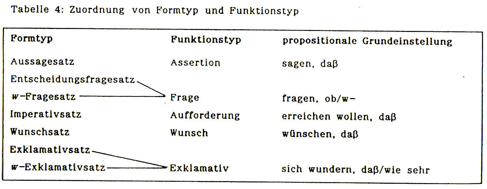

Ein **Formtyp** konstituiert sich durch mehrere formale Kennzeichen (s. [@thurmair1989modalpartikeln: 46, Tabelle 3].

Jeder Formtyp ist genau einem **Funktionstyp** zugeordnet (s. [@thurmair1989modalpartikeln: 46, Tabelle 4]) und dient zum direkten Ausdruck einer abstrakt zu verstehenden grundlegenden Einstellung eines Sprechers zur Proposition (d.h. einer propositionalen Grundeinstellung).

Die konkrete **lexikalische Füllung** (z.B. W-Wörter, Modalverben, Abtönungspartikeln) ergibt im Zusammenwirken mit einem **Funktionstyp** einen bestimmten **Illoktionstyp**.

Der **Illokutionstyp** der Äußerung (Sprechhandlungstyp - zum Ausdruck der Redeabsicht des Sprechers) kann der ausgedrückten propositionalen Grundeinstellung entsprechen, die ja bereits durch den jeweiligen Formtyp (z. B. Aussagesatzform) vorgegeben ist.

Die propositionale Grundeinstellung, die durch einen bestimmten Grundtyp zum Ausdruck gebracht wird, kann jedoch **durch zusätzliche einstellungsanzeigende sprachliche Mittel** (vor allem Modalverben, performative Verben, Satzadverbiale, Negationselemente, Abtönungselemente), den weiteren sprachlichen Kontext und die außersprachliche Situation **spezifiziert und modifiziert** werden.

Die **Illokution der Äußerung** ist für den Hörer mit Hilfe **interpretativer Strategien** aus den formalen Indikatoren des Funktionstyps, der lexikalischen Füllung des Satzes und dem sprachlichen als auch außersprachlichen Kontext **erschließbar**.

Die sprachlichen Mittel, die die tatsächliche illokutive Kraft einer Äußerung bestimmen, sind **hierarchisch geordnet**: z.B.
kann eine Abtönungspartikel wie [*ruhig*]{.underline} oder [*mal*]{.underline} erst dann in einem Aussagesatz auftreten, wenn dessen propositionale Grundeinstellung bereits durch Modalverben abgewandelt (modifiziert) ist:

(1) Du *kannst* dich [*ruhig*]{.underline} hinsetzen, ich beiße ja nicht. (*ruhig* ist Abtönungspartikel)\
(2) Du setzt dich [*ruhig*]{.underline} hin, ... (*ruhig* nur als Modaladverb interpretierbar)


### Grundlegende Formtypen

Im Deutschen kann man **folgende grundlegende Satzmodi (Grundtypen)** unterscheiden:

-   Aussagesatz (auch: Deklarativsatz, Konstativsatz),\
-   Fragesatz (auch: Interrogativsatz),\
-   Imperativsatz (auch: Aufforderungsatz, in weiteren Sinne),\
-   Wunschsatz (auch: Desiderativsatz),\
-   Ausrufesatz (auch: Exklamativsatz).

Die einzelnen Satzmodi lassen sich nach Form und Funktion im Kontext in mehrere Subtypen gliedern.
Besonders zahlreich sind die einzelnen Aufforderungssatz- und Fragesatztypen.


### Fragesätze

**Tabelle 1: Prototypische Merkmale deutscher Fragesätze** **(im Altmannschen Satzmodusmodell)**, zusammengestellt nach den Angaben in [@thurmair1989modalpartikeln: 44, 46, 66-73]

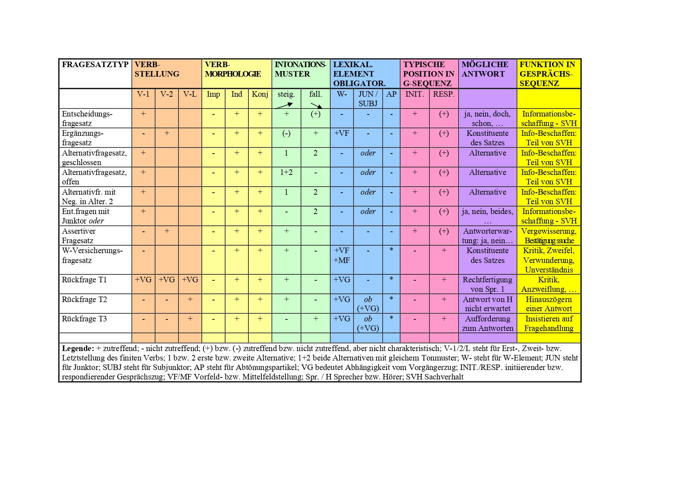

#### Vergleich mit anderen Grammatiken

Im Duden [@drosdowski1995duden: 592-594] und in [@engel1996deutsche: 52-58] werden teilweise andere Termini für den Bezug auf die verschiedenen Fragesatztypen verwendet:

**Tabelle 2:** **Vergleich frage(satz)bezogener Termini in grammatischen Werken**


**Unterschied zwischen "Fragesatz" und "Frage"** (Aussagesatz und Aussage, usw.): *Fragesatz* bezieht sich auf den Satzmodus eines Satzes und damit auf den Formtyp, *Frage* dagegen auf den Sprechakt (den Illokutionstyp) einer Äußerung (prinzipiell sind verschiedene Formtypen möglich). Entsprechendes gilt für die beiden Ausdrücke "Aussagesatz" und "Aussage". In [@thurmair1989modalpartikeln] und [@drosdowski1995duden] werden Satzmodi (Satzarten) beschrieben, in [@engel1996deutsche] hingegen Sprechakttypen.   


**Beispiele aus [@thurmair1989modalpartikeln]**

#### Alternativfragesätze

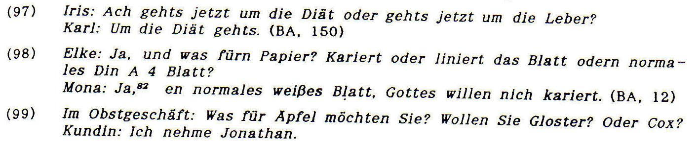


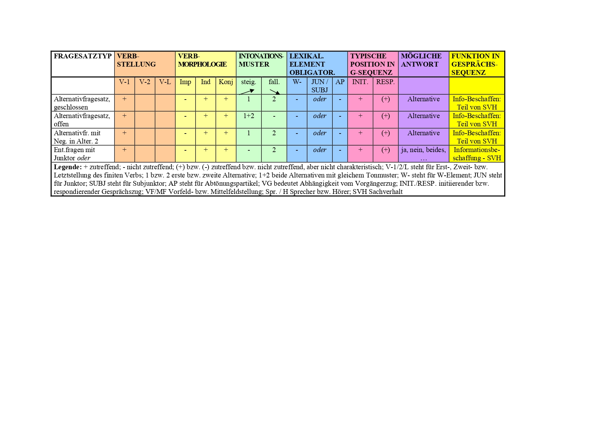

#### Assertive Fragesätze

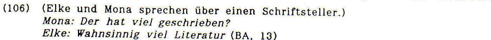

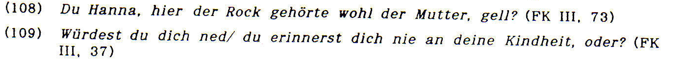

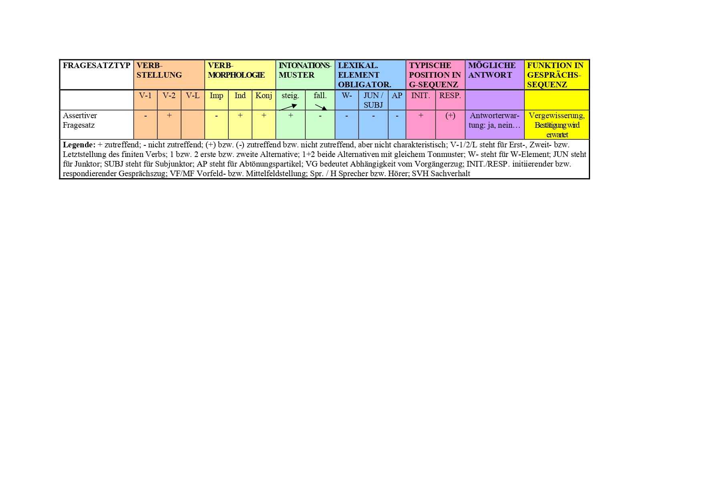


#### Rückfrage Typ 1


#### Rückfrage Typ 2

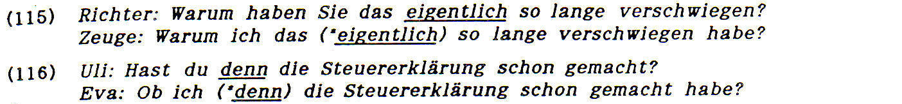

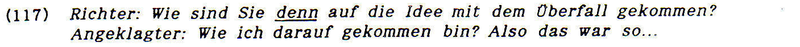


#### Rückfrage Typ 3


#### W-Vergewisserungsfragesätze


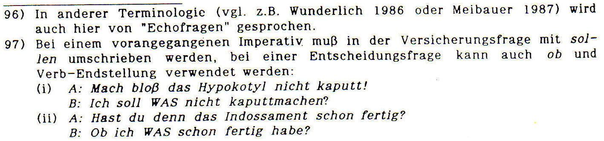


#### Ueberblick


