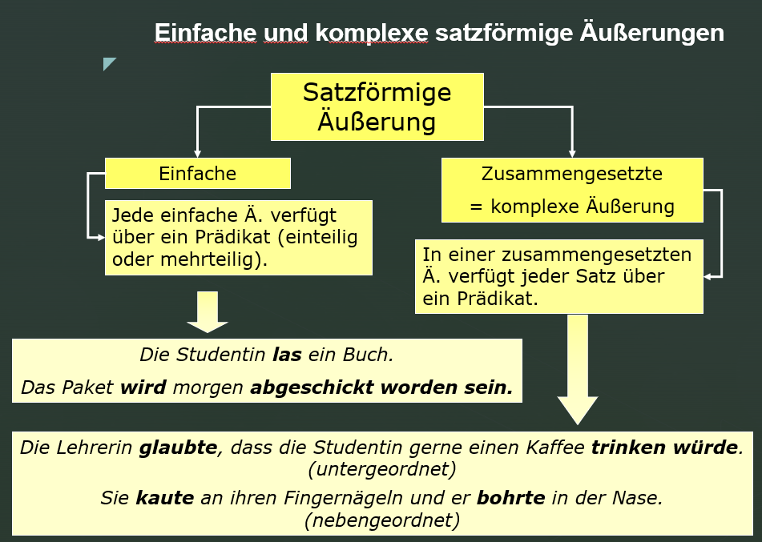

# Satztypologie

## Phrasen und Köpfe

Die meisten Texte bestehen vorzugsweise aus satzförmigen Äußerungen. In diesem Kapitel beschäftigen wir uns daher mit den verschiedenen Form- und Funktionstypen von Sätzen.

Ein prototypischer Satz besteht aus zumindest einem finiten Verb (z.B. *Sprich!*), ist kommunikativ selbständig und macht eine sprachliche Handlung eindeutig (hier: Aufforderung an den Gesprächspartner zum Sprechen). Die meisten Sätze bestehen aus mehr als einem Satzelement. Umgangssprachlich ist oft die Rede davon, dass ein Satz aus Wörtern zusammengesetzt ist. Das ist nicht völlig richtig, was sich am Beispiel des folgenden deutschen Satzes erweist:

(1) Studentin fährt in Stadt.   

Die Substantive *Studentin* und *Stadt* sind im Satz nicht verwendungsfähig. Es fehlen grammatische Bindemittel, d.h. bestimmte Funktionswörter, die gemeinsam mit autosemantischen Ausdrücken eine semantische und syntaktische Verbindung eingehen, die man Phrasen nennt. Sätze bestehen demnach aus *Phrasen* von semantisch und syntaktisch zusammengehörigen Wörtern, nicht aus einzelnen Wörtern: die Studentin, die Stadt in (2).

(2) [Die Studentin] fährt in [die Stadt].   

Zwei oder mehrere Phrasen können zusammengesetzt sein, z.B. die *Präpositionalphrase* im Beispiel (3), die aus der Präposition (P) *in* und der Nominalphrase (NP) *die Stadt* besteht. 

(3) Die Studentin fährt [ ~P~ in [ ~NP~ die Stadt]].

In den meisten syntaktischen Phrasen kann ein Element als *Kopf* oder Gliedkern identifiziert werden. Eine syntaktische erbt ihre Eigenschaften vom Kopf der Phrase, z.B. in der Phrase *die Stadt* gibt das Substantiv oder Nomen *Stadt* seine Eigenschaften an seine Begleiter (z.B. Artikel, Adjektiv) weiter. Deshalb bezeichnet man eine solche Phrase als *Nominalphrase*.

Im Beispiel (3) ist dagegen die Präposition der Kopf einer Phrase, denn die Präposition *in* regiert (hier in Zusammenarbeit mit dem Hauptverb *fahren*) den Kasus der Nominalphrase *die Stadt*. 


:::rmdnote
**`Phrasenprinzip`**

Eine **`Phrase`** ist eine Verbindung von semantisch und syntaktisch zusammengehörigen Satzelementen. Um Wörter im Satz verwenden zu können, müssen sie  häufig (nicht immer) durch andere (syntaktisch kompatible Wörter) zu Phrasen ergänzt werden. Wie sie zu ergänzen sind, das steuert ihr *Selektionsrahmen* (d.h. ihre lexikalischen Eigenschaften, -> *Rektion*, *Valenz*). 
:::

Beispiel: Dass [in den Lesesaal stellen] in dem Satz *Sarah würde das Buch in den Lesesaal stellen* eine Einheit bildet, ersieht man aus:   
(i)	Man kann diesen Komplex gesamthaft verschieben (z.B. an den Satzanfang):   
		[In den Lesesaal stellen] würde Sarah das Buch.   
(ii)	Man kann den Komplex gesamthaft durch ein Verb ersetzen (z.B. *lesen*):   
	Sarah würde das Buch [in den Lesesaal stellen ].   
	Sarah würde das Buch [lesen].   
Der ganze Komplex [in den Lesesaal stellen] hat trotz Ergänzung immer noch **verbalen Charakter**.

Das ist ein starkes Argument dafür, dass der Komplex [das Buch in den Lesesaal stellen] verbale Prägung hat und eine Phrase ist: eine *Verbalphrase* (VP). Das Fragment *Sarah würde* [...] ruft zur Ergänzung eine Verbalphrase auf. 

:::rmdnote
**`Kopfprinzip`**
in endozentrischen Phrasen.

Phrasen haben einen **`Kopf`** (Gliedkern).   
Die Eigenschaften des Kopfes übertragen sich auf die gesamte Phrase (Vererbung).   
Die Position des Kopfes hängt vom Sprachtyp ab (SVO, SOV, …).   
:::

In den folgenden englischen, deutschen und slowenischen Beispielen stellen die Präposition oder das Hauptverb den Kopf de jeweiligen Phrase dar.

(4) *in* the bank; this *amused* the man - that this *amused* the man   
(5) *in* der Bank;  *nach* meiner Meinung - meiner Meinung *nach*   
(6) dies *belustigte* den Mann - dass dies den Mann *belustigte*   
(7) *v* banki; to *zabava* moža - da to *zabava* moža / to moža *zabava*

Die meisten der untersuchten Sprachen im Korpus von Dryer [Wals](https://wals.info/feature/81A#2/18.0/153.1) zeigen entweder die SVO- oder die SOV-Reihenfolge. In den meisten Sprachen der Welt dominiert demnach die Abfolge **Subjekt vor Objekt**. Das hängt damit zusammen, dass eine handelnde Person häufig als Satzsubjekt ausgedrückt wird, während konkrete oder abstrakte Gegenstände, die von der Handlung betroffen sind oder erzeugt werden, als (direktes) Objekt ausgedrückt werden. Das entspricht auch der *anthropozentrischen Sichtweise* des Menschens, wonach der Mensch im Zentrum menschlichen Denkens steht und daher gern als Ausgangspunkt eines Gedankens verwendet wird.


Deutsche Beispielsätze:   
(8) Die Studentin *trink-t* am liebsten Bohnenkaffee.   
(9) Die Studentin *ha-t* am liebsten Bohnenkaffee ge*trunk*en.   
(10) Die Lehrerin meinte, 
	*dass* ihre Studentin am liebsten Bohnenkaffee *trink-t*.   
(11)	Die Lehrerin meinte, 
	*dass* ihre Studentin am liebsten Bohnenkaffee ge*trunk*en *ha-t*.   
(12)	Am liebsten *trink-t* die Studentin Bohnenkaffee.   

Slowenische Beispielsätze:   
(13) Študentka najraje *pi-je* pravo kavo.   
(14) Študentka *je* najraje *pila* pravo kavo.   
(15) Učiteljica je menila, 
	*da* njena študentka najraje *pi-je* pravo kavo.   
(16)	 Učiteljica je menila, 
	 *da* *je* njena študentka najraje *pila* pravo kavo.   
(17)	Najraje študentka *pi-je* pravo kavo.   

Verwendet man lediglich Nominalphrasen, die als Kopf einen Substantiv enthalten, dann können Englisch und Slowenisch als SVO-Sprachen eingeordnet werden. Deutsch wurde aufgrund mehrerer Argumente (z.B. der Rektionsrichtung in Infinitivkonstruktionen wie z.B. *ein Buch lesen* oder der Endstellung des finiten Verbs in Nebensätzen) als SOV-Sprache eingeordnet. Es gibt aber Argumente dagegen (z.B. Hauptsätze, die in Texten am häufigsten vertreten sind, zeigen meist SVO-Abfolgen, solange kein Auxiliarverb auftritt, denn dann erscheint das Hauptverb wiederum nach dem Objekt). Im Dryers Ansatz [Wals](https://wals.info/feature/81A#2/18.0/153.1) wird Deutsch aufgrund der einander widersprechenden Argumente den Mischtypen (im Hauptsatz hauptsächlich SVO, in Nebensätzen SOV) zugeordnet, einer heterogenen Klasse von Sprachen.


## Einfache vs. komplexe Äußerungen

*Satzförmige Äußerungen* können aus einem oder mehreren Sätzen zusammengesetzt sein. Eine *einfache Äußerung* enthält ein Prädikat, dass aus einem oder mehreren Verbformen bestehen kann (ein- oder mehrteiliges Prädikat). Im Prädikat wird mit Hilfe eines einzelnen Verbs oder durch das Zusammenwirken mehrerer Verbformen eine Handlung, ein Vorgang oder ein Zustand ausgedrückt. Außer dem Prädikat kann eine einfache satzförmige Äußerung noch weitere Satzkonstituenten enthalten (z.B. ein Subjekt oder ein Objekt). 

*Komplexe Äußerungen* enthalten zwei oder mehrere miteinander verknüpfte Sätze. Jeder Satz verfügt über ein Prädikat, das ein - oder mehrteilig sein kann. Sätze in komplexen Äußerungen können einander nebengeordnet oder ober- bzw. untergeordnet sein. Nebengeordnete Sätze in einer komplexen Äußerung sind prinzipiell kommunikativ selbständig, daher kann man sie (a) voneinander trennen (z.B. durch Pause bzw. Punkt) oder (b) ihre Reihenfolge verändern (außer wenn die semantischen Beziehungen dies nicht erlauben) oder (c) sie mit nebenordneten Konjunktionswörtern wie z.B. *und, oder* verbinden.^[In vielen deutschen Grammatiken ist statt von *Äußerungen* traditionell von *Sätzen* die Rede. Dann werden *einfache Sätze* von *zusammengesetzten Sätzen* unterschieden. Letztere werden auch als *Ganzsätze* bezeichnet, die nach dieser Redeweise aus mehreren *Teilsätzen* bestehen.]




:::rmdrobot
Lesen Sie den folgenden Witz und stellen Sie fest, wo satzförmige Äußerungen auftreten, welche satzförmigen Äußerungen einfach bzw. welche komplex sind und welche komplexe Äußerungen nebengeordnete bzw. untergeordnete Sätze enthalten!

*Dialog zwischen Mann und Frau*:   
>Sie: "Sag mal, wenn ich sterben würde, tätest Du wieder heiraten?"   
Er: "Aber nicht doch."   
Sie: "Wieso nicht? Gefällt es Dir nicht, verheiratet zu sein?"   
Er: "So gesehen hast Du Recht, also ich denke schon, dass ich wieder heiraten würde."   
PAUSE   
Sie: "Würdest Du mit ihr in unserem Bett schlafen?"   
Er: "Ja, ich glaube, das würde ich."   
Sie: "Und Du würdest ihr meine Kleider zum Anziehen geben?"   
Er: "Wenn sie ihr gefallen würden, dann täte ich das. Ja, ich würde sie ihr geben."   
PAUSE   
Sie: "Und die Bilder von mir, würdest Du sie durch ihre Bilder ersetzen?"   
Er: "Ja, das würde ich wohl tun."   
Sie: "Lass mich raten, Du würdest sie sogar mit meinen Schlägern Golf spielen lassen, hab ich Recht?"   
Er: "Niemals im Leben nicht! Sie ist Linkshänderin..."   

:::


:::rmdrobot
Song des aktuellen Bond-Films:
[NoTimeToDie_YouTube](https://youtu.be/BboMpayJomw)


```{=html}
<div class="vembedr">
<div>
<iframe src="https://www.youtube.com/embed/BboMpayJomw" width="533" height="300" frameborder="0" allowfullscreen=""></iframe>
</div>
</div>
```

Lesen Sie den folgenden Text und stellen Sie fest, wo satzförmige Äußerungen auftreten, welche satzförmigen Äußerungen einfach bzw. welche komplex sind und welche komplexe Äußerungen nebengeordnete bzw. untergeordnete Sätze enthalten! In welchen Äußerungen und Wie oft kommt das Subjekt als erste Satzkonstituente vor?

[Spiegel NoTimeToDie](https://www.spiegel.de/kultur/musik/james-bond-song-von-billie-eilish-no-time-to-die-video-mehrere-millionen-mal-aufgerufen-a-5390be6e-ade2-430e-8e63-13d10b1b5685)

>Wer sich auf den neuen James-Bond-Film gefreut hat, muss sich noch etwas gedulden: Die Premiere für "No Time To Die" wurde erneut verschoben. Dieses Mal auf April 2021.
Doch für alle Neugierigen gibt es einige Szenen nun vorab zu sehen: Sängerin Billie Eilish hat das Video zum Titelsong des Streifens veröffentlicht.
Die 18-jährige Eilish ist darin in Schwarz-Weiß-Optik vor einem Mikrofon zu sehen - im Wechsel mit Szenen aus dem kommenden Bond-Abenteuer. In den meisten Filmausschnitten treten Daniel Craig alias James Bond und Léa Seydoux alias Bonds geliebte Madeleine Swann auf.
Regisseur des Musikvideos ist Daniel Kleinmann, der seit "GoldenEye" (1995) die berühmten Vorspannsequenzen für fast alle James-Bond-Filme gestaltet hat.
Das Lied, eine leicht düstere Ballade mit dramatischem Finale im klassischen 007-Sound, hatte die fünffache Grammy-Gewinnerin Eilish zusammen mit ihrem Bruder Finneas geschrieben. Auch der deutsche Filmkomponist Hans Zimmer, der für den orchestralen Soundtrack des Agententhrillers verantwortlich zeichnet, und der frühere Gitarrist der Band The Smiths, Johnny Marr, wirkten an "No Time To Die" mit.
Der Clip, den die US-Sängerin am Donnerstagabend auf ihrem YouTube-Kanal online stellte, hatte nach einer Stunde bereits über 300.000 Aufrufe. Mittlerweile wurde das Video mehr als sieben Millionen Mal angesehen.
Der Titelsong war bereits im Februar veröffentlicht worden. Ursprünglich sollte der 25. James-Bond-Film im April 2020 in die Kinos kommen. Wegen der Coronakrise wurde der Starttermin zunächst auf den 12. November verschoben. Nun, sechs Wochen vor der geplanten Premiere, wurde auch diese wieder abgesagt.
Für Hauptdarsteller Daniel Craig ist es der letzte Einsatz als Geheimagent 007. Neben Craig und Seydoux spielen Lashana Lynch und Rami Malek in dem Film von Regisseur Cary Joji Fukunaga mit.   

<!-- -->

Wortwolke: [voyant tools](https://voyant-tools.org)
:::

Tabellen: Rmarkdown (T.P)


```{=html}
<div id="htmlwidget-3bb31562e0f51c9a2360" style="width:100%;height:auto;" class="datatables html-widget"></div>
<script type="application/json" data-for="htmlwidget-3bb31562e0f51c9a2360">{"x":{"filter":"top","vertical":false,"filterHTML":"<tr>\n  <td><\/td>\n  <td data-type=\"disabled\" style=\"vertical-align: top;\">\n    <div class=\"form-group has-feedback\" style=\"margin-bottom: auto;\">\n      <input type=\"search\" placeholder=\"All\" class=\"form-control\" style=\"width: 100%;\"/>\n      <span class=\"glyphicon glyphicon-remove-circle form-control-feedback\"><\/span>\n    <\/div>\n  <\/td>\n  <td data-type=\"character\" style=\"vertical-align: top;\">\n    <div class=\"form-group has-feedback\" style=\"margin-bottom: auto;\">\n      <input type=\"search\" placeholder=\"All\" class=\"form-control\" style=\"width: 100%;\"/>\n      <span class=\"glyphicon glyphicon-remove-circle form-control-feedback\"><\/span>\n    <\/div>\n  <\/td>\n  <td data-type=\"integer\" style=\"vertical-align: top;\">\n    <div class=\"form-group has-feedback\" style=\"margin-bottom: auto;\">\n      <input type=\"search\" placeholder=\"All\" class=\"form-control\" style=\"width: 100%;\"/>\n      <span class=\"glyphicon glyphicon-remove-circle form-control-feedback\"><\/span>\n    <\/div>\n    <div style=\"display: none;position: absolute;width: 200px;opacity: 1\">\n      <div data-min=\"2\" data-max=\"55\"><\/div>\n      <span style=\"float: left;\"><\/span>\n      <span style=\"float: right;\"><\/span>\n    <\/div>\n  <\/td>\n<\/tr>","extensions":["Buttons"],"fillContainer":true,"data":[["1","2","3","4","5","6","7","8","9","10","11","12"],["doc1","doc1","doc1","doc1","doc1","doc1","doc1","doc1","doc1","doc1","doc1","doc1"],["ADJ","ADP","ADV","AUX","CCONJ","DET","NOUN","NUM","PART","PRON","PROPN","VERB"],[20,36,17,15,5,40,55,10,2,15,55,19]],"container":"<table class=\"ColReorder fill-container\">\n  <thead>\n    <tr>\n      <th> <\/th>\n      <th>doc_id<\/th>\n      <th>upos<\/th>\n      <th>n<\/th>\n    <\/tr>\n  <\/thead>\n<\/table>","options":{"pageLength":10,"colReorder":true,"dom":"Bfrtip","buttons":["colvis","copy","csv","excel","pdf","print"],"columnDefs":[{"className":"dt-right","targets":3},{"orderable":false,"targets":0}],"order":[],"autoWidth":false,"orderClasses":false,"orderCellsTop":true,"rowCallback":"function(row, data, displayNum, displayIndex, dataIndex) {\nvar value=data[2]; $(row).css({'background-color':value == 0 ? \"gray30\" : value == 1 ? \"lightblue\" : null});\n}"}},"evals":["options.rowCallback"],"jsHooks":[]}</script>
```

```{=html}
<div id="htmlwidget-2a5d124ff3f22cd9a47d" style="width:100%;height:auto;" class="datatables html-widget"></div>
<script type="application/json" data-for="htmlwidget-2a5d124ff3f22cd9a47d">{"x":{"filter":"top","vertical":false,"filterHTML":"<tr>\n  <td><\/td>\n  <td data-type=\"character\" style=\"vertical-align: top;\">\n    <div class=\"form-group has-feedback\" style=\"margin-bottom: auto;\">\n      <input type=\"search\" placeholder=\"All\" class=\"form-control\" style=\"width: 100%;\"/>\n      <span class=\"glyphicon glyphicon-remove-circle form-control-feedback\"><\/span>\n    <\/div>\n  <\/td>\n  <td data-type=\"disabled\" style=\"vertical-align: top;\">\n    <div class=\"form-group has-feedback\" style=\"margin-bottom: auto;\">\n      <input type=\"search\" placeholder=\"All\" class=\"form-control\" style=\"width: 100%;\"/>\n      <span class=\"glyphicon glyphicon-remove-circle form-control-feedback\"><\/span>\n    <\/div>\n  <\/td>\n  <td data-type=\"integer\" style=\"vertical-align: top;\">\n    <div class=\"form-group has-feedback\" style=\"margin-bottom: auto;\">\n      <input type=\"search\" placeholder=\"All\" class=\"form-control\" style=\"width: 100%;\"/>\n      <span class=\"glyphicon glyphicon-remove-circle form-control-feedback\"><\/span>\n    <\/div>\n    <div style=\"display: none;position: absolute;width: 200px;opacity: 1\">\n      <div data-min=\"1\" data-max=\"4\"><\/div>\n      <span style=\"float: left;\"><\/span>\n      <span style=\"float: right;\"><\/span>\n    <\/div>\n  <\/td>\n<\/tr>","extensions":["Buttons"],"fillContainer":true,"data":[["1","2"],["und","doch"],["CCONJ","CCONJ"],[4,1]],"container":"<table class=\"ColReorder fill-container\">\n  <thead>\n    <tr>\n      <th> <\/th>\n      <th>token<\/th>\n      <th>upos<\/th>\n      <th>n<\/th>\n    <\/tr>\n  <\/thead>\n<\/table>","options":{"pageLength":10,"colReorder":true,"dom":"Bfrtip","buttons":["colvis","copy","csv","excel","pdf","print"],"columnDefs":[{"className":"dt-right","targets":3},{"orderable":false,"targets":0}],"order":[],"autoWidth":false,"orderClasses":false,"orderCellsTop":true,"rowCallback":"function(row, data, displayNum, displayIndex, dataIndex) {\nvar value=data[2]; $(row).css({'background-color':value == 0 ? \"gray30\" : value == 1 ? \"lightblue\" : null});\n}"}},"evals":["options.rowCallback"],"jsHooks":[]}</script>
```

```
## [1] "Konjunktor:  und"  "Konjunktor:  doch"
```

```
## [1] "Subjunktor:  "
```


## Verbstellungstypen

In welchen Fällen können wir satzförmige Äußerungen als wohlgeformte deutsche Sätze einordnen? Um dies systematisch beurteilen und entsprechende grammatische Regel bilden zu können, ist es sinnvoll, Sätze nach verschiedenen Gesichtspunkten oder Kriterien zu klassifizieren oder zu typisieren. Ein gängiges Kriterium für die Unterscheidung von Satztypen im Deutschen, sogenannten **Stellungstypen**, ist die *Stellung der finiten Verbform im Satz*. Nach diesem Kriterium lassen sich drei Satztypen unterscheiden:
- **V-1-Sätze** (auch Stirnsätze genannt), in denen die finite Verbform als erster Bestandteil eines Satzes erscheint;   
- **V-2-Sätze** (auch Kernsätze genannt), in denen die finite Verbform nach einer Satzkonstituente als zweiter Bestandteil eines Satzes auftritt;   
- **V-Letzt-Sätze** (auch Spannsätze genannt), in denen die finite Verbform als letzter Bestandteil eines Satzes erscheint.   

Hier sind drei Beispiele aus dem Witz *Dialog zwischen Mann und Frau* (s.o.):   
(1) *Gefällt* es Dir nicht, verheiratet zu sein?   
(2) [Sie] *ist* Linkshänderin.
(3) ..., also ich denke schon, dass ich wieder heiraten *würde*.

Beispiel (1) zeigt einen V-1-Satz (mit der finiten Verbform *gefällt*), Beispiel (2) einen V-2-Satz (mit der finiten Verbform *ist*) und Beispiel (3) einen V-Letzt-Satz (mit der finiten Verbform *würde*). 

Hier sind drei weitere Beispiele aus einer *Eulenspiegel*-Geschichte (s.u.):   
(4) *Verschwinde* von hier!   
(5) [In der Nacht] *hörte* der Bauer immer wieder lautes Gegacker.   
(6) Als sie das Wirtshaus verlassen *hatten*, gingen sie wieder zum Bauernhof zurück ...   

Beispiel (4) zeigt einen V-1-Satz (finite Verbform: *verschwinde*), Beispiel (5) einen V-2-Satz (finite Verbform: *hörte*) und Beispiel (6) einen V-Letzt-Satz (finite Verbform: *hatten*).   

In (1) und (4) ist die jeweilige finite Verbform (*gefällt, verschwinde*) der erste (hör- oder sichtbare) Bestandteil des Satzes. Deshalb können wir derartige Sätze als V-1-Sätze (Stirnsätze) einordnen. In (2) und (5) handelt es sich um V-2-Sätze, da vor der jeweiligen finiten Verbform (*ist, hörte*) eine Satzkonstituente steht, und zwar die aus einem Wort bestehende Nominalphrase [*Sie*] bzw. die Präpositionalphrase [*in der Nacht*]. In (3) und (6) sehen wir Sätze, die mit einem speziellen Einleitewort beginnen (*dass* bzw. *als*), die wir als Subjunktoren bezeichnen, also Konnektoren, die einen untergeordneten Satz (Nebensatz) einleiten. Eine V-1 oder V-2-Stellung ist in derartigen Sätzen nicht möglich. Stattdessen müssen wir die finite Verbform (*würde, hatten*) in der V-Letzt-Position realisieren, um einen wohlgeformten Satz zu erhalten. In den beiden Nebensätzen der Beispiele (3) und (6) war außerdem zu berücksichtigen, dass wir mit einem mehrteiligen Prädikat zu tun haben. In solchen Fällen ist es wichtig, die finite Verbform (*würde* bzw. *hatten*) von der infiniten Verbform (dem Infinitiv *heiraten* bzw. dem Partizip Perfekt *verlassen*) zu unterscheiden. Die finite Verbform drückt die Kategorien Person und Numerus aus und kongruiert in dieser Hinsicht mit dem Subjekt, die infinite Verbform (im Deutschen) dagegen nicht.

In Texten kommen immer wieder Beispiele vor, die nicht so eindeutig als V-1, V-2 oder V-Letzt-Sätze eingeordnet werden können wie die oben angeführten. Wir greifen ein paar Beispiele aus den bisher verwendeten Texten heraus:

(7) Und du *würdest* ihr meine Kleider zum Anziehen geben?   
(8) Ja, das *würde* ich wohl tun.   
(9) So, so, mit den Hühnern *soll* ich schlafen gehen!   
(10) ..., wenn ich sterben würde, *tätest* Du wieder heiraten?   
(11) Als sie das Wirtshaus verlassen hatten, *gingen* sie wieder zum Bauernhof zurück ...   

In den Beispielen (7) bis (11) können die selbständigen Sätze (Hauptsätze) alle als V-2-Sätze eingeordnet werden. Hier zeigt sich, dass wir uns im Klaren darüber sein müssen, welche Wörter Bestandteil eines Satzes sind und welche nicht. Konnektoren wie z.B. *und* im Beispiel (7) sind keine Satzkonstituenten (Satzbestandteile). Eine Satzkonstituente sollte im Satz verschiebbar und ersetzbar sein. Der Konnektor *und* kann nicht an andere Stellen im Satz verschoben werden und erfüllt damit ein grundlegendes Kriterium für eine Satzkonstituente nicht.

(12) \*Du würdest *und* ihr meine Kleider zum Anziehen geben?   

Der Konnektor *und* ist durch Ausdrücke wie z.B. *oder, aber* ersetzen. Die Ausdrücke üben dieselbe syntaktische Funktion aus, nämlich die Verknüpfung von nebengeordneten Phrasen oder Sätzen (Konjunkten). Diese Konnektoren haben **gemeinsam**,    
- nicht frei verschiebbar zu sein, wie das für Satzkonstituenten verlangt wird;   
- (meist) an eine einzige Position gebunden zu sein (vor einem Satz bzw. zwischen zwei Sätzen),    
- nur durch bestimmte Ausdrücke ersetzbar zu sein (eine relativ kleine Gruppe, die wir als Konjunktoren bezeichnen),    
- nicht erfragbar bzw. nicht als Antwort auf eine Ergänzungsfrage (W-Frage) dienen zu können, wie das für Satzkonstituenten charakteristisch ist.   
Konjunktoren sind keine Satzkonstituenten, sie stehen somit vor einer Satzkonstruktion und verknüpfen diese mit einem anderen Konjunkt. Aufgrund der vorgebrachten Kriterien werden sie bei der Beurteilung, zu welchem Stellungstyp ein Satz gehört (V-1, V-2 oder V-Letzt), nicht berücksichtigt.

Zu einer ähnlichen Schlussfolgerung gelangen wir auch in solchen Fällen, in denen ein Konnektor einen untergeordneten Satz einleitet, wie zum Beispiel die Subjunktoren *dass* in (3) und *als* in (6). Auch Subjunktoren zählen wir demnach nicht als Satzkonstituenten. Im Unterschied zu den Konjunktoren beeinflussen die Subjunktoren jedoch die Stellung der finiten Verbform, denn sobald ein Subjunktor verwendet wird, steht die finite Verbform in der V-Letzt-Position. Auf diesen Umstand kommen wir im Zusammenhang mit einem anderen Ansatz, der im deutschen Satz Stellungsfelder etabliert, noch zurück.

Im Beispiel (8) erscheint die finite Verbform *würde* erst als drittes Wort. Wir dürfen jedoch nicht einfach nur Wörter abzählen, sondern die hierarchische Struktur des Satzes berücksichtigen. Zuerst müssen wir daher die Konstituenten des Satzes ermitteln, und zwar mit Hilfe unserer Identifikationsverfahren (allen voran: der Verschiebe- und Ersatzprobe). Wir sollten also in Erfahrung bringen, ob die Partikel *ja* am Anfang des Beispiels (8) an andere Stellen im Satz verschoben werden kann und ob die kommunikative und syntaktische Funktion in anderen Positionen erhalten bleibt. Außerdem sollten wir in schriftlichen Äußerungen auch Interpunktionszeichen berücksichtigen, in diesem Fall das Komma. Welche Funktionen hat das Komma in deutschen Äußerungen? Die grundlegende syntaktische Funktion des Kommas ist die Abgrenzung von Sätzen (Sätze werden durch Kommas voneinander abgegrenzt). Eine weitere (prosodische) Funktion des Kommas ist es, eine (nicht obligatorische) Sprechpause zu kennzeichnen. Im Beispiel (8) können wir beide Funktionen erkennen: Nach der Partikel *ja* kann man eine kurze Sprechpause einlegen und damit zeigen, dass damit eine gedankliche Einheit abgeschlossen ist. Die Partikel *ja* ist somit eine gebündelte Antwort auf eine Entscheidungsfrage und ließe sich durch den expliziten Satz *ich würde sie durch ihre Bilder ersetzen* austauschen. Deshalb bezeichnet man derartige Verwendungen der Partikel *ja* auch als **Satzäquivalente**. Zu einer entsprechenden Schlussfolgerung gelangen wir auch im Beispiel (9), in dem das Adverb *so* wie ein Satzäquivalent verwendet wird und daher vom darauf folgenden Satz durch Komma abgegrenzt wird. 

Die Beispiel (10) und (11) zeigen ebenfalls Hauptsätze mit der finiten Verbform in V-2-Stellung. Auch hier gilt es, die hierarchische Struktur der komplexen Äußerung zu berücksichtigen. Die Nebensätze stellen eine Konstituente im jeweiligen Hauptsatz dar. Das wird besonders gut sichtbar, wenn wir die Nebensätze durch eine Anapher ersetzen (in diesen beiden Fällen mit *dann*:

(13) [wenn ich sterben würde = *dann*] *tätest* Du wieder heiraten?   
(14) [Als sie das Wirtshaus verlassen hatten = *dann*], *gingen* sie wieder zum Bauernhof zurück.   

Nun wird sichtbar, dass der jeweilige Nebensatz die erste Satzkonstituente des Hauptsatzes darstellt und die finite Verbform (*tätest* bzw. *gingen*) demnach die V-2-Position im Hauptsatz besetzt.

Was stellen wir mit sprachlichen Äußerungen an, die keine finite Verbform enthalten? Hier sind zwei  Beispiele aus unseren bisherigen Texten:

(15) Wieso nicht?
(16) Gefällt es Dir nicht, verheiratet *zu sein*?   

Eine Alternative ist, dass man derartige Konstruktionen nicht berücksichtigt. Die andere Möglichkeit ist zum Vergleich eine satzartige Konstruktion zu schaffen, in der eine finite Verbform auftritt. Die beiden folgenden Beispiele zeigen das Ergebnis der zweiten Alternative (die hinzugefügten oder ersetzten Wortformen stehen in runden Klammern):

(15) Wieso (*würdest*) (du) (das) nicht (tun)?
(16) Gefällt es Dir nicht, dass du verheiratet (*bist*)?   

Nach der Vervollständigung der Sätze mit Hilfe des Kontexts erweist sich die W-Frage (*Wieso nicht?*) als äquivalent zu einer Frage vom V-2-Stellungstyp und die Infinitivkonstruktion (*verheiratet zu sein*) als äquivalent zu einem Nebensatz vom V-Letzt-Stellungstyp. 

Die bisherige Beispiele deuten auch darauf hin, dass bestimmte Stellungstypen mit bestimmten **kommunikativen Absichten** und den daraus resultierenden charakteristischen Satzformen zusammenhängen:    
- Entscheidungsfragesätze (*Gefällt es dir nicht?*) und Imperativsätze (*Verschwinde von hier!*) sind meist V-1-Sätze,    
- Aussagesätze (*Sie ist Linkshänderin*) und Ergänzungsfragesätze (*Warum stinkst du nach Huhn?*) sind meist V-2-Sätze und   
- Nebensätze (*Als sie das Wirtshaus verlassen hatten, ...*) sind V-Letzt-Sätze. 


## Stellungsfelder


