# Dependenzgrammatik

Als Grundbeziehung zwischen (linear auftretenden) sprachlichen Elementen gilt auch das Prinzip der **Dependenz**, d.h.
der Abhängigkeit eines Elementes von einem anderen.
Sprachliche Elemente stehen somit wie andere Erscheinungen in unserer Welt in Hierarchiebeziehungen zueinander.
Das abhängige Element wird Dependens genannt, das nicht-abhängige dagegen Regens (vgl. syntagmatische Beziehung Rektion).
Die Dependenz ist eine syntaktische Grundbeziehung, bei der ein Element (das Dependens) nicht ohne ein anderes (das Regens) auskommen kann: z.B.
in der Phrase *ziemlich wichtige Persönlichkeiten* kann die Partikel *ziemlich* nicht ohne das Adjektiv *wichtig* auftreten, da die Phrase \* *ziemlich Persönlichkeiten* keine wohlgeformte Phrase der deutschen Sprache wäre (also ungrammatisch).
Das Dependenzprinzip steht in den sogenannten Valenzgrammatiken bzw.
*Valenzmodellen* im Mittelpunkt.
Die Satzstruktur wird hierarchisch gegliedert, mit dem Verb (Verbalkomplex, Prädikat) an der Spitze.
Derartige Valenzmodelle werden übrigens als *Valenzverbgrammatiken* bezeichnet.

## Valenz

**Valenz** (auch: **Wertigkeit**) ist die Fähigkeit eines Satzelementes, andere Elemente im Satz zu ermöglichen, zu fordern oder auszuschließen.
Das **Regens** ist dasjenige Satzelement, das andere Elemente im Satz ermöglicht, fordert oder ausschließt.
Ein **Dependens** ist ein Satzelement, das von einem Regens ermöglicht, verlangt oder ausgeschlossen wird.

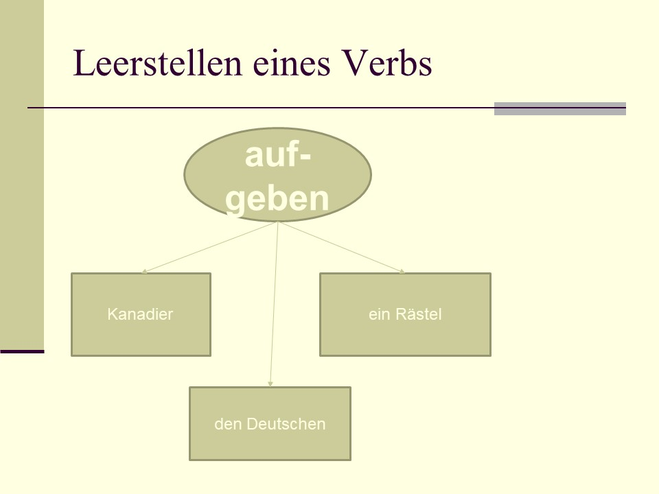

(1) [ ~NP~ Kanadier] -- [ ~VP~ lachen / weinen / schlafen ...]\
(2) Kanadier lachen / weinen / \*schlafen darüber\
(3) [ ~NP~ Kanadier] -- [ ~VP~ können darüber *lachen*].\
(4) [Leerstelle 1: *Kanadier*] [*geben*]{.underline} [Leerstelle 2: *den Deutschen*] [Leerstelle 3: *ein Rätsel*] [*auf*]{.underline.

lachen~2~ [Subjekt, Präpositivergänzung]: Wer lacht?\
Worüber lacht x ?

aufgeben~3~ [Subjekt, Dativergänzung, Akkusativergänzung]\
Wer gibt wem was auf?

## Ergänzung vs. Angabe

Ergänzungen sind spezifisch für bestimmte Klassen von Verben, Angaben sind hingegen mit beliebigen Verbklassen verknüpfbar.

**Subklassenspezifisch \<==\> nicht-subklassenspezifisch**

(4) Diese Frau ist gefährlich.

(5) Diese Frau ist \* den Mann gefährlich.
    (Existenz)

(6) Diese Frau fragt den Mann.
    (Sagen, Meinen)

(7) Diese Frau fährt nach Maribor.
    (Ziel)

(8) Diese Frau fragt den Mann \* nach Maribor.
    (Ziel)

(9) Heute fährt diese Frau nach Maribor (Angabe)

(10) Heute fragt diese Frau den Mann.
     (Angabe)

(11) Heute ist diese Frau gefährlich.
     (Angabe

(12) Sie fragt den Mann.
     (Austauschprobe)

(13) Sie fragt ihn.
     (Austauschprobe, Ersatzprobe: dieselbe Funktion ?)

(14) Den Mann fragte sie.
     (Verschiebeprobe: Satzglied oder kein Satzglied ?)

(15) Diese Frau sagt, dass sie morgen nach Maribor fährt.
     (dass = kein Satzglied)

(16) Diese Frau sagt, sie morgen \* dass nach Maribor fährt.

## Verben: semantische Oberklassen

**Verben mit ähnlicher Bedeutung haben eine ähnliche syntaktische Valenz.**

**Dynamische Verben**

-   **Handlungsverben**:\
    Essen, trinken, schreiben, verfassen, treffen, kraulen, bringen, abholen, graben, heben, ...

-   **Vorgangsverben**:\
    treiben, wehen, triefen, schneien, schnarchen (?) ...

**Statische Verben** - **Zustandsverben**: sein, sitzen, stehen, schlafen (?), ...

Die semantischen Oberklassen zerfallen in eine Reihe von semantischen **Unterklassen**: z.B.
bei den *Handlungsverben* kann man beispielsweise unterscheiden:\
- *Verben des Sagens und Meinens* (Verba dicendi),\
- *Fortbewegungsverben*,\
- ...

Bei den *Zustandsverben* sind unterscheidbar:\
- Existenzverben,\
- Emotionsverben,\
- ...

## Ergänzungsklassen

In den folgenden Tabellen sind die Ergänzungsklassen zu sehen, die im Rahmen der Mannheimer Valenzgrammatik unterschieden werden (Engel 1989 und 2004).

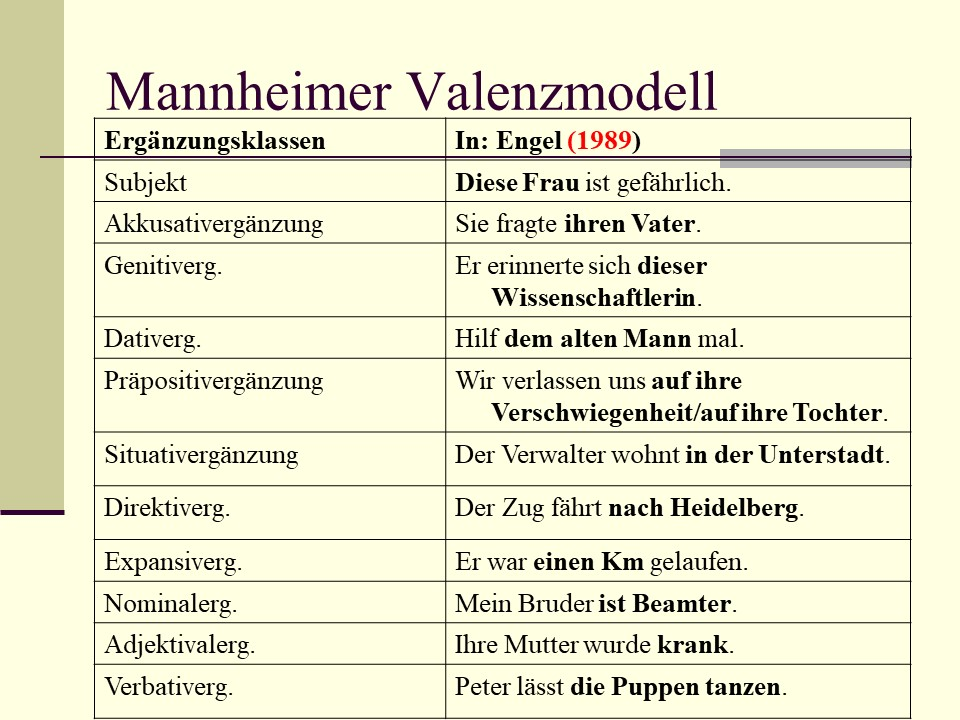

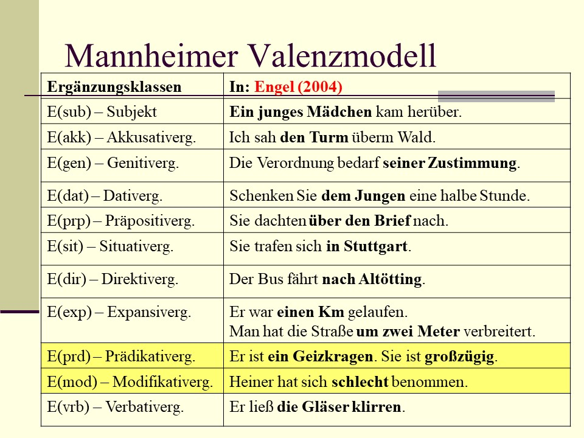

### Subjekt

Das Subjekt (E~sub~) hat verschiedene **Ausdrucksformen**. Es erscheint als:    
- Nominalphrase im Nominativ (1 - 2),   
- Pronominalphrase im Nominativ (3 - 4),   
- Nebensatz ohne und mit Korrelat *es* (5),   
- Infinitvsatz ohne und mit Korrelat *es* (6).   

(1) *Diese Frau* ist unsere Nachbarin. 
(2) *Der Löwe mit seiner imposanten Mähne* ist der König der Tiere.   
(3) *Sie als vernünftiger Mensch* sollte das wissen. - Das Kind ist immer so fröhlich. *Es* versetzt alle Anwesenden in gute Laune. 
(4) *Niemand* hat das Recht, Sie zu beschimpfen.   
(5) *Dass Sie sich so kurzfristig noch bei uns einfinden konnten*, freut uns sehr. - *Es* freut uns sehr, *dass Sie sich so kurzfristig noch bei uns einfinden konnten*.   
(6) *Mit Ihnen zu spazieren*, hat mir große Freude bereitet. - *Es* hat mir wirklich große Freude bereitet, *mit Ihnen zu spazieren*.

In Beispiel (3) bezieht sich das Pronomen *es* auf *das Kind* im vorherigen Satz. Das Pronomen *es* ist in diesem Fall mit dieser Nominalphrase *das Kind* austauschbar und daher so wie diese als Subjekt einzuordnen.   

Aus den Beispielen (5) und (6) ist ersichtlich, dass das Pronomen *es*, obwohl es im Nominativ steht, nicht allein das Subjekt darstellt, sondern gemeinsam mit dem Neben- bzw. Infinitivsatz. Es fungiert als Korrelat oder Platzhalter im Hauptsatz für den ausgeklammerten Neben- bzw. Infinitivsatz.    

**Kongruenz**:   
Das Subjekt kongruiert (von wenigen Ausnahmen abgesehen) in Person und Numerus mit der finiten Verbform. 

Die meisten Verben fordern ein Subjekt, aber nicht alle. Witterungsverben (7) und Empfindungsverben (8) kommen ohne Subjekt vor. Das Personalpronomen *es* in Beispiel (7) wird nicht als Subjekt gewertet, denn es lässt sich nicht durch andere Ausdrucksformen ersetzen. In solchen Fällen ordnet man das nicht-kommutierbare Pronomen dem Verbalkomplex zu. In Beispiel (8) kommt keine Nominalphrase im Nominativ vor, der Satz ist also subjektlos. Die Dativergänzung bezieht sich auf eine Person, die eine (angenehme oder unangenehme) Erfahrung macht oder Empfindung verspürt.     

(7) *Es* regnet. *Es* hagelt. *Es* schneit. ...   
(8) *Mir* ist kalt. *Mir* graut es vor diesem Menschen. Rap-Musik gefällt *ihr* am besten.    

Die Dependenzdiagramme [@engel2008deutsche] zeigen den Unterschied zwischen Nominalphrasen in Subjekt- und Objektfunktion an:   

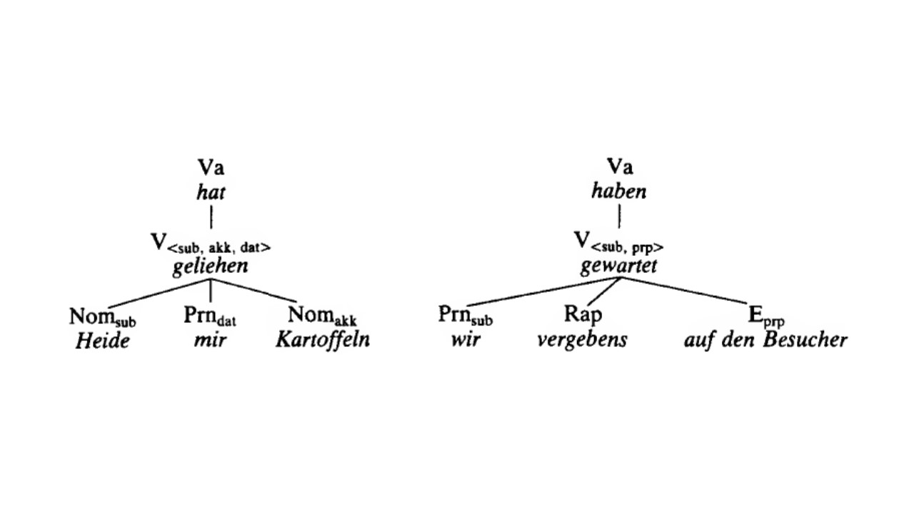

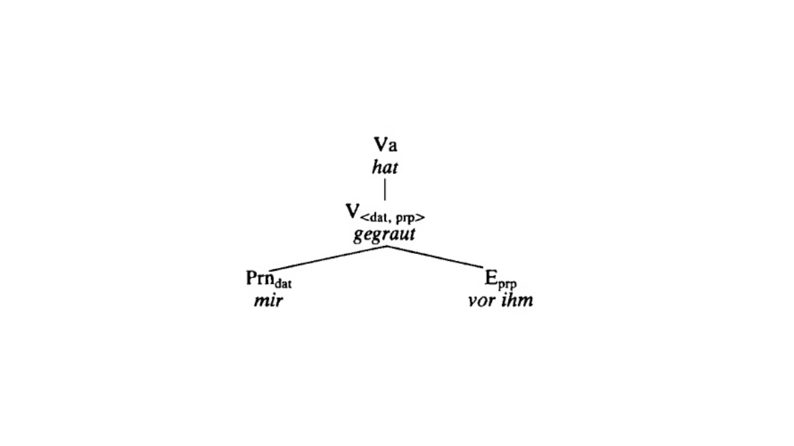

*Verbklassen ohne Subjekt* sind ein Argument dafür, dass das Subjekt wie andere Ergänzungen von der Verbvalenz abhängen und dass es nicht notwendig ist, dem Subjekt im Valenzmodell eine Sonderrolle einzuräumen. Ein weiteres Argument sind auch *semantische Beschränkungen*, die durch die Valenz des Hauptverbs festgelegt werden und auch das Subjket betreffen.   

Für die *Sonderstellung des Subjekts* gegenüber anderen Ergänzungen gibt es mehrere Argumente:   
- die *Kongruenz* zwischen Subjekt und finiter Verbform,   
- in *Infinitivsätzen* wird das Subjekt eliminiert,    
- das Subjekt ist bei weitem das *häufigste Satzglied*,   
- das Subjekt tritt häufig als *erstes Satzglied* auf,   
- das Subjekt bezieht sich häufig auf den Urheber einer Handlung (*Agens*),   
- das Subjekt nimmt häufig Bezug auf bekannte Information (*Thema*).   

**Transformationen**:   
- E~sub~ (Aktivsatz) ==> E~prp~ (Passivsatz) in Beispiel (9),   
- E~sub~ (Satzglied) ==> E~gen~ (Attribut in NP) in (10).   
- E~sub~ (Satzglied) ==> E~prp~ (Attribut in NP) in (11).   

Dependenzdiagrame mit einem Aktiv- und einem Passivsatz aus [@engel2008deutsche]:   

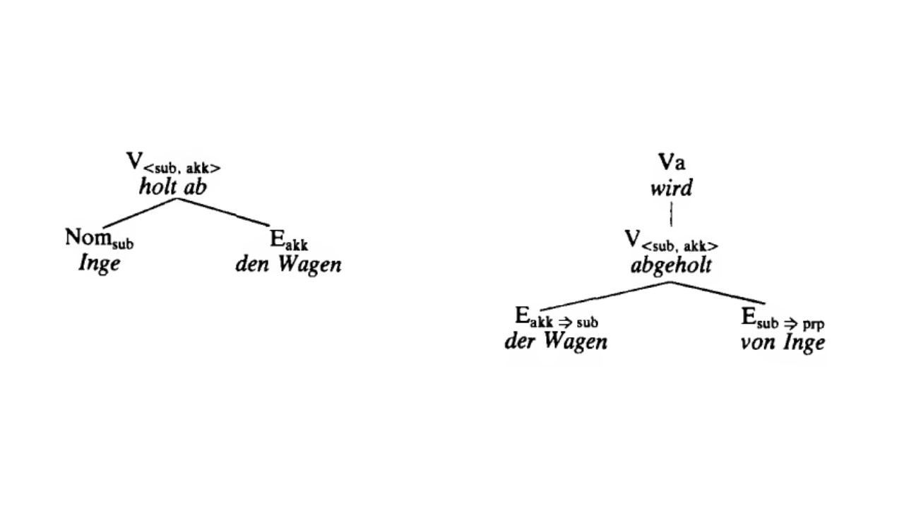

Aus dem Subjekt eines Aktivsatzes wird im *Passivsatz* eine Präpositivergänzung (9) und in einer *Nominalisierung* ein Genitivattribut (Subjektgenitiv, Beispiel 10) oder ein Präpositionalattribut (Präpositivergänzung zum Nomen, Beispiel 11).   

(9) *Inge* holt den Wagen [am Montag] ab. ==> Der Wagen wird *von Inge* [am Montag] abgeholt.    
(10) *Die Studentin* bereitet sich auf eine Prüfung vor. ==> die Vorbereitung *der Studentin* auf eine Prüfung ...    
(11) *Der Arzt* behandelt eine Privatpatientin. ==> die Behandlung der Privatpatientin *durch den Arzt* ...    

### Akkusativergänzung

Die Akkusativergänzung (E~akk~) wird auch als *Akkusativobjekt* oder *direktes Objekt* bezeichnet und hat verschiedene **Ausdrucksformen**. Sie erscheint als:    
- Nominalphrase im Akkusativ (1),   
- Pronominalphrase im Akkusativ (2),   
- Nebensatz ohne und mit Korrelat *es* (3),   
- Infinitvsatz ohne und mit Korrelat *es* (4).   

(1) Die Arbeitnehmer fordern *eine Gehaltserhöhung*.    
(2) Ein Mann ist in eine Wohnung eingedrugen. Die Nachbarin hat *es* auch gesehen.   
(3) Wir haben nicht erwartet, *dass Sie sich so kurzfristig noch bei uns einfinden könnten*. - Er schätze *es*, *wenn man ihn freundlich behandelte*.   
(4) Wir hoffen, *Ihnen ein gutes Angebot machen zu können*. - Der Bauer hielt *es* für ratsam, *möglichst früh aufzustehen*.   

In Beispiel (2) bezieht sich das Pronomen *es* auf ein Neutrum (ein Ereignis). Das Pronomen *es* ersetzt in diesem Fall den vorherigen Satz und füllt eine der Leerstellen des Verbs sehen, nämlich diejenige, die für die Akkusativergänzung vorgesehen ist.   

Aus den Beispielen (3) und (4) ist ersichtlich, dass das Pronomen *es*, obwohl es im Akkusativ steht, nicht allein das Objekt darstellt, sondern gemeinsam mit dem Neben- bzw. Infinitivsatz. Es fungiert als Korrelat oder Platzhalter im Hauptsatz für den ausgeklammerten Neben- bzw. Infinitivsatz.    

**Kongruenz**:   
Im Deutschen kongruiert die Akkusativergänzung nicht mit der finiten Verbform. 

Das linke Dependenzdiagramme [@engel2008deutsche] zeigt einen Satz mit Akkusativergänzung:   

**Semantik**:   
Viele *Handlungsverben* fordern eine Akkusativergänzung, daher ist die Akkusativergänzung die zweithäufigste aller Ergänzungen. Bedeutungsmäßig ist die Akkusativergänzung von Handlungsverben häufig ein *Patiens* (d.h. ein von der Handlung betroffener oder erzeugter Gegenstand). 

**Ersatzformen**:   
Nicht jede Nominalphrase oder Pronomen im Akkusativ ist automatisch eine Akkusativergänzung. Eine Akkusativergänzung identifizieren wir mit einem *Personalpronomen im Akkusativ*, das jedoch durch andere Ausdrucksformen ersetzbar sein muss, oder mit der Fragestellung *Wen oder was?*.   

(5) Ich meine *es* doch gut mit Ihnen.    
(6) Er ist *einen Kilometer* (weit) gelaufen.       

Das Personalpronomen *es* in Beispiel (5) ist nicht ersetzbar und  daher keine Akkusativergänzung (E~akk~) sondern gehört zum Verbalkomplex. Es handelt sich umd eine feste Wendung. In Beispiel (6)
ist die Nominalphrase im Akkusativ *einen Kilometer* nicht ersetzbar durch die Anapher im Akkusativ *ihn*, aber erfragbar durch *Wie weit?*. Daher ist eine Expansivergänzung (E~exp~) die angemessenere Lösung.   

**Transformationen**:   
- E~akk~ (Aktivsatz) ==> E~sub~ (Passivsatz) in Beispiel (7),   
- E~akk~ (Satzglied) ==> E~gen~ (Attribut in NP) in (8).   

Dependenzdiagrame mit einem Aktiv- und einem Passivsatz aus [@engel2008deutsche]:   

Aus der Akkusativergänzung eines Aktivsatzes wird im *Passivsatz* ein Subjekt (7) und in einer *Nominalisierung* ein Genitivattribut (Objektgenitiv, Beispiel 8).   

(7) Inge holt *den Wagen* [am Montag] ab. ==> *Der Wagen* wird von Inge [am Montag] abgeholt.    
(8) Der Arzt behandelt *eine Privatpatientin*. ==> die Behandlung *der Privatpatientin*   

Bei vielen transitiven Verben sind Akkusativergänzungen obligatorisch. Ein Beispiel mit fakultativer Akkusativergänzung:   

(9) Wir essen gerade. (ausgelassene E~akk~: *was* essen wir?)   

### Dativergänzung

Die *Dativergänzung*, traditionell auch als *Dativobjekt* oder *indirektes Objekt* bezeichnet, kommt bei recht vielen transitiven Verben vor, aber sehr oft nur *fakultativ*. 

**Ausdrucksformen**: Nominal- oder Pronominalphrase im Dativ.   
Die Dativergänzung enthält KEINE PRÄPOSITION. 

**Transformationen**:   
- Bei *Passivierung*: unverändert,   
- bei *Nominalisierung*: E~dat~ ==> E~prp~

Semantisch gesehen handelt es sich um den *Adressaten* einer Handlung. Aber es gibt auch eine Reihe von Nominalphrasen im Dativ, die mit einer anderen Bedeutung assoziiert sind  und teilweise auch nicht eindeutig subklassenspezifisch sind. Daher spricht man in solchen Fällen gerne von *freien Dativen* (Dativus possessivus oder Pertinenzdativ, Dativus ethicus, Dativus sympathicus / commodi und incommodi).   

(1) Das Mädchen hilft *der alten Frau* beim Aufstehen. - *Der alten Frau* wurde geholfen. - die Hilfe *für die alte Frau*
(2) Er schreibt *seiner Freundin* in dieser Woche schon den dritten Liebesbrief. (E~dat~ = Adressat)   
(3) Der Sohn reinigt *seinem Vater* das Auto. (für seinen Vater / statt seines Vaters = Benefaktiv oder Nutznießer der Handlung)   
(4) *Mir* ist die Vase heruntergefallen. (Dativus incommodi: der Person ist ein Mißgeschick widerfahren)   
(5) Du bist *mir* auf den Fuß getreten. (Dativus possessivus: auf meinen Fuß)
(6) Du bist *mir* ein schöner Freund!   (ethischer Dativ: innere Anteilnahme des Sprechers an Handlung)   
(7) Dass du *mir* ja nicht zu spät nach Hause kommst! (ethischer Dativ: innere Anteilnahme des Sprechers am Geschehen)   

Während die prototypische Dativergänzung (Bedeutug: Adressat) im Satz betonbar und erststellenfähig (vorfeldfähig) ist, gibt es bei den sogenannten *freien Dativen* Beschränkungen oder andere Ersatzmöglichkeiten:   
- der ethische Dativ ist weder betonbar noch vorfeldfähig;   
- der Dativus sympathicus ist mit einer Präpositionalphrase ersetzbar (*für jemanden* / *statt jemandes*),   
- der possessive Dativ ist in ein possessives Attribut zu einem Nomen umwandelbar (eine Teil-Ganzes-Beziehung liegt demnach vor).   

### Genitivergänzung

Die *Genitivergänzung* (E~gen~), auch als *Genitivobjekt* bezeichnet, ist im Gegenwartsdeutschen auf eine kleinere Gruppe von Verben beschränkt. Viele davon gehören in den juristischen Sprachgebrauch. Bei manchen Verben konkurriert die Genitivergänzung mit anderen Termergänzungen, z.B. mit der Präpositivergänzung (1). 

(1) Sie erinnerte sich noch sehr gut *jenes Tages*. - Sie erinnnerte sich noch sehr gut *an diesen Tag*.   

**Ausdrucksformen**:   
- Nominal- oder Pronominalphrase im Genitiv (2 - 3),   
- Nebensatz oder Infinitivsatz (4 - 5).   

(2) *Dieses schlimmen Tages* entsann sich noch sehr gut.   
(3) *Dessen* bedarf es wohl nicht mehr.   
(4) Seine Mitarbeiter beschuldigten ihn, *dass er einen Verstoß gegen die Geschäftsordnung begangen hatte*.   
(5) Seine Mitarbeiter beschuldigten ihn, *einen Verstoß gegen die Geschäftsordnung begangen zu haben*.   

**Identifikation**:   
- Anapher *dessen* (Maskulinum, Neutrum) bzw. *deren* (Femininum),   
- Frage *wessen*?   

**Transformation**:   
Bei *Passivtransformationen* ändert sich die Form einer Genitivergänzung nicht, bei *Nominalisierung* wird sie - falls überhaupt möglich - in eine Präpositivergänzung umgewandelt.   

(6) Man bezichtigte ihn *des Diebstahls*. ==> Er wurde *des Diebstahls* bezichtigt.   
(7) Er hat sich *der Stimme* enthalten. ==> die Enthaltung *bei der Abstimmung / Stimmabgabe*    

Genitivergänzungen sind teils *obligatorisch*, teils *fakultativ*. Bei einigen Verben kommen sie gemeinsam mit Akkusativergänzungen vor.   

Im Gegensatz zu den Genitivergänzungen, die als Satzglieder zu Verben treten, kommen **Genitivattribute**, seien es nun Angaben oder Ergänzungen, in vielen Texten, insbesondere in Fachtextsorten, Publizistik und wissenschaftlicher Literatur ziemlich häufig vor.   

### Präpositivergänzung

(in anderen grammatischen Werken in der Regel deckungsgleich mit den Kategorien *Präpositionalergänzung (E~4~; E~prp~; pS), Präpositionalobjekt*)

Die E~prp~ ist eine relativ neue "Entdeckung" im Bereich der deutschen Grammatik.
In nicht wenigen Grammatiken, auch in einigen neueren, wird sie nicht als selbständig Ergänzungskategorie aufgeführt.
Woran das liegen mag, lässt sich anhand von Beispielen wie den folgenden erkennen.^1^

z.B.
(1) Sie denkt an ihren Freundin der Armee.\
(2) denken [an]{.underline}, fragen [nach]{.underline}, sie freuen [auf]{.underline}/[über]{.underline}, rechnen [mit]{.underline}, ...

Präpositivergänzungen E~prp~ ähneln den Situativergänzungen E~sit~ und Direktivergänzungen E~dir~.

Aber welcher grundlegende syntaktische Unterschied besteht zwischen E~prp~ - E~sit~, E~dir~ ?^2^

z.B.
(3) Er fährt [nach]{.underline} Bamberg /[ans]{.underline} Meer/ [ins]{.underline} Gebirge.\
(4) Wir denken [an]{.underline} den Urlaub/[an]{.underline} ihn/ dar[an]{.underline}.\
(5) Er fährt ([dorth)in]{.underline}.

**Unterschied zwischen Eprp und Esub, Eakk, Edat, Egen:**\
^**1**^Die E~prp~ hat im Gegensatz zu Subjekt, Akkusativ-, Dativ- und Genitivergänzung keine bestimmten [Kasussendungen]{.underline} zur Identifizierung.\
Die E~prp~ haben viele [verschiedene]{.underline} Präpositionen (2), die verschiedene Kasus regieren (können).

**Unterschiede zwischen Eprp und Edir / Esit:**\
^**2**^ (a) Ein **Austausch der Präpositionen** in eine E~prp~ ist grundsätzlich **nicht** möglich und führt gewöhnlich zu ungrammatischen Sätzen (zu Sonderfällen wie *protestieren für/gegen* siehe unten).\
(b) In einer E~prp~ ist die **Präposition immer enthalten** (außer wenn sie als satzförmige Ergänzung (SE) auftritt), also auch in Anaphern (z. B. [*an*]{.underline} *ihn denken, dar[an]{.underline} denken*)\
(c) Die **Präp**.
einer E~prp~ sind **ohne Eigenbedeutung**, worin sich zeigt, dass die Präposition in ihrer Funktion mit einer Kasusendung vergleichbar ist.

Aber wie soll man die folgenden Fälle beurteilen?

z.B.
(6) Die Ärzte [halten]{.underline} den Mann [für tot]{.underline}.\
(7) Meine Freundin [hält]{.underline} nichts [davon]{.underline}, [kurze Röcke zu tragen]{.underline}.\
(8) Er besteht [auf sein Recht]{.underline}.\
(9) Das Haus [besteht aus Steinen]{.underline}.\
(10) Die Prüfung [besteht in einer schriftlichen Arbeit]{.underline}.
(11) Er kann [vor den Augen seiner Familie]{.underline} bestehen.

Beim Austausch der Präp.
ändert sich [die Bedeutung]{.underline} des Verbs.
Im Grunde kann man in solchen Fällen sogar behaupten, dass es sich um verschiedene (**homophone** oder gleichlautende) **Verben** handelt, die sich darin unterscheiden, dass in den von ihnen verlangten Ergänzungen nicht die gleichen Präpositionen auftreten.

Vgl.
(12) Er wohnt *am Stadtrand / in Belgien / neben dem Supermarkt*.

Warum würden Sie (bei Berücksichtigung der oben angeführten Kriterien zur Unterscheidung zwischen Eprp und Edir / Esit) folgende Präpositionalphrasen als E~prp~ einordnen bzw.
warum als E~sit~/ E~dir~?

z.B.
(13) Der Opa [erzählt]{.underline} (seinen Enkeln) [über sein Leben]{.underline}.\
(14) Der Chef [erzählt]{.underline} (uns) [von]{.underline} seinen Plänen.\
(15) Die Tante [erzählt]{.underline} (ihrem Neffen) [aus]{.underline} ihrem Leben.\
(16) Günther [freut sich am Glück anderer]{.underline}.\
(17) Die Kinder [freuen sich auf]{.underline} die Ferien.\
(18) Carola [freut sich über]{.underline} ihren Erfolg.

Die **Präp. wirken bedeutungsdifferenzierend**, obwohl die Unterschiede schwer fassbar sein können.
In (13) und (14) sind wahlweise verschiedene Präp.
**ohne** Bedeutungsunterschiede zugelassen.
Die Präposition *aus* in der Eprp in (15) legt eine **partitive Interpretation** nahe ("ein *Ausschnitt* aus ihrem Leben").
In (17-18) wird die jeweilige Sonderbedeutung aus der [Verbindung]{.underline} zwischen dem Verb *sich freuen* und einer der beiden Präp.
hergeleitet (**Bezug auf Gegenwärtiges/Zukünftiges** (17) bzw.
Bezug auf **Vergangenes** (18)).

Wie kann man problematische Fälle wie in (19-20) beurteilen?

z.B.
(19) Er [schreibt für]{.underline} die Abschaffung des Paragraphen 218.
(20) Er [schreibt gegen]{.underline} die Abschaffung des Paragraphen 218.

Bei *schreiben* (= schriftlich Partei ergreifen) haben die Präp.
eigene scharf unterschiedene Bedeutungen.

Aber das **Paradigma** ist **auf** zwei **Antonyme beschränkt**, es fehlt die relativ freie Austauschbarkeit der Präp.
wie sie für die E~sit~, E~dir~, typisch ist.
Ähnliche Fälle: *sein, stimmen, eintreten, sich entscheiden + für / gegen* (paraphrasierbar durch *zugunsten von* + D bzw. *zuungunsten von* + D).

Welchen **Status** hat die **Präposition**?\
(a) Sollte man die Präposition einer E~prp~ **zum Verb** rechnen **oder**\
(b) sollte man sie zusammen **mit** der **NP** bzw.
P~rn~P **als E~prp~** aufführen?

**Drei Gründe gegen die Lösung (a),** d.h.
dagegen, dem regierenden Verb die Präp.
der E~prp~ zuzurechnen (obwohl die Präp. der E~prp~ fest mit dem Verb verbunden ist, was sich beispielsweise in der Eigenschaft der Präposition zeigt, wie ein Kasusmorphem zu fungieren):

**1.** die Präposition bildet mit den von ihr abhängigen Elementen **eine Präpositionalphrase**, die durch Lösung (a) auseinander gerissen würde.\
**2.** **Viele E~prp~** sind **fakultativ**.
Das macht eine Integration der Präp.
in das regierende Verb unzweckmäßig.
Bei jedem Verb mit fakultativer E~prp~ müsste man (statt einer gleich) zwei Wörterbucheinheiten ansetzen (z.B. *sich erinnern* und *sich erinnern an* ).
Dies würde zu einer gewaltigen Aufblähung des Lexikons führen.
[Anmerkung: Für Erst- und Zweitsprachenlerner schwerer zu erlernen.]\
**3.** Es gibt **Verben, die zwei E~prp~ mit verschiedenen Präp. regieren**, deren NPs in unterschiedlichen Kasus auftreten können (z. B. *sprechen mit* + D *über* + A).
Mindestens eine E~prp~ muss aktualisiert sein, aber es können auch beide gemeinsam auftreten.
Der Einbau der Präpositionen in die VP wäre daher auch aus diesem Grunde schwierig.

z.B.
(22) Er meldet sich [in der Zentrale]{.underline} [beim Operateur]{.underline}.\
(23) Ich mache das [mit dem Hammer]{.underline}.
(instrumental)\
(24) Inge geht [mit ihrem Freund]{.underline} ins Kino.
(komitativ)\
(25) Walter geht [mit dem Schirm]{.underline} in die Stadt.
(komitativ)

Engel & Schumacher (1978: 65) setzen in (22) neben der Lokalangabe (*in der Zentrale*) noch eine E~prp~ (*beim Operateur*) an.
Die *bei*-Phrase wird als E~prp~ gewertet, da die Präposition nicht kommutiert (d. h. nicht austauschbar ist, ohne die Funktion der Phrase im Satz zu verändern).
Sonst sind ***bei*****-Phrasen** **meist als E~sit~** zu werten.
In (23-24) scheint es Latour (1985: 65) im Gegensatz zu Engel & Schumacher (1978: 65), dass die **Komitativbestimmungen** dennoch nur bei bestimmten Verben vorkommen (also subklassenspezifisch sind).
Dies soll laut Latour auch bei den **Instrumentalbestimmungen** der Fall sein.

**Kommutation**:\
(23) mittels, mit Hilfe (von), unter Verwendung (von), ...\
(24) in Begleitung (von), in Gesellschaft (von), unter Mitnahme (von), nicht ohne.

**Anaphern**:\
a) [Präposition + Pronomen]{.underline} (besonders bei Menschen, teilweise bei Tieren)\
b) [da(r)- + Präposition]{.underline} "Pronominaladverb" bei Sachen, teilweise auch bei Tieren)

Die Grenze zwischen a) und b) ist fließend, insbesondere bei Tieren, aber auch bei Institutionen (die Organisationseinheiten von Personengruppen darstellen) ist die Zuordnung nicht immer eindeutig.

**Ausdrucksformen.**\
Charakteristisch für die E~prp~ (in Engel & Schumacher: E~4~) ist ihre morphosyntaktische Vielfältigkeit: - Präp.
+ NP\
- Präp + P~rn~P\
- Pronominaladverb (Präpositionaladverb)\
- Nebensatz ± Korrelat\
- Infinitivsatz ± Korrelat

z.B.
(25) Der Text handelt [von Umweltproblemen]{.underline}.\
(26) niemand denkt [an ihn]{.underline}.\
(27) Ich habe nichts [damit]{.underline} zu tun.\
(28) Ich warte [darauf, dass du kommst]{.underline}.\
Er denkt [darüber]{.underline} nach, [ob er kommen soll]{.underline}.
Wir erkundigen uns, [wann die Vorstellung beginnt]{.underline}.\
(29) Er besteht [darauf, die Wahrheit zu erfahren]{.underline}.\
selten : Präp.
+ Adj (Engel & Schumacher 1978), (Latour 1985:61)

z.B.
(30) Alle halten ihn [für genial]{.underline}.
(Helbig & Buscha 1987: Prädikativ)

Das **Korrelat** ist **oft fakultativ**, **manchmal jedoch obligatorisch**.
Wenn ein Verb mehrere Präpositionen regiert, die bedeutungsdifferenzierend wirken, dann ist das Korrelat obligatorisch.

Die E~prp~ kommt bei ziemlich **vielen Verben** vor, nur fakultativ und nicht selten doppelt (Latour 1985: 62, 66)

**Transformationen**: (Helbig & Buscha 1987: 547)

z.B.
(31) Man wartete [auf die ausländische Gäste]{.underline}.
Auf die ausländischen Gäste]{.underline} wurde gewartet.
Es wurde [auf die ausländische Gäste]{.underline} gewartet.\
(32) Die Regierung hofft [auf bessere Beziehung]{.underline}.
Die Hoffnung der Regierung auf die bessere Beziehung.\
(33) Er schreibt [an seinen Vater]{.underline} einen Brief.
Er schreibt [seinem Vater]{.underline} einen Brief.\
(34) Sie erinnert sich [an ihre Kindheit]{.underline}.
Sie erinnert sich [ihrer Kindheit]{.underline}.

Bei der Passiv- oder Nominalisierungstransformation bleibt die Präpositivergänzung gewöhnlich unverändert.

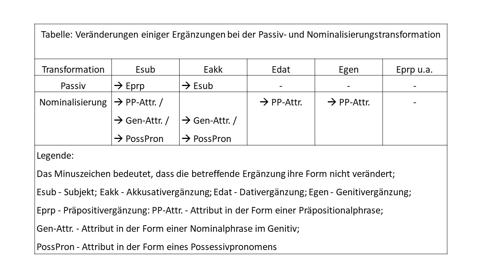

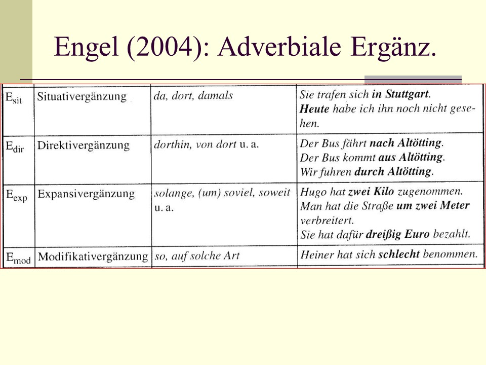

### Situativergänzung

E5 , Esit ; pS/Adv , pSA

Lokale wie temporale Esit benennen die Situation, in die ein Sachverhalt eingebettet ist.
Deshalb wird diese Art von Ergänzung im Mannheimer Valenzmodell auch ***Situativergänzung*** genannt (sie entspricht der Ergänzungsklasse E5 in Engel & Schumacher 1978: 68 ff).
Der Terminus "adverbiale Umstandsbestimmung des Ortes (bzw. der Zeit) in der deutschen Schulgrammatik verwischt (nach Latour 1985: 65) den **Unterschied**

a)  **zwischen verbspezifischen und nichtverbspezifischen** Satzgliedern und

b)  **zwischen Esit und Edir**, die u.a.
    durch spezifische Anaphern unterscheidbar sind.

Welche **Klassen von Verben** verlangen eine Esit ?

z.B.

(1) *sein, sich befinden, liegen, stehen, sitzen, wohnen, hängen, kleben, stecken*, ...

(2) *beginnen, anfangen, stattfinden, passieren; beißen*, ...

Die Esit kommt vor allem bei den Verben des räumlichen Sich - Befindens vor, seltener bei anderen Verben, bei denen das Geschehen zeitlich näher bestimmt wird.
[Engel 1988: 194 ff].
In der Grammatik von Engel werden auch einige wenige Verben zu dieser Klasse gezählt, die eine kausale Situativergänzung erfordern (z. B. *beißen*).

**Anapher**:

a)  lokal ([da, dort)]{.underline} ([da(r) + Prät)]{.underline}

b)  temporal [(dann)]{.underline}

c)  kausal [(deshalb)]{.underline}

Innerhalb einer Ergänzungskategorie liegen somit [drei]{.underline} (zumindest) unterschiedliche [*Anaphorisierungsmöglichkeiten*]{.underline} vor.
Warum haben die beiden Vertreter des Mannheimer Valenzmodells (Engel und Schumacher) trotzdem nur eine Ergänzungsklasse und nicht zumindest zwei verschiedene (lokale + temporale) Ergänzungsklassen gebildet ?
Laut Latour (1985: 66) taten sie dies eher aus praktischen Gründen, denn Verben mit einer [temporalen]{.underline} Esit sind nicht besonders häufig.
Daher hat man beide in einer E - Kategorie zusammengefasst.
Noch seltener sind Verben mit einer kausalen Situativergänzung.
Die meisten Kausalbestimmungen haben nämlich Angabestatus, d.h.
sie sind nicht spezifisch für bestimmte Verbklassen.

Wodurch unterscheidet sich die Situativergänzung Esit von der Präpositivergänzung Eprp?

z.B.
(3) Dort In ihr befand sich ein brauner Briefumschlag.
Auf ihr Unter ihr

(4) [Auf sie]{.underline} / [auf dein Entgegenkommen]{.underline} wartet er schon die ganze Zeit.

In (3) erscheinen Situativergänzungen, in (4) eine Präpositivergänzung.

Wesentliche **Kennzeichen der Esit** sind

a)  dass die Esit *ohne* Präposition vorkommen kann,\
b)  dass die Präposition *prinzipiell austauschbar* ist,\
c)  dass die Präposition in Esit eine *eigene* *Bedeutung* hat und\
d)  dass die Esit als Kategorie eine eigene Bedeutung hat; (bei der Eprp als Kategorie ist eine solche spezifische Eigenbedeutung nicht zu erkennen, was sie mit den restlichen Objekten, der Akkusativ-, Dativ- und Genitivergänzung, vergleichbar macht), d.h. die Esit ist nicht nur syntaktisch, sondern auch semantisch als *Kategorie* (bzw. als zwei oder drei Kategorien sogar) bestimmbar.

Welche **Ausdrucksformen** hat die Esit ?

z.B.
(5) [In der Kiste]{.underline} lag ein brauner Briefumschlag.\
(6) [In ihr]{.underline} lag ein brauner Briefumschlag.\
(7) [Darin]{.underline} lag ein brauner Briefumschlag.\
(8) [Dort]{.underline} lag ein brauner Briefumschlag.\
(9) Diese Leute wohnen, [wo der Weg zum Wald abbiegt.]{.underline}\
[Engel 1988: 195]

Die Esit erscheint in (5) und (6) als Präpositionalphrase (d. h. als Präposition + NP (5) bzw.
als Präp.
+ PrnP (6)), als Präpositionaladverb (7), Adverb (8) und wie die meisten anderen Ergänzungsklassen auch als generalisierende Nebensätze (9) oder indefinite Nebenätze.

Nach Engel (1988: 195) ist die Esit immer *obligatorisch.* Fakultative Situativbestimmungen (10) betrachtet er als [Angaben]{.underline} (mit jeder Art von Verb verbindbar).\
(10) Das Mädchen las [in ihrem Zimmer]{.underline} einen spannenden Arztroman und vergaß, zu ihrer Verabredung mit dem tollsten Junge in der Klasse zu gehen.

**Transformationen**:

z.B.
(11) Familie Meier wohnt [in einem Hochhaus.]{.underline}\
==\> Das Wohnen der Familie Meier [in einem Hochhaus.]{.underline}\
(12) Man stand [dort]{.underline} nur herum.\
==\> [Dort]{.underline} wurde nur herumgestanden.\
(Passiv mit intransitiven Verben seltener)

In den Beispielen (11) und (12) ist zu sehen, daß die Situativergänzung bei einer Nominalisierungs- oder bei einer Passivtransformationen unverändert bleibt.

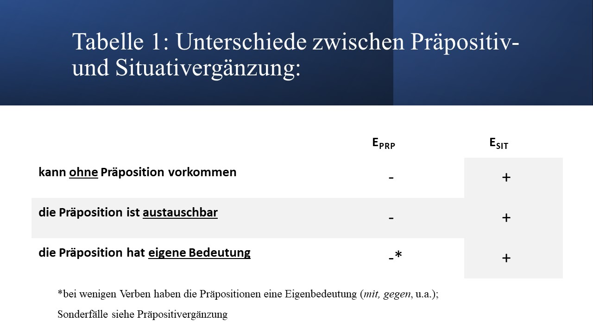

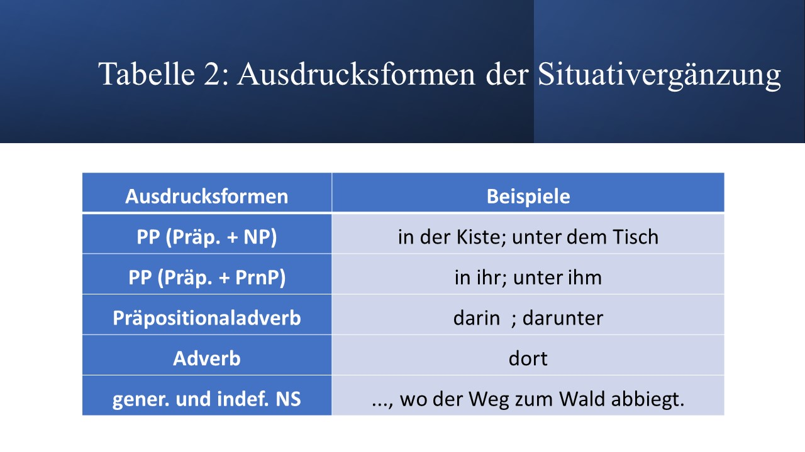

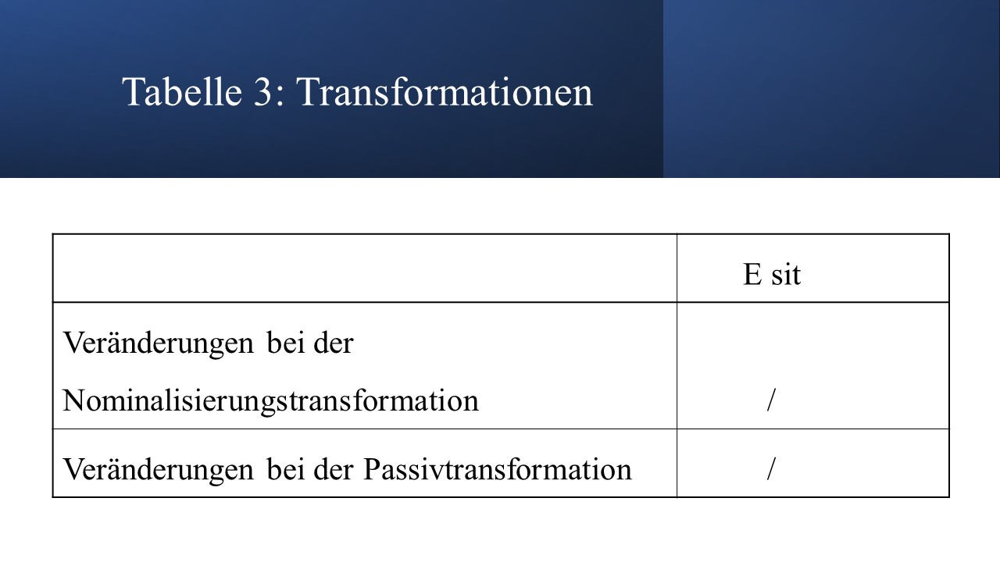

Weitere Beispiele und Erläuterungen zur Situativergänzung aus Latour (1985)

[Verben mit der Situativergänzung]{.underline}

Zur Valenz einer Reihe von Verben gehört eine Situativergänzung, die in meisten Fällen auch obligatorisch ist.

Beispiel: München liegt [*an der Isar*]{.underline}***.***

\*München liegt.

Die gleiche morphosyntaktische Struktur wie die Esit haben die situative Angaben.

Beispiel Er hat mir die Geschichte [*an der Isar*]{.underline} erzählt.

Eine temporale Esit erscheint selten, bei Verben wie *stattfinden, passieren , beginnen*.

Beispiel: Die Diskussion begann [*am frühen Abend*]{.underline}.

Es gibt einige Präpositionen mit lokaler Bedeutung, die sich nicht nur mit Hilfe von Adverbien anaphorisieren lassen, sondern auch durch die Anapher [da(r)- + Präposition]{.underline} (die ja gerade für die Präpositivergänzung Eprp charakteristisch ist).
Solche Präpositionen sind:

hinter [(dahinter)]{.underline}

neben [(daneben)]{.underline}

unter [(darunter)]{.underline}

zwischen [(dazwischen)]{.underline}

in [(darin)]{.underline}

über [(darüber)]{.underline}

vor [(davor)]{.underline}

Bei den Präpositionen [an]{.underline} und [auf]{.underline} ist diese Art der Anaphorisierung nur beschränkt möglich.

Beispiele: Eine Kugel hängt [am Tannenbaum]{.underline}.\
Eine Kugel hängt [daran]{.underline}.

Monika steht [an der Haltestelle]{.underline}.\
Monika steht [\*daran]{.underline}.

Das Buch liegt [auf dem Tisch]{.underline}.\
Das Buch liegt [darauf]{.underline}.

Fritz steht [auf dem Bahnsteig]{.underline}.\
Fritz steht [\*darauf]{.underline}.

Bei anderen lokalen Präpositionen wie [außerhalb]{.underline}, [bei]{.underline}, [diesseits]{.underline}, [gegenüber]{.underline}, [innerhalb]{.underline}, [inmitten]{.underline}, [oberhalb]{.underline} u.a.
ist nur die Anaphorisierung mit *da* und *dort* möglich.
Die Ausdrucksform der Esit ist dann eine adverbiale Partikel oder eine Präpositionalphrase, wobei die Präposition austauschbar ist.

Beispiele: Das Schloss befindet sich [dort]{.underline}.\
Das Schloss befindet sich [da oben]{.underline}.

Das Restaurant liegt [hinter dem Berg]{.underline}.\
Das Restaurant liegt [im Wald.]{.underline}\
(Latour 1985: 66, 67 ff)

### Direktivergänzung

E6, Edir; pS/Adv (pSA); Richtungsergänzung, Adverbialbestimmung

Diese Ergänzungsklasse lässt sich (gemäß Engel 1988: 195) mit sehr vielen Verben verbinden.
Eine wichtige Teilmenge der "Direktivverben" sind in (1) zu sehen.
Welche ?

z.B.
(1) *gehen, fahren, fliegen, kommen, ziehen, drehen*, ...

Es sind die Verben der *Fortbewegung*.

**Ausdruckformen**: [Engel 1988: 195]

z.B.
(2) Er stürzte sich [auf das Tier]{.underline}.\
(3) Er stürzte sich [auf den mit der Brille]{.underline}.\
(4) Er stürzte sich [darauf]{.underline}.\
(5) Er stürzte sich [hinein]{.underline}.\
(6) Er ging, [wohin der Wind ihn trieb.]{.underline}

Die Direktivergänzung erscheint in (2) und (3) als Präpositionalphrase (als Präp.+NP (2), als Präp.+PrnP (3)), als Präpositional-/Pronominaladverb (4), als Adverb (5) sowie als generalisierender / indefiniter Nebensatz (6).

**Unterscheidung zwischen Edir und Eprp**?
Siehe auch Esit!

Wesentliche **Kennzeichen der Edir** sind\
a) dass die Edir *ohne* Präposition vorkommen kann,\
b) dass die Präposition *prinzipiell austauschbar* ist,\
c) dass die Präposition in Edir eine *eigene* *Bedeutung* hat und\
d) dass die Edir als Kategorie eine eigene Bedeutung hat; (bei der Eprp als Kategorie ist eine solche spezifische Eigenbedeutung nicht zu erkennen, was sie mit den restlichen Objekten, der Akkusativ-, Dativ- und Genitivergänzung, vergleichbar macht), d.h.
die Edir ist somit nicht nur syntaktisch, sondern auch semantisch als *Kategorie* (bzw. als mehrere Kategorien sogar) bestimmbar.

**Anaphern**:\
Die Edir unterscheidet sich von den übrigen bisher behandelten Ergänzungsklassen (Subjekt, Akkusativ-, Dativ- und Genitivergänzung; im geringeren Maße jedoch von der zuvor behandelten Situativergänzung) durch die *Uneinheitlichkeit und Unübersichtlichkeit ihrer Anaphorisierungsverhältnisse.* Stellen Sie in den folgenden Beispielen jeweils eine geeignete Anapher für die folgenden Edir fest!

z.B.
(7) Klaus fährt [nach Osnabrück]{.underline}.\
(8) Der Zug kommt [aus Braunschweig]{.underline}.\
(9) Wir kommen diesmal nicht [über Göttingen.]{.underline}\
(10) Der Wagen drehte sich [um seine Achse]{.underline}.

Je nach Bedeutung sind folgende Anaphern geeignet und damit **Subklassen** von Direktivergänzungen unterscheidbar:

#### Subergänzungsklassen

(7) *Ziel der Bewegung* - [dahin, dorthin, hin]{.underline}\
(8) *Ausgangspunkt der Bewegung* - [von dort, von dorther, von daher]{.underline}\
(9) *passierter Bereich* - [darüber]{.underline}\
(10) *umgangener Bereich* - [darum, herum]{.underline}

Die Anaphorisierungsverhältnisse bei der Edir sind aber noch komplizierter:

Stellen Sie in den folgenden Sätzen die geeigneten Anaphern für Edir fest !

z.B.
(11) Er platzt [in die Gesellschaft]{.underline} hinein.\
(12) Peter wandert [in die USA]{.underline} aus.\
(13) Der junge Vögel fällt [aus dem Nest]{.underline}.\
(14) Der erschossene Gangster fiel [aus dem Wagen]{.underline}.\
(15) Wir kommen nicht [über Österreich]{.underline}.\
(16) Fritz steigt [über den Zaun]{.underline}.

(11,12) - *Ziel* -\
(11) [hinein, darein, herein, \*dahin, \*dorthin]{.underline}\
(12) [\*hinein, \*darein, \*herein, dahin, dorthin]{.underline}

(13,14) - *Ausgangspunkt*\
(13) [daraus, her-/hinaus, her-/hinunter, \*daher, \*dorther]{.underline}\
(14) [daraus, hin-/heraus, \*hin-/herunter, \*daher, \*dorther]{.underline}

(15,16) - *passierter Bereich*\
(15) [darüber, \*hin-/herüber,\*dahin, \*daher]{.underline}\
(16) [darüber, hin-/herüber, \*dahin, \*daher]{.underline}

Die **Anaphorisierungsprobe**, die sich bei der Bestimmung des Subjekts, der Akkusativ-, Dativ-, Genitiv- und Situativergänzung als taugliches Testverfahren zur Identifikation und Abgrenzung verschiedener Ergänzungsklassen bewährt hat, liefert nun sogar für Beispielsätze **innerhalb einer Subergänzung unterschiedliche Ergebnisse**.
Die Beispiele haben gezeigt, daß offenbar mit zwei verschiedenen Typen von Anaphern innerhalb einer Edir gearbeitet werden muss:

a)  *Partikelanaphorisierung* (Anaphorpart)

(da- / dort-) [hin / her]{.underline}

b)  *Pronominaladverbiale Anaphorisierung* (Anaphpronadv)

[da(r) + Präp,]{.underline} [hin + Präp.]{.underline}, [her + Präp]{.underline}

Die Subergänzungen *passierter Bereich* und *umgangener Bereich* sind nur durch b) Anaphpronadv anaphorisierbar.

[Latour 1985: 71; 68 - 83 weitere Beispiele und Hinweise]

Es gibt eine kleine Gruppe von Verben (Latour 1985: 68 ff), bei denen eine Zuordnung zur Edir nicht eindeutig ist.
Vergleichen Sie die folgenden Beispielsätze !

z.B.
(17) Er verschwand [in ein]{.underline} / [in einem Nebenzimmer]{.underline}.\
(18) Er schreibt [auf ein]{.underline} / [auf einem Blatt Papier]{.underline}.\
(19) Er versuchte [in die]{.underline} / [in der Sparkasse]{.underline} einzubrechen.\
(20) Er trug das Bündel, [in eine]{.underline} / [in einer Zeitung]{.underline} *eingewickelt*, zum Bahnhof.\
Aber: (21) Er *wickelte* das Bündel [in eine Zeitung]{.underline}.

Diese Verben (hier nicht vollständig aufgezählt) markieren einen **Überschneidungsbereich zwischen Esit und Edir**.
Aber sonst sind Esit und Edir relativ klar abgrenzbar.
[weitere Hinweise: Latour 1985: 68]

Bei den Subergänzungen "***passierter***" bzw.
"***umgangener Bereich***" ist nur Anaphpronadv möglich (Latour 1985: 82).
Aber welche Ergänzung wird ebenfalls durch Anaphpronadv identifiziert?
Wie kann man die Edir und die *andere* Ergänzungsklasse dennoch voneinander abgrenzen?

z.B.
(22) Der Zug fährt [durch den Tunnel]{.underline}.\
(23) Der Weg fährt [um den See]{.underline}.\
(24) Ich sehe ein Problem [in dieser Sache]{.underline}.\
(25) Wir wählen Paul [in den Betriebsrat]{.underline}.

Neben bereits oben genannten **Unterschieden zwischen Edir und Eprp** können noch zwei **weitere** hinzugefügt werden.

1.  Eine [Edir]{.underline} kann man durch die folgenden Formen anaphorisieren:

<!-- -->

a)  "da(r) + Präp."\
b)  "hin- / her- + Präp."

Die Eprp kann hingegen durch die folgenden Formen anaphorisiert werden:

a)  "da(r) + Präp."\
b)  "Präp. + Pron."

2\.
Die Anaphern zu [Edir]{.underline} in (25) offenbaren noch einen weiteren (leicht übersehbaren) Unterschied:

Die Präposition [*in*]{.underline} einer Edir wird bei Anaphpronadv zu [*- ein*]{.underline}, bei Eprp bleibt sie [*- in*]{.underline}.

Edir sind **teilweise obligatorisch, teils fakultativ**.
Von fakultativen Edir sprechen Engel & Schumacher (1978: 71), wenn dem betreffenden Element ein besonders hoher Erwartungsgrad und damit eine *spezifische Relation zum Verb* zugeschrieben wird.
Im anderem Falle, wenn diese Bedingung nicht erfüllt wird, liegt eine [*Direktivangabe*]{.underline} vor.

Vergleichen Sie !

z.B.
(26) Der Vogel fliegt ([nach Süden]{.underline}).\
(27) Er keuchte ([den Gang entlang]{.underline}).\
(28) Er lächelte ([hinüber]{.underline}).\
[Engel & Schumacher 1978: 71]

In (27) und (28) liegen gemäß Engel & Schumacher Angaben vor; die Verben dort kommen nur unter besonderen Kontextbedingungen mit Direktivangabe vor.

Es ist gelegentlich kritisiert worden, daß die Edir und die Esit "semantisch definiert" seien, während beispielsweise die Esub und die Eprp morphologisch definiert sind, d.h.
dass die Kriterien für die Klassifikation der E disparat seien.
Dazu Engel & Schumacher (1978: 71 ff):

1.  Die E beruhen auf Kommutationsreihen, die bereits [erhebliche semantische Voraussetzungen]{.underline} machen (die Elemente, die einander entsprechen - miteinander kommutieren, können semantisch ja nicht beliebig sein, wenn man [sinnvolle Sätze]{.underline} bilden will).
    -   Hierin liegt also kein Unterschied zwischen Edir und Esit einerseits und Esub und Eprp andererseits.
2.  Die *Doppelnatur des sprachlichen Zeichen* (Inhalts- und Ausdrucksseite): Man kann zwar keine grundsätzliche 1 : 1 Entsprechung zwischen Inhalts- und Ausdrucksseite feststellen, was aber nicht unbedingt bedeutet, daß sich zu oberflächensyntaktisch ermittelten Kategorien stellenweise keine semantische Entsprechungen ergeben können; stellenweise fehlen solche semantischen Entsprechungen allerdings (nämlich bei Esub, Eakk, Edat, Egen, Eprp).

Anmerkung: Das Subjekt transitiver Verben ist recht häufig **Agens** (d.h. Verursacher einer Handlung), die Akkusativergänzung recht häufig **Patiens** (d.h. betroffener oder erzeugter Gegenstand einer Handlung oder - seltener - Person einer Handlung), die Dativergänzung dagegen des öfteren **Adressat** (d. h. meist eine Person, an die die Handlung gerichtet ist).
Zu charakteristischen semantischen Interpretationen letzterer Ergänzungsklassen siehe auch Helbig & Buscha 1987 (unter den semantischen Satzmodellen).

**Transformationen** :

z.B.
(29) Die Vögel ziehen [in den Süden]{.underline}.\
==\> Der Zug der Vögel [in den Süden]{.underline}.\
(30) Man treibt die Stiere [durch die Straßen Pamplonas]{.underline}.
==\> Die Stiere werden [durch die Straßen Pamplonas]{.underline} getrieben.

Bei Passiv- oder Nominalisierungstransformationen bleibt die Edir unverändert.

Im Duden (1973: 488 ff) setzt man statt Esit und Edir (E6, E7 in Engel & Schumacher 1978) folgende Ergänzungsklassen an: Raumergänzung, Zeitergänzung, Begründungsergänzung.

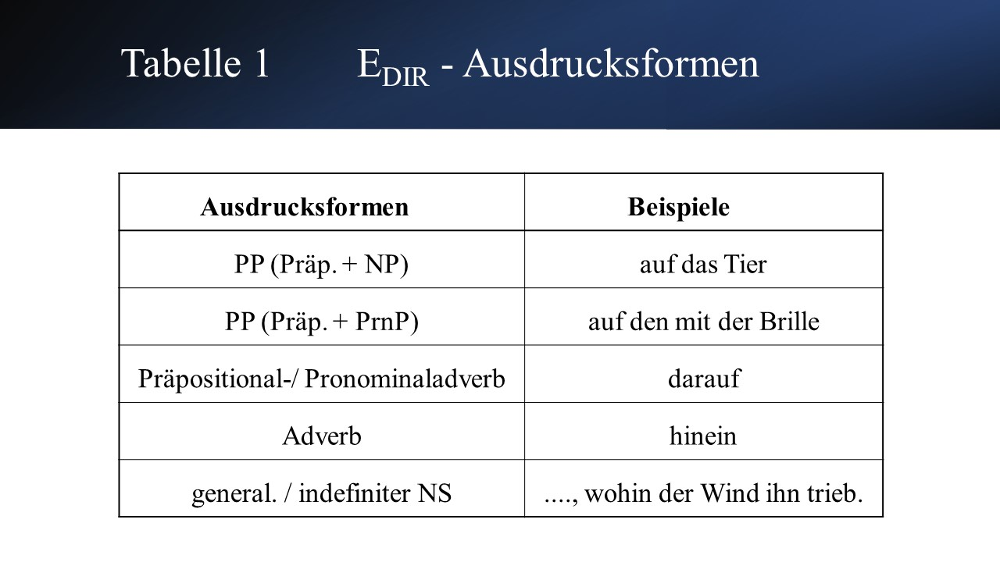

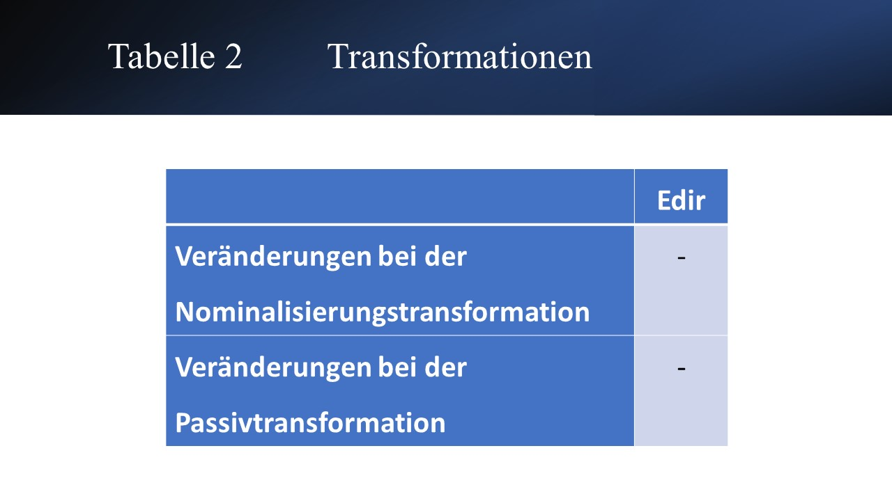

Weitere Beispiele und Erläuterungen zur Direktivergänzung

Nach Latour (1985: 69 ff) gibt es noch einige Verben, bei denen eine Zuordnung sowohl zu Edir als auch zu Esit möglich ist.
Diese Verben haben alle den trennbaren Verbzusatz [ein-]{.underline}.
Die Präposition ist in den meisten Fällen *in* und ist nicht kommutierbar (d. h. sie kann nicht gegen eine andere Präposition ausgetauscht werden), was bei den Esit und den Edir sonst nicht vorkommt.

Beispiele: einbrechen in [der / die]{.underline} Sparkasse\
sich einpendeln auf [ein / einem]{.underline} bestimmtes (-en) Niveau\
sich einreihen in [der / die]{.underline} Schlange der Wartenden\
etwas einzeichnen in [der / der]{.underline} Karte\
jemanden einsperren in\
sich einbürgern in\
sich eingewöhnen in

Bei Verben wie [einbetten, einklammern, einstufen, eintätowieren, einwachsen, einweben]{.underline} und anderen, die sonst mit der Direktivergänzung vorkommen, ist in Konstruktionen mit Partizip II alternativ auch eine Situativergänzung möglich.

Beispiel: Er wickelte das Bündel *in eine Zeitung* ein.
(Edir)\
Er trug das Bündel, *in eine / einer Zeitung* eingewickelt, zum Bahnhof.
( Edir / Esit)

Diese Verben kennzeichnen einen **Überschneidungsbereich** zwischen den beiden Ergänzungen, aber trotzdem handelt sich um Kategorien, die ansonsten klar voneinander abgegrenzt werden können.

Anmerkung: Auch im Slowenischen gibt es entsprechende Überschneidungen zwischen Direktiv- und Situativergänzungen.

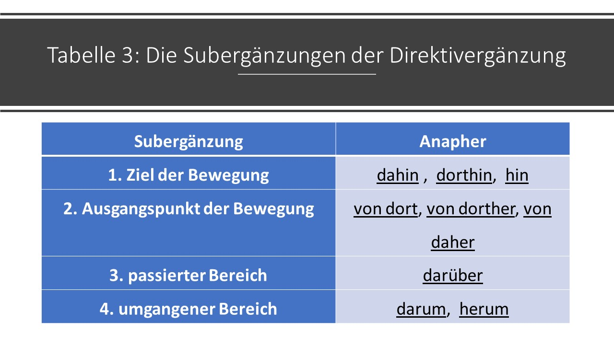

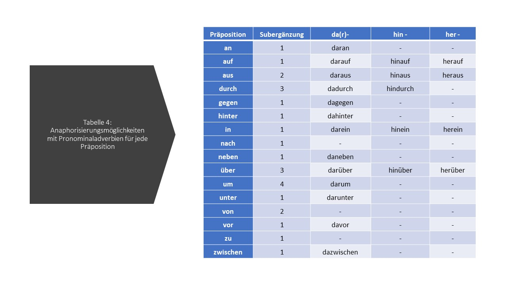

Beispiele:

**1. Ziel der Bewegung**

**an**

Uwe geht { ans Ufer.

[dahin, dorthin, \*daran]{.underline}

Er schraubt sein Namenschild { an die Tür.

[daran, \*dorthin, \* dahin]{.underline}

Häng bitte das Bild { an die Wand.

[daran, dahin, dorthin]{.underline}

**auf** (weitere Besonderheiten: Latour 1985: 73)

Morgen steigen wir { auf den Feldberg.

[darauf, hinauf, \*dahin, \* dorthin]{.underline}

Gisela drückt { auf den Knopf.

[darauf, \*hinauf, \*herauf, \*dahin, \*dorthin]{.underline}

**gegen**

a)  Der Wind dreht { gegen Osten.

[dahin, dorthin, \*dagegen]{.underline}

b)  Fritz fährt den Wagen { gegen einen Laternenpfahl.

[dagegen, \*dahin, \*dorthin]{.underline}

**hinter**

Der Ball fliegt { hinter das Tor.

[dahinter, dahin, dorthin]{.underline}

**in**

a)  Karin geht { in die USA.

[dahin, dorthin, \*darein, \*hinein, \*herein]{.underline}

Sonja fährt { ins Gebirge.

[dahin, dorthin, \*darein, \*hinein, \*herein]{.underline}

( a- Ländername enthalten; b- großräumigen Bewegungen)

b)  Lisa schlägt einen Nagel { in die Wand.

[darein, hinein, \*dahin, \*dorthin]{.underline}

(kleinräumige Bewegungen)

**nach**

a)  Wir fuhren { nach Heidelberg / Madagaskar.

[dahin, dorthin, \*danach]{.underline}

(Ortsname, Ländername)

b)  Fritz greift { nach dem Wecker.

[danach]{.underline}

(kleinräumige Bewegung !)

**neben**

Christian setzt sich { neben den Brunnen.

[daneben, dorthin, dahin]{.underline}

**unter**

Der Ball rollt { unter den Schrank.

[darunter, dahin, dorthin]{.underline}

**vor**

Anne fährt den Wagen { vor die Garage.

[davor, dahin, dorthin]{.underline}

**zu**

Bernd bringt den Koffer { zum Bahnhof.

[dahin, dorthin]{.underline}

**zwischen**

Friedrich fährt den Wagen { zwischen die beiden Bäume.

[dahin, dorthin, dazwischen]{.underline}

Karl legt ein Lesezeichen { zwischen die Seiten.

[dazwischen, \*dahin, \*dorthin]{.underline}

(Kleinräumigkeit !)

\

**2. Ausgangspunkt der Bewegung**

**aus**

a)  Der Zug kommt { aus Braunschweig / Frankreich.

[daher, dorther, \* daraus, \*heraus]{.underline}

(Ortsname, Ländername)

b)  Der junge Vogel fällt { aus dem Nest.

[daraus, heraus, hinaus, hinunter, herunter, \*daher,]{.underline}

[\*dorther]{.underline} (vertikale Bewegung)

Der erschossene Gangster fiel { aus dem Wagen.

[daraus, hinaus, heraus, \*daher, \*hinunter,\*herunter]{.underline}

(vertikale und horizontale Bewegung)

c)  Fritz steigt { aus dem Fenster.

[daraus, hinaus, heraus, \*daher, \*dorther]{.underline}

**von**

a)  Der Wind weht { von Norden.

[daher, dorther, \*davon]{.underline} (weiträumige Bewegungen)

b)  Robert fällt { von der Leiter.

[hinunter, herunter, \*davon, \*daher, \*dorther]{.underline}

c)  Monika nimmt die Decke { vom Tisch.

[weg !]{.underline}

[\*davon, \* daher, \*dorther, \*herunter]{.underline}

\

**3. Passierter Bereich**

**durch**

Jürgen fällt { durch die Glasscheibe.

[dadurch, hindurch, \*dahin, \*daher]{.underline}

Wir fuhren { durch Italien.

[dadurch, hindurch, \*dahin, \*daher]{.underline}

(direktionale Bewegung)

**über**

a)  Wir kommen nicht { über Frankfurt / Österreich.

[darüber, \*hinüber, \*herüber, \*dahin, \*daher]{.underline}

b)  Nina steigt { über den Zaun.

[darüber, hinüber, herüber, \*dahin, \*daher]{.underline}

**4. Umgangener Bereich**

**um**

Der Weg führt { um den See.

[darum, herum, \*dahin, \*dorthin]{.underline}

### Expansivergänzung

Die Expansivergänzung (E~exp~ ) ist eine von Engel (1988: 196) angesetzte Ergänzung, die in den Valenzmodellen der anderen von uns behandelten Grammatiker als besondere Ergänzungskategorie fehlt.

Stellen Sie in den folgenden Beispielsätzen Unterschiede zwischen den unterstrichenen Ergänzungen hinsichtlich ihrer **Anaphorisierung** fest!

z.B.: (1) Er nahm ihr [den Schlüssel]{.underline} ab.\
(2) Er nahm in dieser Zeit [zehn Kilo]{.underline} ab.\
(3) Sie fuhr mit dem Wagen [zum Bahnhof]{.underline}.\
(4) Die Sitzung dauerte [bis zum späten Abend]{.underline}.\
(5) Die Hausfrau fürchtet [um den Braten]{.underline}.\
(6) Der Schneider kürzte die Hose [um einen Zentimeter]{.underline}.

Die Anaphorisierung macht folgende Unterschiede deutlich (in Klammern hinter der Bezeichnung für die betreffende festgestellte Ergänzung steht die einsetzbare Anapher):

(1) Eakk (ihn), (2) Eexp ( (um) soviel); (3) Edir ([dahin, dorthin]{.underline}), (4) Eexp ( [so lange)]{.underline}; (5) Eprp ([darum]{.underline}); (6) Eexp ([um soviel]{.underline}).

**Semantisch** sind auch andere Unterschiede zwischen den unterstrichenen Phrasen erkennbar:

(1) Gegenstand, (2) Massenbezeichnung; (3) Richtung der Bewegung, (4) Expansion (Ausdehnung) in der Zeit; (5) Gegenstand, (6) Maßbezeichnung.

**Transformationen**:

In (1) und (2) erscheinen Nominalphrasen im Akkusativ.
Die Passiv- und die Nominalisierungstransformation zeigen wie schon das Anaphorisierungsverfahren einen syntaktischen Unterschied zwischen den beiden Nominalphrasen im Akkusativ an.

(1) Er nahm ihr [den Schlüssel]{.underline} ab.

    -   Der Schlüssel wurde ihr von ihm abgenommen. (Passiv) - Das Abnehmen des Schlüssels (Nominalisierung)\

(2) Er nahm in dieser Zeit [zehn Kilo]{.underline} ab.

    -   \* Zehn Kilo wurden in dieser Zeit von ihm abgenommen. (Passiv) - Das Abnehmen von zehn Kilo (Nominalisierung)

(3) Eakk =\> Esub im Passivsatz; Eakk =\>Sg Attribut in Nominalisierung;

(4) Passiv nicht möglich; Sa =\> Sg bzw.
    von + NP Attribut in Nominalisierung.

Die aufgezeigten Unterschiede machen es zweckmäßig, solche Ergänzungen als besondere Ergänzungskategorie auszusondern, obwohl sie selten vorkommt.
Sie ist auf Verben beschränkt, die eine messbare Veränderung im Raum oder in der Zeit bezeichnen: *gehen, wachsen, dauern*, usw.
Die Eexp gibt immer das Ausmaß der vom Verb bezeichneten Veränderung an.
Eexp ist meist fakultativ.

**Anaphern**: *(um) soviel, soweit; so lange*

**Ausdrucksformen**:

z.B.: (7) Der Baum wuchs jährlich [etwa einen halben Meter]{.underline}.\
(8) Er verlängerte den Rock [um fünf Zentimeter]{.underline}.\
(9) Seine Stimme hallte [weit]{.underline}.\
(10) Die Sitzung dauerte [ziemlich lange]{.underline}.
Die Sitzung dauerte, [bis die letzten Züge fuhren]{.underline}.

• NP mit Sa (7),\
• *um* + NP/PrnP (8),\
• Adj.P/ AdvP (9),\
• NS (10).

Transformationen: s.o.

-   In anderen Valenzmodellen fällt die Eexp je nach Semantik und Paradigma unter Eakk, Eprp, Edir bzw. Raumergänzung, Zeitergänzung, u.a.

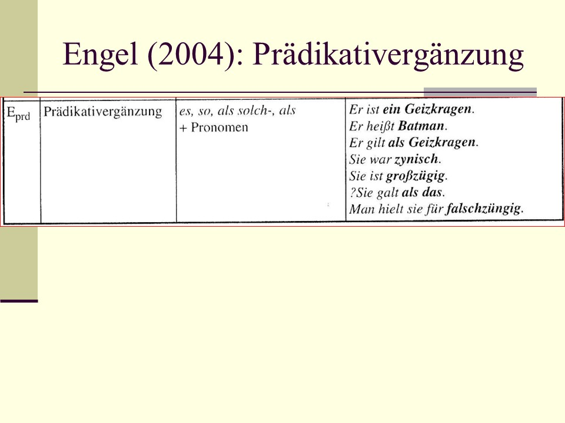

### Modifikativergänzung

Die Modifikativergänzung (E~mod~) wurde von [@engel2004deutsche] für eine kleine Gruppe von Verben neu eingeführt, und zwar für die Verben des sich-Verhaltens, einer Gruppe von statistischen Verben (wie z.B. *sein*). 

**Identifikation**:   
- Anapher *auf diese Weise, auf diese Art*,   
- Frage *wie?*

(1) Er benimmt sich *schlecht*.   
(2) Sie verhält sich *kameradschaftlich*.   

Die Modifikativergänzung ist bei diesen Verben obligatorisch. Im Imperativ kann man das Verb *sich benehmen* auch ohne Modifikativergänzung verwenden.    

(3) *Benimm dich* oder es knallt!

Dieses Kriterium war auch bei den Situativergänzungen schon verwendet worden und war hilfreich bei der Abgrenzung von den situierenden Angaben. Trotz der Forderung nach obligatorischem Auftreten gestaltet sich die Abgrenzung der Modifikativergänzung von der Prädikativergänzung, aber auch von der modifikativen Angabe, dennoch schwierig, da dieselben Anaphern (*auf diese Art, auf diese Weise*) oder dieselbe Fragestellung (*wie?*) auch bei diesen Klassen Anwendung finden.   

(4) Die Stiefeltern behandelten den Jungen *fürsorglich*. (Prädikativergänzung: sie behandelten ihn auf diese Weise - wie behandelten sie ihn?)   
(5) Unsere Oma hört und sieht *schlecht*. (modifizierende Angabe: sie hört / sieht so - wie hört und sieht sie?)   
(6) Mein Freund fährt *schneller*, als die Polizei es erlaubt. (modifizierende Angabe: wie, auf welche Art und Weise fährt er?)   

Allein aus diesen wenigen Beispielen ist ersichtlich, dass es zu Überschneidungen zwischen den beiden Ergänzungsklassen und der Angabeklasse kommt und dass die Modifikativergänzung als eigenständige Ergänzungsklasse nicht notwendig zu scheint. [@durovic2004proundcontra] schlägt vor, die Modifikativergänzung als Subklasse des Prädikativums, als Modalprädikativum, einzuordnen.      

### Prädikativergänzung

Die Nominal- und die Adjektivalerängzung (E~nom~ und E~adj~) wurden in neueren Auflagen der Grammatik von [@engel2008deutsche] als Prädikativergänzung (E~prd~) zusammengefasst.

#### Ehemalige Nominalergänzung (E~nom~)

In anderen Valenzmodellen wird die Nominalergänzung auch als Subsumptivergänzung, Einordnungsergänzung, Subjektprädikativ oder "substantivisches Prädikatsnomen" bezeichnet.

Die Enom und die Eadj (Bezeichnungen von Engel 1988: 196-197) kommen in der traditionellen Grammatik teilweise gar nicht vor, weil sie als Teil des "Prädikats" begriffen werden, in dem das Verb (meist [sein]{.underline}, [werden]{.underline}, [bleiben]{.underline}) nur noch die unselbständige Rolle einer "Kopula" spielt, während das Substantiv als substantivisches Prädikatsnomen und das Adjektiv als adjektivisches Prädikatsnomen bezeichnet wird.

Vergleichen Sie folgende Beispielsätze!
z.B.:\
(1) Manfred *ist* [Musiker]{.underline}.
Fritz ist [mein Freund]{.underline}.\
(2) Der Sohn *ähnelt* [seinem Vater]{.underline}\
(3) Der Sohn *ist* [seinem Vater]{.underline} [*ähnlich*]{.underline}.

Jung (1984: 64) führt drei relevante Aspekte für die Auffassung "Kopula + Prädikativ = Prädikat" an:

a• die volle lexikalische Bedeutung steckt im Prädikativ;\
b• die Zahl und Art der Aktanten durch das Wort im Prädikativ festgelegt;\
c• das häufigste Kopulaverb *sein* wird bei einer Nominalisierung weggelassen.

zu a• vergleichen Sie die lexikalischen Bedeutungen der Verben und der Prädikative in den folgenden Sätzen!

z.B.: (5) Sein Freund *ist* gestern um 11 Uhr [angekommen]{.underline}.\
(6) Er *ist* [Musiker]{.underline}.\
(7) Er *ist* seiner Sorgen [ledig]{.underline}.\
(8) Den Jungen *interessiert* die Lösung.\
(9) Der Junge *ist* [interessiert]{.underline} (an der Lösung)

zu b • Vergleichen Sie die Valenz der Verben und Prädikative!

zu c • Nominalisieren Sie!
(Satz---\>NP)

In (5,6): Vergleich der Bedeutung von *sein*

In der Grammatik von Jung wird also das gesamte Prädikat ("Kopula" + Prädikativ) als primärer Valenzträger angesehen, die "kopulativen" Verben von den autosemantischen Verben unterschieden.
Die Valenz des (prädikativen) Adjektivs (Substantivs) rückt damit auf die gleiche Stufe wie die Valenz des Verbs (Stepanowa / Helbig 1981: 171).

Wenn das Verb als primärer Valenzträger im Satz angesehen wird, dann sind "kopulative" und autosemantische Verben syntaktisch gleichwertig.
Man kann dann von einer Hierarchie der Valenz ausgehen (Stepanowa / Helbig 1981: 171).

Glinz und die inhaltbezogene Grammatik wollten der "Kopula" (so Engel & Schumacher 1978: 72) wieder den Rang eines vollwertigen Verbs zugestehen.
Sie verkannten aber die durch das Verb und das "Prädikatsnomen" ausgedrückte Beziehung und Namen und griffen daher zu Bezeichnungen wie "Gleichgröße" (Glinz), "Gleichsetzungsnominativ" (Grebe), "Artangabe" (Glinz), "Artergänzung" (Grebe).

Warum sind die soeben angeführten Bezeichnungen problematisch?
Vergleichen Sie die folgenden Beispielsätze!

z.B.: (11) Dieser Mann ist [sein Vater]{.underline}.\
(12) Ljubljana ist [die Hauptstadt Sloweniens]{.underline}.\
(13) Das Auto ist [ein Verkehrsmittel]{.underline}.\
(14) Mein Schwager heißt [Manfred]{.underline}.\
(15) Mein Bruder ist [Beamter]{.underline}.\
(16) Er gilt [als Fachmann]{.underline}.\
(17) Er benimmt sich [wie ein Rindvieh.]{.underline}

Nur in (11) und (12) geht es wirklich um eine Gleichsetzung der beiden Nominative.
In den restlichen Sätzen muss man doch eher von einer Einordnung des Individuums in eine bestimmte Kategorie sprechen, die im Subjekt ausgedrückt wird.
Das betreffende Element wird klassifiziert (siehe auch Latour 1985: 84f; Engel 1988: 197), sei es durch [Einordnung in eine Obermenge]{.underline}, sei es durch [Zuordnung eines Merkmals]{.underline}.
Entsprechendes gilt übrigens auch für die Eadj .

Eine Unterscheidung zwischen den Ergänzungsklassen Enom und Eadj erscheint den Vertretern des Mannheimer Valenzmodells (Engel 1988, Engel & Schumacher 1978 und Latour 1985) dennoch aus praktischen Gründen erstrebenswert.
Warum wohl?

z.B.: (18) Dein Freund heißt [Manfred]{.underline}, nicht?\
(19) Manfred ist [freundlich]{.underline}.

Enom und Eadj werden durch verschiedene Wortklassen konstruiert (Nomen - Adj. ; daher die Bezeichnungen "Nominalergänzung" und "Adjektivergänzung") und subsumieren oder qualifizieren dementsprechend eine andere Größe.

Was spricht dafür, dass Enom, Eadj (in anderen Grammatikmodellen "Prädikativ" genannt) als selbständiges Satzglied und nicht als Teil des Prädikats angesehen werden kann?
Vergleichen Sie!

z.B.: (20) Manfred ist [mein Freund]{.underline}.\
(21) Sein Vater ist [freundlich]{.underline}.\
(22) Seine Mutter ist *abgereist*.

Permutierbarkeit, Kommutierbarkeit, Anaphorisierbarkeit.

Die unterstrichenen Ausdrücke in (20) und (21) sind permutierbar (d. h. sie können beispielsweise mit dem Subjekt den Platz tauschen), kommutierbar (d. h. es sind verschiedene sprachliche Formen mit gleicher Funktion im Satz einsetzbar) und auf spezifische Art und Weise anaphorisierbar (nämlich durch das Pronomen *es* und/oder das unflektierte Adverb *so*).
Sie stehen nur bei bestimmten Klassen von Verben - mit anderen Worten: sie sind subklassenspezifisch und können damit als Ergänzungen (und nicht als Angaben) eingeordnet werden.
Enom und Eadj sind außerdem obligatorisch.

Allerdings ist im Fall der Enom und Eadj zu erkennen, dass die Anaphern *es* und *so* nicht in jedem Fall einsetzbar sind.
Die Anaphorisierbarkeit dieser beiden Ergänzungen scheint somit auch von semantischen Gesichtspunkten bestimmt zu werden, nämlich von der Bedeutung des regierenden Verbs.

**Anaphern**:

Stellen Sie in den folgenden Beispielen geeignete Anaphern fest!

z.B.: (23) Karl ist [Angestellter]{.underline}.\
(24) Alle nennen ihn [Karlchen]{.underline}.\
(25) Dr. Uhlenbeck gilt [als Genie]{.underline}.\
(26) Die Klasse bekommt Herrn Schneider [als Lehrer]{.underline}.\
(27) Er verhält sich [wie ein guter Freund]{.underline}.\
(28) Er behandelt mich [wie seinen Vertrauten.]{.underline}\
(29) Er hat sich [als Bürger]{.underline} erwiesen.

(23) es, (24) so, (25) ? als einen, ? als solchen, (26) ? als einen, ? als solchen, (27) so, (28) so, (29) als solcher.

Bei bestimmten Verben scheint die Enom nur schwer bzw.
nicht anaphorisierbar zu sein ( Latour 1985: 84 - 85).

**Ausdrucksformen**: S.
(23-28)\
•NP/PrnP mit N/Prn im Nom.(23),\
•NP: Er hieß [so]{.underline}.
Er blieb, [der er immer gewesen war.]{.underline}

(30) Man hielt ihn [für einen langweiligen Menschen]{.underline}. (Enom oder Eprp ?)

#### Ehemalige Adjektivalergänzung

In anderen grammatischen Werken wird die Adjektivalergänzung (E~adj~) auch als Artergänzung, Qualitativergänzung, oder "adjektivisches Prädikatsnomen" bezeichnet.

Diese Ergänzung ist der E~nom~ semantisch und morphosyntaktisch so ähnlich, dass es ernsthaft Argumente gibt, beide in **einer** Ergänzungskategorie zusammenzufassen.

•Worin liegt der Hauptunterschied zwischen Enom und Eadj ?

z.B.: (1) Brigitte ist [ein verträumtes Mädchen]{.underline}.\
(2) Brigitte ist [verträumt]{.underline}.

Der Kern einer Eadj ist ein Adjektiv (bzw. ein Adverb), der Kern einer Enom dagegen immer ein Substantiv.
Außerdem kann man einen weiteren Unterschied zwischen Enom, und Eadj feststellen, der morphologischer Natur ist.
Vergleichen Sie (1) mit (2) und (3) mit (4)!

z.B.: (3) Man hat ihn [einen Fachmann]{.underline} genannt.\
(4) Man nennt Franz [zuverlässig]{.underline}.

Bei der Enom kann der Unterschied zwischen Nominativ und Akkusativ zutage treten.
Prädikative Adjektive werden im Dt.
nicht flektiert.

• Steht die Eadj bei den gleichen Verben wie die Enom?

In (5) sind Verben angeführt, die mit der Nominalergänzung kombiniert werden können.
Welche Anaphern können wir einsetzen und welche Ausdrucksformen kann die Eadj annehmen?
Vergleichen Sie dazu die Beispiele in (6) - (14).

z.B.: (5) *sein, nennen, werden, machen; heißen, sich benehmen, zählen + als, sich ausgeben als, ansehen + als*, usw.\
(6) Sie war [nachdenklich]{.underline}.\
(7) Sie war [wie krank]{.underline}.
Man sah sie [als geeignet für diese Stelle]{.underline} an.\
(8) Sie war [es]{.underline} auch.
Sie war eben [so]{.underline}.\
(9) Sie benahm sich, [wie man es von ihr gewohnt war]{.underline}.\
(10) Karin ärgert sich [schwarz]{.underline}.\
(11) Die Geschichte lässt mich [kalt]{.underline}.\
(12) Die Tür steht [offen]{.underline}.\
(13) Er nimmt die Sache [ernst]{.underline}.\
(14) Sie trinkt ihr Glas [leer]{.underline}.

Die Eadj kann bei einigen der unter (5) stehenden Verben nicht stehen, aber hauptsächlich bei denselben Verben wie die Enom ("Kopulaverben" und bei einigen anderen).
Durch die verwendbaren Anaphern in (6) - (14) wird die kategoriale Nähe zwischen Enom und Eadj deutlich (z.B. 6-9): [es, so]{.underline}.

Beide Ergänzungen klassifizieren das Subjekt oder das Objekt:\
a) durch Einordnung in eine Obermenge,\
b) durch Zuordnung eines Merkmals.

Die Eadj nennt eine Eigenschaft, eine Beschaffenheit, einen Zustand der Größe, die durch die Esub / Eakk bezeichnet wird.
Die Beispiele (10-14) zeigen jedoch, dass die beiden Anaphern [es, so]{.underline} nicht in allen Fällen einsetzbar sind.

Welche Schlussforderungen könnte man in solchen Fällen ziehen?
Sind die Adjektive dennoch als Eadj anzusehen?

a)  die Adjektive in (11) - (12) sind keine Eadj , sondern könnten (gemäß der Rechtschreibung bis 1998) als Verbzusätze eingeordnet werden (d. h. als Teile komplexer Verben: so in *offenstehen, kaltlassen*), nach der neuen Rechtschreibung dagegen als phraseologische Einheiten verstanden werden (*offen stehen, kalt lassen, ernst nehmen, leer trinken, schwarz ärgern*);\
b)  die Adjektive in (10) - (14) sind erststellenfähig und nehmen folglich eine Zwischenstellung zwischen Eadj und trennbarem Verbzusatz ein.

Damit wird deutlich, dass es:\
a) zwischen Ergänzungen und Angaben (z.B. Edat, Eakk, (Esit), Edir),\
b) zwischen Ergänzungen und Verbkomplex fließende Übergänge gibt.

**Ausdrucksformen**: (Engel 1988: 197)\
• (wie / als) + AdjP (6,7),\
• Partikel (8), •NS (9).

• Ist die Eadj (wie die Enom) obligatorisch oder kann man auch fakultative Eadj feststellen?

Teilweise in [negierten Sätzen]{.underline} kann man Eadj weglassen.

z.B.
(15) Er kann sich einfach [nicht]{.underline} benehmen.
(statt: Er kann sich einfach nicht entsprechend / richtig / angemessen / ... benehmen)

• In den folgenden 3 Beispielsätzen (16-18) handelt es sich um 3 verschiedene Ergänzungen.
Was ist ihnen gemeinsam, wodurch unterscheiden sie sich?

z.B.
(16) Man bezeichnet ihn [als Genie]{.underline}.\
(17) Man bezeichnet ihn [als genial]{.underline}.\
(18) Man hält ihn [für ein Genie]{.underline} / [für genial]{.underline}.

a)  gemeinsame Semantik (Einordnung eines Individuums in eine Kategorie bzw. die Zusprechung einer Eigenschaft),\
b)  morphosyntaktische Unterschiede (Phrasen mit verschiedenen Wortklassen als Kerne, Präp. - Austausch nicht möglich); verschiedene Anaphorisierung ([so solcher; so; dafür; für einen solchen)]{.underline}, ein wichtiges Argument für die Zuordnung zu verschiedenen Ergänzungsklassen.

### Verbativergänzung

In den Tabellen (Engel & Schumacher 1978; Engel 1988: 187), die eine Übersicht über die Ergänzungen in der deutschen Gegenwartssprache geben, fällt auf, dass die E~vrb~ (E9) nur eine ganz bestimmte Formen aufweist.
In welchen Formen kommt die Evrb nämlich vor?

Die Evrb ist im Gegensatz zu den oben genannten Ergänzungen per definitionem **satzförmig**: sie kommutiert nicht mit einer NP, allenfalls mit einem Pronomen (Prn) wie [es]{.underline} oder [das]{.underline}.
(Latour 1985: 89; Engel 1988: 198).
Die Evrb wird in den meisten Grammatiken nicht als besondere Ergänzungsklasse ausgesondert, wie die Vergleichstabelle (Engel & Schumacher 1978: 22-23) nahelegt.

Ergänzungen in Form von Nebensätzen sind uns in den Beschreibungen der anderen Ergänzungsklassen bereits begegnet.

Generalisierende Nebensätze sind (laut Engel & Schumacher 1978: 77; Latour 1985) bei allen Ergänzungen außer bei den Evrb möglich.

• Wodurch unterscheiden sich Evrb einerseits und die satzförmigen Ergänzungen (SE) und die generalisierenden Nebensätze (gen. NS) andererseits?\
- SEakk(1), gen. NS (2), Evrb (3)

z.B.: (1) Er antwortete, [dass das neue Gesetz morgen in Kraft trete.]{.underline}\
(2) [Wer ihn kennt,]{.underline} sagt nichts.\
(3) Es heißt, [dass dicke Menschen gemütlich sind]{.underline}.

Der Unterschied zeigt sich in der **(Nicht-) Kommutierbarkeit mit NP**: Bei den Evrb handelt es sich um obligatorische NS in Ergänzungsfunktion, die nicht durch NP oder andere Ausdrücke ersetzt werden können.
Die SE und gen. NS können dagegen durch nicht-satzförmige Elemente ersetzt werden.
Für die Evrb ist eine Stellung am Satzanfang wesentlich ungewöhnlicher als für die SE und gen. NS.
(Latour 1985: 90)

Wie **anaphorisiert** man eine Evrb?

Das ist eines der großen Probleme im Mannheimer Valenzmodell und der Valenztheorie überhaupt.
Die Valenztheorie liegt keineswegs abgeschlossen vor uns.
Es gibt bestimmte Probleme, für die sie (noch) keine befriedigenden Lösungen anzubieten hat.
Ein Beispiel dafür ist die Anaphorisierung, das wichtigste Mittel (neben der Kommunikation) im Valenzmodell von Engel (1988), Engel & Schumacher (1978), Latour (1985), um die einzelnen E-Klassen gegeneinander abzugrenzen.
Die Anaphorisierungsprobe versagt leider in einigen Fällen (z.B.: Eprp - Edir); daher wurden semantische Kriterien herangezogen.

Wie anaphorisiert man einen Satz?
(denn die Evrb ist ja immer satzförmig).
Es gilt mehrere Elemente eines Satzes (d.h. ein Verb + E) zu anaphorisieren.
Zur Anaphorisierung des Verbs einer Evrb bedienen wir uns eines Mittels, das verwendet wird, um Wortwiederholungen zu vermeiden.
Welches Mittel ist das?

z.B.: (4) Karl stopft sich eine Pfeife und Franz [tut / macht]{.underline} es auch.\
(5) Klaus singt und Petra [tut]{.underline} es auch.

Man verwendet ein **Proverb** (ein Verb mit sehr allgemeiner Bedeutung).
Die WG [es tun / es machen]{.underline} können offensichtlich ein Verb + E oder auch ein Verb ohne E anaphorisieren, aber nicht das Verb isoliert von seinen Ergänzungen.

• Versuchen Sie nun eine Evrb zu anaphorisieren!
Welche Anaphern sind geeignet bzw.
nicht geeignet?

z.B.: (6) Petra lässt [die Milch anbrennen]{.underline}.\
(7) Es heißt, [Herr Meier ist (bleibt, wird) krank]{.underline}.\
(8) Nun gilt es, [Geduld zu haben]{.underline}.\
(9) Es heißt, [er hat die Stelle bekommen]{.underline}.\
(10) Du hast [den Brief auf dem Schreibtisch liegen]{.underline} lassen.\
(11) Ich frage mich, [ob sie nicht doch recht hat]{.underline}.\
(12) Ich fürchte, [dass sie heute nicht kommt]{.underline}.

Die Verben [sein, werden, bleiben, heißen]{.underline} sind nur durch sich selbst anaphorisierbar.
Die Evrb bei den Verben [zögern, sich weigern, es gilt, geruhen, (nicht) umhinkommen, es heißt + Infinitiv]{.underline} können nicht anaphorisiert werden.

Kann bei einem bestimmten Verb eine Ergänzung nicht anders als satzförmig realisiert sein, so müssen wir wohl eine Evrb annehmen.
(Latour 1985: 91-93)

Die Evrb kommt nur bei einer kleinen Anzahl von Verben vor.
Diese Ergänzungsklasse kommt regelmäßig bei allen Nebenverben vor und ist nach der Auffassung von Engel (1988: 198) dann [keine]{.underline} Satzergänzung (sondern Teil des Verbalkomplexes).

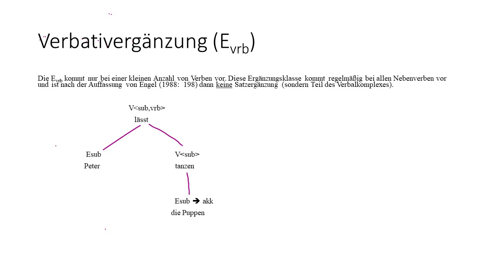

## Angaben

(nach Engel 1988: 219-239)

**0. ÜBERBLICK**

Jeder Satz und jedes satzartige Konstrukt (Nebensätze, Infinitivsätze, satzwertige Partizipialkonstruktionen) kann durch Elemente erweitert werden, die nicht vom Verb ausgewählt werden, sondern frei hinzufügbar sind und lediglich von der Sprechsituation bestimmt werden.
Diese Elemente heißen (**freie**) **Angaben**.
Sie werden zwar wie die Ergänzungen vom Verb regiert, sind aber im Gegensatz zu den Ergänzungen **nicht valenzbedingt**, also **nicht subklassenspezifisch** (d.h. nicht spezifisch für bestimmte Verbklassen), und können daher prinzipiell zu den verschiedensten Verben hinzugefügt werden (*sie passen prinzipiell zu allen Verben*).

Engel (1988: 219) unterscheidet vier **Großklassen von Angaben**:\
- **modifizierende** (modifikative) verbbezogene Angaben - A~mod~\
- **situierende** (situative) satzbezogene Angaben - A~sit~\
- **negative** Angaben - A~neg~\
- **existimatorische** äußerungsbezogene Angaben - A~ex~.

### Modifizierende Angaben

Modifizierende Angaben beziehen sich auf das Hauptverb[[1]](#_ftn1) eines Satzes.
Sie modifizieren (d.h. verändern, wandeln ab) eine Handlung, einen Vorgang oder Zustand, der durch das Hauptverb eines Satzes ausgedrückt wird.
Modifizierende Angaben können somit als **verbbezogene** Angaben charakterisiert werden.

**Ausdrucksformen**:\
- Adverbien (1)\
- Adjektive (in adverbialer Funktion) (2)\
- Präpositionalphrasen (3)\
- *wie*-Phrasen (4)\
- Nebensätze (5).

(1) Ich habe die Frauen [gern(e)]{.underline} geküßt.\
(2) Paul hat trotz seiner großen Nase [freiwillig]{.underline} an dem Schönheitswettbewerb teilgenommen.\
(3) Die Studentin sprach [mit großer Freude]{.underline} über die bestandene Deutschprüfung.\
(4) Die neue Angestellte führte die Aufträge [wie ihre Vorgängerin]{.underline} aus.\
(5) Sie fuhr den Wagen, [als ob sie von hundert Polizisten verfolgt würde]{.underline}.

**Identifizierung** mithilfe von:\
- Anapher *so*\
- Präpositionalphrase *auf diese Art und Weise*\
- Frage mit Interrogativadverb *wie*.

(1a) Ich habe die Frauen [so]{.underline}/[auf diese Weise]{.underline} geküßt.\
(1b) [Wie]{.underline} habe ich die Frauen geküßt?

Modifizierende Angaben stehen gewöhnlich **nahe dem Hauptverb**.
Wenn das Hauptverb als Inifinitiv oder Partizip II im rechten Klammerteil auftritt, kann die modifizierende Angaben nicht rechts davon erscheinen, sondern lediglich **im Mittelfeld** (d.h. zwischen finitem und infinitem Verb) und **im Vorfeld von Aussagesätzen** (d.h. vor dem finiten Verb eines Aussagesatzes).

(1c) \* Ich habe die Frauen geküßt [gern(e)]{.underline}.\
(1d) [Gern(e)]{.underline} habe ich die Frauen geküßt.

### Situierende Angaben

Es handelt sich hier um die am **stärksten gegliederte** und am **häufigsten** vorkommende Großklasse von Angaben.
Alle situierenden Angaben haben die Funktion, den im Satz beschriebenen Sachverhalt in verschiedenartige (temporale, lokale, kausale u.a.) Zusammenhänge einzuordnen.
Situierende Angaben beziehen sich somit auf den ganzen Satz und können daher als **satzbezogene** Angaben bezeichnet werden.

Zur Untergliederung dieser Großklasse verwendet Engel die herkömmliche semantische Subklassifikation.

**Semantische Klassen**:\
- temporale - A~temp~\
- lokale und direktive - A~lok~ und A~dir~\
- kausale - A~kaus~\
- konditionale - A~kond~\
- konsekutive - A~kons~\
- konzessive - A~konz~\
- finale - A~fin~\
- instrumentale - A~inst~\
- restriktive - A~rest~\
- komitative - A~kom~ .

Zu den situierenden Angaben rechnet Engel auch die *weiterführenden Angabesätze* (S154).

**Prinzipielle Ausdrucksformen**:\
- Adverbien\
- Präpositionalphrasen\
- akkusativische Nominalphrasen\
- Adjektiv(alphrasen)\
- Nebensätze.

Allerdings kommt nicht jede situierende Subklasse in allen oben genannten Ausdrucksformen vor.

**Verschiebbarkeit**:\
Situierende Angaben sind besonders leicht verschiebbar.
Darin zeigt sich ihre starke Unabhängigkeit vom Verb bzw.
der Verbalphrase.

#### Temporalangaben

Temporalangaben situieren (betten ein) einen Sachverhalt in der Zeit.
Die zeitliche Situierung kann erfolgen:\
- **absolut**, d.h.
durch Angabe der Jahreszahl, des Datums oder Uhrzeit (1)\
- **relativ** - in Bezug auf die **Sprechzeit** (2)\
- **relativ** - in Bezug auf **andere im Text genannte Sachverhalte** (3).

(1) Mein Bruder war [am 13. Januar 1996 in Berlin.]{.underline}\
(2) [Gestern]{.underline} hatte ihre Tochter ein Rendez-vous mit unserem Jochen.\
(3) Bernd lief schnell zur Post. [Kurze Zeit später]{.underline} holte er seine Freundin ab.

Außerdem ist auch die **Dauer eines Sachverhaltes** zu berücksichtigen, d.h.
Temporalangaben,\
- die einen *Zeitpunkt* nennen oder beschreiben oder\
- die einen *Zeitraum* nennen oder beschreiben.

Die Substitutionsformen (Anaphern usw.) unterscheiden sich im Hinblick darauf.

**Identifizierung** mithilfe von:\
- Anaphern *dann, bis dann, seitdem* oder *so lange*\
- Präpositionalphrasen *bis zu dieser/jener Zeit, seit dieser/jener Zeit*\
- Frage mit den Interrogativadverbien *wann, bis wann,* *seit wann* oder *wie lange*.

(1a) Mein Bruder wurde [dann/zu jener Zeit]{.underline} geboren.\
(1b) [Wann]{.underline} wurde ihr Bruder geboren?

Die zeitliche Situierung kann im Deutschen erfolgen:\
- ausschließlich durch Temporalangaben (4)\
- in Kombination mit verbalen Tempusmorphemen (5).

Die verbalen Tempusmorpheme ermöglichen eine grobe zeitliche Situierung des Sachverhaltes, die Temporalangaben hingegen eine feinere zeitliche Situierung des Sachverhaltes.

(4) Friedensvertrag [1945]{.underline} (Überschrift)\
(5) [Gestern]{.underline} verlieb[te]{.underline} sich ihre Tochter in unseren Jochen.

#### Lokal- und Direktivangaben

Lokalangaben (1-4) und Direktivangaben (5) situieren einen Sachverhalt im Raum.
Die räumliche Situierung kann erfolgen:\
- **absolut**, d.h.
durch Nennung des Ortes oder Richtung (1),\
- **relativ** - in Bezug auf die **Redesituation** (2),\
- **relativ** - in Bezug auf **andere im Text** genannte lokale Bestimmungen von Sachverhalten (4).

**Identifizierung** mithilfe von:\
- Anaphern *da, dort, dahin, dorthin, von daher, von dort, dort hinüber, dort entlang u.a.* (1b),\
- Präpostionalphrasen (3b),\
- Fragen mit den Interrogativadverbien *wo, wohin, wo entlang u.a.* (2b).

**Ausdrucksformen:**\
- Adverbien (2a),\
- Präpositionalphrasen (1a),\
- Nebensätze (3a).

(1a) Ihr Bub hat unsere Tochter [auf dem Hauptplatz]{.underline} vor allen Leuten geküßt.\
(1b) Ihr Bub hat unsere Tochter [dort]{.underline} vor allen Leuten geküßt.\
(2a) [Hier]{.underline} haben meine Eltern früher noch Kartoffeln angebaut.
Heute ist alles bebaut.\
(2b) [Wo]{.underline} haben deine Eltern früher noch Kartoffeln angebaut?\
(3a) [Wo heute die Straße verläuft]{.underline}, haben meine Eltern früher noch Kartoffeln angebaut.\
(3b) [An jenem Ort]{.underline} haben meine Eltern früher noch Kartoffeln angebaut.\
(4) *Wo heute die Hauptstraße verläuft*, haben meine Eltern früher noch Kartoffeln angebaut.
[Daneben]{.underline} stand ein großer Birnbaum.
[Auf der anderen Seite des Feldes]{.underline} plätscherte ein kleiner Bach.\
(5) Die attraktive Frau lächelte [zu ihm hinüber]{.underline}.
Er lächelte.
Er lächelte wie ein kleines Kind (Vergleich).
Er lächelte sie an.
(Richtung) Sie lächelte ihm zu.
(Richtung) Sie lächelte ihm entgegen.
(Richtung) - Direktivangaben\
(6) Sie fuhr ihm entgegen.
(Richtung = Direktivergänzung: Bei Fortbewegungsverben muss man eine Fortbewegungsichtung oder -bereich angeben.)

#### Kausalangaben

Kausalangaben nennen einen Grund, eine Ursache eines Sachverhaltes und charakterisieren den im Satz beschriebenen Sachverhalt als dessen Folge oder Auswirkung:

(1) Kausalangabe ---------- Satzrest\
    Grund/Ursache ---\> Folge/Auswirkung\
    Zeit t1 ==\> Zeit t2

**Identifizierung** mithilfe von:\
- Anaphern *darum, deshalb*,\
- Präpositionalphrasen *aus diesem Grund*,\
- Fragen mit den Interrogativadverbien *warum, weshalb, wieso*.

**Ausdrucksformen:**\
- Adverbien (2),\
- Präpositionalphrasen (3),\
- Nebensätze (4).

(2) [Deshalb/darum]{.underline} glaube ich nicht an Gespenster.\
(3) [Aus diesem Grund]{.underline} sollten wir lieber nicht an Gespenster glauben.\
(4) [Weil in diesem Haus seltsame Dinge vor sich gehen]{.underline}, sollten wir lieber doch an Gespenster glauben.

Grund bzw.
Ursache können angegeben werden:\
- **absolut**, d.h.
durch Nennung des Grundes bzw.
der Ursache (4),\
- **relativ** - unter Verweis auf **andere im Text** genannte Sachverhalte (2, 3).

#### Konditionalangaben

Konditionalangaben nennen eine Bedingung für den im Satz beschriebenen Sachverhalt.

(1) Konditionalangabe --- Satzrest\
    Bedingung ---\> ermöglichte Handlung/Geschehen/Zustand\
    Zeit t1 ==\> Zeit t2

**Identifizierung** mithilfe von:\
- Anaphern *dann*,\
- Präpositionalphrasen *unter dieser Voraussetzung, unter dieser Bedingung*,\
- Fragen mit den Interrogativadverbien *wann*.

**Ausdrucksformen:**\
- Adverbien (2),\
- Präpositionalphrasen (3),\
- Nebensätze (4).

(2) [Dann]{.underline} hätte ich noch eine Chance.\
(3) [Unter dieser Voraussetzung]{.underline} hätte sie noch eine Chance.\
(4) [Wenn sie ihre Bewerbung erneut einreichen würde]{.underline}, hätte sie noch eine Chance.

Die Bedingung kann angegeben werden:\
- **absolut**, d.h.
durch Nennung der Voraussetzung bzw.
der Bedingung (4),\
- **relativ** - unter Verweis auf **andere im Text** genannte Sachverhalte (2, 3).

#### Konsekutivangaben

Konsekutivangaben nennen eine Folge eines weiteren, im Satz beschriebenen Sachverhalts.

(1) Konsekutivangabe --- Satzrest\
    Folge ---\> Erst-Handlung/Geschehen/Zustand\
    Zeit t2 ==\> Zeit t1

**Identifizierung** mithilfe von:\
- Fragen mit der PP *mit welcher Folge*, mit der NP *welche Folge* (2b, 2c).

**Ausdrucksformen:**\
- Nebensätze (2a).

(2a) Er schob den Ärmel zurück, [so daß Meusebach die Narbe sah]{.underline}.\
(2b) [Mit welcher Folge]{.underline} schob er den Ärmel zurück?\
(2c) [Welche Folge]{.underline} hatte es, daß er den Ärmel zurückschob?

Die Folge kann nur **absolut** angegeben werden, d.h.
durch ihre Nennung (2a).

**Verschiebungen**:\
Im Gegensatz zu den bisher besprochenen situierenden Angaben lassen Konsekutivangaben keine Voranstellung (d.h. Vorfeldstellung im Hauptsatz) zu, die Zwischenstellung (d.h. Einfügung ins Mittelfeld des Hauptsatzes) ist ungewöhnlich.

(2d) \*[So daß Meusebach die Narbe sah]{.underline}, schob er den Ärmel zurück.\
(2e) ^?^Er schob, [so daß Meusebach die Narbe sah]{.underline}, den Ärmel zurück.

Konsekutivangaben als Satzglieder sind zu unterscheiden von semantisch entsprechenden **Attributsätzen**, die im übergeordneten Satz ein Bezugselement haben (z.B. *so*).

(3) Der Boden war *so* heiß, [daß wir Blasen an den Füßen bekamen]{.underline}.

#### Konzessivangaben

Konzessivangaben geben einen unzureichenden Gegengrund an, eine Bedingung, die eigentlich ein Geschehen verhindern sollte, sich aber als nicht stark genug erweist bzw.
erwiesen hat.

(1) Konzessivangabe --- Satzrest\
    Bedingung ---\> nicht verhinderte Handlung/Geschehen/Zustand\
    Zeit t1 ==\> Zeit t2

**Identifizierung** mithilfe von:\
- Anaphern *trotzdem, dennoch, u.a.*,\
- Präpositionalphrasen *trotz dieses Umstandes, ungeachtet des Umstandes*,\
- Nebensätze mit den Einleitungselementen *obwohl, obgleich, obzwar, /wenn/ auch /wenn/* u.a.

**Ausdrucksformen:**\
- Konjunktionadverbien (2),\
- Präpositionalphrasen (3),\
- Nebensätze (4).

(2) [Trotzdem/dennoch]{.underline} ging er ohne Regenschirm weg.\
(3) [Trotz des strömenden Regens]{.underline} ging er ohne Regenschirm weg.\
(4) [Obwohl es in Strömen regnete]{.underline}, ging er ohne Regenschirm weg.

Die unzureichende Voraussetzung kann angegeben werden:\
· **absolut**, d.h.
durch Nennung der unzureichenden Voraussetzung (3, 4),\
- **relativ** - unter Verweis auf **andere im Text** genannte Sachverhalte (2).

#### Finalangaben

Finalangaben geben das Ziel oder den Zweck eines Sachverhaltes an:

(1) Finalangabe --- Satzrest\
    Zweck, Ziel \<--- Handlung/Geschehen/Zustand\
    Zeit t2 \<== Zeit t1

**Identifizierung** durch:\
- Anaphern *dafür*,\
- Präpositionalphrasen *um dieses Umstandes willen, für diesen Zweck u.ä.*,\
- Fragen mit den Interrogativadverbien *wozu, wofür*, mit PP *zu welchem Zweck*.

**Ausdrucksformen**:\
- Adverbien (2),\
- Präpositionalphrasen (3),\
- Nebensätze (5),\
- Infinitivsätze (4).

(2) [Dafür]{.underline} war er alles bereit zu tun.\
(3) [Um dieses Besitzes willen]{.underline} verließ er seine Frau.\
(4) Sie gab ihre Stelle auf, [um für ihre altersschwache Mutter zu sorgen]{.underline}.\
(5) Sie gab ihre Stelle auf, [damit ihre Mutter nicht ins Altersheim gehen müsse]{.underline}.

Der Zweck kann angegeben werden:\
- **absolut**, d.h.
durch Nennung der unzureichenden Voraussetzung (3, 4, 5),\
- **relativ** - unter Verweis auf **andere im Text** genannte Sachverhalte (2).

#### Instrumentalangaben

Instrumentalangaben geben das Mittel zur Erreichung eines Zieles an.

**Identifizierung**:\
- Anapher *damit*,\
- Präpositionalphrase *mit diesem Mittel, mit dieser Sache, durch dieses Mittel*,\
- Frage *womit, wodurch, mit welchem Mittel*.

**Ausdrucksformen:**\
- Adverbien,\
- Präpositionalphrasen.

(1) Damit wird sie es wohl schaffen.\
(2) Mit dieser Säge wird sie es wohl schaffen.

Das Mittel zur Erreichung eines Zieles kann angegeben werden:\
- **absolut**, d.h.
durch Nennung der unzureichenden Voraussetzung (2),\
- **relativ** - unter Verweis auf **andere im Text** genannte Sachverhalte (1).

#### Restriktivangaben

Restriktivangaben nennen eine beschränkende Bedingung für ein Geschehen, legen den Geltungsrahmen für einen Sachverhalt fest.

**Ausdrucksformen:**\
- Adverbien (1),\
- Partikeln auf -*mäßig* (5) (sehr produktiv in der Umgangssprache),\
- unflektierte Adjektive bzw.
Partizipialphrasen mit solch einem Adjektiv (2),\
- Präpositionalphrasen (3),\
- Nebensätze vom Typ *was ... angeht/betrifft/anbelangt* (4).

(1) [Insofern]{.underline} ist er doch eigentlich ein glücklicher Mensch.\
(2) [Beruflich (gesehen)]{.underline} bin ich jetzt zufrieden.\
(3) [In dieser Hinsicht]{.underline} kann ich nicht klagen.\
(4) [Was die pädagogischen Fähigkeiten betrifft]{.underline}, ist sie die bessere.\
(5) [Verkehrsmäßig]{.underline} sind wir nicht schlechter dran als Österreich.

**Identifizierung** durch:\
- Adverbien *insofern*,\
- Fragen *in welcher Hinsicht, inwiefern*.

Die Einschränkung kann angegeben werden:\
- **absolut**, d.h.
durch Nennung der Einschränkung (2, 4, 5),\
- **relativ** - unter Verweis auf **andere im Text** genannte Sachverhalte (1, 3).

Restriktivangaben sind gewöhnlich **betont** und stehen fast immer am **Satzanfang**.
Allerdings ist es möglich, einfachere Ausdrucksforemn auch ins Mittelfeld oder komplexere Formen auch ins Nachfeld zu **verschieben**.

#### Komitative Angaben

Komitative Angaben nennen zu einem Sachverhalt einen **begleitenden** oder **fehlenden** oder **stellvertretenden** Umstand.

**Identifizierung:**\
- Anapher *damit, mit ihm/ihr*,\
- Präpositionalphrase *in Begleitung von jemandem/etwas u.a.*,\
- Frage *mit wem, ohne wen (Person)*, sonst Erfragung nicht möglich.

**Ausdrucksformen:**\
- Adverb,\
- Präpositionalphrase,\
- Nebensatz,\
- Infinitivsatz.

(1) Sie ging [mit ihrem Gast]{.underline} ins Theater.\
(2) Er fuhr [ohne Mantel]{.underline} zur Arbeit.\
(3) Sie stimmten ab, [ohne daß der Fall überhaupt diskutiert worden wäre]{.underline}.\
(4) Sie stimmten ab, [ohne überhaupt diskutiert zu haben]{.underline}.

Sofern Situativangaben als Nebensätze realisiert werden, sind über die angegebenen Beispiele hinaus noch zahlreiche weitere Subjunktoren sowie teilweise subjunktorlose Formen möglich.

Tests für die Identifizierung von freien Angaben (nach Helbig 1981???):

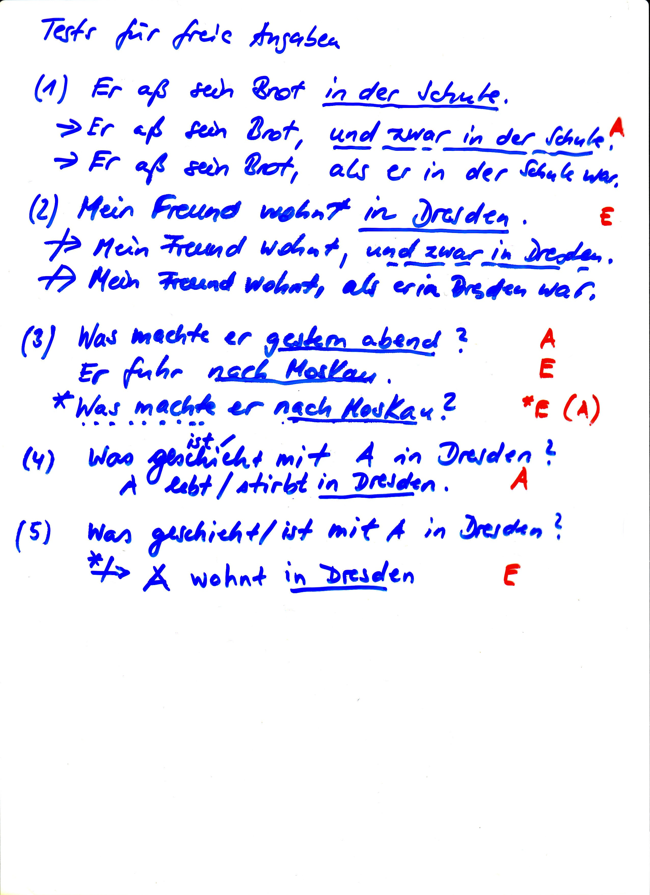

### Negative Angaben

Negative Angaben negieren Sachverhalte oder Teile eines Sachverhaltes.
Im Satz stehen sie **hinter den satzbezogenen** und **vor den verbbezogenen Angaben**.

**Ausdrucksformen:**\
- Negationspartikel *nicht*,\
- Konkurrenzformen *keinesfalls, keineswegs*,\
- verstärkte Formen *durchaus nicht, gar nicht, überhaupt nicht*,\
- Negationswörter mit situativer Komponente *niemals, nirgends*,\
- u.a.

Negationsangaben kommen nicht in Nebensatzform vor.

**Identifizierung:** nicht erfragbar.

**Position im Satz:**

Die Negationspartikel ist allein nicht vorfeld- oder nachfeldfähig, auch im Mittelfeld hat sie als Satznegator eine relativ feste Position.
Sie zeigt recht ähnliche Stellungseigenschaften wie die Gradpartikeln.
Die übrigen Formen sind, ähnlich wie situierende Angaben, freier verschiebbar.
Sie können auch allein ins Vorfeld verschoben werden (mehr in S179ff, S193, 195).

Die gesamte **Skala der Negationsmöglichkeiten** wird in E002-006 (Engel 1988) beschrieben.

### Existimatorische Angaben

Nach (Engel 1988: 227-238).

**Bedeutung**: Einschätzung des Sachverhaltes durch den Sprecher.\
**Funktion**: Äußerung zur Äußerung, manche zusätzlich auf spezielle Teile der Äußerung hin orientiert.

(1a) Die hat sogar einen Preis bekommen.\
(1b) Die hat einen Preis bekommen, und das ist überraschend.

Einteilung in 7 **Subklassen**:\
- kautive Angaben (z. B. geradezu), zusätzlich phrasenorientiert;\
- selektive Angaben (z. B. besonders), zusätzlich phrasenorientiert;\
- ordinative Angaben (z. B. erstens), meist zusätzlich satzorientiert;\
- judikative Angaben (z. B. bemerkenswerterweise), zusätzlich satzorientiert;\
- verifikative Angaben (z. B. tatsächlich);\
- Abtönungselemente (z. B. ja, doch, eben, halt, denn, mal);\
- Dativus ethicus oder ethischer Dativ (vor allem mir).

#### Kautive Angaben

-   **Bedeutung und Funktion**: auf einzelnen Ausdruck hin orientiert und relativieren dessen Bedeutung; Vorsichtsmaßnahme.\
-   **Formen**: in erster Linie **Gradpartikeln (**z.B. *fast, geradezu, gewissermaßen, sozusagen, teilweise*); unflektiertes **Adjektiv** *einfach* und **Ausdrücke wie**: *im allgemeinen, in gewisser Weise, ich möchte sagen* (oft als Parenthese).

(2) Auf der Brücke konnte man die Gefahr [geradezu]{.underline} spüren.\
(3) Es geht - [wie ich sagen möchte]{.underline} - um eine alte Bekannte.\
(4) Es geht [gewissermaßen]{.underline} um eine alte Bekannte.\
(5) Sie ist [einfach]{.underline} bezaubernd.

-   **Syntagmatische Eigenschaften:** Verschiebung nur teilweise möglich:\

(6) Es geht um eine alte Bekannte, [wie ich sagen möchte]{.underline}.\
(7) [Gewissermaßen]{.underline} geht es um eine alte Bekannte.

#### Selektive Angaben

-   **Funktion**: Hervorhebung eines Ausdrucks; Herstellung einer Beziehung zwischen verbalisiertem Sachverhalt und anderen möglichen;\
-   **Formen**:\
-   **Gradpartikeln (***allein, bereits, besonders, eben, gerade, insbesondere, sogar*),\
-   unflektierte **Adjektive** *ausgerechnet, vornehmlich* und\
-   Ausdrücke wie *vor allem*.

(8) Du müßtest [besonders]{.underline} achtgeben.\
(9) [Besonders]{.underline} du müßtest achtgeben.\
(10) [Vor allem]{.underline} muß man\* auf \*Pünktlichkeit achten.

-   **Syntagmatische Eigenschaften**: unabhängig von Bezugswort verschiebbar;\
-   **Vorkommensrestriktionen**: nur in Konstativ- und Interrogativsätzen.

#### Ordinative Angaben

-   **Funktion**:\
    Äußerungen in Beziehung zu anderen (bzw. Teilen davon).

-   **Formen**:\
    **Partikeln** *allenfalls, allerdings, außerdem, beispielsweise, bestenfalls, bloß*, *doch, einerseits* usw., *erstens* usw., *ferner, freilich, immerhin, indessen, jedenfalls, jedoch, lediglich, nämlich, mindestens, nun* (äußerungseinleitend), *nur* (äußerungseinleitend), *obendrein, ohnedies, ohnehin, schließlich, schon, sowieso, überdies, übrigens, vielmehr, wenigstens, wohl* (betont), *zudem, zugleich, zumindest, zwar* (äußerungseinleitend, verlangt *aber o.* a. im Folgesatz);\
    unflektierte **Adjektive** *gewiß, sicher, tatsächlich, wiklich*;\
    **Ausdrücke** wie *auf der einen / anderen Seite, darüberhinaus, im übrigen, in erster Linie, unter anderem, zum Beispiel z.B.)*.

-   **Syntagmatische Eigenschaften**: Bis auf *nur* und *nun* meist frei verschiebbar.

(10a) Wir haben [allerdings]{.underline} nichts davon gewußt.
(Helbig 1988: Abtönungspartikel - AP)\
(10b) [Allerdings]{.underline} haben wir nichts davon gewußt.\
(11) Er ist [immerhin / schließlich]{.underline} dein Vater.
(Helbig 1988: AP)\
(12) [Nun / Nur]{.underline} konnte er das nicht wissen.\
(13) Der Motor war [sowieso]{.underline} schon veraltet.
(Helbig 1988: AP)\
(14) Mir war das [übrigens]{.underline} bekannt.
(Helbig 1988: AP)\
(15) [Zwar]{.underline} weiß ich viel, doch möcht' ich alles wissen.
(Goethe)

#### Judikative Angaben

-   **Funktion**:\
    Bewertung des Sachverhalt durch Sprecher; Orientierung auf Satz.

-   **Formen**: **Modalpartikeln** und **Rangierpartikeln** mit Ableitungssuffix *-weise* (z.B. *bedauerlicherweise, bemerkenswerterweise, begreiflicherweise, erfreulicherweise, glücklicherweise, interessanterweise, seltsamerweise, unglücklicherweise, verständlicherweise*).\
    Hinzu kommen **andere Partikeln und Ausdrücke** wie *Gott sei Dank, leider, zu unserem (größten) Bedauern, zum Glück* und\
    **parenthetische Nebensätze** wie *was mir sehr leid tut,* was *ich bedauerlich finde.*

(16a) Er hat das [*bemerkenswerterweise*]{.underline} nicht erwähnt.\
(16b) [*Bemerkenswerterweise*]{.underline} hat er das nicht erwähnt.\
(17) Es ist [*glücklicherweise*]{.underline} nichts passiert.\
(18) Das hat sie [*verständlicherweise*]{.underline} verschwiegen.\
(19) Sie kann es [*leider*]{.underline} nicht besser.

-   **Syntagmatische Eigenschaften**:\
    **Partikeln** weitgehend verschiebbar;\
    **Weiterführende Angabesätze** meist nachgestellt oder vorangestellt (dann mit Doppelpunkt), gelegentlich eingeschoben:

(20) Sie hat es wieder nicht geschafft, [*was mir sehr leid tut*]{.underline}.\
(21) [Was]{.underline} [*mir sehr leid tut*]{.underline}: Sie hat es wieder nicht geschafft.\
(22) Sie hat es, [*was mir sehr leid tut*]{.underline}, wieder nicht geschafft.

#### Verfifikative Angaben

-   **Funktion**:\
    modifizieren Realitätsgrad eines Sachverhaltes (illokutiv orientiert).

-   **Formen**:\
    **Modalpartikeln** *anscheinend, bekanntermaßen, bekanntlich, erwiesenermaßen, gewissermaßen, hoffentlich, logischerweise, möglicherweise, nachgewiesenermaßen, notwendigerweise, vielleicht, zweifellos, zweifelsohne*; unflektierte **Adjektive** wie *angeblich, bestimmt, eigentlich, eventuell, gewiß, nachweislich, natürlich, offenbar, offensichtlich, selbstverständlich, sicher, tatsächlich, vermutlich, wahrscheinlich, wirklich*;\
    **Ausdrücke** wie *an (und für) sich, im Grunde, mit Sicherheit, ohne Frage, ohne Zweifel*;\
    **Nebensätze** *wie sich leicht nachweisen läßt, wie ich hoffe;* **parenthetische Hauptsätze** wie - (so) *hoffe ich -*.

-   **Vorkommensbeschränkungen**:\
    meist in Aussagen, gelegentlich in Fragen.

(23a) Dies ist [*bekanntlich*]{.underline} nicht das erste Mal.\
(23b) [*Bekanntlich*]{.underline} ist dies nicht das erste Mal.\
(23c) Dies ist nicht das erste Mal [*bekanntlich*]{.underline}.\
(24) Er ist [*notwendigerweise*]{.underline} mitschuldig.\
(25) Sie könnte [*vielleicht*]{.underline} etwas wissen.\
(26) Hätten Sie [*vielleicht*]{.underline} etwas Zucker?\
(27) [*Eigentlich*]{.underline} müßte sie das wissen.\
(28) Wir werden Ihnen [*selbstverständlich*]{.underline} den Schaden ersetzen.\
(29) Er hat [*mit Sicherheit*]{.underline} den Täter gesehen.

-   **Syntagmatische Eigenschaften**: frei verschiebbar.

(30a) [*Wie sich leicht nachweisen läßt*]{.underline}, hat sie in allem recht.\
(30b) Sie hat, [*wie sich leicht nachweisen läßt*]{.underline}, in allem recht.\
(30c) Sie hat in allem recht, [*wie sich leicht nachweisen läßt*]{.underline}.\
(31a) Sie kann den Täter identifizieren, [*hoffe ich*]{.underline}.\
(31b) Sie kann, [*(so) hoffe ich*]{.underline}, den Täter identifizieren.

#### Abtönungspartikeln

-   **Funktion**: Orientierung auf illokutive Komponente der Äußerung; Redeabsicht modifizieren, zu verstärken, abzumildern o.ä.

(32) Der hat [*aber*]{.underline} einen Bart!\
(33) Ist das [*aber*]{.underline} kalt!\
(34) Franz hatte einen Kreislaufkollaps. - Der hat sich [*ja auch*]{.underline} nie geschont.\
(35) Es gibt wieder eine Weinschwemme, was [*ja*]{.underline} nach dem regnerischen Sommer [*auch*]{.underline} nicht anders zu erwarten war.\
(36) Hast du [*auch*]{.underline} alles eingepackt?\
(37) Wie alt bist du [*denn*]{.underline}?\
(38) Ist er [*denn*]{.underline} wirklich schon zu alt dafür?\
(39) Wo kann man [*denn*]{.underline} hier telefonieren?

-   **Auffallende formale Eigenschaften**: Die meisten AP unbetont, nur integriert im Mittelfeld, vor Satznegation, satzmodusabhängig.

#### Dativus Ethicus

-   **Bedeutung**: Unruhe, innige Anteilnahme des Sprechers oder des Partners (selten einer anderen Person) an einem Sachverhalt.

-   **Formen**: meist Partnerpronomina, seltener reine reine Verweispronomina; immer unbetont, nie im Vorfeld.

-   **Vorkommenspräferenzen**: kaum in reinen Mitteilungen, meist in Ermahnungen, Vorwürfen (häufig ironisch), Aufforderungen u.ä.

(40) Du bist [*mir*]{.underline} ein schöner Freund!\
     (41a) Du wirst [*mir*]{.underline} noch aus dem Fenster fallen!\
     (41b) Fall [*mir*]{.underline} nicht aus dem Fenster!\
     (41c) Daß du [*mir*]{.underline} nicht aus dem Fenster fälltst!\
(41) Der wird [*dir*]{.underline} noch die ganze Konstruktion verwässern.\
(42) Und daß du [*mir*]{.underline} nicht der [*Tante Emma*]{.underline} von diesem Ausflug erzählst!\
(43) Sie kann [*dir dem General der Heilsarmee*]{.underline} ein Glas Wein anbieten.

## Verbalkomplex

Jedes satzartige Konstrukt (Hauptsatz, Nebensatz, Partphrase) enthält ein **Verb**, das Zahl und Art der Ergänzungen festlegt und damit die Grundstruktur des gesamten satzartigen Konstrukts bestimmt.
Dieses Verb nennt Engel (1988: 443) das **zentrale Verb**.

Hauptsätze und finite Nebensätze enthalten immer ein **finites Verb.** Wenn sie nur eine einzige Verbform enthalten, fallen zentrales Verb und finites Verb notwendig zusammen.

Enthält ein satzartiges Konstrukt jedoch mehr als eine Verbform, so können zentrales Verb und finites Verb nicht identisch sein.
Dann wird aus diesen Verbformen ein **Verbalkomplex** gebildet.

Als **Regens** der Ergänzungen gilt nicht nur das finite Verb, sondern der Verbkomplex, zu dem gemäß Latour (1985: 43 ff) folgende Elemente gehören:

1.  das zentrale Verb (finit oder infinit) [das in der folgenden Beschreibung ausgelassen wird],\
2.  trennbare Verbzusätze (Verbpräfixe und die 1. unmittelbare Konstituente in Zusammensetzungen) (z.B. [*an*]{.underline}*kommen, [unter]{.underline}gehen*),\
3.  Modalverben (*können, müssen, wollen,...*),\
4.  zeiten- und passivbildende Auxiliarverben\* (*haben, sein, werden*),\
5.  Reflexivpronomina (in Verbindung mit bestimmten Verben),\
6.  Pronomen *es* (in Verbindung mit bestimmten Verben),\
7.  Funktionsverbgefüge ( und einige andere lexikalische Fügungen).

Nach Engel (1988) gehören neben den oben angeführten noch einige weitere Verbklassen zum Verbalkomplex (siehe dazu den Überblick über den Prädikatskomplex).

**Übersicht (Prädikatskomplex):**\
· das [zentrale]{.underline} Verb,\
· [Auxiliarverben]{.underline} (*haben, sein, werden*),\
· [Modalverben]{.underline} (*können, müssen, sollen,...*),\
· [Modalitätsverben]{.underline} (*scheinen, pflegen, sich trauen, ...*),\
· Bewegungsverben (*gehen, schicken, legen, ...*),\
· modalitätsverbähnliche Verben (*sein, bleiben, bekommen, ...*),\
· Situativverben (*sein, bleiben, haben*),\
· weitere Konstruktionen mit Partizip II.
(*Er gibt das Spiel verloren., Wo steht das geschrieben?, Der Brief lag unter den Büchern versteckt*.),\
· [Nebensatzverben]{.underline}, [Infinitivverben]{.underline}, [Partizipverben]{.underline},\
· [trennbare Verbzusätze]{.underline},\
· [Reflexivpronomina]{.underline},\
· [Pronomen *es*]{.underline},\
· lexikalische Fügungen ([Gefügenomina]{.underline}).

Situativverben: *sein, bleiben, haben* + Infinitiv (ohne *zu*)

z.B.
(36) Ich würde heute lieber im Bett *liegen* [bleiben]{.underline}.\
(37) Sie [hat]{.underline} unheimlich viel Krimskrams in ihrem Zimmer *herumliegen*.\
(38) Der Tisch soll so *stehen* [bleiben]{.underline}.

### Trennbare Verbzusätze

Engel & Schumacher (1978: 34 ff) und Engel
(1988: 439 ff) verstehen unter **Präfixverben**
lediglich Verben mit einem unbetonten, untrennbaren Morphem, das reihenbildend
vor das Verb tritt oder zusammen mit dem Verb als isolierte Bildung vorkommt
(z.B. *beantragen, entscheiden, verbieten,
verlieren, gewinnen*).
Von Verben mit **Verbzusatz** sprechen diese Autoren, wenn die
erste unmittelbare Konstituente des Verbs betont und trennbar ist.
(vgl. dazu
auch Fleischer 19XX - Wortbildung der deutschen Gegenwartssprache).

**Verbzusätze: Präpositionen** ([ein]{.underline}laden, [um]{.underline}steigen),

 **Adjektive** ([krank]{.underline}melden, [breit]{.underline}treten),

 **Adverbien** ([weiter]{.underline}erzählen, [wieder]{.underline}geben),

**Nomina** / **Präpositionen + Nomina** ([rad]{.underline}fahren
- Rad fahren, [zutage]{.underline}treten - zu Tage treten) - [nach der neuen Rechtschreibung keine
Zusammensetzungen !!!]
,

selten: **Verben** ([kennen]{.underline}lernen - kennen
lernen, [liegen]{.underline}bleiben - liegen bleiben) - [nach der neuen Rechtschreibung keine
Zusammensetzungen mehr!!!]
.

Bei den Verben mit Verbzusatz besteht das Problem,
zwischen echten komplexen Verben einerseits und Simplex mit freier Ergänzung zu
unterscheiden.
**Kriterien zur
Unterscheidung:**

**1. Komplexes Verb oder Simplex
+ E~dir~ ?** (Pseudoverbkomplex[°](#_ftn1) )

a\.
Kommutiert das fragliche Element mit
Präpositionalphrasen der E~6~ (E~dir~)?

z.B.
 (1)  Komm herunter!

   nach
unten

(2)  Der Gast geht  hinein
.

   ins
Hotel (hinein) .

(3)  Der Fuchs kommt  heraus
.

   aus
dem Bau (heraus).

Die Adverbien
sind fakultativ, mit der Präposition korresporendierende Teile der Edir

b\.
Ergibt die
Kommutation des Simplex mit bedeutungsähnlichen Verben akzeptable Sätze?

z.B.
 (4)  Der Gast  geht

 eilt  hinein.

 schleicht

   ...

Die Anaphorisierungsprobe ist nicht durchführbar,
weil die Pronominaladverbien Anaphern sind.

Wenn die beiden Proben positiv ausfallen, dann ist
das fragliche Element eindeutig als E~6~

(E~dir~) klassifizierbar.
Damit sind **Pseudoverbkomplexe** (Verben +
Pseudoverbzusatz) erwiesen (die folgenden Beispiele nach der Rechtschreibung
bis 1998):

z.B.
 *hinausklettern, hinübersetzen,
dazwischenstellen, zurückgehen, fortlaufen, wegrennen, herunterfallen*.

(vgl. Fleischer!)

**2. Komplexes Verb oder Simplex + E~sit~?**

Zur Identifikation können Proben angewandt
werden, die den oben durchgeführten entsprechen:

a\.
Kommutierbarkeit mit
Präpositionalphrase (E~sit~)?

b\.
Kommutation mit Synonymen u.a.
-- akzeptable Sätze?

z.B.
 (5)  Es stand ein alter Nußbaum  [davor]{.underline}.

   vor dem Haus.

(6)  Die Katze sitzt fast immer  [dahinter]{.underline}.

  hinter dem Kamin.

 sitzt

 (7)
 Die Katze hockt fast immer dahinter.

 liegt

**3. Komplexes Verb oder Simplex + E~adj~ (E~8~)?**

a\.
**Anaphorisierungsprobe** (*so, es, das* ® E~8~)
bzw.
**Erfragbarkeit** durch
Fragepartikel *wie*?

z.B.
 (8)  Macht ihre Antwort dich [glücklich]{.underline}?
 + + (Adjektivalergänzung)

(9)  Du kannst mir nichts [weis]{.underline}machen.
 - - (Teil des Verbkomplexes)

b\.
Kann das adjektivische Element **im eingeleiteten Nebensatz** bei
einteiliger Konjugationsform vom V~f~ **getrennt** werden?
(Fall Probe *a* negativ ausfällt, ist *b* zweifelhaft)

(==> Verbkomplex)

### Komplexe Prädikate

**Hilfsverben** (**zeiten- und passivbildende Auxiliarverben)** sowie
**Modalveben und Modalitätsverben** (Verben
mit obligatorischem *zu*-Infinitiv) werden bei Engel & Schumacher (1978: 45)
bzw.
Engel (1988: 443 ff) als verbale Erweiterungen betrachtet, die für die
syntaktische Vollständigkeit von Sätzen nicht konstitutiv sind und denen auch **keine Valenz** zukommt (vgl. Helbig &
Buscha 1987).

Es gibt jedoch Fälle, die eine Interpretation
dieser Verben als Vollverben nicht ausschließen.
In diesen Fällen handelt es
sich um sehr übliche Verwendungsweisen, die nicht durch die Textkonstitution
motiviert sind.
Die isolierten Sätze ohne Infinitiv (2) - (3) erwecken kaum den
Eindruck syntaktisch unvollständiger (elliptischer) Sätze oder den Eindruck
spontaner legerer Rede (wie es bei der Ellipse des Partizips in (1) der Fall
ist.

z.B.
 (1)  Er [ist]{.underline} in die Stadt.
 (gegangen,
gefahren, ...)

 (2)
 Ich [muss]{.underline} leider nach Hause.
 (gehen, fahren,...)

(3)  Ich
[möchte]{.underline} noch gern eine Tasse Tee.
 (haben)

  V~f~ V~i~

Im Gegensatz zu den eben behandelten
(elliptischen) Fällen lassen sich für die Beschreibung von Hauptverben,
Modalverben und Modalitätsverben + Infinitivum als Prädikatskomplexe starke
Argumente anführen.
**Speziell bei
infinitivischen Verbalsyntagmen** tritt der Fall auf, dass zwischen

· infinitivischer satzförmiger Ergänzung
einerseits,

· und Infinitivkonstruktion als Verbativergänzung
E~vrb~ (E~9~)oder

· als Teil eines Prädikatskomplexes
andererseits unterschieden werden muß.

Engel & Schumacher (1978: 46 ff) haben die **Kommutation des fraglichen Infinitivs** mit
einem nominalen Syntagma als Kriterium für seine **Klassifikation als satzförmiger Ergänzung** gewertet.

z.B.
 (4)
 Er versprach seiner Frau, [ihr
einen Netz zu schenken]{.underline}./

 Er
versprach seiner Frau einen Netz .

(5)  Er
denkt daran, [den Plan zu verwirklichen]{.underline}.

 Er
denkt an die Verwirklichung des Plans.

(6)  Er
traut sich nicht [zu widersprechen]{.underline}.

 \*Er
traut sich keinen Widerspruch.

(7)  Ich gedenke, [das morgen zu tun]{.underline}.

 \*Ich
gedenke des morgigen Tuns.

(8)  Es gilt [zu gewinnen]{.underline}.

 \*Es
gilt der Gewinn.

(9)  Es beginnt, [kalt zu werden]{.underline}.

 \*Es
beginnt mit dem Kaltwerden.

Das Merkmal der **Anaphorisierung** ist bei diesen Fällen ein zu schwaches Kriterium,
da es eine Klassifizierung der Infinitivkonstruktion als Ergänzung erlauben
würde.

z.B.
 (8')
 Es gilt zu gewinnen./ Das gilt es.

(9')  Das traut er sich nicht.

Mit dem Kriterium der **Kommutation** sind aber nur die infinitivischen satzförmigen
Ergänzungen eindeutig identifiziert.
Zur Unterscheidung zwischen
infinitivischer E~vrb~ (E~9~)und dem Infinitiv eines Modalitätsverbs muss ein
weiteres Kriterium herangezogen werden.
Dieses Kriterium besteht in den
unterschiedlichen **Rektionsverhältnissen**.

Bei [Modalitätsverben]{.underline} wird das Vorhandensein einer E~sub~ (E~0~)
und deren semantische Füllung von dem abhängigen Infinitiv geregelt.
Bei [Verben + infinitivischer E~vrb~ (E~9~)]{.underline}wird die Aktualisierung und semantische Füllung der E~sub~ (E~0~) nicht vom abhängigen Infinitiv
gesteuert.
Die E~sub~ bleibt in diesem Fall konstant, wenn man andere
Verben als Infinitive einsetzt.
Das V~f~ regelt die E~sub.~

z.B.
 (10)
 [Es]{.underline} [**gilt**]{.underline} zu *gewinnen*.

 (11)
 [Es]{.underline} [**gilt**]{.underline}, ihn willkommen zu *heißen*.

 (12)
 [Er]{.underline} **pflegt**, samstags seine Einkäufe zu [*erledigen*]{.underline}.

 (13)
 In dieser Gegend **pflegt** [es]{.underline} häufig zu [*regnen*]{.underline}.

Vollverb + infinitivische Evrb (E9) in (10) und
(11).
Modalitätsverb + abhängiger Infinitiv in (12) und (13).

Das Subjekt des Modalitätsverbs (Engel 1988: 477)
und das Subjekt des abhängigen Verbs bezeichnen immer dieselbe Größe.
Daher
wird das Subjekt nur einmal genannt.
Die besondere Problematik des
Modalitätsverben liegt darin, dass es zu den meisten von ihnen **homonyme Vollverben** gibt.
Zwischen
homonymen Vollverben und E~sub~ besteht eine Verträglichkeitsrelation,
während **Modalitätsverben mit beliebiger
E~sub~ kombinierbar** sind (unter Beachtung der Verträglichkeit
zwischen E~sub~ und Infinitiv).

z.B.
 (14)
 Er verspricht [ihr]{.underline}, sie zu
besuchen.
 (VV)

 (15)
 \*Das Wetter verspricht [uns]{.underline},
schön zu werden.
 (V~n~)

(16)  Er hat bei ihm nichts zu lachen.

 (17)
 Das Buch hat hier liegenzubleiben.

Die abhängige **Infinitivkonstruktion
beim Vollverb** ist **anaphorisierbar**,
bei den Modalitätsverben kann der abhängige Infinitiv nicht anaphorisiert und
auch nicht kommutiert werden.

z.B.

(18)  Das Wetter verspricht
schön zu werden./

 \*Das
Wetter verspricht [es/das]{.underline}.
 (V~n~)

(19)  Er verspricht, morgen zu kommen./

  Er verspricht es/das.
 (VV)

(20)  Das verspricht ja heiter zu werden./

 \*Das
verspricht Heiterkeit.
 (V~n~)

(21)  Er versprach, mir etwas zu schenken./

Er
versprach mir ein Geschenk.
 (VV)

Schwieriger
ist die **Unterscheidung von
Modalitätsverb und homonymem Vollverb bei *anfangen,
beginnen, aufhören***, da in diesen Fällen auch bei den Vollverben die E~sub~
des V~f~ und des Infinitivs **referenzidentisch** sind. Aber nur die Modalitätsverben können mit relativ beliebigen E~sub~ kombiniert werden.

z.B.
 (22)  Die Sache fängt an, mir Spaß zu machen.

(23)  Es
fängt an zu regnen.

 (24)  Der Blumenstrauß fängt an zu welken.

Aber nur:

 (25)  Klaus fängt (damit) an zu singen.

Nur der Infinitiv beim Vollverb ist anaphorisier-/ kommutierbar.

z.B.
 (25')  Klaus fängt [damit]{.underline} an.

 (25'')  Klaus fängt [mit dem Singen]{.underline} an.

Der **semantische
Unterschied** zwischen Vollverb und V~n~ besteht darin, dass das
Vollverb auf eine intentionale Handlung referiert; das Modalitätsverb (V~n~)
bezeichnet nur den Beginn eines Prozesses.

Eine Gruppe von Verben (*sein, bleiben, bekommen, kriegen, geben, es gibt*) verhält sich **ähnlich wie die Modalitätsverben (V~n~**).

z.B.

(26)  Das Problem [ist]{.underline}
kaum zu lösen.

 (27)
 Es [bleibt]{.underline} noch viel für dich zu
tun.

(28)  In diesem Restaurant [bekommt]{.underline} man noch nach 22^00^
etwas zu essen.

 (29)
 Du [kriegst]{.underline} es nichts mehr zu
trinken!

(30)  [Gib]{.underline} mir doch bitte noch etwas zu trinken!

 (31)
 In Köln gibt es viele schöne Kirchen
zu besichtigen.
(...,die man ...)

(32)  Es gab eine Menge zu essen/zum Essen.

Diese Gruppe ist heterogen und zeigt gemäß Engel
(1988: 51 ff) Abweichungen gegenüber den Modalitätsverben:

z.B.
 · Konkurrenzform zum werden-Passiv; +/-E~sub~ (31)

· Infinitiv als Attribut zu E~akk~ (31),(32)
-- es gibt (31,32) + zu-Infinitiv (man +V~f~)

**Nebensatzverbkomplexe**: zu den Nebensatzverben rechnet Engel (1988: 485): *bedeuten, finden, sich fragen, es heißt, sich sagen, wähnen*.

Nebensatzverben regieren nie Infinitivsätze.
Zu den Nebensatzverben gibt es
auch gleichlautende Verben mit anderer Bedeutung.
Zu allen Nebensatzverben sind
Perfektformen möglich, Passiv im allgemeinen nicht.

z.B.
 (33)  Man
bedeutete ihr, (dass) das Spiel entschieden sei.

 (34)
 Ich finde, er hat recht.

(35)  Sie fragte sich, ob er das wohl ernst meine.

(36)  Es heißt, Petra sei gestürzt.

(37)  Ich habe mir gesagt, dass da etwas wohl nicht stimmen kann.

(38)  Wähntest du etwa, ich sollte das Leben hassen?

**Infinitivverbkomplexe:** Nebenverben\*, die immer ein anderes Verb im Infinitiv (einschließlich
seiner Satelliten) regieren, jedoch eine andere Subjektgröße als dieses haben.

(± zu-Infinitiv)

z.B.
 (39)  Man
bedeutete **ihr**, den Hut *ab[zu]{.underline}nehmen*.
(gehoben)

 (40)
 Ich fühle **die Erde** [*f*]{.underline} *beben*.

 (41)
 Es gibt **eine Menge** [zu]{.underline} *tun*.

 (42)
 Ich hörte **ihn** [*f*]{.underline} *kommen*.
 (® Fortbewegungsverben)

**Partizipverbkomplexe:** die Verben *kommen, stehen*.
Das
Subjekt des Partizipverbs und das des abhängigen Partizips sind identisch .

z.B.

(43)  Er kam ins Zimmer *geschwankt*.

 (44)
 In diesem Buch steht alles *geschrieben*, was ...

Weitere Beispiele: *Er gibt das Spiel verloren., Wo steht das geschrieben?, Der Brief lag unter
den Büchern versteckt*.

**Komplexe mit *finden* uns *sehen*:**

z.B.

(45)  Sie [fand]{.underline} ihn an den
Mauer *lehnen/lehnend*.

 (46)
 Sie [fand]{.underline} ihn *schlafend*.

(47)  Sie [fanden]{.underline} das Kind in Windeln *gewickelt*.

 (48)
 Ich [sah]{.underline} ihn den Ast *absägen*

(49)  Sie sah ihn Nüsse *knackend*
im Zimmer .

 (50)
 Sie wurde total vom Regen *durchnässt* [gesehen]{.underline}.

**Als Prädikatskomplexe auch (in)transitive Verben V~t~ /V~i~ +
Infinitiv \< + Bewegung \>**

z.B.

(51)  Ich [gehe]{.underline} noch heute
in die Stadt *einkaufen*.

 (52)
 [Gehst]{.underline} du mit *baden* ?

(53)  Sie [schickt]{.underline} den Jungen Brötchen *holen*.

 (51') Ich [gehe]{.underline} noch heute in die Stadt, um *ein[zu]{.underline}kaufen*.

(52') [Gehst]{.underline} du mit ins Freibad / ins Freibad *baden*.

Trotz der möglichen Kommutation haben sich Engel
& Schumacher (1978: 51) dafür entschieden, den Infinitiv als Teil eines
komplexen Prädikats zu beschreiben, »da im Falle der Kommutation des Infinitivs
mit einer E~dir~ (E~6~)
in (34') die Kodierung des Infinitivs als Satzergänzung theoretisch nicht
vertretbar ist.«

**Situativverben**: *sein, bleiben, haben* + Infinitiv (ohne *zu*)

z.B.
 (54)  Ich
würde heute lieber im Bett *liegen* [bleiben]{.underline}.

 (55)
 Sie [hat]{.underline} unheimlich viel
Krimskrams in ihrem Zimmer *herumliegen*.

 (56)  Der Tisch soll so *stehen* [bleiben]{.underline}.

**\
**

### Reflexivpronomina

Nicht alle Reflexivpronomina gehören zum
Verbkomplex.
[Engel & Schumacher]{.underline} (1978: 42 ff) unterscheiden im KVL[°](#_ftn2) folgenden Gruppen:

a) echt reflexive Verben

b) fakultativ reflexive Verben

c) partim reflexive Verben

d) reflexive Fügungen

e) reziproke Verben

**a) echt reflexive Verben**

Echt reflexive Verben liegen dann vor, wenn
folgende Kriterien erfüllt sind:

· das Reflexivpronomen ist nicht weglassbar
(Ausnahmen: z.B. Er irrt (sich).);

· der Austausch des Reflexivpronomens gegen
einen anderen sprachlichen Ausdruck (ein anderes Pronomen, eine Nominalphrase,
... ) ist nicht möglich.

z.B.
 (1)
Er weigert [sich]{.underline}, das zu glauben.

 (2) Er hat [sich]{.underline} dem Mädchen
erklärt.

In (2) ist der Austausch nur mit
Bedeutungsveränderung möglich.

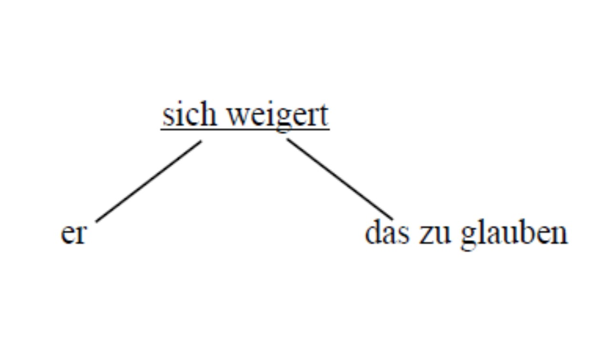

**b) fakultativ reflexive Verben**

· das Reflexivpronomen ist weglassbar;

· das Reflexivpronomen kommutiert ebenfalls
nicht mit anderen sprachlichen Ausdrücken (Pronomen, Nominalphrasen, ...) oder
der Austausch ergibt eine Bedeutungsveränderung

z.B.
 (3) Er hält ([sich]{.underline}) eine Illustrierte.

**c) partim reflexive Verben**

Das Reflexivpronomen kommutiert mit einem
anderen Glied im selben Kasus (eine E~x~ kann durch ein
Reflexivpronomen realisiert sein), mit Nomina und Pronomina.
In diesem Falle
zählt das Reflexivpronomen [nicht]{.underline} zum Verbkomplex, sondern hat den Status
einer Ergänzung.

z.B.
 (4)
Er verletzt [sich]{.underline}.

  wäscht  den Hund.

   ihn.

**d) feste Fügungen mit Reflexivpronomen**

Ein Reflexivpronomen kann Bestandteil einer (phraseologischen) verbalen
Wendung sein.

Es ist · weder eliminierbar

 · noch austauschbar gegen andere Pronomina
oder Nomina.

Daher wird
es von Engel & Schumacher als Bestandteil des Verbkomplexes gesehen.

z.B.
 (5) Er zerbricht [sich]{.underline} den Kopf.

(6) Er setzt [sich]{.underline} zur
Ruhe.
 [V
+ sich + Präp.
+ NP]

(7) Er führt immer einen
Regenschirm [mit sich]{.underline}.
 [V +
Präp.
+ sich]

**2 Typen:** [V + sich +
Präp.
+ NP] und [V + Präp.
+ sich].

**e) reziproke Verben**

In reziproker Bedeutung ist das Reflexivpronomen
ersetzbar durch *einander*.

z.B.
 (8) Sie lieben [sich]{.underline}.
- Sie lieben *einander* (Er liebt sie, sie liebt ihn)

Das Reflexivpronomen in (8) hat den Status einer
Ergänzung.

### Pronomen *es*

Zu unterscheiden sind ein kommutierbares *es* (1) und ein nicht kommutierbares *es*.
(2)-(12).

z.B.
· (1) Das neue Auto ist teuer.
[Es]{.underline}
ist teuer.

 · (2) [Es]{.underline} regnet.

 · (3)
Er nimmt [es]{.underline} mit allen auf

  (4)
Er meint es gut mit dir.

 · (5)
[Es]{.underline} gibt dort keinen Ärger mehr.

  (6)
[Es]{.underline} kam zu einem schweren Verkehrsunfall.

  (7)
[Es]{.underline} handelt sich um deine Anfrage.

  (8)
[Es]{.underline} fehlt (dir) an Mut.

  (9)
[Es]{.underline} kommt auf das Ergebnis an.

 · (10)
[Es]{.underline} wurden 30 Typhusfälle gezählt.

  (11)
[Es]{.underline} ist ein schreckliches Unglück passiert.

  (12)
[Es]{.underline} heißt, dass ihre Firma in Konkurs geht.

Das nicht-kommutierbare *es* wird **zum Verbalkomplex**, und nicht als Ergänzung gerechnet. Das hat die Konsequenz, dass einige der angeführten Sätze kein Subjekt haben. Andere Grammatiktheorien sprechen in einem solchem Falle von einem **formalen Subjekt**. In (10), (11) ist *es* stellungsgebunden: eliminiert man es an dieser 1.
Stelle des Satzes, so wird der Aussagesatz (konstative Satz) zum Fragesatz; stellt man ein anderes Satzelement an die Spitze des Satzes, so fällt dieses *es* weg.

Daher kategorisiert [Latour]{.underline} (1985:46) dieses nicht-kommutierbare stellungsgebundene Pronomen *es* weder als abhängiges Satzglied noch dem Verbalkomplex zugehörig.

### Funktionsverbgefüge und andere lexikalische Fügungen

Der Begriff der **lexikalischen Fügung** deckt einen Bereich ab, der sehr heterogen ist
in Bezug auf die interne syntaktische Struktur wie auch in Bezug auf den
Verschmelzungsgrad der einzelnen Teile dieser Fügungen.
Die verbabhängigen
Bestandteile (Nomina, Adjektive, Verben, Pronomina) können **nicht als Ergänzungen** beschrieben werden, da die
Anaphorisierungsprobe negativ ausfällt, sondern als Teile des Verbkomplexes.

z.B.
 (1)  Sie steht dem Maler [Modell]{.underline}.
 (E~akk~ - E~1~?)

 \*Sie
steht [es]{.underline} dem Maler.

 (2)
 Ich lasse mich nicht [für dumm]{.underline} verkaufen.
 (E~prp~ - E~4~?)

 \*Ich
lasse mich nicht [dafür]{.underline} verkaufen.

 (3)
 Er hat die Sache [im Griff]{.underline}.
 (E~sit~ -
E~5~?)

 \*Er
hat die Sache [dort]{.underline}.

 (4)  Seine Ausbildung
stand [in Frage]{.underline}.
 (E~sit~ - E~5~?)

 \*Seine Ausbildung stand [dort]{.underline}.

 (5)  Der Plan kommt [zur
Erörterung]{.underline}.
 (E~dir~ - E~6~?)

 \*Der Plan kommt [dorthin]{.underline}.

 (6)  Er hat es im
Leben [weit]{.underline} gebracht.
 (E~adj~ - E~8~?)

  \*Er
hat es im Leben [so]{.underline} gebracht.

Diese Fügungen können durch (z.T.) Attribute
erweitert werden, d.h.
ihre interne Struktur ist z.T.
veränderbar.
Bei den
attribuierbaren Fügungen handelt es sich in erster Linie um eine bestimmte
Gruppe von **Funktionsverbgefügen,** in
denen das Verb nur noch strukturelle Verbfunktionen ausübt, während das
Gefügenomen (in der Regel ein Deverbativum) einen verbalen Inhalt (meist eine
Handlung oder einen Vorgang) ausdrückt.

Die attributiven Erweiterungen können
verschiedener Art sein.

z.B.
 (7)  Er kam in Gefahr, [sein
Leben zu verlieren]{.underline}.

  Er kam in [Lebens]{.underline}gefahr.

In (7) kommutiert der infinitivische Attributsatz
mit der ersten unmittelbaren Konstituente einer Zusammensetzung.

In (8) kommutiert ein Possesivpronomen mit einem
attributiven Adjektiv, mit einem attributiven Genitiv und mit der ersten
unmittelbaren Konstituente einer Zusammensetzung.

z.B.
 (8)  Das Land steht unter der Kontrolle [des
Militärs]{.underline}.

 Das Land steht unter [seiner]{.underline} Kontrolle.

 Das Land steht unter [militärischer]{.underline} Kontrolle.

 Das Land steht unter [Militär]{.underline}kontrolle.

Soll man die (meist) von den Nomina abhängigen
Elemente als Attribute betrachten, oder soll man sie in Abhängigkeit von der
gesamten Fügung sehen, d.h.
als Ergänzungen (besonders bei den
Funktionalverbgefügen gut vorstellbar -- die Basisverben sind nämlich
kommutierbar).

z.B.
 (9)  in Bewegung
setzen -
bewegen

 in Aufregung bringen
- aufregen

 unter Kontrolle stehen
- kontrolliert werden

(Funktionalverbgefüge -- Basisverben: leisten
aktionale Differenzierung)

Engel & Schumacher (1978: 41) haben sich
entschlossen, dieses Problem im Kleinen Valenzlexikon auszuklammern (»\*«) und begnügen sich mit Beispielsätzen.

Die Gefügenomina (und die Nomina in anderen lexikalischen Fügungen) **werden [nicht]{.underline} als Ergänzungen
gesehen,** sondern bilden zusammen mit dem Verb (und Präposition) den
Verbkomplex, denn die **Gefügenomina sind
nicht anaphorisierbar** (Latour 1985: 46 und Engel & Schumacher 1978: 38
ff. behandeln nur Funktionalverbgefüge mit
Präpositionalphrasen »pS«, bei Helbig/Buscha 1987 auch andere Typen).

Die hauptsächliche semantische Leistung der Funktionsverbgefüge besteht darin, dass sie ein Geschehen folgenderweise markieren (Helbig/Buscha, S.103):

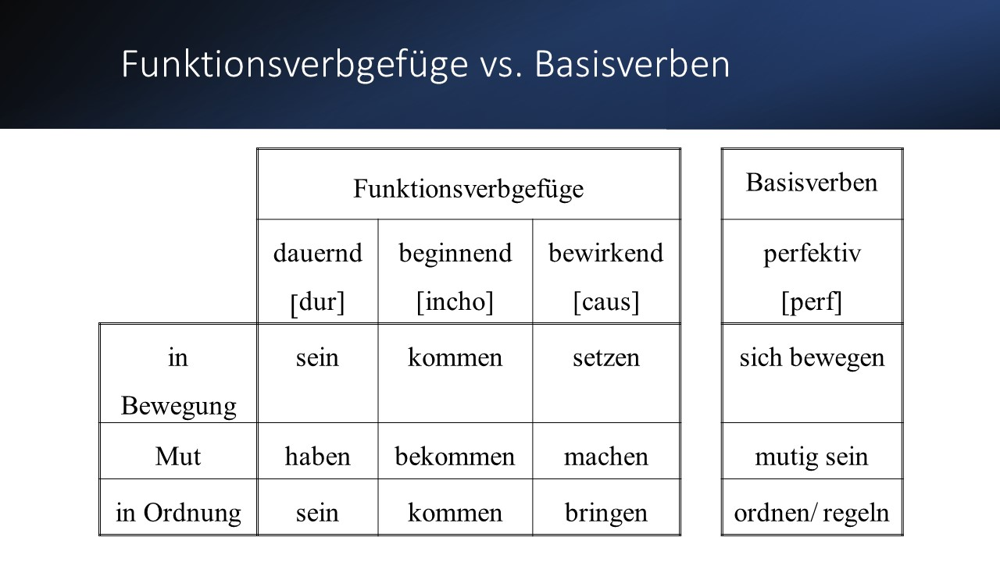

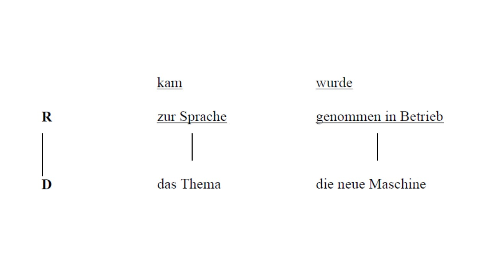

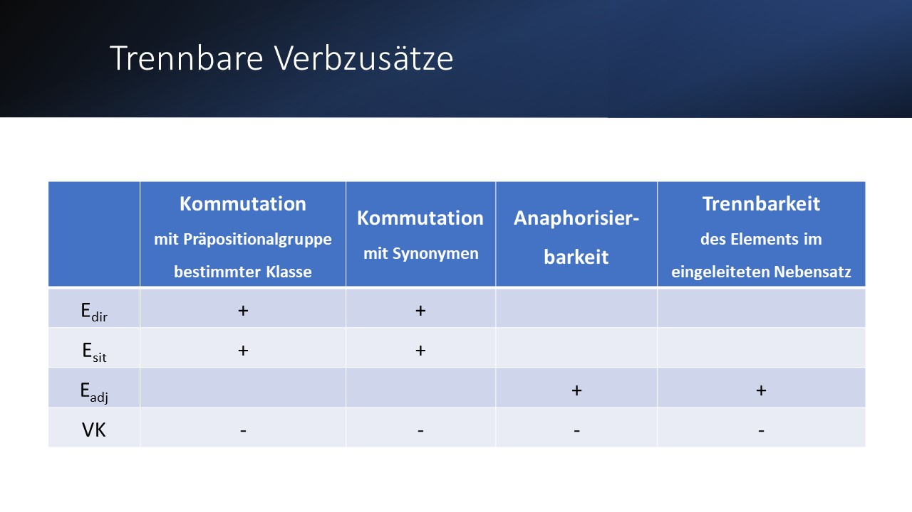

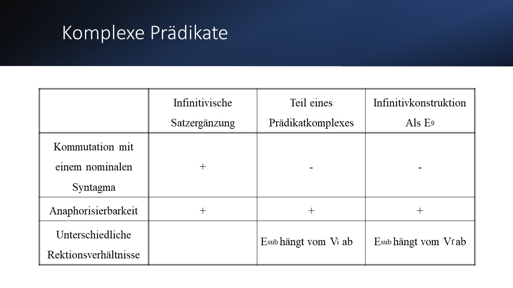

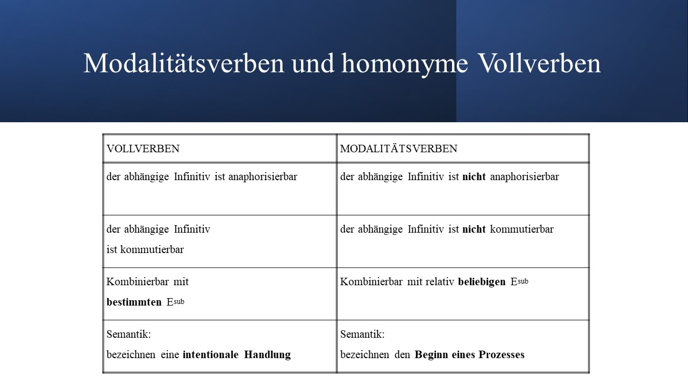

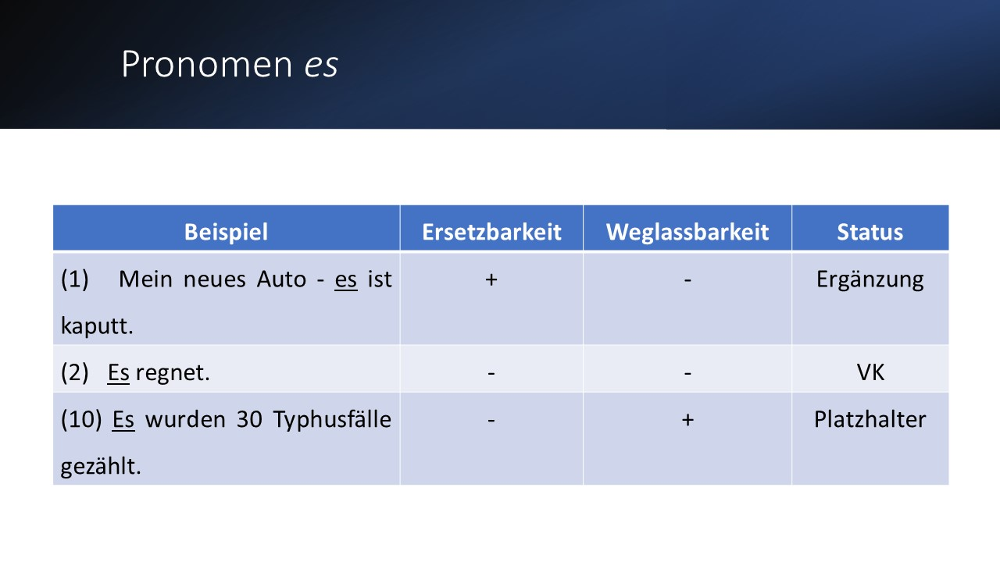

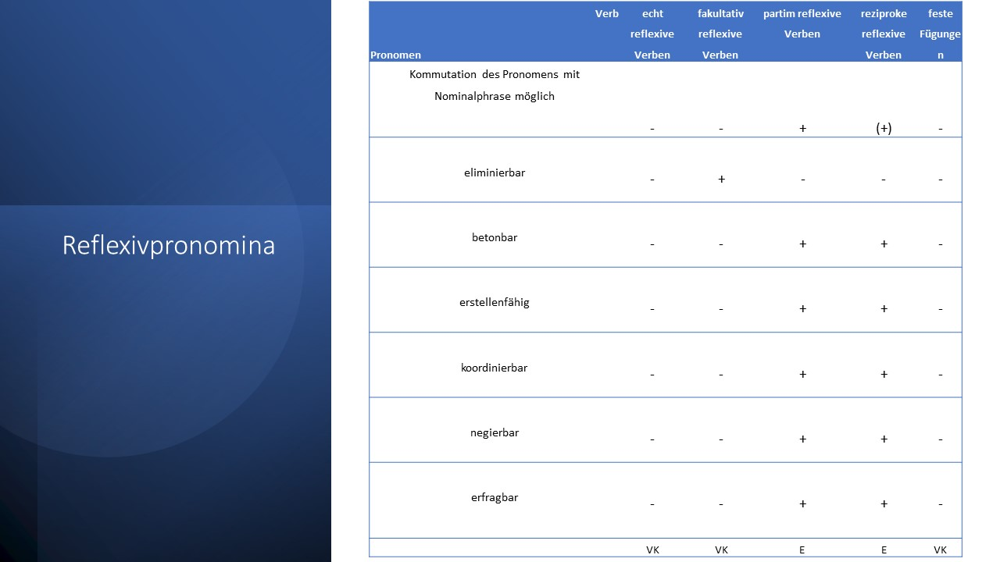

----------------------------------------------------------------------

[°](#_ftnref1) Ein
Pseudoverbkomplex ist ein Verb, dessen erstes Kompositionsglied als Ergänzung
beschrieben werden kann.

[°](#_ftnref2) KVL ( Engel & Schumacher: Kleines
Valenzlexikon deutscher Verben; 1978)

## Leipziger Valenzmodell

Ende der 60-er Jahre entstand im **Leipziger Linguistenkreis** um Gerhard Helbig ein Valenzmodell, das seinen Niederschlag u.a.
im "Wörterbuch zur Valenz und Distribution deutscher Verben" von G.
Helbig und W.
Schenkel fand.
Dieses Modell ging zunächst von der syntaktischen Valenz (d.h. von der Valenz der Ausdrucksebene) und von der Wortart "Verb" aus (erst später - in den 70-er Jahren - Übertragung auf andere Wortarten - Adjektiv, Substantiv)

Zu den valenzgebundenen ("syntaktisch notwendigen") Gliedern gehören solche, die im entsprechenden Stellenplan des Verbs verankert und folglich für dessen Subkategorisierung von Bedeutung sind.
Dabei wird im dreistufigen Modell unter Valenz die Fähigkeit des Verbs verstanden, bestimmte Leerstellen um sich herum zu eröffnen, die durch obligatorische oder fakultative Aktanten zu besetzen sind (Valenz hier im semantischen und syntaktischen Sinne gefasst!).

Leerstellen: die vom Valenzträger (hier: Verb) gefordert und obligatorisch bzw.
fakultativ zu besetzenden Stellen, die im "Stellenplan" des Verbs (bzw. eines anderen Valenzträgers) verankern und in dessen Bedeutung angelegt sind.

**Aktanten** ("Mitspieler") Glieder, die diese Leerstellen besetzen.

Zu adäquaten Beschreibung der Aktanten muss man kennen:\
a) ihre *Zahl* und\
b) ihre *Art* (syntaktisch und semantisch), d.h.
die Distribution des Valenzträgers: im Anschluss an Harris verstehen Helbig & Schenkel unter Distribution eines sprachlichen Elements "die Summe aller Umgebungen, in denen es vorkommt".

Auszusondern sind die valenzabhängigen Glieder.
Die valenzabhängige Umgebungen (Kontexte) sind also nur eine Untermenge der Umgebungen (Distribution) des Valenzträgers (Verb).

Entsprechend dieser Bestimmungen der Begriffe "Valenz" und "Distribution" werden im Helbig & Schenkels Valenzwörterbuch die Verben auf folgende 3 Stufen interpretiert:

1\.
die *quantitative Anzahl der Aktanten*:\
z.B.: erwarten 2 , rauben 2+(1)=3

2\.
die *quantitative Festlegung der Aktanten*:\
durch Angabe der [syntaktischen]{.underline} Umgebungen der Verben in streng formalen Begriffen ("strenge Subkategorisierungsregeln")

z.B.: Sn, Sa, Sd, pS, NS, J,...

z.B.: geben 3 ---\> Sn, Sa, Sd\
legen 3 ---\> Sn, Sa, pS\
berichten 1+(2)=3 ---\> Sn, (Sd), (Sa/pS/NS)

z.B.: (1) Ich berichte.\
(2) Ich berichte ihm.\
(3) Ich berichte ihm mein Erlebnis / über meine Reise / ,wo ich gewesen bin.

• Vergleichen Sie mit dem Valenzmodell von Engel (1988), Engel & Schumacher (1978), Latour (1985)!

3\.
die *qualitative Festlegung der Aktanten* durch Angabe der [semantischen]{.underline} Umgebung der Verben ("Selektionsregeln") - mit Hilfe von Begriffen wie z.B.: Hum, Abstr,...

z.B.: (4) Die Jungen bewundern ihre Aufrichtigkeit.\
(5) \* Ihre Aufrichtigkeit bewundert die Jungen.

bewundern:\
I.
2\
II.
Sn Sa\
III.
+Anim O; + Hum O; - Abstr.
O

• Vgl.
Sie mit H/B (1987,625)!\
• Vgl.
Sie wiederum mit den Mannheimer Valenzmodellen!

----------------------------------------------------------------------

[[1]](#_ftnref1) Die **Hauptverben** (in anderen Grammatiken meist *Vollverben* genannt) sind im Gegensatz zu den Nebenverben und Funktionsverben in der Lage, ohne weitere Verben bzw.
stützende Nominal- oder Präpositionalphrasen einen Satz zu konstituieren - z.B.
in der finiten Verbform (Engel 1988: 409).

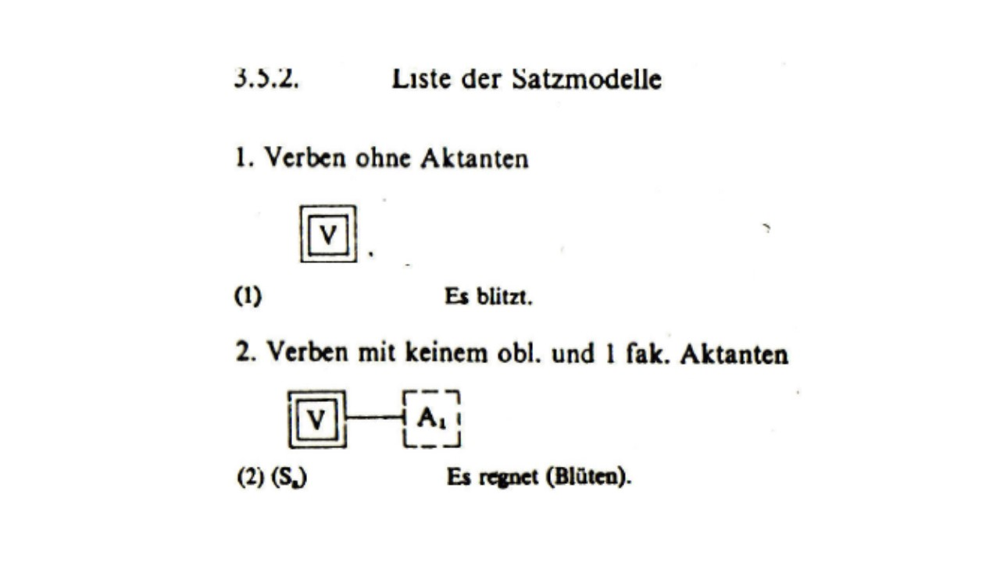

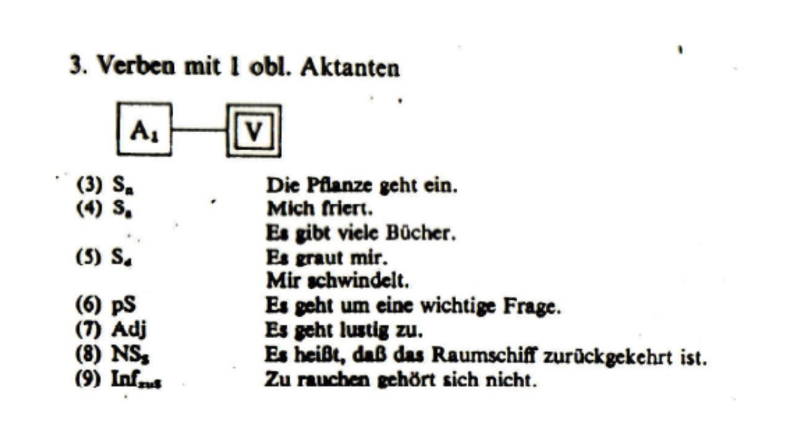

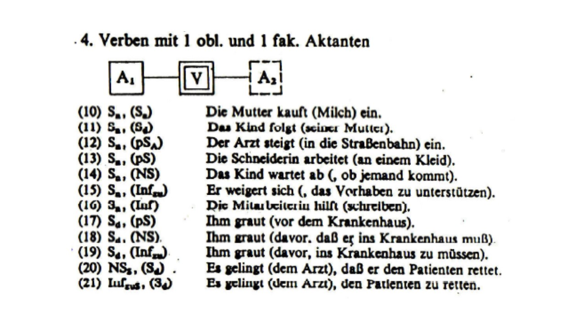

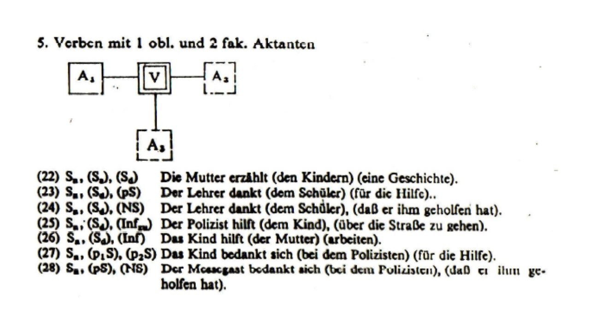

## Semantisierte Valenz

Aus Helbig & Buscha (1987): semantische Valenz.   

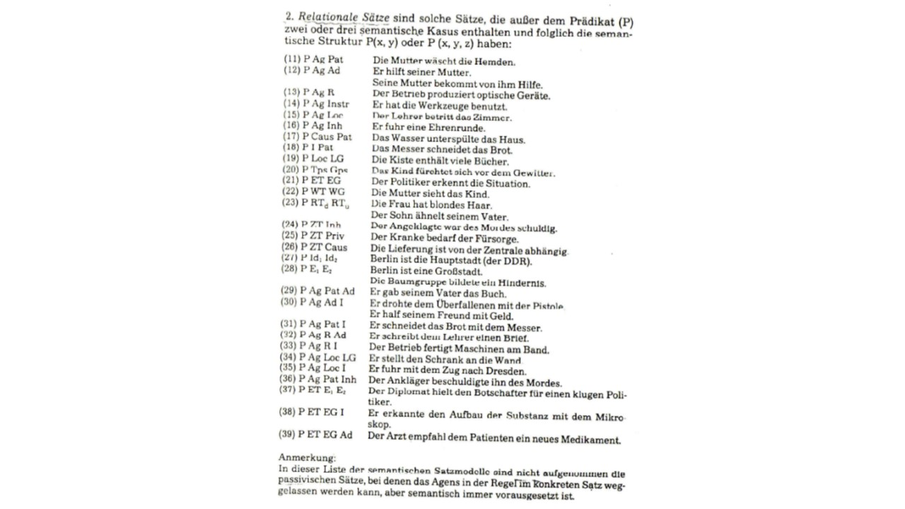

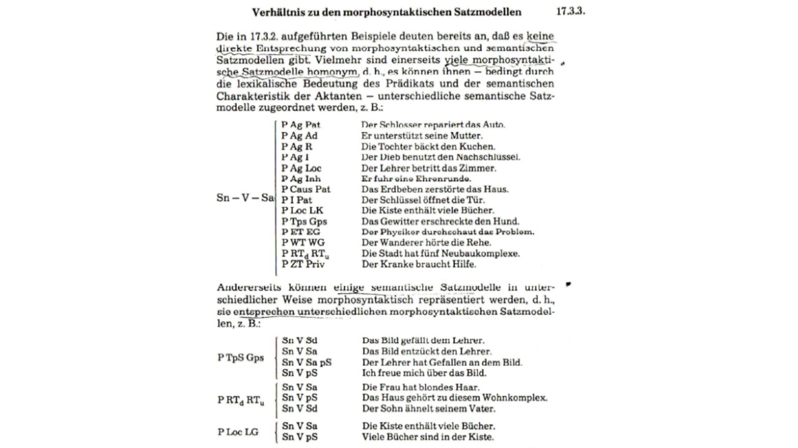

